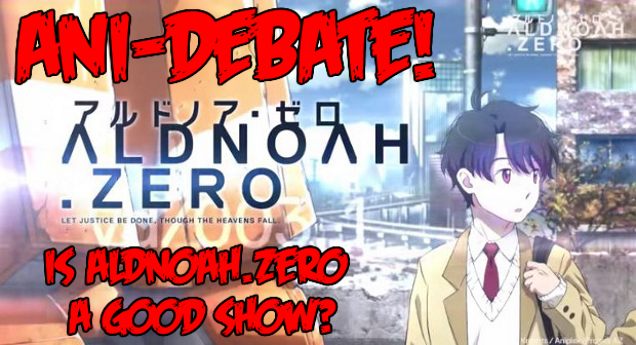

---
{
  title: "Let's Ani-Debate! Ani-Debate Annoucement Topic",
  tags:
    [
      "ani-tay",
      "ani-debate",
      "skype",
      "fun",
      "heated",
      "debate",
      "aldnoahzero",
    ],
  published: "2014-08-15T16:00:00-04:00",
  attached: [],
  license: "cc-by-4",
  oldArticle: true,
}
---

Here on Ani-TAY, we have very opinionated and passionate people. These people like to
  write and talk a lot, leading to heated debates and amazing discussions... so me and the other guys in the Ani-TAY
  chatroom decided... why not turn this into a series? Let's Ani-Debate.

<h2 class="sc-1bwb26k-1 fvCjqJ" id="h116563">What is Ani-Debate, and How will it work?</h2>

  Ani-Debate is going to be a series of articles about more controversial topics in anime that people have been talking
  about lately, to start discussion with the community, and to have a good time debating on said topic. The debates
  themselves will be a semi-organized debate similar to the style of debate over on <a class="sc-1out364-0 hMndXN sc-145m8ut-0 gIacKn js_link" data-ga='[["Embedded Url","External link","http://www.debate.org/",{"metric25":1}]]' href="http://www.debate.org/" rel="noopener noreferrer" target="_blank">debate.org</a>, but not as complicated.
  There will be 2 teams of 1-3 people from the community debating over a topic, and I'll be a moderator in the debates.
  There will be 3 rounds of debate and these rounds are:

<ul class="sc-1lmbno3-0 dpuHif" data-style="Bullet" data-type="List">
<li><strong>Round 1 - Opening Arguments</strong>: The Opening Arguments is to try to convince the reader and to make
    your points clear. This Round will be discussion-less, with each team stating their arguments with 3 as a minimum.
  </li>
<li><strong>Round 2 - Rebuttal and Discussion</strong>: The Rebuttal and Discussion round is the meat of the debate;
    the round where the teams will try to make their argument while putting down the other team. Also, I'll interject
    questions of my own if I felt like the discussion glossed over some important topics, and when the debate runs out
    of steam, I'll end this round.
  </li>
<li><strong>Round 3 - Closing Arguments</strong>: After the debate is done, the teams will get one last chance to try
    to persuade the reader and to make their argument. This will be in the style of Round 1.
  </li>
</ul>

Also, I'll put a poll at the bottom of every debate, and after a week, I'll check
  back and I'll make a flashy banner declaring which one "won", depending on the results of the poll. 
<h2 class="sc-1bwb26k-1 fvCjqJ" id="h116564">How will this be managed, and How can I
  participate?</h2>
I'll be doing most of the management for the Ani-Debates. I want this
  to be a fun (yet heated) way to get the opinions out that anybody can do, so I don't want formatting or organizing to
  be a burden for people. I plan to have the debates on a Skype chatroom (text chat so you don't need a webcam. All you
  need is an MS account) and I'll take the debate Skype chat and format it so it looks pretty and consistent. 

That being said, I really won't be able to organize most of the debates. I made this
  <a class="sc-1out364-0 hMndXN sc-145m8ut-0 gIacKn js_link" data-ga='[["Embedded Url","External link","https://docs.google.com/spreadsheets/d/10QY02SYKePpEsoTPHWt2gK4wznJS0ZyC8bqN1rtAtwA/edit?usp=sharing",{"metric25":1}]]' href="https://docs.google.com/spreadsheets/d/10QY02SYKePpEsoTPHWt2gK4wznJS0ZyC8bqN1rtAtwA/edit?usp=sharing" rel="noopener noreferrer" target="_blank">spiffy spreadsheet</a> so anybody interested can organize a
  debate. The way I intend it to work is when people want to debate on a topic, they find some other people to join a
  team (or you can go alone, I really don't care), and once you do that, find a time that will work for everyone (That
  includes me). Enter in the date of argument (and mark the hour in the most common time zone), and mark Yes on the
  Ready column. I'll chuck everyone into a special and spiffy group chat made for the Ani-Debates. During the time you
  decide the date and the date itself, your team will need to come up with at least 3 opening arguments, and then on the
  day of the argument, It'll happen!

The date of the release of the article with the
  poll and such will be the next Monday after the debate. If it's on the later half of the week, and I can't find time
  to format it, It'll be up the week after that on Monday, or whenever I have time... but it'll always be released on
  monday for a level of consistancy. Also, I'll only have time for 1 per every two weeks when it comes to
  formatting.

<h2 class="sc-1bwb26k-1 fvCjqJ" id="h116565"><strike>When will we be able to
  see an Ani-Debate?</strike></h2>
<strike>Very soon! Some of the guys who are working on
  the Ani-TAY Summer Collaboration project (Our Anime of the season that you should be watching article or whatever Dex
  calls it) got into a very heated argument about if Aldnoah.Zero is a good show or not, so we decided that we'd do an
  Ani-Debate! Look forward to it in the next few weeks. Also, If you checked out the spreadsheet, there's a bunch of
  debates sitting there, but no planning yet; I listed a bunch of topics that I thought would be interesting, so join
  up! (I'm looking forward to the NGE one, worst anime one, and the Shounen one, personally) </strike> Just ignore this,
  I dungoofed :/

<h2 class="sc-1bwb26k-1 fvCjqJ" id="h116566">Plans for the Future</h2>
This is a community event I'm really am looking forward to, because it'll be fun, and it'll
lead to interesting discussions. That being said, there may be times I won't be able to do the moderation due to IRL
commitments, and if anybody wants to do an Ani-Debate without me, go ahead. If anybody picks up my slack, just make
sure to follow the format that I use, and use the Ani-Debate Assets that I'll post in the near future. ATM, the assets
are a work in progress, and won't be finalized until we actually do one of these. I hope you like it, and I hope it
comes out well!

