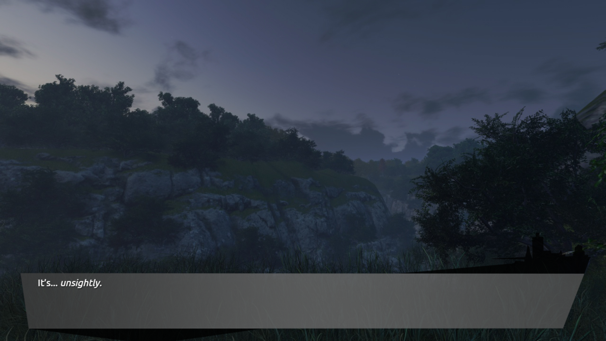
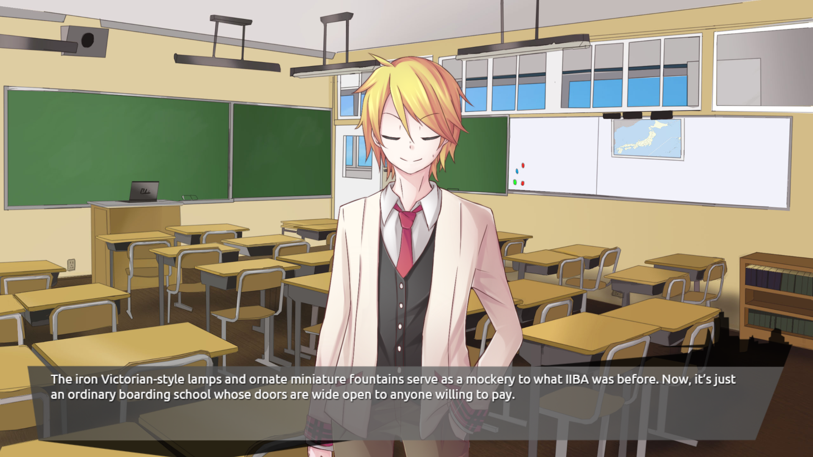
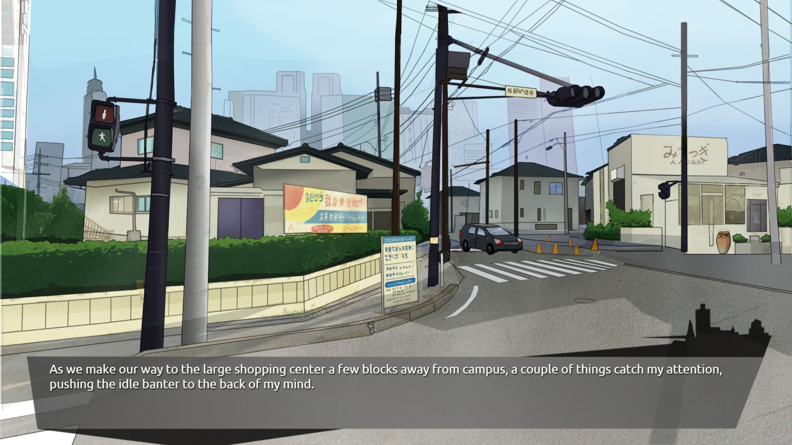

---
{
	title: "Lucid9 is Promising, but Unpolished",
	published: "2014-10-26T21:00:00-04:00",
	tags: ["Preview", "Visual Novel", "Fuwanovel", "Lucid9", "Rockmandash Rambles", "TAY-Classic"],
	kinjaArticle: true
}
---

While there are tons of indie games being made out there, it's not that often that you'll find one being made by the Western Visual Novel community. These tend to vary in quality, from the [well regarded *Katawa Shoujo*](https://tay.kinja.com/katawa-shoujo-review-510682746), to not so great games like [*Always The Same Blue Sky*](http://tay.kotaku.com/rockmandash-reviews-always-the-same-blue-sky-visual-n-1568079967). When the head of this project asked me to give the demo a shot, I said, why not? From what I can tell from the [demo](http://lucid9.weebly.com/), *Lucid9* holds potential and is much closer to Katawa Shoujo in that axis, but it's rough around the edges.

Before we get started, I'm going to give some background information: *Lucid9* is developed by Fallen Snow Studios, a group of people from the Fuwanovel community who wanted to make a visual novel. Fuwanovel is one of the biggest Visual Novel communities out there, and there was recently a [fuwacast](http://www.mixcloud.com/OriginalRen/welcome-to-the-fuwacast-episode-14/) (the Fuwanovel Podcast) by with the creators of the game and if you are interested, you should give a listen**. Keep in mind that this is my thoughts of an alpha demo, so lots of things don't really work (like saving, skipping or pausing) and it may not actually be this way when it comes out.**

#### Writing

*Lucid9* is a Slice of Life Mystery Visual Novel, and the premise is this:

> Yama Ishimoto's life is fairly average. He's breezing through his third year of high school with random shenanigans, hilarious antics, and far too many fried chicken eating competitions. Even when an inexplicable series of murders within the city begins to gain a startling body count, Yama isn't concerned.
>
> Until fate abruptly impels him to the forefront of the investigation.
>
> Now, armed with only his wits and a few vague clues, Yama must uncover the malevolent force behind these serial killings. Just what will he uncover...?

Unfortunately, the demo is pretty short, so we can't really see both sides of the game: all the demo contains at the moment is the slice of life. The writing itself is entertaining ( it gives me a [*Rewrite*](https://rockmandash12.kinja.com/rockmandash-reviews-rewrite-visual-novel-1609445042) vibe) and it got me interested in the story, but I have a big gripe with it: the intro doesn't give much of an idea where the story is going and what it's about. They throw you into a Slice of life world without a good introduction.

I jumped into the story without reading it's plot summary (like a normal person would), and when I finished the demo, I didn't really know what any of it was about, and had to read the plot summary to figure out the premise. I didn't know the characters (especially the protagonist), I didn't know anything about the setting, and I didn't know what made this game special (and I played the demo more than once for this write-up). It really begs the question: Why should I care about them if I don't know who they are or anything about them other than their personality and a few aspects of their past? The demo really needs to be longer to encompass all of this in my opinion. It also doesn't present anything that would help it stand from the crowd, or make you remember it. Yes, it's a mystery visual novel but that doesn't necessarily mean it's good... it still needs to have it's own identity and it doesn't show any of that in the demo. It's not memorable at all, and that makes me worry about it.

That being said, the writing that was there was enjoyable: the main character's sarcasm is surprisingly good, The interactions are pretty funny and I feel like the final product will be pretty enjoyable, but I worry how they are going to balance the drama with the comedy, an issue that a lot of series have nowadays.

#### Art

After the first backround, I was hoping to be impressed by the visuals, but this is a part where the indie nature rubs it's face: the art is OK, but it's not really my cup of tea. The fact that it's 16:9 makes me happy, the character expressions were pretty nice, the effects they have are nice, the UI that is OK, and the character art is pretty nice in general, but there are elements where this game could use improvement. The text should be larger, some of the CG looks weird IMO, and the background art needs improvement. It seems kinda flat to me, there's like no lighting effects, and the backgrounds in general don't look very aesthetically pleasing to me. I appreciate the work it took to make the assets, but I hope this is improved by the time it's done.

#### Soundtrack

*Lucid9*'s soundtrack is pretty good. They have a [soundcloud with some of the soundtrack](https://soundcloud.com/fallensnowstudios), and I found it pleasing to the ear. The tracks fit the situation well, and are well composed in general. I can't wait to see some of these tracks implemented in the game.

#### Conclusion

*Lucid9*'s demo left me wanting more, and that's more than I can say for a lot of indie VN's. The issue is that this feeling wasn't just because it was interesting, but also because really happened and I couldn't really get a grasp about what *Lucid9* is going to be like. I'm looking forward seeing what *Lucid9 *really is about and really hope it succeeds, but I hope the team takes the time they need to make this great. It looks promising, but unpolished.

If you want to give the game a try, check out the demo [here](http://lucid9.weebly.com/).
