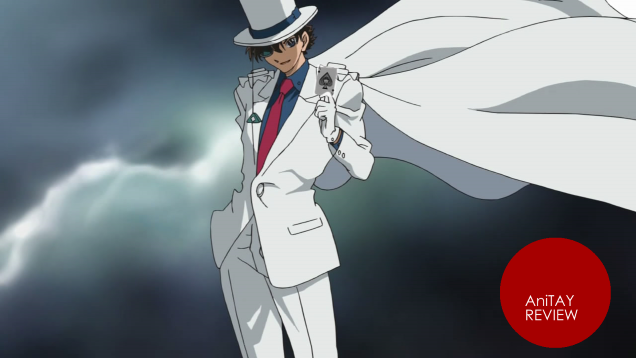
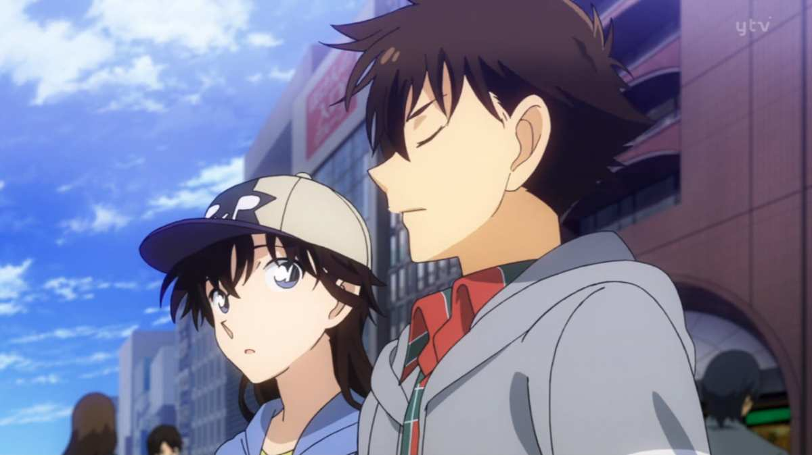
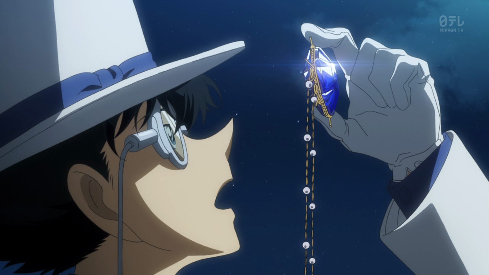
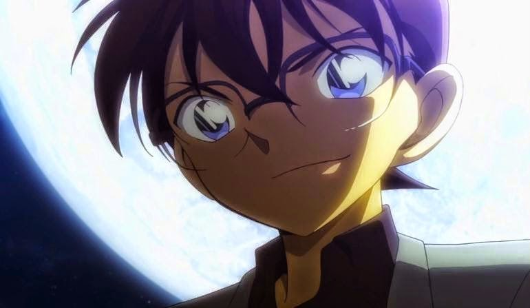
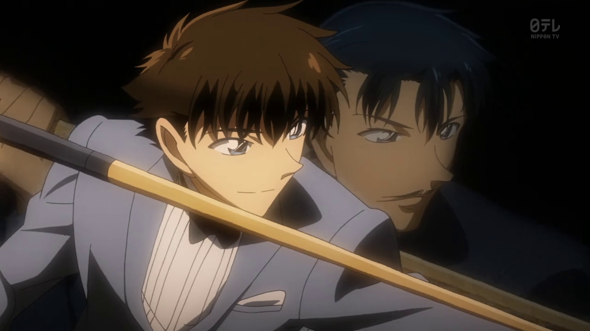
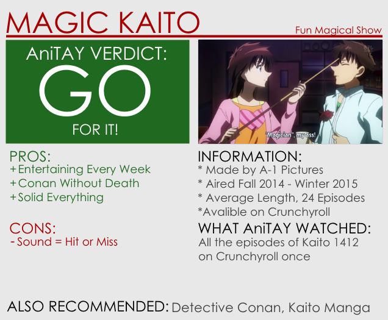

---
{
	title: "Magic Kaito 1412 : The Ani-TAY Review",
	published: "2015-04-04T10:15:00-04:00",
	tags: ["Rockmandash Reviews", "The AniTAY Review", "Tayclassic", "AniTAY", "Magic Kaito"],
	kinjaArticle: true
}
---

If you've been watched anime or read manga in the early 2000's, you've probably came across a series called *Detective Conan*, one of the longest consistently running manga out there. Today, I'm reviewing *Magic Kaito 1412*, A-1 Picture's adaptation of the mangaka's earlier manga series focused on the Magic Kaito Kid and his miraculous feats. Is it any good, and does it live up to *Conan*? Let's find out in this review.

# Episodic Fun, with an Overarching story

As an adaptation of an older manga with a more episodic writing style, many elements of the show are reminiscent of the way anime was structured in the past, with an episodic nature. While there are pros and cons to having an episodic nature vs a more continuous story, Kaito Kid is a fun show week by week that benefits more from an episodic structure, and I appreciate it because the trend anime nowadays are more overarching and a change of pace is quite nice.

That being said, this isn't all episodic: Similar to shows like *Death Parade,* *Magic Kaito* has an overarching story which every episodic episode is related to in some way, and it keeps the show cohesive and interesting. The story follows Kaito Kuroba after he learns that father used to be the famous Kaito Kid thief and that he was murdered by a mysterious organization for refusing to aid them in retrieving the "Pandora Gem," a mystical stone that bestows immortality, and thus the show is pretty much spent looking for this Gem. Due to the fact that the "Pandora Gem" is persumed to be a very large gem, Kaito goes about this by stealing them (but he always returns them, so he's technically not a bad guy!), with the individual thefts being one arc in an overarching story. Honestly, it works really well, as you get the feeling that the story is going somewhere, while feeling self-contained and satisfying, something that a lot of shows should learn from. (AKA, CLIFFHANGERS SUCK.)

# Conan - Death = Win

Who knew that *Detective Conan* without constant death in the series would be so entertaining? I've always been a big fan of Conan, but the consistent murder has always been a gripe of mine, making the impact weaker the further it goes on, making the show feel repetitive and annoying. In *Magic Kaito*, we get to see robberies of rare and precious gems done with a magical flare instead of constant murder cases, and like how watching Conan solve cases in *Detective Conan* was fun, watching Kaito stealing these gems, doing these magic tricks, solving mysteries, etc. is a fun blast. It's pretty much everything I loved about Conan without the death, and it makes the show that much more enjoyable. It has a similar cast of characters that are pretty enjoyable (personally like Conan's cast a bit more, but it's pretty close), similar setups, and the same trill that comes with reading Conan, but in a more bearable way. It's great and it makes for a good watch.

# Solid Execution

A-1 Pictures did a good job with *Magic Kaito*: everything is solid, it's a fun watch, and there's nothing that you can truly count as a flaw for this show. The art is good, the pacing is good, the use of tone is good, the mystery is good, etc. Pretty much every aspect of this show is good, and at worse passable, and for what's essentially a side project of the season given they were working on *[*Saekano*](https://anitay.kinja.com/saekano-how-to-raise-a-boring-girlfriend-the-ani-tay-1693443663)*, *[*Your Lie in April*](http://anitay.kinja.com/your-lie-in-april-the-ani-tay-review-1691904314)* *and* *Seven Deadly Sins* as well this season, it's quite good, and very well rounded.

# Amazing/Annoying Audio

The Sound was really was the only aspect of this show that bothered me while watching. Some aspects were great, like the fantastic opening (which is really good, one of my favorites for the season), and most of the sound like the voice acting in general was pretty good but there are parts of this show that are absolutely jarring and I think sound pretty horrible. Most of this is the Engrish thrown in this series that just sounds bad, or Kaito's voice which is hit or miss, but this is really a small annoyance.

Kaito Kid isn't "Best anime evar" material, but it doesn't really need to be. Even though it's not perfect, it's a show that is consistently entertaining, and it does enough to make this a really fun watch. What else do you want? If you want a fun, entertaining show, you can't go wrong with *Magic Kaito 1412*.

***

*Rockmandash is a frequent writer of Visual Novels and anime on *[*his blog*](/authors/reikaze)* and AniTAY as well. Come and check them out if you are interested in reviews and opinion pieces on these topics! For an explanation of my review system, *[*check this out*](http://tay.kotaku.com/rockmandash-rambles-an-explanation-on-my-review-system-1619265485)*, and here's *[*my biases in reviewing*](/posts/rockmandash-rambles-my-personal-biases-in-reviewing-1688152053)*.*

