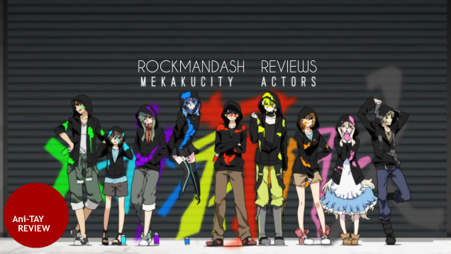
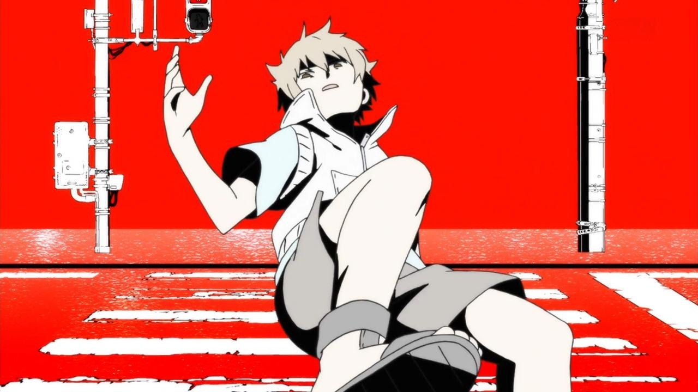
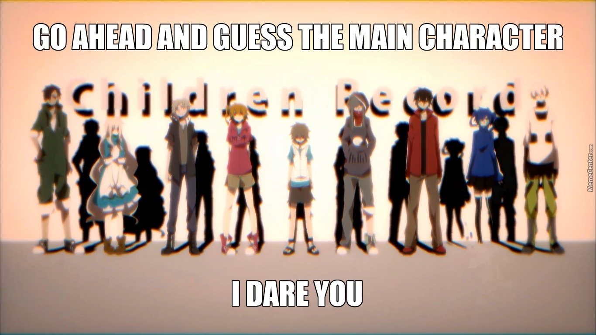
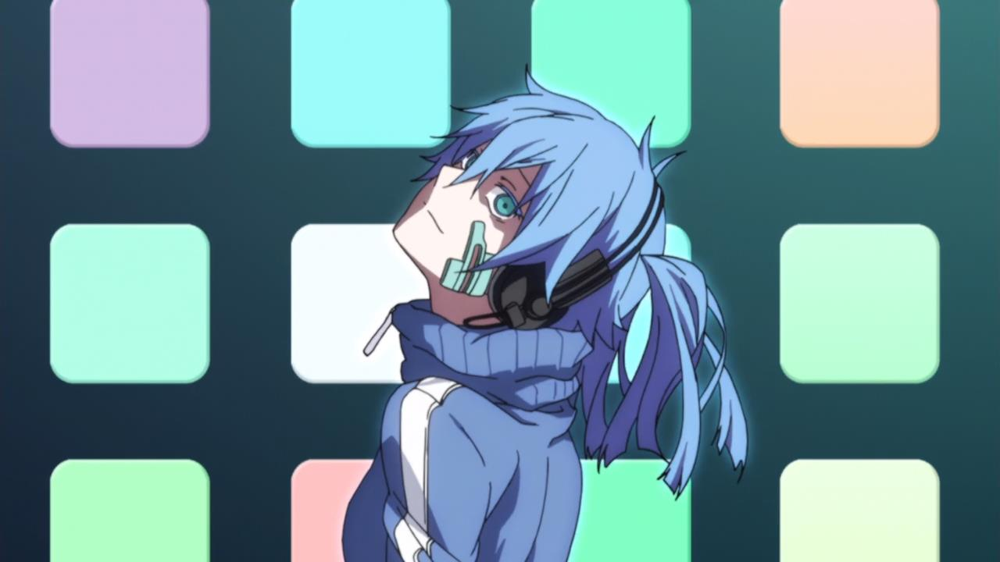
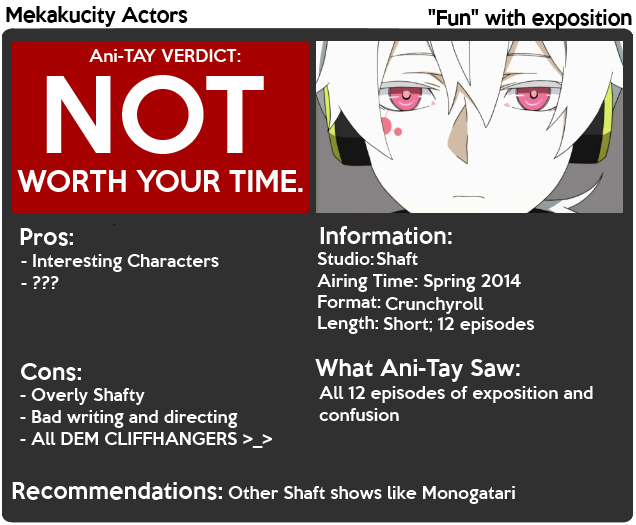

---
{
	title: "Mekakucity Actors : Rockmandash's Ani-TAY Review",
	published: "2014-06-28T17:00:00-04:00",
	tags: ["rockmandash reviews", "ani-tay", "review", "tay classic", "mekakucity actors", "actors", "mekaku", "city", "bad"],
	kinjaArticle: true
}
---

In the [first AniTay Podcast Episode](http://tay.kotaku.com/ani-tay-podcast-episode-1-pilot-1555636369), I said I stopped picking shows to watch based on description because the execution could be bad and the show could be sub-par. I was hoping Mekaku City Actors would prove this wrong: A show that sounds awesome, and is executed very well. What could go wrong? It's a show done by studio Shaft, who's work has been constantly solid, and I've enjoyed every show I've seen that involves a NEET, which the descriptions emphasized. Mekaku City Actors broke my expectations in all the wrong ways.

# Premise

I find the premise of this show interesting, as it is about a group known as the the Mekakushi Dan: a group of teenagers with unusual powers. Seeing the Mekakushi Dan together is fun to watch and enjoyable, but the Mekakushi Dan rarely get together, which is something I'll elaborate on that later.....

***

# Characters

The amazing characters with unique abilities and interesting personas are the sole reason you should watch this show. Pretty much every character has an interesting back story, and the interactions between each other is great. Three characters I am personally a fan of are Shintarou, Ene, and Konoha, who shine whenever they are on the screen.

## Soundtrack & Pandering to the fans

Mekaku City Actors is a show based on a series of songs done by Vocaloids. This is an important tidbit to know before you watch, as it can make or break the enjoyment of the show... and because it is based on a series of songs, there will be songs in the show. The songs themselves are quite solid and standalone can be absolutely fantastic... But in the context of a show, they need to be making a mood and supporting a show, which they do not. The biggest problem is that they place songs in situations where they negatively impact the enjoyment of the show just to please the fans who want to see the songs. In my eyes, the songs break the pace of the show and help to emphasize the clueless feeling that a viewer might have as they watch the show, if they didn't see the source material. They try to explain important things in the songs, but it's almost impossible to pick up anything meaningful from them, plot wise. The saddest part about this is that even though it panders to fans by placing the songs, from what I've heard, this fanservice doesn't work at all due to the bad execution.

# Overly Shaft-y

If you have ever seen a show by Studio Shaft, you know what to expect: a unique visual style, unconventional ways to display things, an emphasis on charecter development, and headtilts. Lots and lots of headtilts. This is pretty pretty much true for the most part, but unlike Madoka or Monogatari which made them stand out and help make the story enjoyable, Shaft's style detracts from the experience of Mekakucity Actors by being way too overly headtilty in the first few episodes, distracting you from the story, and being so conversational that it interferes with the plot. Also, here's a message to Shaft: **I know you guys like your unique art styles, but please do not try CGI again. It falls into the uncanny valley and looks bad.**

***

# No main character

One decision that really hurts this show is because of the way the show is executed, it leads to the show having no real main character. This wouldn't be a problem if every character had an arc and got their moment of the spotlight, but this is simply not the case. This show has characters you can relate to, and plenty of them would be great main characters, as most of them are pretty enjoyable.... but no, they jump between characters like fashionistas change shoes. From what I've read, Shintarou was supposed to be the main character, which in my opinion would be a better way of executing due to the fact that Shintarou is an outsider NEET that has the perspective as the viewer. It baffles my mind that they didn't go that way.

***

# WHAT IS GOING ON????

You will not understand a single thing going on in Mekakucity Actors. Even though almost all the episodes are exposition, you are still left clueless because they never connect it back to an ongoing main story, and the plot goes absolutely nowhere, thus making it more like a string of random events shown to the viewer instead of a show with a connected story. The stringing of random events is pretty horrible as well; episodes on a weekly basis don't have direct correlation with the last one, so you will be spending several episodes being like "WTF is going on, can we continue with what you were trying to show is last week?" This show (and series in general) is so confusing that some insane fan on tumblr took the time out of their lives to write a [GIANT FUCKING GUIDE TO THE KAGEROU PROJECT](http://haiiro-no-suiyoubi.tumblr.com/post/69928272958/a-giant-giant-guide-to-kagerou-project-for-beginners). **THIS SHOULD NOT BE NECESSARY**. To pour some salt on that wound, it has some flat out bad writing and directing... This show is like if a somebody wanted to make an episodic show similar to Cowboy bebop but were forced to make it into a show with a semi-connected plot. It's bad. I think this is probably because this is a series of songs... and you can't really have a plot with any sense of coherency when they are based on songs that have very little to do with each other. This show has no coherency, no direction, and no enjoyment factor, all because you have no idea what's going on. It's like watching a series of events on the news that you don't care for because you have no idea what's going on, or jumping into a movie half way. The last few episodes tries to fix this, but that's like putting together a 10,000 piece jigsaw puzzle in 5 minutes; It just doesn't happen, and it'll never look the way you want it to. This show has the same issue as Angel Beats! has by being only one cour; they could have developed the charecters, had charecter interactions between the charecters, and fleshed out the plot, but because it's only one cour, they couldn't, and thus you are confused and frustrated with the plot.

The cherry on top of this show is that they end almost EVERY episode on a cliffhanger, thus pissing off the clueless viewer and giving less incentive to watch the show. I don't mind a cliffhanger episode every once in a while, but EVERY EPISODE when it's essentially very minor stuff, its absolutely infuriating, and it makes you want to drop this show. I think some of these problems can be fixed by marathoning this show, as waiting a week for information is infuriating absolutely breaks up the pacing, and leaves you clueless, but marathoning this show will not fix all of it's problems.

***

# Personal Enjoyment

Mekakucity Actors is the prime example of what I want a show to be like, on paper at least. Great and interesting characters, neat visual style, with good with a solid animation studio. Watching it though, is a completely different story. Simply put, I didn't enjoy this show, due to the horrible information management, and all the gripes I wrote in this review. Even with the interesting premise of the Mekakushi Dan, the show still manages to fail due to the lack of plot development. You never see the Mekakushi Dan do jack shit, and they are together for only like half the show. The rest of the show is just exposition of their pasts, which is not what I came to watch this show for. I came into this thinking this would be the perfect show for Shaft. After watching it however, I think that Shaft was absolutely the wrong studio to do this show, as everything they do well detracts from the story, and just ruins it.

# Conclusion

This show is bad. Stay far, far away. It had an interesting idea with a great cast, but was ruined by source material, bad directing, and a combination of other factors. If anybody had any idea what happened while watching Mekaku, i'll applaud you, but I'm pretty sure you didn't understand it at all, which was really the biggest problem. I sure didn't. They fucked it up, so please don't watch it. If you are that much a die hard shaft fan, go ahead, but it's not going to be a fun trip.

**Overall 5/10, Polarization +2.5, -1**

 

***

**Copyright Disclaimer:** Under Title 17, Section 107 of United States Copyright law, reviews are protected under fair use. This is a review, and as such, all media used in this review is used for the sole purpose of review and commentary under the terms of fair use. All footage, music and images belong to the respective companies.

*You can see all my reviews on *[*Rockmandash Reviews*](http://tay.kotaku.com/tag/rockmandash-reviews)*. For An explanation of my review system, *[*check this out*](https://rockmandash12.kinja.com/rockmandash-rambles-an-explanation-on-my-review-system-1619265485)*.*

*This show is available on *[*Crunchyroll*](http://www.crunchyroll.com/mekakucity-actors)* for Free & Legal streaming.*
