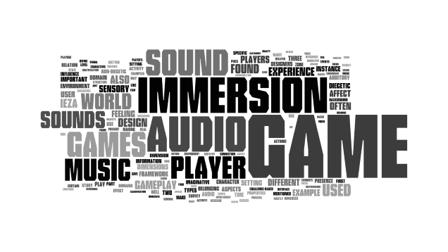

---
{
	title: "Music in Media: Influencing your Experiences",
	published: "2014-11-11T03:45:00-05:00",
	tags: ["Music in Media", "Rockmandash Rambles", "Tay-Classic", "Music", "Games", "Soundtrack", "Discussion", "Influence", "Experience", "Part 1"],
	kinjaArticle: true
}
---

I believe that there is an inherent flaw in the way we typically talk about music in Video Games, Anime or media in general. In reviews or discussions, people tend to gloss over the sound, and on the occasion they discuss it, that discussion is usually composed about if it sounds good or not. The issue is that music in media is more than that. Music in a media or a narrative is fundamentally different than standalone music, and the elements and intricacies that being in a media add are typically glossed over when discussing about them.

Also, I'm just going to throw a disclaimer so this doesn't become an issue in the future: I spend most of my time watching [Anime](http://anitay.kinja.com/) and playing[ Visual Novels](http://tay.kotaku.com/the-beginners-guide-to-visual-novels-1541975662). Most of my examples will be from those medias, but I'll try to throw in more familiar music ~~and will probably fail~~. Also, everything in this article is my opinion, so feel free to disagree. I'm not trying to discuss facts, I'm trying to encourage discussion.

### Getting Absorbed into the World - Creating an Atmosphere

When we experience a game or movie, we are inherently detached from the experience. Unlike events in our real life, the events that take place inside a movie or a game have a very minimal effect on our own lives. Due to this, these works have to try absorbing us into the world by creating an atmosphere that is engaging and a mood that interests the viewer. In medias like TV shows and Video Games, one of the tools that that creators can utilize to absorb us into the world is our senses, thus Visuals and Music are usually used to appease them. They are a crucial element or removing the barriers of a media and making the world feel believable. Through music, these works of art can create an environment in which we can experience, and give a sense of what the scene is like. Through the composition of the songs, you get sensory information the tone of the scene, while acquiring knowledge on the scope of the world. In the track I selected above, Stranger from [*Fate/hollow ataraxia*](http://rockmandash12.kinja.com/rockmandash-reviews-fate-hollow-ataraxia-visual-novel-1612260148?rev=1414624834220) is a tranquil, serene track. Just listening to this, it creates a calming atmosphere which helps you to imagine a calm and tranquil environment which a track like this would play in, and it creates a feeling of existence. Music like this makes you feel like you are in this serine world that this music plays in, and this is an important part of music in media.

This atmosphere is especially important to make in Video Games, where there are long expanses of time where there is little going on screen that involves writing, thus the other tools need to pick up the slack. Some games like platformers don't really have a plot at all, so they rely on the visuals, sound and gameplay to engage the player in an experience. One example I can think of in a game that creates a really solid atmosphere via music is in *Sonic Unleashed*'s Night stages. Many people would say that these stages are absolutely horrible; they are too long, the gameplay is repetitive, and they really shouldn't be there. The biggest reason that I kept playing was the absolutely amazing soundtrack that would play when there wasn't battles; the variety of instruments made me feel like I was playing as a character in that part of the world (because *Unleashed* took place in many parts of the world), and the solid execution with pleasing to the ear composure and smoothness is one that I fell in love with.

Also, this is incredibly important to make for works that do not occur in modern times, in our world, or just any setting we are not familiar with. Creating this atmosphere is essential to how you experience said work, and it will directly influence the your enjoyment of the game. It can be the difference between getting attached to a story, or not. Due to the fact that the person experiencing a work is unfamiliar with the world, music usually acts as a supplement to the world building, as it helps to create a culture and feel for the world. Via the use of genres, specific instruments and play style, Music can heavily influence your perceived notion of the world: it can create a feeling of age, it can create a feeling of fantasy, it can create a feeling of alienation, etc. A great example is the **not** *Final Fantasy* game, [*The Last Story*](http://kotaku.com/the-last-story-the-kotaku-review-5889812). If you just had the writing and the world, it may just feel like another high fantasy, but with Nobuo Uematsu's beautiful soundtrack, it creates a rich world, one with its own history and past. It builds a very distinct tone and feel using instruments like the violin that is not typically found in fantasies, and it helps to create a tone for what the game will feel like. The world feels older than our modern times, but it has a lot of character, and this soundtrack makes the world feel very alive. It gives you a good feel for what the world is like, and is a huge part of the world building in The Last Story.

### Enhancing the Meaning - Using a Soundtrack Well

It's one thing to have a track that portrays an atmosphere, but it's another to use it well. For a soundtrack to be really effective, it has to utilize its music to coincide with what is happening on screen, and accompany the narrative or experience the work is trying to execute. A soundtrack that is used well will capture the themes, make important scenes stand out from the rest, with a well-timed track that matches with what the visuals and writing is doing, but used well enough to make sure that it the track itself leaves impact on the viewer. Sometimes using a track too much may dull the impact, but repetition manages to enforce the meaning of the song.

I think a great example of a well-used soundtrack would be [*Heavy Rain*](http://kotaku.com/heavy-rain-review-no-wrong-conclusion-452580385); the depressing, slow tracks emphasize the bleak and oppressive mood, which heavily compliments the story and shows exactly what you should expect out of this game, putting it's themes front and center. The music is extremely well, to put the player in the world, to make it feel real… and then put the impact of the scene in. It has a wide variety of tension tracks to keep it fresh like Coundown and The Chase, which all keep the songs fresh and sounding appealing to the ear, even though there aren't a lot of tracks in the soundtrack.

It'll be nearly impossible to show you in this text article about what a well-executed soundtrack is like, but I'll try my best by giving examples of shows with similar soundtracks but very different execution (sorry if you are lost by my examples). If you've been watching anime as of late, you have probably heard some of Hiroyuki Sawano and Mika Kobayashi's work, in works like [*Attack on*](https://kotaku.com/attack-on-titan-is-good-so-far-but-doesnt-live-up-to-643242311) [*Titan*](http://tay.kotaku.com/dexs-review-attack-on-titan-1464030190), [*Kill la*](http://kotaku.com/kill-la-kills-first-half-is-just-pure-unfiltered-fun-1486930532) [*Kill*](http://tay.kotaku.com/kill-la-kill-the-ani-tay-review-1554090665), and [*Aldnoah.*](http://kotaku.com/aldnoah-zero-is-a-dark-twist-on-gundam-1654366568)[*Zero*](http://anitay.kinja.com/aldnoah-zero-the-ani-tay-review-1637330529). They make absolutely amazing soundtracks, which all enhance the pacing, tone and mood of the show dramatically. These are shows where the soundtrack is dramatic and bombastic, thus they have a large impact. In these shows, I'd say that the style and quality in the soundtracks are about the same, but *Aldnoah.Zero*'s is nowhere near as entertaining due to the usage. Every time [Don't lose your way](https://www.youtube.com/watch?v=9nvp4kzUoww) is used in *Kill la Kill*, it's used because Ryoko **is losing her way**, and due to the circumstantial usage of it, the track stands out from the soundtrack and you know something's going down. In Attack on Titan, Reluctant Heroes was used whenever characters are determined yet reluctant, thus fitting with the song. In *Aldnoah.Zero*, when [BRE@TH//LESS](https://www.youtube.com/watch?v=UApRJwaqBEI) is used, it's used during tension, but used haphazardly and not for a specific type of tension, thus dulling the strength of the song. By the end of Season 1, BRE\@TH//LESS felt like it was disconnected with what was happening with the show, and it seemed like it was used only to sound cool.

[ ](https://kotaku.com/attack-on-titan-is-good-so-far-but-doesnt-live-up-to-643242311)

### Controlling How You Feel - Dictating Mood

Why is the execution important? Mood. Music is what dictates the mood of the story, and by doing this, directly influences how you the viewer/player feels. One can say that music is emotion itself, and I'd have to agree with thatWhen you have a good soundtrack, the music will attach you to the characters, and the music will mess with you. When you engage a story, you come into it with your own mindset: It is the music's job to snap you into the mindset that the scene intends you to be in, and when it does this, it usually elicits emotions. When you and the music are in the same mindset, it can really memorable moments, and those are the moments when they flood gates open, the emotions start impacting. My example for this is *Clannad*, as the track Roaring Tides does an absolutely fantastic job moving you, and it certainly did a number on me when I first heard it... I was pouring tears.

Most important music in games and film are made to do this. Music is a powerful tool that heavily influences how you feel. Without solid music playing, events mean nothing. Music is what makes a scene memorable, and is probably the most powerful at evoking emotions. While Visuals and Writing can influence your mood to be sad, that influence pales to comparison the influence that playing sad music will do. Music is the aspect of media that strikes straight into your heart, and it's the one that will influence how you feel the most. I'm sure you've all experienced a movie or game where they have a really sad or actiony song to sway your emotions, and it works exceptionally well.

To me, the ideal soundtrack is one that takes that feeling of existence I mentioned earlier and connects you with the characters, and makes you feel what they feel. When you start to think like the protagonist, and feel like your actions would be exactly the same as the protagonist, the soundtrack is doing it's job in creating an amazing atmosphere and getting you to feel. When this combination appears, there is nothing more emotional and impactful that I can think of; you feel the consequences, you feel in the mood, and the music influences you to no end. If you've been on Ani-TAY for an extended period of time, You've probably heard this before, but[*Muv-Luv*](https://rockmandash12.kinja.com/rockmandash-reviews-muv-luv-extra-alternative-visua-1567978967) does this extremely well. It was the [collimation of everything](http://tay.kotaku.com/rockmandash-rambles-why-i-loved-muv-luv-but-you-might-1566859006) I've been talking about in the article: Amazing atmosphere due to the music, excellent execution that [enhances the purpose of the plot](https://dexomega.kinja.com/why-muv-luv-was-a-defining-entry-in-modern-science-fict-1656724699) and making you feel. They utilize the music to make you despair, and after experiencing this moment, you probably will be bauling up just like the main character Takeru did. It's a great example of music in a media done right.

### Conclusion

Music is an aspect of media that is underrepresented in discussions, and I hope this article makes you think and appreciate the influences it has. The next time you are watching a show or playing a game, try to think of the music and it's influences. The next time you discuss your favorite show or game with someone, bring up the soundtrack, as it's rarely discussed... and for those reviewers or analyzers of media reading this: **PLEASE MENTION THE SOUNDTRACK**. It's a crucial element of the experience, and it pains me to see so many people gloss over it. Music dramatically influences a person's experience, so not mentioning it is leaving out an important aspect unmentioned, and it really should be mentioned to spur discussion.
