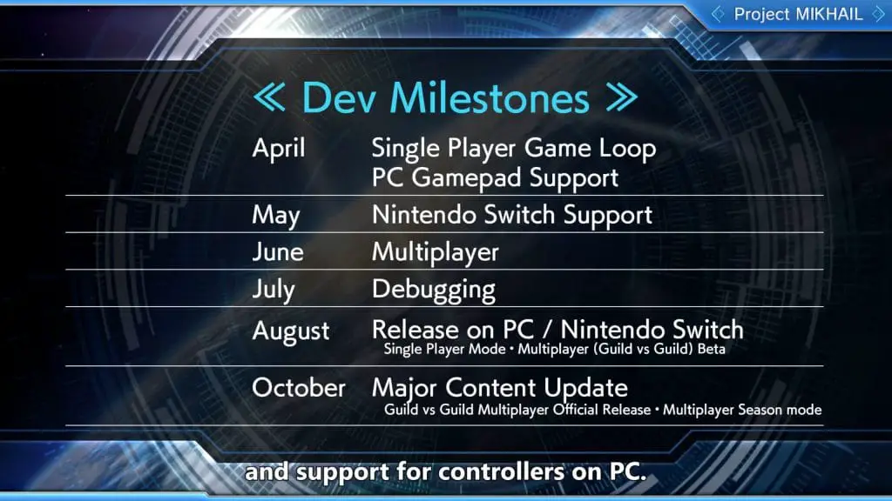
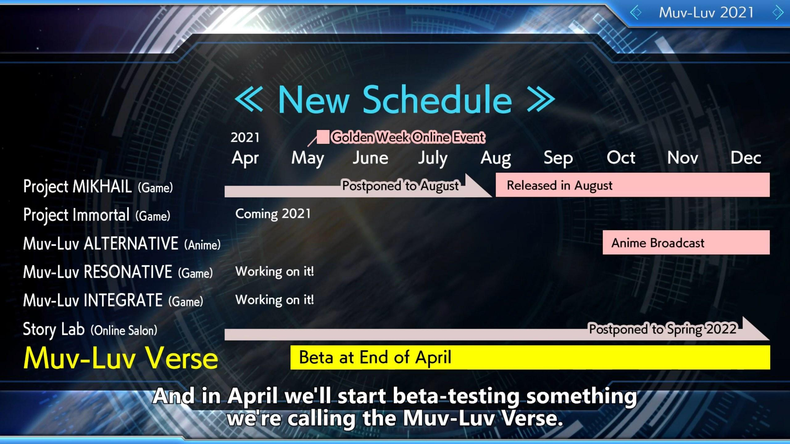

---
{
  title: "Muv-Luv Stream Details Project Mikhail PC and Switch Release, but Also Delays",
  published: "2021-03-25T21:00:37-07:00",
  ogLink: "https://noisypixel.net/muv-luv-project-mikhail-pc-switch-delay/",
}
---

Today developer Anchor hosted a special Muv-Luv announcement stream that detailed the plans for _Muv-Luv_ in 2021, headlined by changes to _Project Mikhail_.

<!-- ezoic_video_placeholder-under_first_paragraph-640x360-999998-clearholder -->

<!-- ezoic_video_placeholder-under_first_paragraph-640x360-999998-nonexxxclearxxxblock -->

<!-- ezoic_video_placeholder-under_first_paragraph-426x240-999998-clearholder -->

<!-- ezoic_video_placeholder-under_first_paragraph-426x240-999998-nonexxxclearxxxblock -->

<!-- ezoic_video_placeholder-under_first_paragraph-384x216-999998-clearholder -->

<!-- ezoic_video_placeholder-under_first_paragraph-384x216-999998-nonexxxclearxxxblock -->

Unlike the previous entries in the _Muv-Luv_ series, which have been Visual Novels, _Project Mikhail_ is an action game where you control a Tactical Surface Fighter Mech to battle the alien BETA. Originally _Project Mikhail_ was set to come out on PC and mobile devices in April but is now the team will launch the new game on PC and Switch instead in August.

The cause of the delay is because age is making a variety of changes to the game, introducing a new producer, and during the stream,[ they also showed new gameplay of* Mikhail*.](https://www.youtube.com/watch?v=FVn6EyF8-Is)

<!-- ezoic_video_placeholder-under_second_paragraph-640x360-999997-clearholder -->

<!-- ezoic_video_placeholder-under_second_paragraph-640x360-999997-nonexxxclearxxxblock -->

<!-- ezoic_video_placeholder-under_second_paragraph-426x240-999997-clearholder -->

<!-- ezoic_video_placeholder-under_second_paragraph-426x240-999997-nonexxxclearxxxblock -->

<!-- ezoic_video_placeholder-under_second_paragraph-384x216-999997-clearholder -->

<!-- ezoic_video_placeholder-under_second_paragraph-384x216-999997-nonexxxclearxxxblock -->

Along with the changes to* Mikhail*, they announced changes to the release schedule of *Muv-Luv *projects:  the Story Lab would be postponed to Spring 2021, but they announced _Muv-Luv Verse_, a “virtual theme park” for _Muv-Luv_.

There are still no release dates on* Project Immortal*,  _Muv-Luv Unlimited: The Day After 04 Resonate,_ or _Muv-Luv Integrate_, the sequel to _Alternative_.

In case you missed it, [check out our review of *Muv-Luv Unlimited: The Day Afte*r](https://noisypixel.net/muv-luv-unlimited-the-day-after-review-pc/), where we touch on each of the recently released episodes in the west.

<!-- ezoic_video_placeholder-mid_content-640x360-999996-clearholder -->

<!-- ezoic_video_placeholder-mid_content-640x360-999996-nonexxxclearxxxblock -->

<!-- ezoic_video_placeholder-mid_content-426x240-999996-clearholder -->

<!-- ezoic_video_placeholder-mid_content-426x240-999996-nonexxxclearxxxblock -->

<!-- ezoic_video_placeholder-mid_content-384x216-999996-clearholder -->

<!-- ezoic_video_placeholder-mid_content-384x216-999996-nonexxxclearxxxblock -->

You can watch the entire stream below:

<!-- ezoic_video_placeholder-long_content-640x360-999995-clearholder -->

<!-- ezoic_video_placeholder-long_content-640x360-999995-nonexxxclearxxxblock -->

<!-- ezoic_video_placeholder-long_content-426x240-999995-clearholder -->

<!-- ezoic_video_placeholder-long_content-426x240-999995-nonexxxclearxxxblock -->

<!-- ezoic_video_placeholder-long_content-384x216-999995-clearholder -->

<!-- ezoic_video_placeholder-long_content-384x216-999995-nonexxxclearxxxblock -->

[YouTube video player](https://www.youtube.com/embed/F-AKwGDr0Zs)
