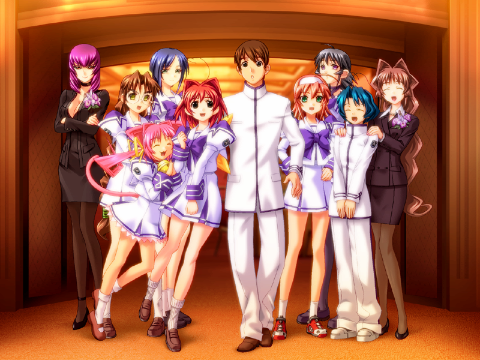

---
{
title: "Muv-Luv Schwarzemarken Anime Announced",
tags: ["Muv-Luv", "News", "Anitay"],
authors: ['reikaze'],
published: '2015-05-21T03:23:00-04:00',
attached: [],
license: 'cc-by-4',
oldArticle: true
}
---

If you have been on AniTAY for a significant period of time, You would know that <a class="sc-1out364-0 hMndXN sc-145m8ut-0 gIacKn js_link" data-ga='[["Embedded Url","External link","https://anitay.kinja.com/dex-where-do-i-start-with-muv-luv-1561900783",{"metric25":1}]]' href="https://anitay.kinja.com/dex-where-do-i-start-with-muv-luv-1561900783" rel="noopener noreferrer" target="_blank"><em>Muv-Luv</em></a>is
  a Visual Novel made by Age, and it’s one that is extremely well received by a lot of us in the AniTAY community.
  Today, the Light novel spinoff<em> Schwarzemarken</em> is now getting an anime! (<a class="sc-1out364-0 hMndXN sc-145m8ut-0 gIacKn js_link" data-ga='[["Embedded Url","External link","http://anitay.kinja.com/fan-translations-and-more-muv-luv-news-1577799452",{"metric25":1}]]' href="http://anitay.kinja.com/fan-translations-and-more-muv-luv-news-1577799452" rel="noopener noreferrer" target="_blank">which Dex totally called a year ago</a>.) 

<aside class="sc-1rh3ayr-6 jfFNjl inset--story branded-item branded-item--kinja" data-commerce-source="inset">

<a class="sc-1out364-0 hMndXN js_link" data-ga='[["Permalink page click","Permalink page click - inset headline"]]' href="https://anitay.kinja.com/dex-where-do-i-start-with-muv-luv-1561900783" rel="noopener noreferrer" target="_blank"><h6 class="sc-1rh3ayr-3 jRIPES">Dex,
    Where do I Start with <em>Muv-Luv</em>?</h6></a>

I’ve recently fielded a few questions about where to start in Muv-Luv just recently.
      Considering…
<a class="sc-1out364-0 hMndXN sc-1rh3ayr-0 kOvmIi js_readmore inset--story__readmore js_link" data-ga='[["Permalink page click","Permalink page click - inset read more link"]]' href="https://anitay.kinja.com/dex-where-do-i-start-with-muv-luv-1561900783" rel="noopener noreferrer" target="_blank">Read more</a>

</aside>
The story of <em>Schwarzemarken </em>is set in Alternative’s 1983, and it focuses
  on the Eastern German Army’s 666th fighting against the BETA’s Westword attack, and everything that comes with it,
  from political conflicts to battles. Also,<em> Muv-Luv</em> had another Anime adaptation, which was <a class="sc-1out364-0 hMndXN sc-145m8ut-0 gIacKn js_link" data-ga='[["Embedded Url","Internal link","http://tay.kotaku.com/dexs-review-total-eclipse-1478426224",{"metric25":1}]]' href="http://tay.kotaku.com/dexs-review-total-eclipse-1478426224">Total</a><a class="sc-1out364-0 hMndXN sc-145m8ut-0 gIacKn js_link" data-ga='[["Embedded Url","External link","https://tay.kinja.com/rockmandash-reviews-muv-luv-alternative-total-eclipse-1585812547",{"metric25":1}]]' href="https://tay.kinja.com/rockmandash-reviews-muv-luv-alternative-total-eclipse-1585812547" rel="noopener noreferrer" target="_blank"> Eclipse</a>, but that has its issues. Looking at the source of Schwarzesmarken,
  this anime shouldn’t have those issues, so let’s roll out the hype train! (Also, good luck on getting me to try to say
  that name out loud... I’ll epically fail &gt;_&lt;)

<aside class="sc-1rh3ayr-6 jfFNjl inset--story branded-item branded-item--kinja" data-commerce-source="inset"><a class="sc-1out364-0 hMndXN sc-1rh3ayr-2 lcMGRt inset--story__thumb js_link" data-ga='[["Permalink page click","Permalink page click - inset photo"]]' href="https://tay.kinja.com/rockmandash-reviews-muv-luv-alternative-total-eclipse-1585812547" rel="noopener noreferrer" target="_blank">
<video autoplay="" loop="" muted=""><source src="./yyvmgdsosl5zvu7mzrfe.mp4" type="video/mp4"/></video>
</a>

<a class="sc-1out364-0 hMndXN js_link" data-ga='[["Permalink page click","Permalink page click - inset headline"]]' href="https://tay.kinja.com/rockmandash-reviews-muv-luv-alternative-total-eclipse-1585812547" rel="noopener noreferrer" target="_blank"><h6 class="sc-1rh3ayr-3 jRIPES">
    Rockmandash Reviews: <i>Muv Luv Alternative: Total Eclipse</i> [Anime]</h6></a>

      More Muv-Luv! I'm sure all of you here on TAY is absolutely sick and tired of me and Dex…
<a class="sc-1out364-0 hMndXN sc-1rh3ayr-0 kOvmIi js_readmore inset--story__readmore js_link" data-ga='[["Permalink page click","Permalink page click - inset read more link"]]' href="https://tay.kinja.com/rockmandash-reviews-muv-luv-alternative-total-eclipse-1585812547" rel="noopener noreferrer" target="_blank">Read more</a>

</aside>
<strong>Source:</strong> Age &amp; <a class="sc-1out364-0 hMndXN sc-145m8ut-0 gIacKn js_link" data-ga='[["Embedded Url","External link","http://www.crunchyroll.com/anime-news/2015/05/19-1/muv-luv-schwarzesmarken-anime-reportedly-being-produced",{"metric25":1}]]' href="http://www.crunchyroll.com/anime-news/2015/05/19-1/muv-luv-schwarzesmarken-anime-reportedly-being-produced" rel="noopener noreferrer" target="_blank">Crunchyroll</a>

<iframe allowfullscreen="" autoresize="true" class="core-inset" data-recommended="false" data-src="https://anitay.kinja.com/ajax/inset/iframe?id=twitter-601048297587912704&amp;autosize=1" frameborder="0" height="280" id="twitter-601048297587912704" mozallowfullscreen="mozallowfullscreen" scrolling="no" src="https://anitay.kinja.com/ajax/inset/iframe?id=twitter-601048297587912704&amp;autosize=1" webkitallowfullscreen="webkitAllowFullScreen" width="500"></iframe>

