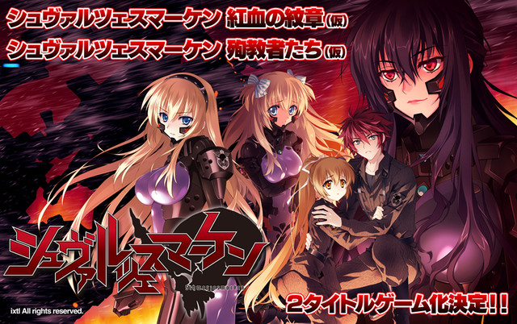

---
{
	title: "Muv-Luv Schwarzemarken Anime Announced",
	published: "2015-05-21T03:23:00-04:00",
	tags: ["Muv-Luv", "News", "Anitay"],
	kinjaArticle: true
}
---

If you have been on AniTAY for a significant period of time, You would know that [*Muv-Luv*](https://anitay.kinja.com/dex-where-do-i-start-with-muv-luv-1561900783)is a Visual Novel made by Age, and it’s one that is extremely well received by a lot of us in the AniTAY community. Today, the Light novel spinoff* Schwarzemarken* is now getting an anime! ([which Dex totally called a year ago](http://anitay.kinja.com/fan-translations-and-more-muv-luv-news-1577799452).)

The story of *Schwarzemarken *is set in Alternative’s 1983, and it focuses on the Eastern German Army’s 666th fighting against the BETA’s Westword attack, and everything that comes with it, from political conflicts to battles. Also,* Muv-Luv* had another Anime adaptation, which was [Total](http://tay.kotaku.com/dexs-review-total-eclipse-1478426224)[ Eclipse](https://tay.kinja.com/rockmandash-reviews-muv-luv-alternative-total-eclipse-1585812547), but that has its issues. Looking at the source of Schwarzesmarken, this anime shouldn’t have those issues, so let’s roll out the hype train! (Also, good luck on getting me to try to say that name out loud... I’ll epically fail >\_<)

**Source:** Age & [Crunchyroll](http://www.crunchyroll.com/anime-news/2015/05/19-1/muv-luv-schwarzesmarken-anime-reportedly-being-produced)
