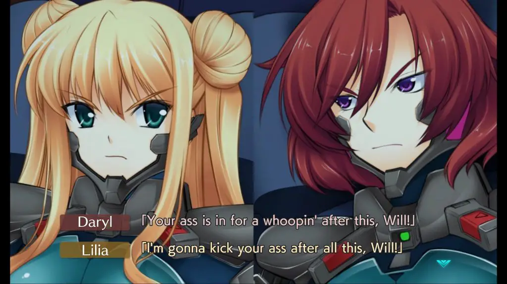
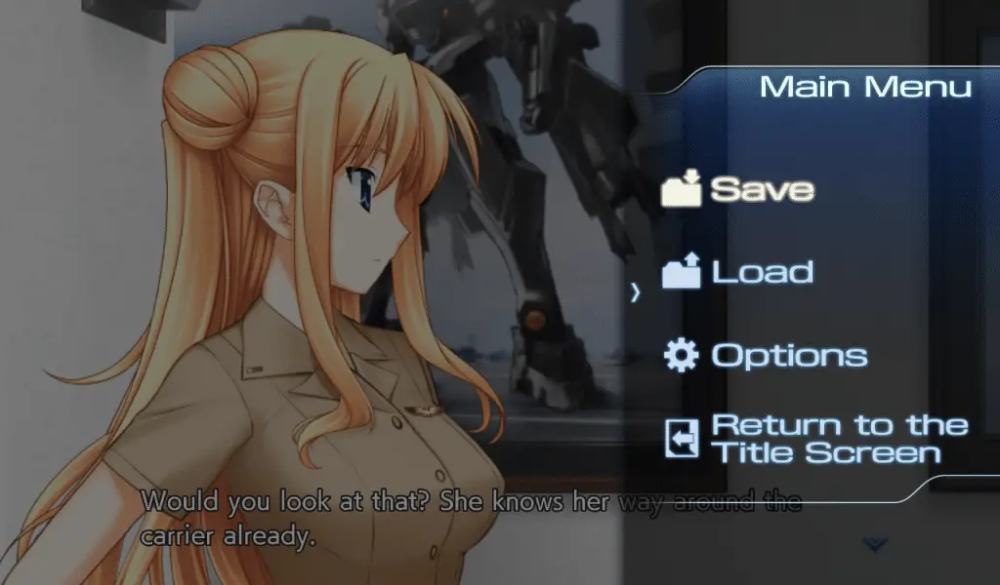

---
{
  title: "Muv Luv Unlimited: The Day After 00 Impressions – A Shot of Alternative",
  published: "2021-02-18T11:29:11-08:00",
  originalLink: "https://noisypixel.net/muv-luv-unlimited-the-day-after-00-preview-pc/",
}
---

I eagerly await every new release of _Muv-Luv_, but out of all the titles Anchor has been releasing, _Muv Luv Unlimited: The Day After_ is probably the one I have been looking forward to the most. This is partly because it was started by Alternative Project but never finished. After all, they went legit. But another reason was that I thought that _Muv Luv Unlimited: The Day After_ is an exceptionally great part of _Muv-Luv_ that no one should miss.

<iframe src="https://www.youtube.com/embed/b2OZHWjxR94?feature=oembed"></iframe>

My _Muv-Luv Unlimited: The Day After 00_ impressions will assume that you have played through at least the original _Muv-Luv_ (the _Extra_ and _Unlimited_ arcs) since there are inherent spoilers that cannot be avoided. So please play those first or read our review on them before you continue with this one.

Unlike most *Muv-Luv* spinoffs, _The Day After_ is not set in the _Alternative_ universe like so many others. It’s effectively a sequel to _Unlimited_, exploring the disaster end that is Alternative V. Of the side stories I’ve experienced, I’d argue it’s the best: it has the most interesting premise, it matches the tone of the best parts of _Alternative_ better than basically anything else, and it’s the most in-depth of the side stories in _Muv-Luv_.

_The Day After 00_ is pretty short (about 10 hours) and is a standalone story, serving as an introduction to the setting. The narrative takes place a short while after Operation Babylon and follows Will and Lilia and their lives stranded in the carrier John F Kennedy. Surprisingly for a _Muv-Luv_ game, there’s actually not that much information about the world outside the JFK carrier. *The Day After 00* acts like a character drama or a mystery game where you wait to see what happens to learn about the setting as a whole.

For most of the game, the general tension between the main leads Will and Lilia is what the story revolves around. They have diametrically opposed visions of the situation on how the JFK should be handled. That being said, near the end, the pacing ramps up and provides the action that one has come to love from the series. This action is presented exceedingly well, feeling like a concentrated shot of the best _Muv-Luv Alternative_ has to offer… but just a shot – gone in a flash.

_The Day After 00_ reminds me of many games like *Zero Escape* or *Root Double* in the way that it manages its setting: always letting you know you’re in a dire situation, keeping the tension high, and building a foreboding, eerie calm that is utilized to its fullest potential. This is ultimately a story about the nature of survival, death, and mourning and is handled well: it’s a story about a tragedy that has rocked everyone’s lives, and people are reeling from that, but having to survive in these catastrophic situations comes first and foremost. I hope the rest of *The Day After* lives up to what *The Day After 00* has to offer because it’s great.

Regarding the release of this game, two things need to be mentioned. First is the engine change: *The Day After* does not use rUGP like in previous releases of *Muv-Luv*. This change is a mixed bag, as there are far fewer options than the previous _Muv-Luv_ games and it has some annoyances like you can’t progress text manually when autoplay is on. It makes up for it with better support and great scaling, but ultimately this change isn’t a big deal and doesn’t make a huge impact on how you experience the story, even if it can be an annoyance.

The second is how _The Day After_ is broken up into four parts. The episodic release by itself doesn’t bother me that much, given that this is similar to how it was released in Japan, but the price is a bit alarming: _The Day After 00_ costs 15 dollars and the other 3 episodes cost 25 dollars each._ The Day After_ adds up really quickly – $90s for the whole package. Given that the main trilogy only costs $60, this is a lot to ask for an inherently derivative work.

As a *Muv-Luv* fan, I have no problems paying for this price at launch, and from my experience with *The Day After 00*, it more than justifies its asking price. Now, I’ll continue to *The Day After 01* and provide my impressions on the remaining episodes leading up to a full review of the entire package. As of right now, *The Day After 00* has raised my expectations of the remainder of the series, and I’m looking forward to what they have to offer.
