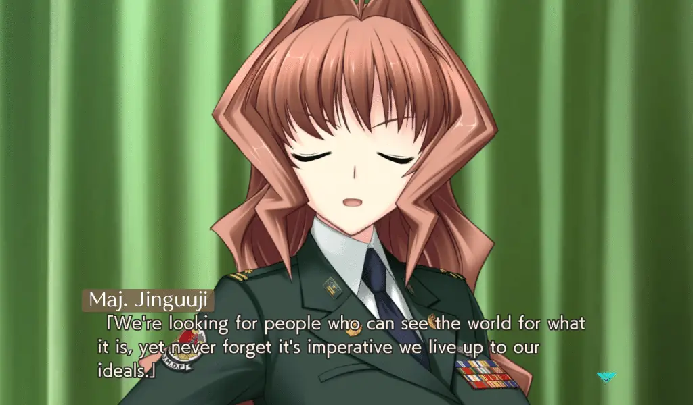
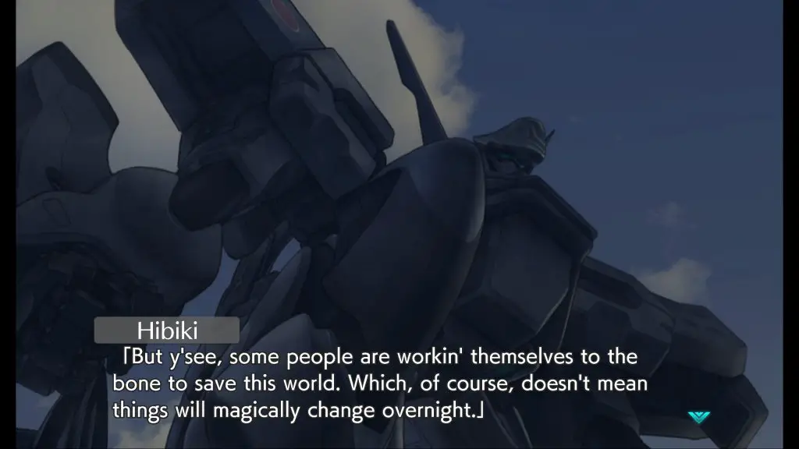

---
{
  title: "Muv-Luv Unlimited: The Day After 01 Impressions – Bigger, Badder, Better",
  published: "2021-02-25T11:31:45-08:00",
  ogLink: "https://noisypixel.net/muv-luv-unlimited-the-day-after-01-impressions/",
}
---

When was the last time you’ve played a game that completely blew you away? When I play video games, watch anime, or anything else, I’m always chasing that high. A constant search for experiences that take me for a ride and never let go. Luckily for me and many *Muv-Luv *fans, this series is a very reliable source for this experience, and age does it again with* Muv Luv Unlimited: The Day After 01*.

My *Muv-Luv Unlimited: The Day After *impressions will assume that you have played through at least the original _Muv-Luv_ (the _Extra_ and _Unlimited_ arcs) since there are inherent spoilers that cannot be avoided. So please play those first or read our review on them before you continue with this one. If you want thoughts on the release structure and the new engine, please read or watch _The Day After 00_ impressions.

After Alternative V screwed over the world, the not so Emerald anymore city of Seattle has become one of the few places in the world where life is sustainable. Along with Hawaii, these are the few places where the Japanese government in exile manages to survive. We follow Tatsunami Hibiki as he gets accustomed to a new life while trying to overcome his past tragedies. In _01,_ we see him get accustomed to a new home of Seattle, a new squadron – war dog, new war mates in  Miono Shizuku, and Ellen Aice, and a new dynamic in his life – working under Major Jinguuji Marimo and having politics thrust into his life.

The last bit about politics is significant to your experience of the game – by this point, if you’re still following _Muv-Luv_, you probably love world-building and politics, and *The Day After *understands that. It goes [OOPS, ALL MUV LUV POLITICS](https://i.imgur.com/rZMswXn.png) and does a political deep dive into the precarious state of the Japanese empire in Seattle. _The Day After 01_ is at its best when talking about nation-building – discussing the problems in the leased areas of Tacoma – social to geopolitical to infrastructure. The world of _The Day After_ is its strength, so to hear more and more about it is always welcome, and to get this through an inherently political lens that tries to see events from as many viewpoints as possible is engaging in so many ways.

*The Day After 01, *for most of the game, is a bit of a slow burn. It’s about the same length as _00_ but definitely didn’t feel like it. It’s hyperfocused on so many of the details of Japanese Seattle that it becomes easy to be overwhelmed by all the details. *The Day After *begins fairly calm, with low tension for most of the early part of the game, but then it escalates, and escalates, and escalates – ending in a bang.\*\*

_The Day After 00_ was a small, closed, isolated, and standalone story that spiraled within itself. It was an incredibly introspective work that got your mind swirling about the potential repercussions of the setting itself. But it ended by opening the can of worms… So how do you top that? Bigger, badder, better: ready to strike at you with more PTSD than you can imagine. Everything in* 01* is bigger than in _00_, the stakes, greater, the numbers, larger. The ramifications, huge. The last hour of this game is incredible, and there are very few games that can wow you with the level of tension and spectacle like Muv-Luv.

In my eyes, after playing through _The Day After 01_, I personally believe that playing through these games is almost as essential of an experience as the main itself. There are very few games that engage with politics and as deeply as* The Day After *and its experiences like the end of *The Day After 01 *that remind me why I started to play visual novels in the first place. I’m very thankful there’s still more to come: I’m going to continue onto *02 *and provide my impressions on that, with the full review of the entire package when I finish _03_.
