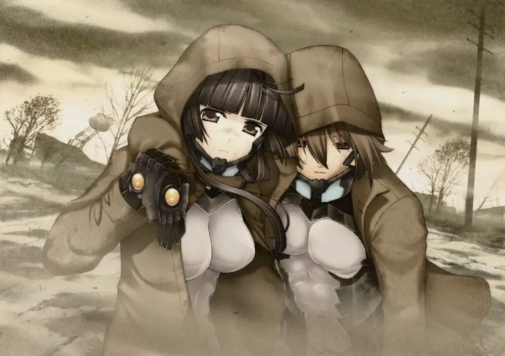
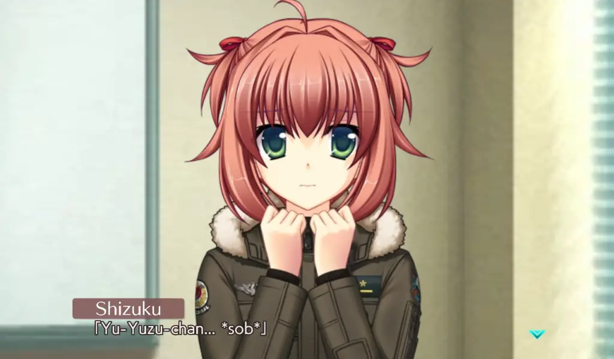

---
{
  title: "Muv-Luv Unlimited: The Day After 02 Impressions – More of the Same Can Be a Good Thing",
  published: "2021-03-01T14:22:10-08:00",
  originalLink: "https://noisypixel.net/muv-luv-unlimited-the-day-after-02-impressions-pc/",
}
---

_The Day After_ train continues with* Muv-Luv Unlimited: The Day After 02*, the most personal and intimate of the series yet. It shouldn’t really be a surprise that _The Day After 02_ is basically a continuation of the previous _The Day After_ episodes. Still, this episode comes in a personal flair and actual, genuine heroism.

My *Muv-Luv Unlimited: The Day After *impressions will assume that you have played through at least the original _Muv-Luv_ (the _Extra_ and _Unlimited_ arcs) since there are inherent spoilers that cannot be avoided. So please play those first or read our review on them before you continue with this one. If you want thoughts on the release structure and the new engine, please read or watch _The Day After 00_ impressions.

Set right after _The Day After_ 01 and the defense of Seattle, we follow Hibiki dealing with the repercussions of the Wardog’s actions at the end of 01. _The Day After 02_ dives deep into Hibiki’s past, and he’s forced to confront who he is: overcoming the conflict between his past and his new identity as a hero. Through flashbacks, we get to experience more of Hibiki’s back story and how he reconciles with that time: trekking through the barren wasteland of a gravity bombed the USA without any traces of civilization, the horror stories and terrible actions that result from those extreme conditions. It builds an inner conflict between who he is and was back then and results in really compelling and engaging storytelling.

Hibiki’s relationship with heroism comes with another dynamic: even if Hibiki doesn’t believe that he is a hero himself, there’s a reputation and expectation that comes with it, and seeing him confront that is compelling storytelling that amplifies the existing struggles he had with his identity. That isn’t to say that Hibiki isn’t a hero, though: in the last few hours of _The Day After 02_, the things he does truly felt epic and heroic in ways I haven’t seen in ages, which is greatly appreciated in an age where heroes truly feel dead.

Some other side conflicts are handled quite well, primarily squadmate Miono Shizuku having a coming of age story that really struck home the more personal and intimate vibe of this episode. All of these components build up to a satisfying _Muv-Luv_, but while this storytelling is great, it’s absolutely the kind of storytelling that one would expect from _Muv-Luv_ and feels far more typical than the others as a result. The other complaint was in pacing: it’s also almost a bit ridiculous how slow _The Day After 02_ is at the beginning, feeling like we were brought to square one or the calm before the storm. It’s then a slow march to the inevitable that we were faced with in 01 but were sidetracked by – war.

So often, war between humans and nations was speculated and discussed in _Muv-Luv_ but rarely did we actually see it play out. We see the first steps towards war at the end of _The Day After 02_, making for a compelling ending and a perfect transition to _The Day After_ 03. It’s really nice to see because the closest thing we got to this was the coup d’etat in Alternative, but that didn’t lead to anything. Seeing it in _The Day After_ is a reminder of the inevitable march: people ruining an already bad scenario and how war never changes.

*The Day After 02* is the most personal of _The Day After_ works, full of great character moments and works as a great transition to the later chapters, but is by far the least distinctive of _The Day After_ thus far. It’s still great, but if the rest are A’s, it’s a B+.  I’m going to continue to _The Day After_ _03,_ with the full review of the entire package when I finish that one.
