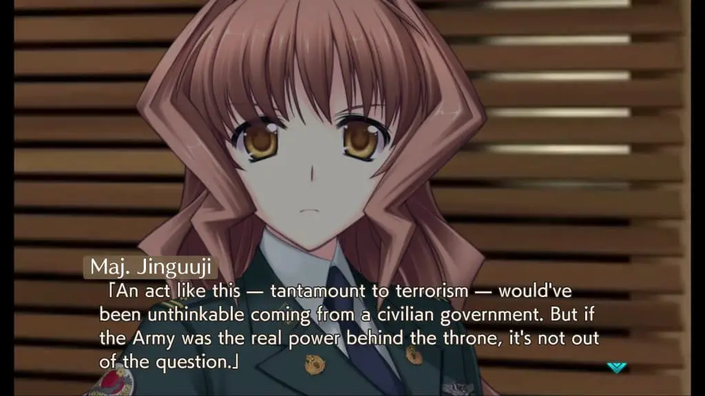
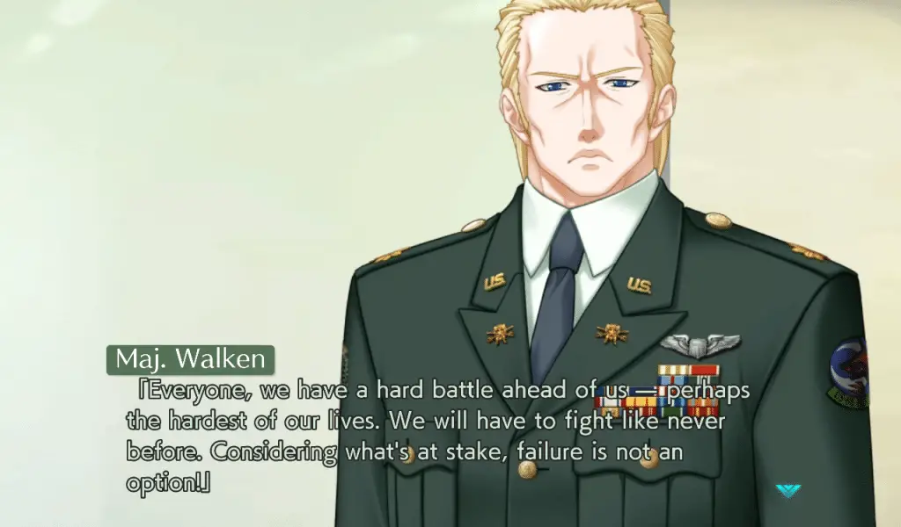
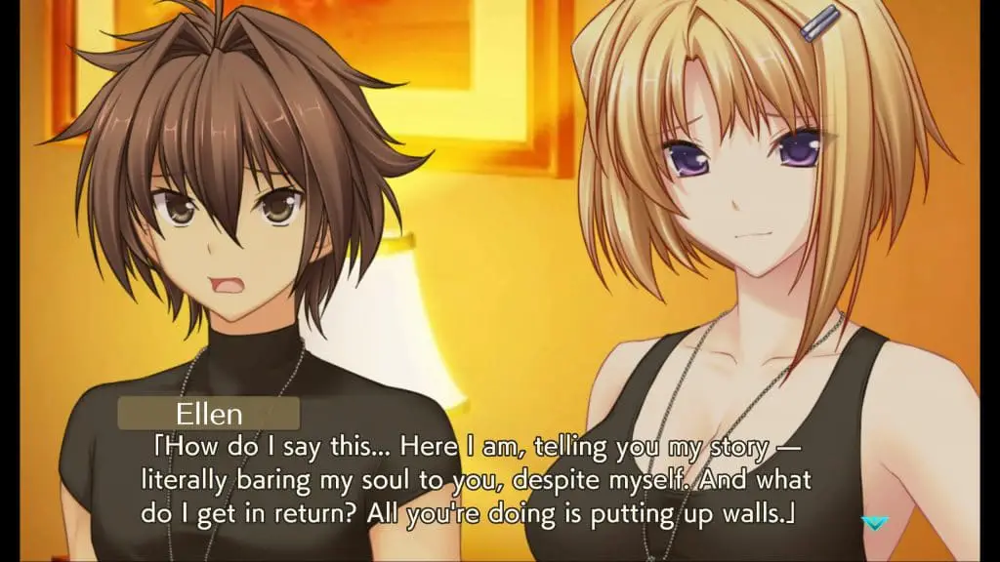
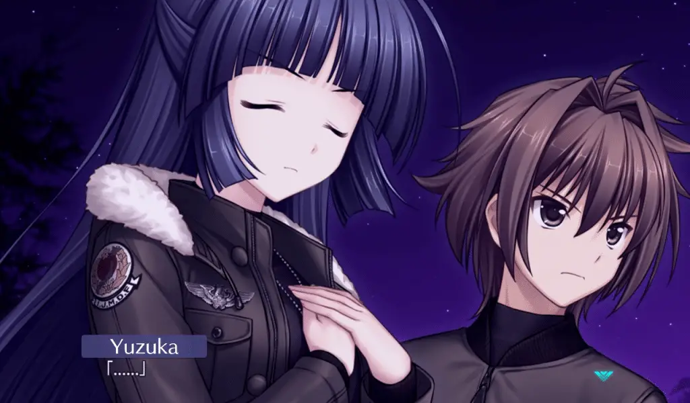

---
{
  title: "Muv-Luv Unlimited: The Day After 03 Impressions – War Insanity",
  published: "2021-03-09T09:12:18-08:00",
  ogLink: "https://noisypixel.net/muv-luv-unlimited-the-day-after-03-pc/",
}
---

War is a cruel mistress, always leaving devastating results and showing up when it’s least wanted. You know, when shit’s gone down. _Muv-Luv_ Unlimited:_ The Day After_ _03_ happens to be exactly that scenario; even in the post-apocalypse, we can’t escape war.  _The Day After_ _03_ is probably how one expected _The Day After_ to go down, having intense drama and wrapping up major parts of the story, but it doesn’t wrap the story up.

<!-- ezoic_video_placeholder-under_first_paragraph-640x360-999998-clearholder -->

<!-- ezoic_video_placeholder-under_first_paragraph-640x360-999998-nonexxxclearxxxblock -->

<!-- ezoic_video_placeholder-under_first_paragraph-426x240-999998-clearholder -->

<!-- ezoic_video_placeholder-under_first_paragraph-426x240-999998-nonexxxclearxxxblock -->

<!-- ezoic_video_placeholder-under_first_paragraph-384x216-999998-clearholder -->

<!-- ezoic_video_placeholder-under_first_paragraph-384x216-999998-nonexxxclearxxxblock -->

My _Muv-Luv_ Unlimited: _The Day After_ impressions will assume that you have played through at least the original _Muv-Luv_ (the Extra and Unlimited arcs) since there are inherent spoilers that cannot be avoided. So please play those first or read our review on them before you continue with this one. If you want thoughts on the release structure and the new engine, please read or watch our _The Day After_ 00 impressions or the review of the series.

<!-- ezoic_video_placeholder-under_second_paragraph-640x360-999997-clearholder -->

<!-- ezoic_video_placeholder-under_second_paragraph-640x360-999997-nonexxxclearxxxblock -->

<!-- ezoic_video_placeholder-under_second_paragraph-426x240-999997-clearholder -->

<!-- ezoic_video_placeholder-under_second_paragraph-426x240-999997-nonexxxclearxxxblock -->

<!-- ezoic_video_placeholder-under_second_paragraph-384x216-999997-clearholder -->

<!-- ezoic_video_placeholder-under_second_paragraph-384x216-999997-nonexxxclearxxxblock -->

_The Day After_ _03_ begins with tensions high then eventually bursting. Despite Hibiki’s best efforts to end the war, the war machine marches forward.  _Muv-Luv_ has an interesting relationship with war: while always being a military story, we’ve never actually seen war because the enemy was always the BETA. Given that humans have been on the losing side against BETA, they did not have time to wage war against each other. That said, the post-BETA era was speculated, and war was always on the horizon. Alternative V comes as a result of the Americans trying to force that post-BETA reality.

So, when conflicts are on the rise in _Muv-Luv_, it’s a special thing. While leading to disastrous results, war pushes people to the limits and provides some of the most interesting storytelling available. The narrative even spends time tying up loose ends from the main trilogy. Sure, we didn’t really experience the 12/5 coup in Unlimited, but that doesn’t mean that those factions just went away, so it was nice to see them make a return. There’s just one problem here _–_ it’s total insanity and can easily break your suspension of disbelief or make the story seem more cartoonish than it actually is. In a way, _The Day After 03_ is great for doing this – it’s dropped any pretenses or normalcy, and in a mad world, you expect mad people.

<!-- ezoic_video_placeholder-mid_content-640x360-999996-clearholder -->

<!-- ezoic_video_placeholder-mid_content-640x360-999996-nonexxxclearxxxblock -->

<!-- ezoic_video_placeholder-mid_content-426x240-999996-clearholder -->

<!-- ezoic_video_placeholder-mid_content-426x240-999996-nonexxxclearxxxblock -->

<!-- ezoic_video_placeholder-mid_content-384x216-999996-clearholder -->

<!-- ezoic_video_placeholder-mid_content-384x216-999996-nonexxxclearxxxblock -->

However, this entire scenario ends up feeling more like fanservice rather than an actual war. You can’t keep on escalating in such an aggressive fashion and not lose someone in the process. Also, as someone living in America in 2021, having a war started by a radical nationalist party feels a touch too close to home for my liking.

This is ultimately a minor complaint as the story still manages to be absolutely riveting regardless of my comment on it going over-the-top. The themes in _The Day After_ lead to some of the coolest moments in the series and were incredibly engaging.

<!-- ezoic_video_placeholder-long_content-640x360-999995-clearholder -->

<!-- ezoic_video_placeholder-long_content-640x360-999995-nonexxxclearxxxblock -->

<!-- ezoic_video_placeholder-long_content-426x240-999995-clearholder -->

<!-- ezoic_video_placeholder-long_content-426x240-999995-nonexxxclearxxxblock -->

<!-- ezoic_video_placeholder-long_content-384x216-999995-clearholder -->

<!-- ezoic_video_placeholder-long_content-384x216-999995-nonexxxclearxxxblock -->

When _The Day After_ _03_ eventually does come back down to earth, it finishes up Hibiki’s personal story for the most part, which is riveting in execution. Sure, the big reveal wasn’t actually a reveal because so much of it was foreshadowed, but it was still satisfying to finally see and hear after much speculation. There are many great character moments in _The Day After_ _03_, and the depth of the cast is at a climax. Ellen, in particular, had amazing moments, which had me loving _The Day After_ that much more. This story is the conclusion for Hibiki, and experiencing that is incredibly engaging.

Because _The Day After 03_ starts with the tension so high, it can’t really ramp it back up in the end, which makes the events feel far more muted than the rest. This isn’t bad per se, and the action was compelling, but it did feel hollow after more questions arose than answers. _The Day After_ _03_ isn’t the end: along with _Muv-Luv_ INTEGRATE, _Muv-Luv_ fans also have _The Day After_ _04/Resonate_ to look forward to, and hopefully with more backstabbing and despair to come. There was tons of political foreshadowing here, and the conflict about the power struggles in the Japanese government seemingly will go all out in the next chapter. Given that _The Day After_ _00_ through _The Day After_ _03_ was released all at once, having to wait for _The Day After_ 04 is incredibly jarring and is honestly the most irritating part of the game.

\
_The Day After_ _03_ has some of the best moments in the series. Not only is there a war, but the game has some absolutely amazing character moments that wrapped up Hibiki’s personal story in a satisfying way. I’m left really liking _The Day After_ _03_ overall. Still, a few things about _03_ rubbed me the wrong way, the over-escalation of the war and the unfortunate cliffhanger thanks to the nature of the release in particular. Still recommended and still some of the best _Muv-Luv_, but it leaves _The Day After_ 01 as the best in the series, in my opinion, which wasn’t something I was expecting to say.
