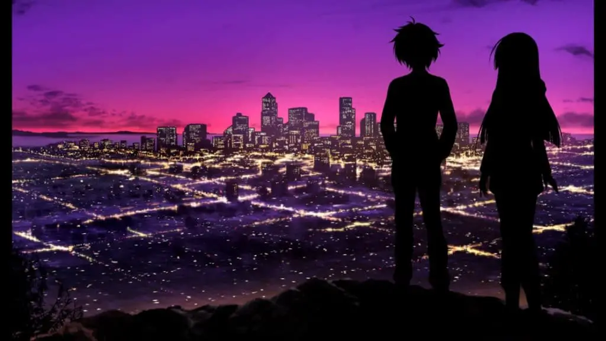
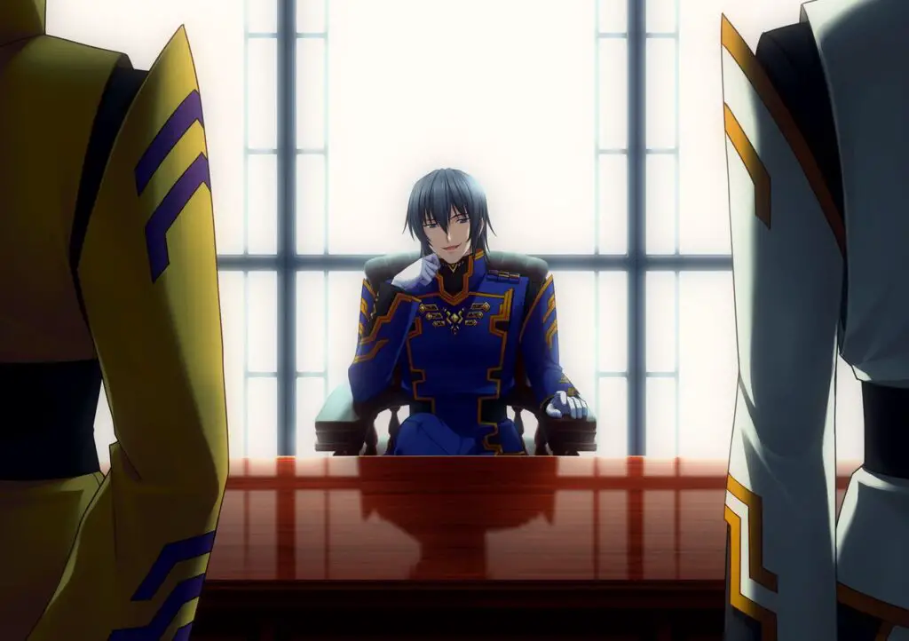
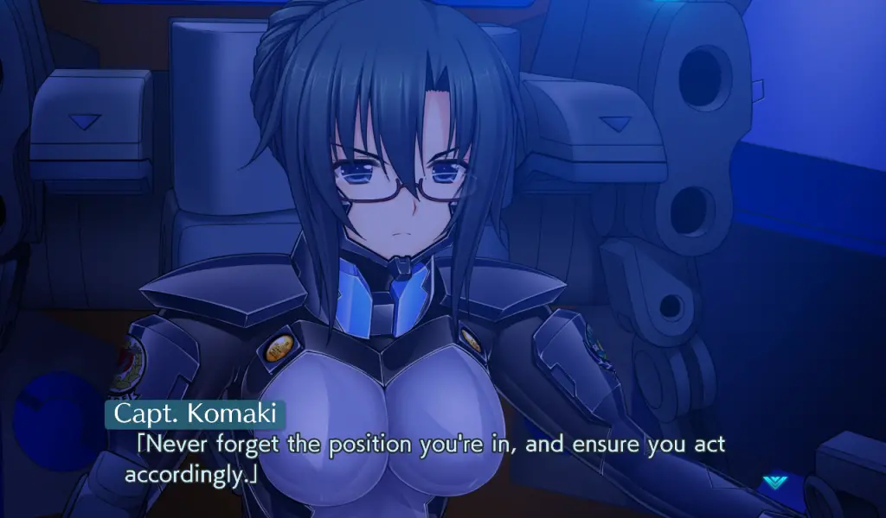

---
{
  title: "Muv-Luv Unlimited: The Day After Review – More Than Just a Side Story",
  published: "2021-03-15T11:11:06-07:00",
  ogLink: "https://noisypixel.net/muv-luv-unlimited-the-day-after-review-pc/",
}
---

We typically expect that a side story is lesser than the original, but every assumption comes with exceptions. With* Muv-Luv Unlimited: The Day After*, I’m delighted to say that age provided exactly that: a side story that’s as good, if not better, than many parts of the main series. With 4 episodes currently out that are all great in their own ways, _Muv-Luv: The Day After_ provides experiences that remind me why I started to play visual novels in the first place.

<!-- ezoic_video_placeholder-under_first_paragraph-640x360-999998-clearholder -->

<!-- ezoic_video_placeholder-under_first_paragraph-640x360-999998-nonexxxclearxxxblock -->

<!-- ezoic_video_placeholder-under_first_paragraph-426x240-999998-clearholder -->

<!-- ezoic_video_placeholder-under_first_paragraph-426x240-999998-nonexxxclearxxxblock -->

<!-- ezoic_video_placeholder-under_first_paragraph-384x216-999998-clearholder -->

<!-- ezoic_video_placeholder-under_first_paragraph-384x216-999998-nonexxxclearxxxblock -->

This review of _Muv-Luv Unlimited: The Day_ After assumes that you have played through at least the original* Muv-Luv* game (the* Extra* and _Unlimited_ arcs). There are inherent spoilers that cannot be avoided when talking about those, so please play those first or read our review on them before you continue with this one. If you want more in-depth thoughts on the specific arcs, please check out our impressions on the games.

<!-- ezoic_video_placeholder-under_second_paragraph-640x360-999997-clearholder -->

<!-- ezoic_video_placeholder-under_second_paragraph-640x360-999997-nonexxxclearxxxblock -->

<!-- ezoic_video_placeholder-under_second_paragraph-426x240-999997-clearholder -->

<!-- ezoic_video_placeholder-under_second_paragraph-426x240-999997-nonexxxclearxxxblock -->

<!-- ezoic_video_placeholder-under_second_paragraph-384x216-999997-clearholder -->

<!-- ezoic_video_placeholder-under_second_paragraph-384x216-999997-nonexxxclearxxxblock -->

Before we start talking about this story, which is why you should or should not play, three things need to be mentioned: the presentation, the engine change, and the episodic release.

_Muv-Luv Unlimited: The Day After’s_ visuals and sound are basically unchanged from _Alternative_, with a similar art style and the same tracks. So, as a recap: the _Muv-Luv_ visuals have their moments and are totally serviceable but aren’t anything special, and the soundtrack is great, but it can get repetitive after looping for a bit. With this release, Anchor rebuilt _The Day After_ in a more modern engine instead of using rUGP like in previous releases of _Muv-Luv_.

If you’re not familiar, rUGP is an eldritch abomination that only works properly when you sacrifice your closest relatives and pray to the gods. Still, it’s full of options and has a distinct look that has come to define the series. With the new engine, it’s incredibly barebones: text looks cheap, it’s missing a lot of features, and frankly, it’s frustrating to use at times. The engine of a visual novel shouldn’t be thought about, but I fought with it a lot. I had issues with full screen, autoplay’s behavior, and the arrows that tell you there’s a menu on the side that sticks on the screen. That said, ultimately, this doesn’t make a huge impact on how you experience the story.

<!-- ezoic_video_placeholder-mid_content-640x360-999996-clearholder -->

<!-- ezoic_video_placeholder-mid_content-640x360-999996-nonexxxclearxxxblock -->

<!-- ezoic_video_placeholder-mid_content-426x240-999996-clearholder -->

<!-- ezoic_video_placeholder-mid_content-426x240-999996-nonexxxclearxxxblock -->

<!-- ezoic_video_placeholder-mid_content-384x216-999996-clearholder -->

<!-- ezoic_video_placeholder-mid_content-384x216-999996-nonexxxclearxxxblock -->

This release of _The Day After_ is broken up into four parts. The episodic release by itself doesn’t bother me, but the price is alarming: _The Day After_ _00_ costs $15, and the other 3 episodes cost $25 each. _The Day After_ adds up quickly. Also, to pour salt on the wound, _The Day After_ _03_ is not the end of the series; we have at the very least _The Day After_ 04*/Resonate* confirmed, so you can add that to the cost. Given that it’s only available digitally and the main trilogy only costs $60, this is a lot to ask, especially since the games are about 10 hours each. If we’re talking about if _The Day After_ as an experience justifies the asking price, it absolutely does, but if you aren’t a diehard fan, you might want to wait for a sale.

<!-- ezoic_video_placeholder-long_content-640x360-999995-clearholder -->

<!-- ezoic_video_placeholder-long_content-640x360-999995-nonexxxclearxxxblock -->

<!-- ezoic_video_placeholder-long_content-426x240-999995-clearholder -->

<!-- ezoic_video_placeholder-long_content-426x240-999995-nonexxxclearxxxblock -->

<!-- ezoic_video_placeholder-long_content-384x216-999995-clearholder -->

<!-- ezoic_video_placeholder-long_content-384x216-999995-nonexxxclearxxxblock -->

Regarding evaluating _The Day After_’s story, the first thing that should be mentioned is that _The Day After_ _00_ is a standalone work. It has a different cast, tone, and appeal than the other entries. It’s an isolated story that spirals within itself, focusing on a tragedy that has rocked everyone’s lives. It deals with how people are reeling from the disaster but prioritizing surviving in these catastrophic situations.

_The Day After_ _00_ takes place a short while after Operation Babylon and follows Will and Lilia and their lives stranded in the carrier John F Kennedy. For a majority of _00_, the general tension between the main leads Will and Lilia drives the work, but near the end, _The Day After_ _00_ ramps up and provides the action that one has come to love Muv-Luv. _The Day After_ _00_ is a pretty concentrated dose of Muv-Luv done right, but it’s a small work, both in size and tone.

As for the rest of _The Day After_ – we get to see how good people handle a messed-up world where everything has gone wrong. After _Alternative V_ screwed over the planet, the not-so-Emerald anymore city of Seattle has become one of the few places where life is sustainable. We follow Tatsunami Hibiki in his new life as a leader while trying to overcome his past tragedies.

<!-- ezoic_video_placeholder-longer_content-640x360-999994-clearholder -->

<!-- ezoic_video_placeholder-longer_content-640x360-999994-nonexxxclearxxxblock -->

<!-- ezoic_video_placeholder-longer_content-426x240-999994-clearholder -->

<!-- ezoic_video_placeholder-longer_content-426x240-999994-nonexxxclearxxxblock -->

<!-- ezoic_video_placeholder-longer_content-384x216-999994-clearholder -->

<!-- ezoic_video_placeholder-longer_content-384x216-999994-nonexxxclearxxxblock -->

In _01,_ there’s a focus on the politics of the Japanese Seattle and an escalation from _00_ in basically every manner. I loved how _The Day After_ _01_ engaged with the reader with the repercussions of various political circumstances and developed the world in fascinating ways. The last hour of _01_ is amazing and my personal favorite of the series with genuinely amazing action scenes, as everything it does combines in an extremely satisfying way. In _02,_ we get a more personal story, diving deep into Hibiki’s past, and he’s forced to confront who he is. We see him overcome the conflict between his past and his new identity as a hero. It builds an inner conflict between who he is and was back then and results in really compelling and engaging storytelling. _The Day After_ _02_ acts as a bridge, sowing the seeds of human war, but we don’t see most of that action until _The Day After_ _03_, which is primarily focused on that war.

_The Day After_ _03_ is probably how one expected _The Day After_ to go down – in the main series, there were lots of human interests that led to the disaster that was _Alternative V_, and it’s not surprising to see more human meddling fucking over the world even more. After a bout of insanity early on in _The Day After_ _03_, it comes down to earth and wraps up the personal story of Hibiki itself. We see the results of the relationships that _The Day After_ has been building up throughout the work, and there were many great character moments as a result.

That being said, while _The Day After03_ wraps up Hibiki’s story, it queues up the power struggle in the Japanese government for _The Day After_ 04, which is not out yet. Outside of minor nitpicks throughout _The Day After_ (_The Day After_ _02_ can be slow at times, _03_ gets so insane it can break suspension of disbelief at certain moments), the biggest complaint of _The Day After_ is that there isn’t more of it. It’s not finished, which is a great thing to say in a review of anything, really.

<!-- ezoic_video_placeholder-longest_content-640x360-999993-clearholder -->

<!-- ezoic_video_placeholder-longest_content-640x360-999993-nonexxxclearxxxblock -->

<!-- ezoic_video_placeholder-longest_content-426x240-999993-clearholder -->

<!-- ezoic_video_placeholder-longest_content-426x240-999993-nonexxxclearxxxblock -->

<!-- ezoic_video_placeholder-longest_content-384x216-999993-clearholder -->

<!-- ezoic_video_placeholder-longest_content-384x216-999993-nonexxxclearxxxblock -->

_The Day After_ has a different primary appeal than Alternative and embraces it. What makes the main trilogy* Muv-Luv* so great is how it manipulates you as a player and has you on a roller coaster of a ride. While worldbuilding was a strength in Alternative, _The Day After_ assumes that anyone who sticks around for side stories is primarily here for more worldbuilding and politics. After all, if there were a work where exploring and fleshing out the world was appreciated, it would be _Muv-Luv_, which has a base premise so interesting that every new entry feels just as fresh as the very first one. But that isn’t to say that _The Day After_ is any lesser. _The Day After_ has so much development, depth, character, world-building, and awesome moments to feel way more than just a side story. It’s better than both extra and unlimited, and it approaches Alternative in greatness.

To add to this, lots of _Muv-Luv_ games vary in quality and tone quite a bit, but _The Day After_ has to be one of the most consistent _Muv-Luv_ stories out there, in tone and quality. Straight up, if I didn’t know anything about* Muv-Luv, *played both, and were asked which was the main entry, going just by quality, I’d have a hard time making a decision.

Sure, _The Day After_ is the result of the bad end of _Unlimited,_ and you might assume that a work that’s continuing from a bad end will feel lesser than the main entries, but it never does. We’re exploring an effectively non-canon world, but like other works that explore bad ends, disaster settings are often the most fascinating and interesting. _The Day After_’s world gets you thinking about different things than _Alternative_ and is a more interesting work regarding the politics of _Muv-Luv._ The nature of how war is used as a political tool, the politics of immigration, and how we view others from different countries, how people manage to survive in an apocalyptic world that’s wiped out a vast majority of the human population.

_Muv-Luv Unlimited_: _The Day After_ is an example of Muv-Luv at its best, exploring a fascinating scenario while delving into the political philosophy of the results and repercussions of everything that happens. The narrative has some of the finest worldbuilding of the series while also being an epic character-driven story in a traditional sense. It does so much right that it’s hard to find any real flaws. If you are a fan of Muv-Luv or have just played the main trilogy – I would highly recommend picking up _The Day After_.
