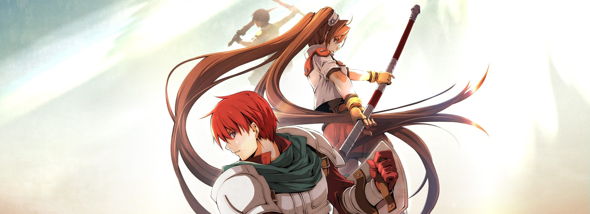
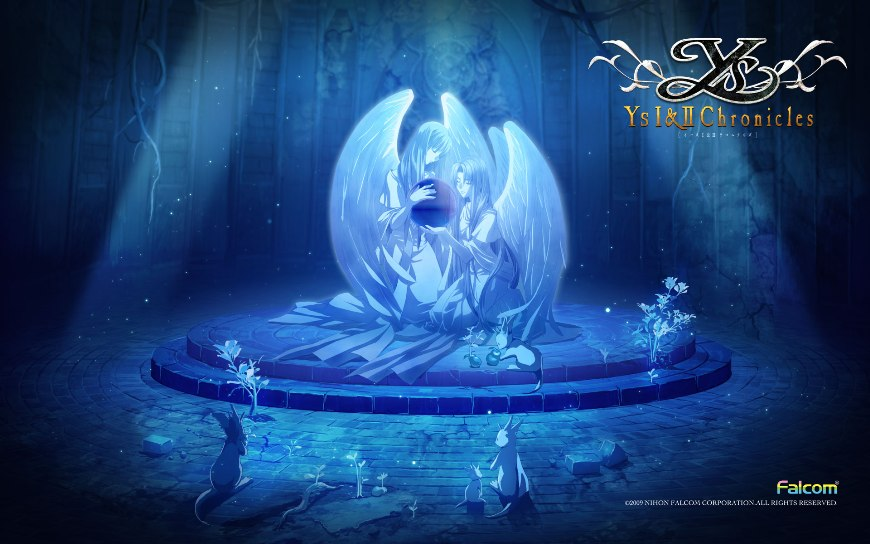
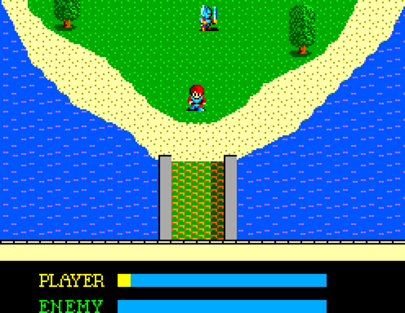
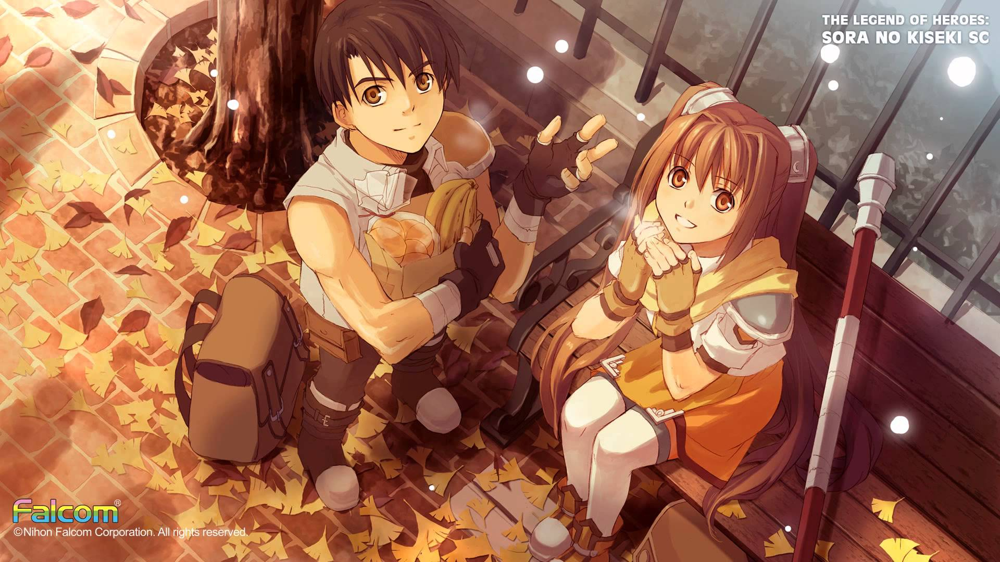

---
{
	title: "My love for Falcom Games, or How Falcom Shaped My Experience with JRPGs",
	published: "2016-01-15T09:00:00-05:00",
	tags: ["Opinion", "Rockmandash Rambles", "Ys", "Kiseki", "Legend of Heroes", "Trails in the Sky", "Trails of Cold Steel", "Falcom", "Nihon Falcom", "RPGs", "JRPGs", "TAYclassic"],
	kinjaArticle: true
}
---

During the early years in gaming, JRPGs were one of the few ways of getting a good, meaningful story in games, but as much as fans of the genre adore them, JRPGs have their fair share of problems. The story of the genre hasn’t been the smoothest, [and many people’s experiences reflect that](http://kotaku.com/jrpgs-youre-better-than-this-1690833683), my own included. This is a story of my experience with the genre, told via Falcom games.

***

## **The Fall from Grace, Held up by *Ys*****

If you spend any amount of time with me, I think one thing that would strike you is that I love stories, above almost everything else. This is an aspect of me that has been a constant for a very long time, longer than almost anything I can recall. Ever since I was a kid, I’ve had my head in the clouds, buried in some story of sorts - I went through all sorts of phases, but nearly all of them involved stories. From reading my heart out in books from the local library to getting absorbed into the massive worlds that JRPGs provided, and now in the Anime/Visual Novel obsession I find myself in, I came to realize that my love for stories is a constant - I spend most of my time looking for the next story that will grace my presence with its awesomeness, or I have my head in some work. It doesn’t matter tone or style - from the serious podcast by NPR known as *Serial* to the silliest of anime like* The World God Only Knows*, I have tried nearly everything, and fell in love with a lot of it.

> The Video above is the opening of the JRPG *Chrono Cross*, a JRPG from the PS1 by Squaresoft (now known as Square Enix)

Thanks to the help from RPGs like *Pokemon*, I became a huge RPG fan when I was a teenager, trying as many games as I could because I loved the experience of going on an adventure, following the characters as they go through plenty of trials and tribulations. Exploring new worlds, allowing me to see the stories of the people who inhabit them or the story of the worlds themselves, and blowing me away with plot twists or amazing visuals, JRPGs offered an experience unlike anything else. Being able to experience a life in amazing worlds with great stories to boot, I fell in love with them.

This state of adoration lasted a fair bit of time (at least a few years), but there was an issue I had with JRPGs that led to me eventually giving up on them. I think this applies to many people as well, but for me it was the potential elements in JRPGs that inhibit the story, most of them involving gameplay. Pretty much the reason anyone plays JRPGs is because of the story, and like I said in my [*Why I love Visual Novels *](http://tay.kinja.com/why-i-love-visual-novels-so-much-and-how-i-got-into-th-1571227739#_ga=1.97942044.241020698.1444271310)article, I got tired of gameplay getting in the way of the plot, even though the genre had great stories to tell. It was frustrating to play games that everyone calls the best in the genre like *Chrono Cross *and *Grandia*, only to have my experience crippled by the gameplay: I was bored by how slow and tedious combat was in many of these games, eventually getting stuck on bullshit bosses in countless titles. Yes, these games may be great in presentation and story, but if someone gets frustrated with the game and can’t continue or can’t enjoy the game, what’s the point? Like so many others, my faith in a genre was broken, and I gave up to move to different pastures. I was done with a genre that was designed so I would get halfway in a story then never be able to continue it on my own terms because of some ridiculous difficulty spike, or make me spend hours doing some boring and tedious task like grinding.

> The Video above a trailer of* Ys: The Oath in Felghana*, which is a remake of *Ys III - Wanderers from Ys*.

While it isn’t the most well-known or most praised series out there, The *Ys *series by Falcom was one of the exceptions to this for me, a series that kept my hopes of great games in the genre alive by taking something that cripples the genre and using it to augment the game. While *Ys *didn’t have the most innovative story in the world, it did everything else you would expect from an RPG like memorable character designs and great visuals, with the reason I fell in love with Ys being the unusually fast and furious combat that put a smile on your face, gameplay that was more fun than nearly anything the genre has to offer. I even enjoyed the bump gameplay from *Ys 1&2*, even if many didn’t because of how different it was. Because of the fast and furious gameplay that was so enjoyable, every moment was fun and engaging, consistently compelling you and pushing you on.

*Ys* also did one thing that only the best in the genre do, something that really left an impression on me: quality music at all times, music so memorable that the series is one of the first thoughts when you think about good music in JRPGs. There are a lot of great soundtracks in the genre, but usually only at certain points. Ys takes this to the next level, having great music at all time. The prime example is [*Ys III/Oath in Felghana’s* *The Boy’s Got Wings*](https://www.youtube.com/watch?v=uPBGhNwuynI), which manages to be so epic that it almost suspends disbelief over the fact that it is **overworld music**. Falcom makes great games, games so polished that you can appreciate everything they do at every step, and along with the gameplay, I fell in love with the polish, the well-crafted experiences designed as experiences instead of stories with bolted-on gameplay like so many others in the genre.

The *Ys *series is an old series that has its origins in the 80's, but for me, the series is so much more than that - it embodies the progress that RPGs have made. While many on the internet clamors for the JRPGs of yore, the elements of the genre that these fans want are the ones I would rather not deal with, and the ones *Ys *abandoned. *Ys *kept on advancing and never looked back (other than remakes), and I appreciated that. It’s a prime example of everything right about JRPGs in the modern age, an action RPG that allowed you to move your character in battle instead of select from menus, an RPG that cut the bullshit like having to grind for hours, and one that was just plain fun at every moment. It had satisfying combat that was fun to play, but you could totally just run away from enemies if you weren’t in the mood, and you wouldn’t really be punished for it in regards to difficulty spikes. It was a series that avoided the traps that many others fell into, it was the prime example to me that JRPGs still have something worthwhile to look at, and it was one of the few that I would sit down and play, even after I stopped actively caring about the genre.

***

### **A Revival of Interest by *Kiseki***

Fast forward half a decade and I came into the end of my first semester in college, figuring that I was going to spend my time on break doing visual novel content once again. I was wrong, as JRPGs beat it to the punch, with my views on the genre being shaken in the past few weeks by the company that kept my faith alive. These past few weeks, Falcom pulled me up, stared at me like I was a moron, and then smacked me across the face to make me even wonder why I gave up on the genre as their *Trails of the Sky* or *Sora no Kiseki* blew my mind and showed me that even works that had elements I viewed as a negative can be so amazing - a work that makes what I despised bearable while making what I loved even greater.

After being egged on by the countless articles by Jason Schreier about how great *Trails in The Sky* was* *and* *words of wisdom from Raitzeno in the community, I gave it a shot, even though I was hesitant. I knew this game was going to be good because of my experience with *Ys *which showed me that Falcom makes great stuff, but I was hesitant because it was a traditional JRPG with turn-based combat - the exact thing I fled from. That being said, I forgot about my concerns quickly after I started because of how much I liked the game, and how much I got absorbed in the story, the world, etc.

Sure, it was totally different than the *Ys *I adored as it was a by-the-books JRPG with turn-based gameplay (albeit with time playing a role), but it was so much more, a game that reminded me why I loved the genre in the first place with one of the most polished and fleshed-out stories I’ve seen out there, taking the essence of everything great about the genre, then amplifying the positives while minimizing the negatives for me. It was celebrating the past while presenting the greatest a genre could provide, with one of the most memorable, most interesting, and most personal stories out there, in the most fleshed-out world I’ve ever seen. Pretty much everything I stated in the *Fantastic!* section in my [review of SC](http://tay.kinja.com/the-legend-of-heroes-trails-in-the-sky-sc-the-tay-rev-1748211289) were aspects that I truly adored during my run with the game and they were all aspects that propelled this to become one of my favorite JRPGs I’ve played.

The other Trails/Kiseki work in the US, *Legend of Heroes: Trails of Cold Steel *was great as well, continuing what SC did well while showing us another angle of the world - one I really appreciated. While I prefer* Trails of the Sky *because it handled things in a way that fit better with what I like about JRPGs* (*mostly the structure of the game as I didn’t really dig the school setting or lack of adventure really), this game is still fantastic and any continuation of the world in the Trails series is something I approve of. It may not be my favorite game out there, but it is proof of how you’ll never go wrong with any of the games Falcom makes, as it’s quite good.

***

If you asked me my thoughts on Falcom and JRPGs, I would respond to you with how I think they are the hidden gem in the world of JRPGs - the hidden diamond that stands as a pinnacle of the genre’s potential thanks to their extremely polished and engaging works, and how they consistently make some of the best JRPGs in the business. I love everything they’ve done, and I wouldn’t trade my experience with their works for anything else. Through their excellence and polish, they have defined my experience with a genre, saving me from turning my back on it forever and once again getting me to love that I once forgot. They’re awesome.

***

*You’re reading TAY, Kotaku’s community-run blog. TAY is written by and for Kotaku readers like you. We write about games, art, culture and everything in between. Want to write with us? Check out our tutorial *[*here*](http://tay.kotaku.com/the-new-taytorial-1659855583)* and join in. If you want to read more of my writing, check out *[*AniTAY*](http://anitay.kinja.com/#_ga=1.93871646.241020698.1444271310)*, *[*RockmanDash Reviews*](http://rockmandash12.kinja.com/)* and *[*KMTech*](http://kmtech.kinja.com/)*.*
