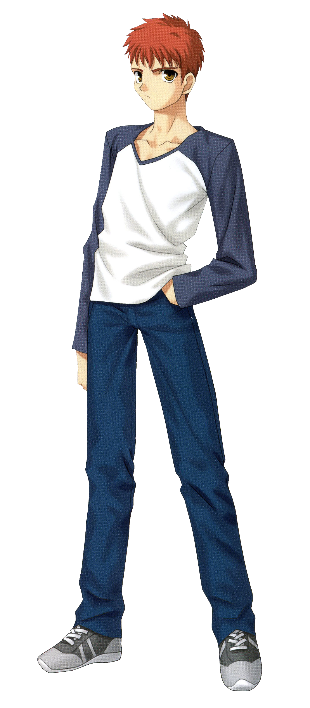
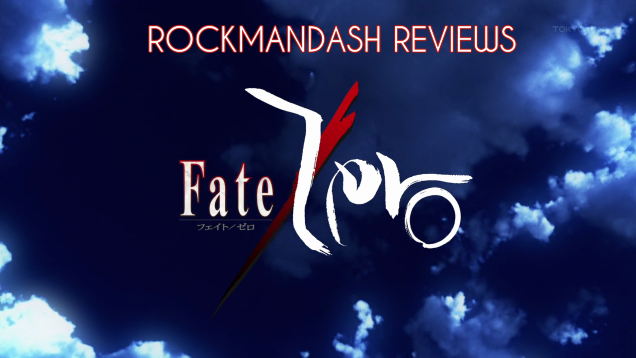

---
{
  title: "Nanana's Buried Treasure : Rockmandash's Ani-TAY Review",
  tags:
    [
      "rockmandash reviews",
      "nanana",
      "nanana buried treasure",
      "tay-classic",
      "anitay",
      "reviews",
      "ani-tay",
    ],
  published: "2014-06-20T15:00:00-04:00",
  attached: [],
  license: "cc-by-4",
  oldArticle: true,
}
---

 If you are an avid anime fan, there is always a show that interests you because of the
  short description you might hear. Unfortunately, people don't enjoy shows because of a concept, they do so because of
  execution. Today, we have Nanana's Buried Treasure, a show that's deceptively simple on a description but tries to be
  more then what you expect (and fails).

<h3 class="sc-1bwb26k-1 fvCjqJ" id="h120360">Characters</h3>
 The reason why I was watching Nanana is because of the great characters and the fabulous
  interactions. The characters and their interactions with each other in Nanana are by far my favorite parts of the
  show. About those said characters, Nanana herself is just OK with a bubbly attitude and a cute design, but in general
  she leaves me with more questions than I would like. Yamma Juugo and Tensai Ikkyuu are the stars of the show in
  Nanana. Juugo's ideals and being the <a class="sc-1out364-0 hMndXN sc-145m8ut-0 gIacKn js_link" data-ga='[["Embedded Url","External link","http://typemoon.wikia.com/wiki/Shirou_Emiya",{"metric25":1}]]' href="http://typemoon.wikia.com/wiki/Shirou_Emiya" rel="noopener noreferrer" target="_blank">anti-Shirou</a> is something I loved,
  while Tensai's awesome detective skills and spunky personality could have drove the whole show for me. All the
  characters were written well, went through nice development and were enjoyable. 

<aside class="sc-1rh3ayr-6 jfFNjl inset--story branded-item branded-item--kinja" data-commerce-source="inset">

<a class="sc-1out364-0 hMndXN js_link" data-ga='[["Permalink page click","Permalink page click - inset headline"]]' href="http://typemoon.wikia.com/wiki/Shirou_Emiya" rel="noopener noreferrer" target="_blank"><h6 class="sc-1rh3ayr-3 jRIPES">Shirou Emiya</h6></a>

Shirou Emiya (衛宮 士郎, Emiya Shirō) is the main protagonist of Fate/stay night who acts
      as the Master 
<a class="sc-1out364-0 hMndXN sc-1rh3ayr-0 kOvmIi js_readmore inset--story__readmore js_link" data-ga='[["Permalink page click","Permalink page click - inset read more link"]]' href="http://typemoon.wikia.com/wiki/Shirou_Emiya" rel="noopener noreferrer" target="_blank">Read
      more</a>

</aside>

<h3 class="sc-1bwb26k-1 fvCjqJ" id="h120361">Puzzles</h3>
 The whole point is finding treasures, right? As such, it's almost mandatory to have
  puzzles, and they have quite a bit of them. The amazing puzzle scenes are always a fun time to see, both the
  execution, and the thought process. Some people may criticize the show saying that it doesn't give enough time for you
  to look around the room and solve the puzzles, but that never bothered me. 

<h3 class="sc-1bwb26k-1 fvCjqJ" id="h120362">Battles</h3>
 Every now and then, there will be a battle in Nanana, which usually happens because they
  found this epic artifact, or are on their way to get said artifact. Each time there is a battle, it's beautifully done
  with some excellent animation, dialogue, and tactics during the fight, with the whole battles being flat out
  entertaining. 

<h3 class="sc-1bwb26k-1 fvCjqJ" id="h120363">Animation</h3>

<iframe allow="accelerometer; autoplay; clipboard-write; encrypted-media; gyroscope; picture-in-picture" allowfullscreen="" frameborder="0" height="315" src="https://www.youtube.com/embed/6YJBriG_RFY" width="560"></iframe>

 A-1 Pictures does it again. I don't think they can screw up animation, they do it so
  well... this show is very pretty. I absolutely love the look on the environment, the puzzle rooms and fight scenes are
  absolutely gorgeous, and the whole show is easily described as beautiful. I'm a fan of CG when done right, and this
  show is definitely an example of CG done right. One might call the art style immature and silly, I think it works
  fine.

<h3 class="sc-1bwb26k-1 fvCjqJ" id="h120364">Sound</h3>

<iframe allow="accelerometer; autoplay; clipboard-write; encrypted-media; gyroscope; picture-in-picture" allowfullscreen="" frameborder="0" height="315" src="https://www.youtube.com/embed/xkv9bj3twm0" width="560"></iframe>

 The soundtrack in Nanana is bloody fantastic. It doesn't draw itself out too much, but it
  really is just an excellent soundtrack. It quickly sets the mood, while sounding fantastic in the process. There's a
  huge variety in the instruments they use in the soundtrack, and the orchestral sound is absolutely fantastic. Whenever
  you notice the music, it's great. Keigo Hoashi really hit a home run with this soundtrack. I think this also extends
  to the OP as well, which are so happy and catchy that you can't help but like them. As for the voices, no problems
  there, and I really liked most of them.

<h3 class="sc-1bwb26k-1 fvCjqJ" id="h120365">Flip Flopping Tone</h3>
 The tone of a show is a very important element of a show, something that can make or break
a show. Unfortunately, In Nanana, the tone of the story's level of consistency is equivalent to the chances of the
Xbox 360 towel trick working for extended periods of time (it's not that high). The show starts off as you would
expect, very character driven and slice of life-esque, with some cool puzzle/treasure scenes, with some pretty
lighthearted writing. Episode 4 goes <a class="sc-1out364-0 hMndXN sc-145m8ut-0 gIacKn js_link" data-ga='[["Embedded Url","External link","https://rockmandash12.kinja.com/rockmandash-reviews-fate-zero-ani-tay-1538163593",{"metric25":1}]]' href="https://rockmandash12.kinja.com/rockmandash-reviews-fate-zero-ani-tay-1538163593" rel="noopener noreferrer" target="_blank">Fate/Zero</a> on you,
with a dark atmosphere, epic fight scenes, orchestral music, and turns very ideal focused. After Episode 4, it tries
to balance itself between each two, and fails. While these can shine separately, put together makes it nowhere as
enjoyable as it needs to be. I loved episode 4. Episode 4 is the reason why I am writing this review, but the later
episodes continue a trend of flipping back and forth between a dark or lighthearted plot which it kills any momentum
this show had. It leaves you wishing for two different things, and you don't get either. A part of me wants to see the
main character continuing to reveal his epic past, with awesome dilemmas occurring in the way, while another part of
me just wants to see characters having fun and solving puzzles. By themselves, they work excellently, but meshed like
this is horrible because you can never expect which tone they will use, and the transition between slice of life and
the epic tone just DOES NOT WORK. They get in the way of each other, and they ruin the show. Worse is when they try to
do both at the same time and it just becomes boring. To me, a focused story is better than a story that tries to do
everything, and that's where Nanana falls flat on it's face. 

<aside class="sc-1rh3ayr-6 jfFNjl inset--story branded-item branded-item--kinja" data-commerce-source="inset">

<a class="sc-1out364-0 hMndXN js_link" data-ga='[["Permalink page click","Permalink page click - inset headline"]]' href="https://rockmandash12.kinja.com/rockmandash-reviews-fate-zero-ani-tay-1538163593" rel="noopener noreferrer" target="_blank"><h6 class="sc-1rh3ayr-3 jRIPES">
    Rockmandash Reviews: <i>Fate/Zero</i> [Anime]</h6></a>

Welcome to Rockmandash Reviews, and today on the Type Moon Marathon, we have the 2012
      anime known…
<a class="sc-1out364-0 hMndXN sc-1rh3ayr-0 kOvmIi js_readmore inset--story__readmore js_link" data-ga='[["Permalink page click","Permalink page click - inset read more link"]]' href="https://rockmandash12.kinja.com/rockmandash-reviews-fate-zero-ani-tay-1538163593" rel="noopener noreferrer" target="_blank">Read more</a>

</aside>

<h3 class="sc-1bwb26k-1 fvCjqJ" id="h120366">Stuff Not Explained</h3>
 There's a lot of stuff never answered in Nanana. Why is Nanana in that room in the first
  place as a ghost? How did Nanana create all of these puzzle rooms and find all the treasures? How does she remember so
  much about them? How does Nanana have so many games when she doesn't do anything? What is Juugo's motivations for
  doing what he does? Who were the other people Nanana knew that helped develop the island? The list goes on and on.
  Forgetting things you mention is a sign of bad writing, and they are all over the place. Don't get me started on the
  ending, where they just said fuck it after a random battle and called it a season. That thing they call an ending...
  is just a joke, and just leaves you absolutely confused because they don't explain like half of the things in the
  plot.

 This show can be a lot of fun, and it can be very epic. You may come out of this show
loving every bit of it, or hating it. The fact that it's shooting itself in the face and ruining any interest you
might have in the plot is a painful experience to watch, but when done right, it's done very well. If this was two
separate shows, it would be the greatest thing since sliced bread. But it's not. As such, I leave you with a warning
with this show; you will love it, or hate it. Personally, It left a bitter taste in my mouth.

<h3 class="sc-1bwb26k-1 fvCjqJ" id="h120367">Overall 6/10; Polarization +2
  -2</h3>

<strong>Copyright Disclaimer:</strong> Under Title 17, Section
  107 of United States Copyright law, reviews are protected under fair use. This is a review, and as such, all media
  used in this review is used for the sole purpose of review and commentary under the terms of fair use. All footage,
  music and images belong to the respective companies. 

<em>You can see all my reviews on </em><a class="sc-1out364-0 hMndXN sc-145m8ut-0 gIacKn js_link" data-ga='[["Embedded Url","Internal link","http://tay.kotaku.com/tag/rockmandash-reviews",{"metric25":1}]]' href="http://tay.kotaku.com/tag/rockmandash-reviews"><em>Rockmandash Reviews</em></a><em>. For An explanation
  of my review system, </em><a class="sc-1out364-0 hMndXN sc-145m8ut-0 gIacKn js_link" data-ga='[["Embedded Url","External link","https://rockmandash12.kinja.com/rockmandash-rambles-an-explanation-on-my-review-system-1619265485",{"metric25":1}]]' href="https://rockmandash12.kinja.com/rockmandash-rambles-an-explanation-on-my-review-system-1619265485" rel="noopener noreferrer" target="_blank"><em>check this out</em></a><em>. </em>

<aside class="sc-1rh3ayr-6 jfFNjl inset--story branded-item branded-item--kinja" data-commerce-source="inset">

<a class="sc-1out364-0 hMndXN js_link" data-ga='[["Permalink page click","Permalink page click - inset headline"]]' href="https://rockmandash12.kinja.com/rockmandash-rambles-an-explanation-on-my-review-system-1619265485" rel="noopener noreferrer" target="_blank"><h6 class="sc-1rh3ayr-3 jRIPES">
    Rockmandash Rambles: <i>An Explanation on my Review System</i> (Updated 11/15/2015)</h6></a>

If you’ve read any of my reviews and wanted to know why I did them the way I do,
      here’s an…
<a class="sc-1out364-0 hMndXN sc-1rh3ayr-0 kOvmIi js_readmore inset--story__readmore js_link" data-ga='[["Permalink page click","Permalink page click - inset read more link"]]' href="https://rockmandash12.kinja.com/rockmandash-rambles-an-explanation-on-my-review-system-1619265485" rel="noopener noreferrer" target="_blank">Read more</a>

</aside>

<em>This show is available on </em><a class="sc-1out364-0 hMndXN sc-145m8ut-0 gIacKn js_link" data-ga='[["Embedded Url","External link","http://www.crunchyroll.com/nananas-buried-treasure",{"metric25":1}]]' href="http://www.crunchyroll.com/nananas-buried-treasure" rel="noopener noreferrer" target="_blank"><em>Crunchyroll</em></a><em> for Free &amp; Legal streaming.</em> <em> </em>

