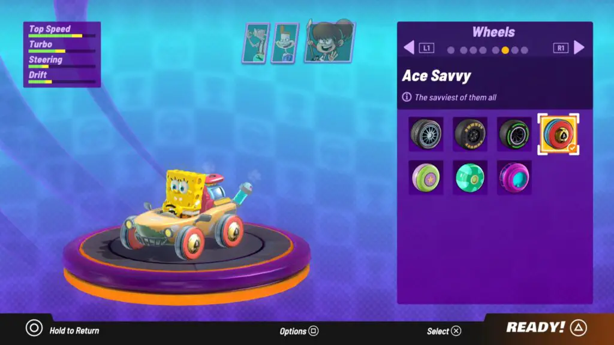
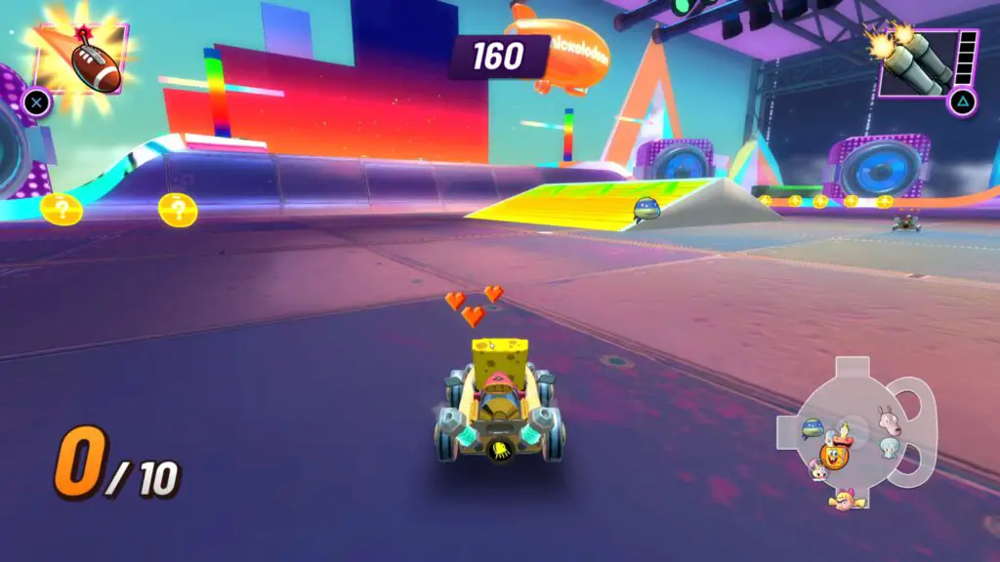
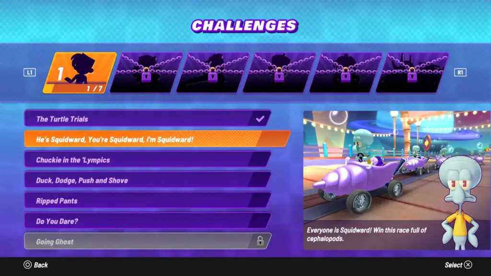

---
{
  title: "Nickelodeon Kart Racers 2: Grand Prix Review – Found the Roster, Lost the Character",
  published: "2020-10-06T07:59:00-07:00",
  ogLink: "https://noisypixel.net/nickelodeon-kart-racers-2-grand-prix-review-ps4-xbox-one-switch/",
}
---

While the Kart Racer genre is almost always enjoyable thanks to bright visuals and fun gimmicks, the genre is of dubious quality and often a target for a quick buck. With the original _Nickelodeon Kart Racers_, one could definitely make the argument that quality was not the primary development goal: the game played poorly, had a limited cast, and looked like it came straight out of the bargain bin. _Nickelodeon Kart Racers 2_ sets out to redeem the series, and for the most part, is a much more competent game as a result, but it still can’t seem to shake off the low budget quality.

From the starting line, *Nickelodeon Kart Racers 2 *provides players a decent kart racing experience, with the maneuverability selling the enjoyment of driving around in this whacky setting. A bonus is the surprisingly decent motion controls, but I wouldn’t recommend it for competitive play.  Nickelodeon Kart Racers 2 is fairly enjoyable, and I felt myself eagerly pursuing the gold medal in the Grand Prix every now and then. That being said, there are some mechanics that weren’t great, such as drifting, which feels temperamental. As you control the drift on a turn, you gain a slight speed boost, but then the inputs feel more like vague suggestions while other times, you get flung to the wall without any real distinction of why.

When it comes to the modes offered, *Nickelodeon Kart Racers 2 *gives players Arena/Battle Mode, Time Trial, Challenge mode, Free Race, and a robust Grand Prix mode. The Grand Prix mode has three difficulty options, 8 cups, each with four tracks, with the last cup being a repeating course. Each track is well-sized and well designed. One of the more significant complaints about the first game was the fact there were only 12 playable characters – that has been rectified here. The cast has almost tripled, with 30 playable characters from a variety of Nickelodeon franchises. The AI scales to the multiple difficulty options well, though, on Hard, it feels like the AI can be unjustifiably fast.

<!-- ezoic_video_placeholder-under_first_paragraph-640x360-999998-clearholder -->

<!-- ezoic_video_placeholder-under_first_paragraph-640x360-999998-nonexxxclearxxxblock -->

<!-- ezoic_video_placeholder-under_first_paragraph-426x240-999998-clearholder -->

<!-- ezoic_video_placeholder-under_first_paragraph-426x240-999998-nonexxxclearxxxblock -->

<!-- ezoic_video_placeholder-under_first_paragraph-384x216-999998-clearholder -->

<!-- ezoic_video_placeholder-under_first_paragraph-384x216-999998-nonexxxclearxxxblock -->

While *Nickelodeon Kart Racers *is decent to play, there’s not a lot of originality here. Many entries in the genre are inherently derivative to Mario Kart, but takes this to an extreme, as _Nickelodeon Kart Racers 2_ comes off more like a skin of Mario Kart than its own game. One place where this is incredibly apparent is in kart customization, which is extremely similar to _Mario Kart 8_. It doesn’t do it as well though: the kart customization features come off as players can also pick supers in the form of your “chiefs’ and two other boosts using crew engineer and mechanic power-ups. If anything, these options make the game feel less balanced since elements like boosts are powerful to the point where they come off as game-breaking.

<!-- ezoic_video_placeholder-under_second_paragraph-640x360-999997-clearholder -->

<!-- ezoic_video_placeholder-under_second_paragraph-640x360-999997-nonexxxclearxxxblock -->

<!-- ezoic_video_placeholder-under_second_paragraph-426x240-999997-clearholder -->

<!-- ezoic_video_placeholder-under_second_paragraph-426x240-999997-nonexxxclearxxxblock -->

<!-- ezoic_video_placeholder-under_second_paragraph-384x216-999997-clearholder -->

<!-- ezoic_video_placeholder-under_second_paragraph-384x216-999997-nonexxxclearxxxblock -->

Many of the in-game items can be easily compared to the Mario Kart series. For example, the green shell is the toy balls, the red shell is the football, the blue shell is the jelly queen, the bananas are the gnomes, the mushroom is the form of soda bottles, and so on. There are a handful of unique items, but you’ll just be seeing the same Mario Kart derivatives over and over. Item balancing is pretty all over the place, which makes matches pretty chaotic, which I’m not really a fan of, but there might be some that are.

Sadly,_ Nickelodeon Kart Racers 2’s_ battle mode is a waste of time. The maps are large, empty, dark, and just not fun to play. You can’t really see other characters until close up, so you spend most of the time wandering around aimlessly until you run into someone. The modes are basic; Deathmatch is called “Free For All Battle” and a Shine Thief clone called “Control the Golden Spatula.” If you’re playing single-player, the AI won’t keep you entertained past a few rounds.

<!-- ezoic_video_placeholder-mid_content-640x360-999996-clearholder -->

<!-- ezoic_video_placeholder-mid_content-640x360-999996-nonexxxclearxxxblock -->

<!-- ezoic_video_placeholder-mid_content-426x240-999996-clearholder -->

<!-- ezoic_video_placeholder-mid_content-426x240-999996-nonexxxclearxxxblock -->

<!-- ezoic_video_placeholder-mid_content-384x216-999996-clearholder -->

<!-- ezoic_video_placeholder-mid_content-384x216-999996-nonexxxclearxxxblock -->

Still, *Nickelodeon Kart Racers 2 *is a massive improvement visually over the first entry, which looked more like a flash game, but it still looks more like a remastered PlayStation 2 game. The models appear lifeless, the items and karts that interesting, and the UI is exceptionally basic. While the levels are bright and cheerful, there are very few iconic landmarks, and they don’t really feel like they genuinely represent a region in the Nickelodeon universes.

The most damning oversight in this game is the sound. The music is compiled of generic songs that don’t have anything to do with the show that they’re supposed to represent. If that wasn’t bad enough, the characters don’t have any voices, leaving the game without the charm you’d expect from a game with the main selling point being its cast.

*Nickelodeon Kart Racers 2 *may be fun for a couple of laps, but the derivative gameplay, dated visuals, and disappointing music causes it to lack identity in the genre and ultimately become a generic kart racer with iconic characters. The racing mechanics end up being the highlight of the entire experience, but nothing could make up for the lack of charm.  It’s a decent enough game to be a gift for a kid or a rental for a weekend, but if you’re a 90s kid trying to get your nostalgia fix with a fun Nickelodeon game, I’d probably get something else.

<!-- ezoic_video_placeholder-long_content-640x360-999995-clearholder -->

<!-- ezoic_video_placeholder-long_content-640x360-999995-nonexxxclearxxxblock -->

<!-- ezoic_video_placeholder-long_content-426x240-999995-clearholder -->

<!-- ezoic_video_placeholder-long_content-426x240-999995-nonexxxclearxxxblock -->

<!-- ezoic_video_placeholder-long_content-384x216-999995-clearholder -->

<!-- ezoic_video_placeholder-long_content-384x216-999995-nonexxxclearxxxblock -->
