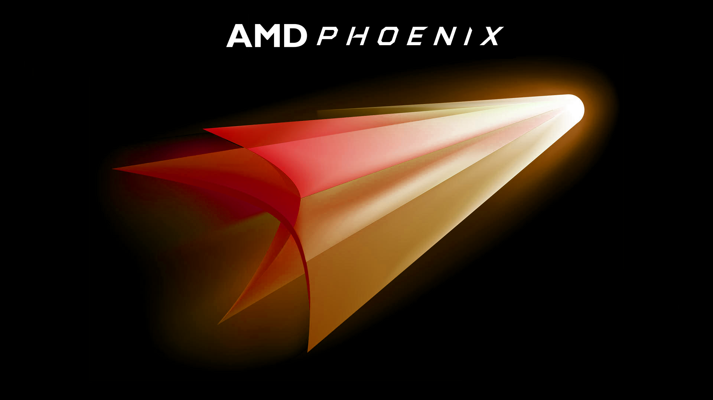
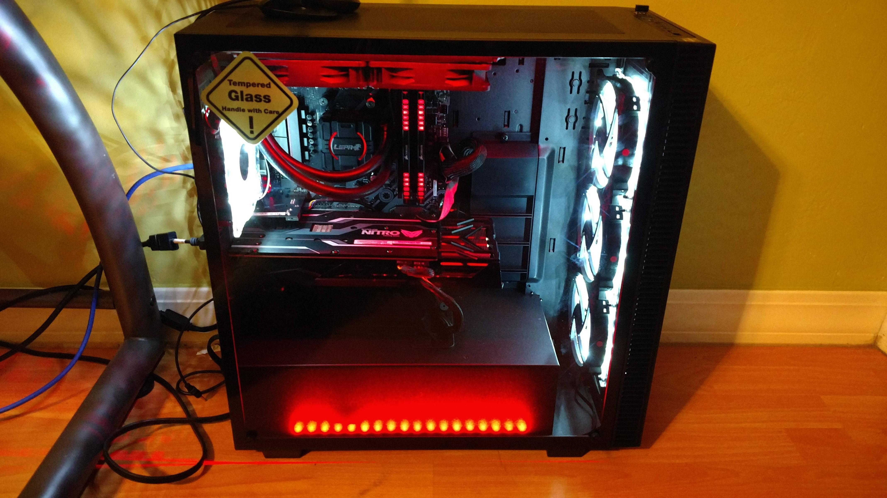
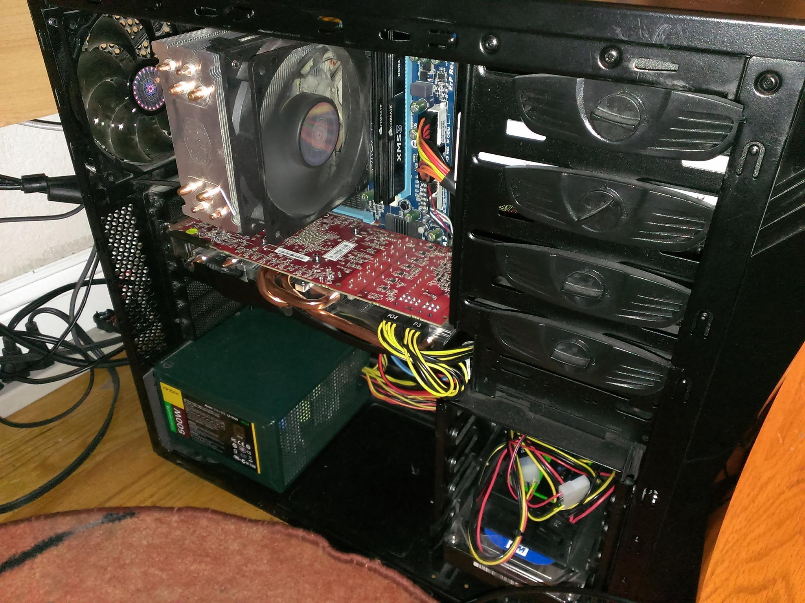
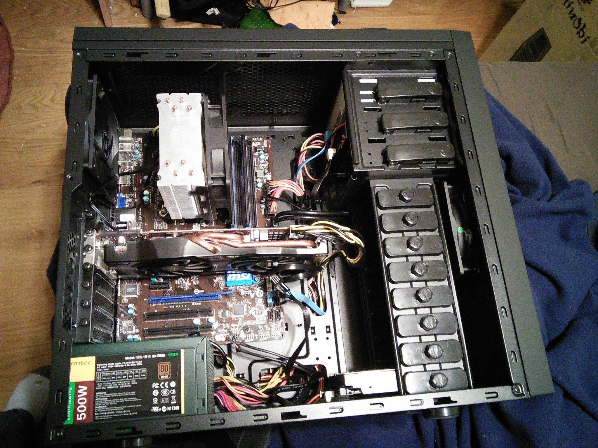
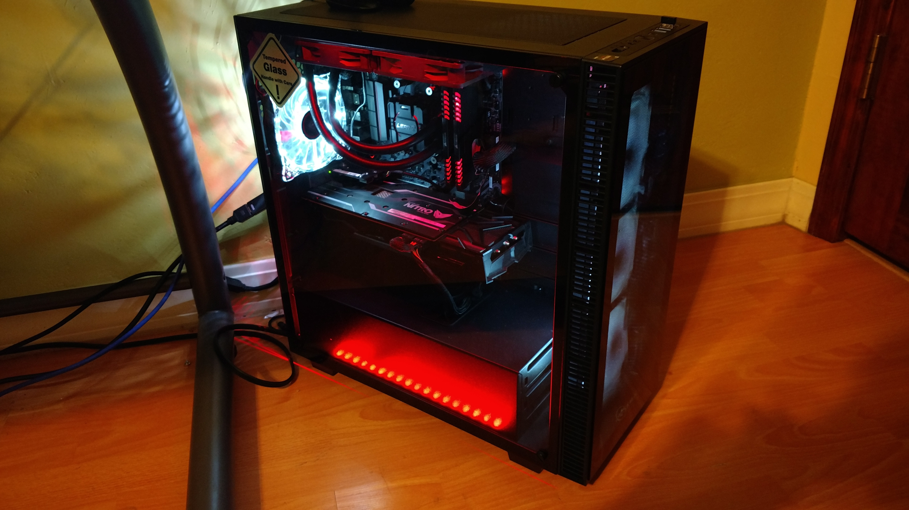

---
{
	title: "Phoenix : My AMD PC Build",
	published: "2017-05-05T21:40:00-04:00",
	tags: ["Rockmandash Rambles", "PC"],
	kinjaArticle: true
}
---

 

Ever since I started getting into PCs, I had an unwavering fascination with the AMD Phenom line (the Phenom II’s in particular), which was AMD’s flagship processor line from the late 2000’s and early 2010’s. Ever since I first laid my eyes on them, I thought they had an unwavering amount of coolness to them, overclockable chips that were a more affordable alternative to the juggernaut of intel. While they weren’t technically superior to the competition in every aspect, the phenoms at the time were the price to performance kings, and seemed to have the consumer in mind throughout. As someone who was on a really tight budget, I started to admire this line as hey represented everything I wanted out of a CPU: they gave you more raw horsepower for less money, allowed you to do more with your processors (All CPUs could be overclocked, and if you were lucky, you could even unlock them!), they had upgradability in mind, and they were \*cool\* with an amazing purple color scheme and Black editions, which I always loved.

In the end, I decided to cheap out and get an Athlon II X3 435 and an AM3+ board as a stopgap for the upcoming Bulldozer FX CPUs, a decision I quite regret making. Of course, I regretted it because FX was terrible and I wouldn’t get much of a real upgrade in games, but there’s also a part of me who regrets doing that because I never got a phenom in the end, a processor actually faster than it’s FX equivalents, at least early on. I eventually switched to intel like everyone else as AMD CPU’s burned into ashes, leaving us with no competition and a pile of regrets.

But while Phenom itself died with the failure of FX, the spirit of Phenom rises again in Ryzen. To me, I can’t help but see Ryzen as a Phenom III, as it shares so much of what made phenoms great. AMD has once again made the new price to performance king, providing more horsepower and cores than the competition at the price points the chips go for with a truly innovative design (though in opposite way than phenom), in a ay that cares about the consumer once again.

When FX flopped, I decided to get a 3570k as an upgrade (which was great!) but I accidentally killed my z77 board I had my i5 on. I got fed up with the lack of more than 4 cores on a mainstream platform, as I was getting into video production (and I’m a computer engineering student so I figured eventually a class would use the power… not yet anyways) so the instead of buying a new board, I sold the i5 got a Xeon x5660 which could OC as the net cost of moving was cheaper than getting a new board. It’s a great chip for the price and does the job, but that was a compromise of gaming for productivity, and now with Ryzen I can have the best of both worlds, and it would serve as a significant upgrade from either intel chips even if I didn’t buy the xeon. With the ideal phenom in a modern age, and my prosumer/gamer focus in the way I use my PC, my latest upgrade from an aging intel to ryzen is a no brainer, and given that it’s a spiritual successor to phenom ii in so many ways, I thought it would be only fitting to make my new rig an homage to that lineup as well. Enter Phoenix.

I think Phoenix is a perfect name for this rig, in sync with the Ryzen spirit while echoing the Phenom past. The rig I put together is basically a dream build at reasonable prices (I strive for price to performance over absolute best though sooo), and I’m really happy with how it ended up. I decided to get a Ryzen 1600 as it’s the bang for the buck king when it comes to high performance CPUs, does everything I really need to do and it pairs nicely with my R9 Fury. If I need more cores in what I can do, I can always upgrade to Zen2 or later when that comes. The complete specs, and the list on PC Part Picker: <https://pcpartpicker.com/list/bXdYzM>\
\
CPU: Ryzen 1600\
Cooler: Lepa Aquachanger 240\
Motherboard: MSI Tomahawk B350\
RAM: Corsair Vengence LED (Red) 3000 mhz\
GPU: Sapphire Nitro R9 Fury\
CASE: Rosewill Cullinan/Anidees Ai Crystal\
SSD: Sandisk Extreme II 240gb SSD\
HDD: WD Blue 1TB\
NZXT Hale832 750w PSU\
Other: Gigabyte GC-WB867D-I\
Other: Deepcool RGB 350\
\
In this imgur album, I process the build, and show some pics. I think it looks fantastic, and I’m in love. check it out!

