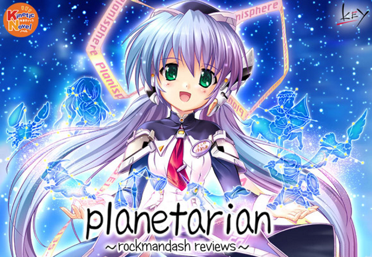

---
{
	title: "Planetatian is now on Steam!",
	published: "2014-09-12T14:59:09-04:00",
	tags: ["undefined"],
	kinjaArticle: true,
	hideFromIndex: true
}
---

It's the first of the Key & Sekai project partnership; we finally have Planetarian up on steam, and it's even on sale! 25% off of the regular price. If you have some interest with the game, check out my review here.

Steam Link - <http://store.steampowered.com/app/316720/>

###### [Rockmandash Reviews: *Planetarian* \[Visual Novel\]](https://rockmandash12.kinja.com/rockmandash-reviews-planetarian-visual-novel-1607911392)

Why don't you come to the Planetarium? The beautiful twinkling of eternity that will never fade, no

[Read more](https://rockmandash12.kinja.com/rockmandash-reviews-planetarian-visual-novel-1607911392)