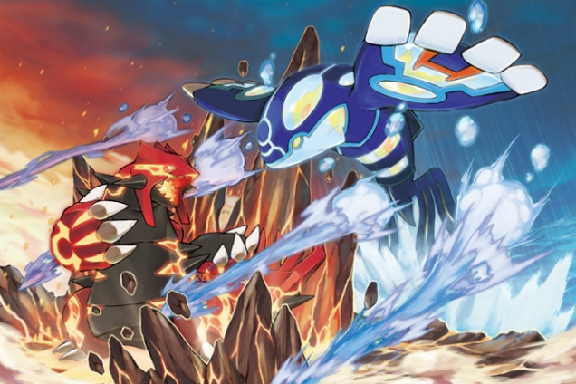
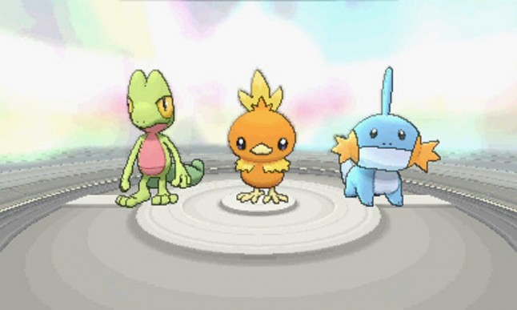
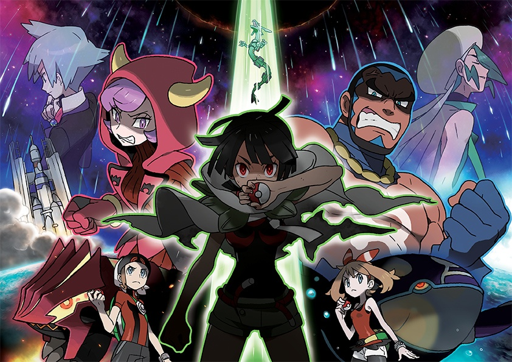
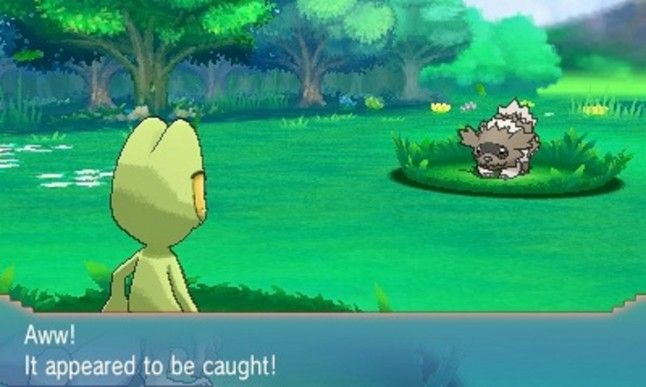
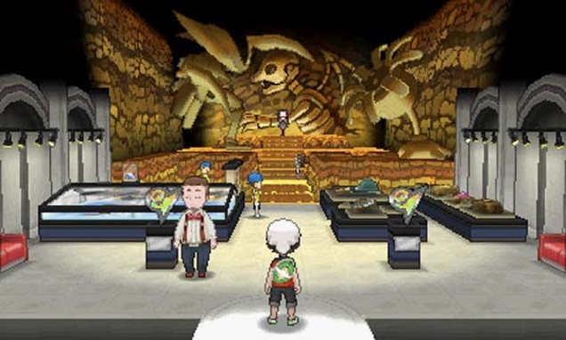
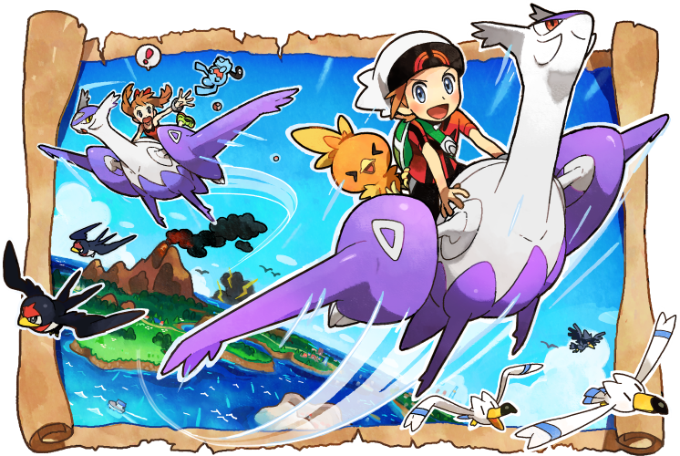
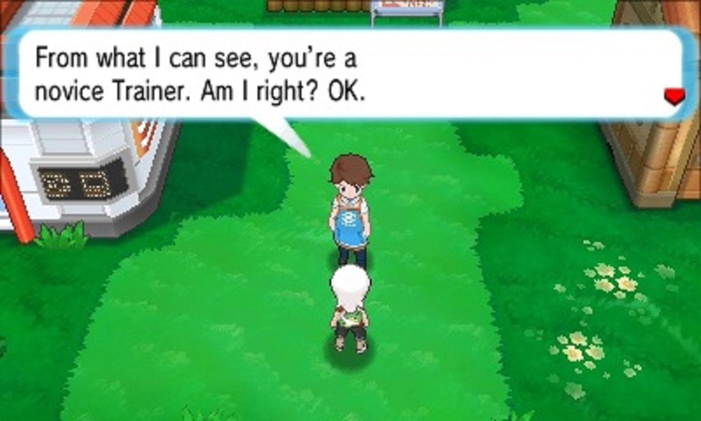
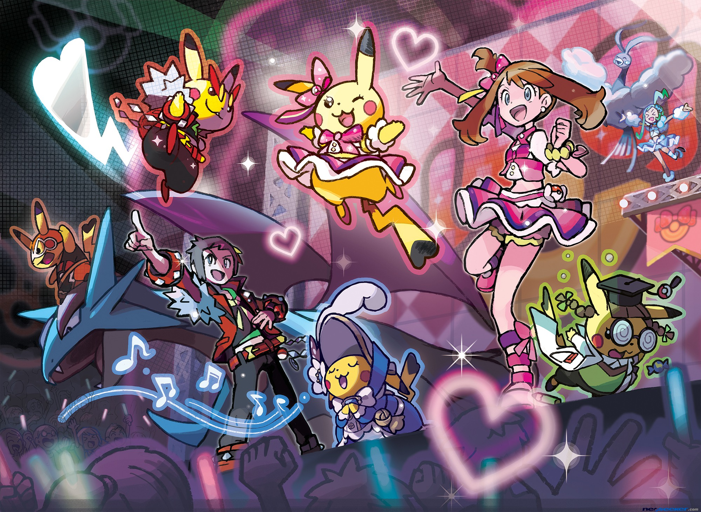
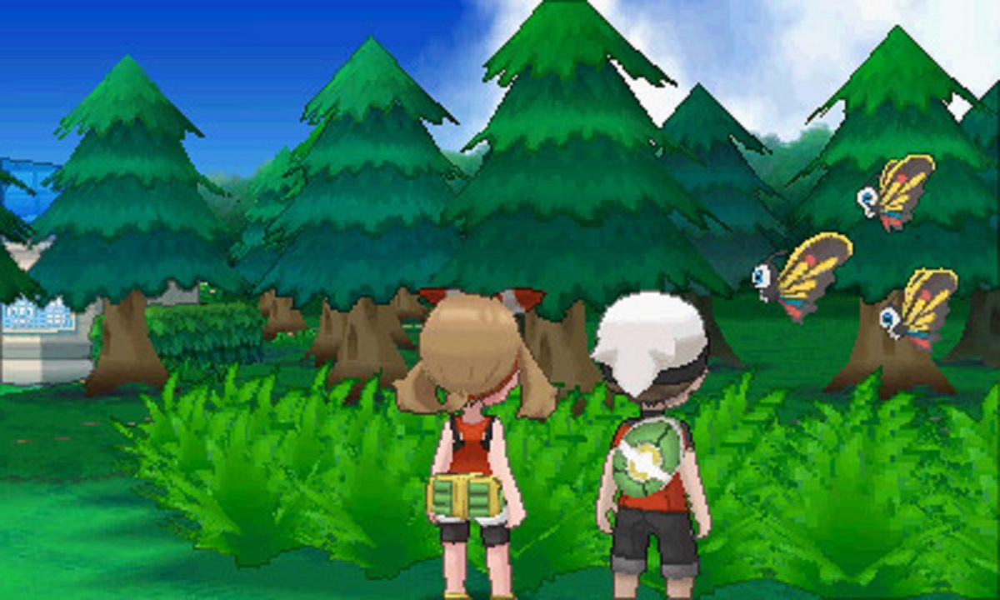
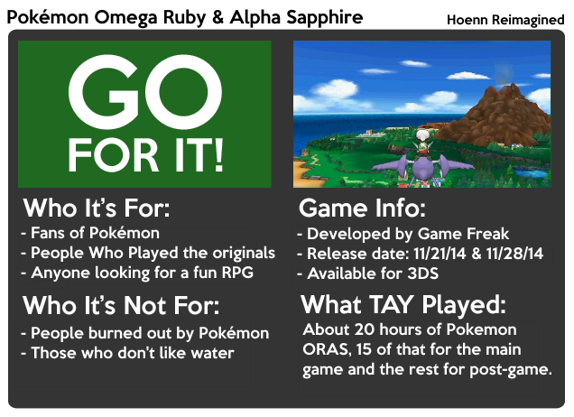

---
{
	title: "Pokémon Omega Ruby & Alpha Sapphire: The TAY Review",
	published: "2014-11-26T22:45:00-05:00",
	tags: ["TAY-Review", "Tayclassic", "Pokemon", "Omega Ruby", "Alpha Sapphire", "Rockmandash Reviews"],
	kinjaArticle: true
}
---

<video src="./cxgddjmil0xsaqn56cro.mp4"></video>

I'm sure that a lot of people also say this, but Pokémon was an essential part of my childhood. When I was in the 3rd grade, I was obsessed with the Pokémon TCG (3rd Gen), and when I finally was able to play the games, I started with DPPT, and soon played RSE after. The third generation was interesting to me; I liked it quite a bit when I played it, but little nitpicks have always kept me from making the third generation. Now that Game Freak has outfitted Ruby and Sapphire with the X & Y experience and remade the whole game, does it finally become something more? Let's find out in this review for Pokémon Omega Ruby & Alpha Sapphire.

# Homage to the Originals

There is one aspect of ORAS that is so prevalent, and so overbearing that every element of the game is influenced by it: ORAS was made to be accurate, and recreate the game with a modern twist. While it has several improvements and is a more modern game in mechanics than the originals, the experience playing ORAS is very similar to the originals', and it feels like them, but with a bit of added personality. It constantly references the original games by using assets from it, and during the main story, it never really deviates much from the source. It's like a nice trip down memory lane or a celebration of Hoenn in a way: The remake knows its roots and it embraces them while adding some charm. To me, the game shows more emotion: it's more charming, and it feels more complete, which makes it that much more enjoyable

It reminds me of a GBA Firered ROM Hack for remaking Johto in how they were trying so hard to be accurate, while trying to add features and extra personality to the game. To me, it feels like a fan made this, and they were trying very hard to be accurate to the source, while adding something new. If you liked the originals, you'll probably like this. If you didn't, some of the modernized aspects may make you enjoy the game, but I don't think it will sway your opinion that much.

# Simple yet Satisfying Scenario

Time to get the story out of the way: The structure and scenario is extremely similar to the originals, and pretty much every Pokémon game in the main series. You are a new trainer who just moved to the Hoenn Region, and your father Norman has been hired as a Gym Leader. You pick one of the 3 starters (Mudkip, Torchic and Treeko), then travel around the region to complete the Pokédex and battle eight Gym Leaders. During your adventure, you will run into the nefarious Team Aqua or Magma, with one of the teams opposing the others depending on the version you have. You eventually thwart the Team's devious plans and become the Pokémon League Champion, like every other Pokémon game. There's a bit in me that wishes that they used the story from Emerald instead Ruby and Sapphire, because I found Emerald's story to be more exciting, but in ORAS, the story is pretty much identical to the originals. I don't really have any personal gripes with the more simplistic story that they used for ORAS because it's just as enjoyable now as it was when I originally played it, and it's still pretty fun in general, but I would have appreciated the story from Emerald a bit more.

That being said, the story isn't identical to the originals. Game Freak added the Delta Episode to the story, and it's pretty great. [Patricia's article](http://kotaku.com/one-big-reason-to-finish-the-new-pokemon-games-1661733984) covers it pretty well, but I have my 2 cents to add in here: it's a fun and new story element of Pokémon ORAS with great production values, interesting themes, and great lore. It's a story worth caring about in Pokémon, and I hope that Game Freak can continue this trend. I always thought it was missed potential that they never had any story element in the games with Deoxys, and the execution was way better than I expected. Also, just a slight warning for those who haven't played through the delta episode yet: at the end of the episode, there are 3 major battles in a row that you can't save in between, so if you screw up on one of them then you'll have to restart on the whole gauntlet. Come prepared!

# The Pokémon Experience

**Battling**

Let's start with the actual act of battling: it is essentially the same from X & Y due to the fact that they haven't changed the metagame at all, it's the same generation, and it's running on the same engine. This means it's fast, frenetic, and more balanced than ever (especially after that weather nerf). However, while the engine is the same from X and Y, along with all the move sets, stats etc., the game feels much more like Ruby and Sapphire because of the Pokémon available. All the Pokémon are the exact same from the original RSE throughout most of the main quest, and the trainers are exactly the same from gen 3 (which means you will not run into triple battles and things of the sort) so even though it's running a new engine, with a totally different met game, it felt exactly like battling in the 3rd generation. Most of the tactics I used during that generation worked exceedingly well because it just played like RSE. What I mean by this is that the gameplay is much more simple in comparison to X and Y, because you don't need to worry about all the other things that goes into battling in Pokémon.

<video src="./mq4jotqz9tc57t8k4ldi.mp4"></video>

This may not bother many of you out there, but out of the box, ORAS is insanely easy. If you want some challenge, you have to make it yourself. It's easy in comparison to the originals, and easy for a game in general. Never once did I find the game hard, and the streamlining doesn't help the feeling of challenge either. The Exp. Share still shares to your whole team so you are pretty over leveled at all times if you enable it, and Nintendo just gives you a lot of free things in the game, which makes it that much easier. I was appalled when they gave you a legendary in the middle of the game. Before, legendries were things I felt proud of owning, and they offered a challenge. Now they just give it out, which really bothered me.

**Movement**

Moving your character is much more like X and Y (fast yet unreliable at times) due to the full 3D world and the fact you have your analog stick, but they added a new sneaking feature… which personally I did not care for because it got annoying. While it was neat at times to find cool Pokémon, it hindered the movement of the game by causing you to sneak unless you had the analog stick pushed completely out. Other movement improvements are composed of speeding up movement in general: running is faster, surfing is extremely fast, and movement underwater is much faster than before. The movements on water serve to cut down the amount of time you need to spend in the water, if that's a thing that bothers you. Personally, while the amount spent surfing is more than the other games in the series, this has never really been an issue for me and probably won't be an issue for you unless you really don't like water. The game's based on one of the more southern islands of Japan, and it's a stylistic choice that doesn't really bother me. That being said, the maps are still the same as generation 3 (with the exception of Mayville City) and movement quirks still exist: an example is that the bikes still handle the way they originally did, with the Mach bike being a tad too fast to control precisely, and the aero bike being a tad too slow to blow through routes like it's nothing.

Late in the game, there is a new method of movement that's just absolutely amazing: they give you the eon ticket which allows you to fly in the sky with Latios and Latias, and I have got to say, this is the most fun I've had moving around a region in Pokémon. It's fast, and it unleashes the inner child in me… it's an absolute blast. I wish that they just made the HM fly like this instead of being relegated to the Eon ticket, but it's a lot of fun and it makes post-game really enjoyable.

**Pacing**

The pacing is the section that has been most modernized: while the original gen 3 games can be a slog and slow to get through, the pacing of this game is pretty fast. It's eliminated most of the excess fat, and it leaves you with a frenetic and fun experience. There's nothing that is stopping you from going slower, and at your own pace, but the remakes really do a great job at making it fun to revisit, and pushes you forward (I was able to beat the main quest in 15 hours, much faster than I've ever finished a Pokémon game before). They tell you where you need to go, they block off sections that would cause you to wander off aimlessly until you need to go there, etc. An example of this is how pretty much all major backtracking has been eliminated; during any long trek that made you re-experience the same route and nothing new at the beginning of the game before fly, they would give you the option to just skip to the point you needed to go. Seeing this blew my mind, and made me enjoy the game that much more. The pacing makes this game much more enjoyable than I'd expect, and is probably the best part of the new games: less grinding, less slogging around, and more fun.

**Et cetera**

One thing that struck me as awesome usage of the bottom screen is in this game: it has tons of improvements and is one of the best interfaces for Pokémon. The DexNav app is another incentive to catch Pokémon, and it works really well. All the features from X and Y are there under the PlayNav, The AreaNav is the first map that's on the touchscreen which makes it the first worth using, and the BuzzNav is the TV bits that you had to go out of your way to see, and along with all of these are the quick toggles to the menu. It's great, and it's one of the smaller things that make ORAS a better experience.

Also, the side gameplay aspects that Nintendo keeps on changing is the way it was in generation 3: contests are back, secret bases are back, etc., but they are refreshed and executed in a better way than the originals. For an example, during the contests you can enable AR, and I found that to be really neat.

# Pleasing to the Eyes

ORAS looks great: it's Hoenn wrapped up in the X & Y visual aesthetic with upgrades and touchups, and frankly, it looks fantastic. All the great things about X & Y's engine applies here, and it looks just as nice in the Hoenn region as it did in Kalos. When I first saw the early announcements, I didn't like it at all. I thought the art style was odd in the way they executed it. I thought it didn't look nearly as nice as before, but that was nostalgia speaking. Seeing everything working together, and actually experiencing it made me appreciate the execution of the world. With great expressions, amazing dungeon design, etc., the changes the game makes cause the game to feel truly alive. It's a reimagining that adds a lot of emotion and it's one that I can get behind, and it looks great. Some places are seriously impressive visually to me: the Team hideouts, the gyms and the contest halls got major upgrades, and they just look fantastic. I have nothing but praises for the way this game looks, it really uses the hardware well.

# Enjoyment

<video src="./jpjumhajumtjsgbkqpcg.mp4"></video>

I had a lot of fun playing through ORAS. While X and Y were also a lot of fun, I don't think it was nearly as memorable to me. The added charm, and improved pace of the game, and all the little improvements turn this game from what could once be called a black sheep of the series into something that was a blast, something that I'll look back even more fondly than I did the originals. It set out to do its job of making the player have fun, and I personally think it succeeded in that aspect.

# Sounds solid, most of the time

I've always been a fan of soundtracks in Pokémon games, as they were always pleasing to the ear, fitting to the location they were aiming for and invigorating when necessary. That being said, Ruby and Sapphire's soundtrack was never something I've been the biggest fan of, and it didn't stand up in comparison to some other soundtracks in my opinion. ORAS tries to change that, and it has mild degrees of success, but I wouldn't say it's one of the best Pokémon soundtracks out there.

The approach that ORAS has with its soundtrack is that it tries to be faithful while trying to make it fit the situation more. In general, the remixes capture the essence of the original soundtrack, while amplifying the feeling, ambience, and tone of it. They add charm to the world, and enrich the atmosphere, while preserving the feeling and tone that the original tracks had (YAY FOR TRUMPETS!). It's a great soundtrack, and it's one that really captures the spirit of the game.

That being said, every now and then, you'll run into some tracks that sound off. A lot of times tweaked music doesn't influence that much but some of the remixes completely change the feeling of the track and the atmosphere makes (route 111 is jazzy, for example). The differences are subtle, but can really throw a person off; some of the added tones detract from the melody and dilute the sharp feeling that the originals had. The soundtrack overall is pretty outstanding, but it's the little things.

Pokémon Omega Ruby & Alpha sapphire are beautiful recreations of the third generation for the Gameboy Advance. They use the strengths of the modern Pokémon games to improve on the style that the originals had while keeping the feeling of the game intact. It's a great remake and it does what all good remakes really should do.

