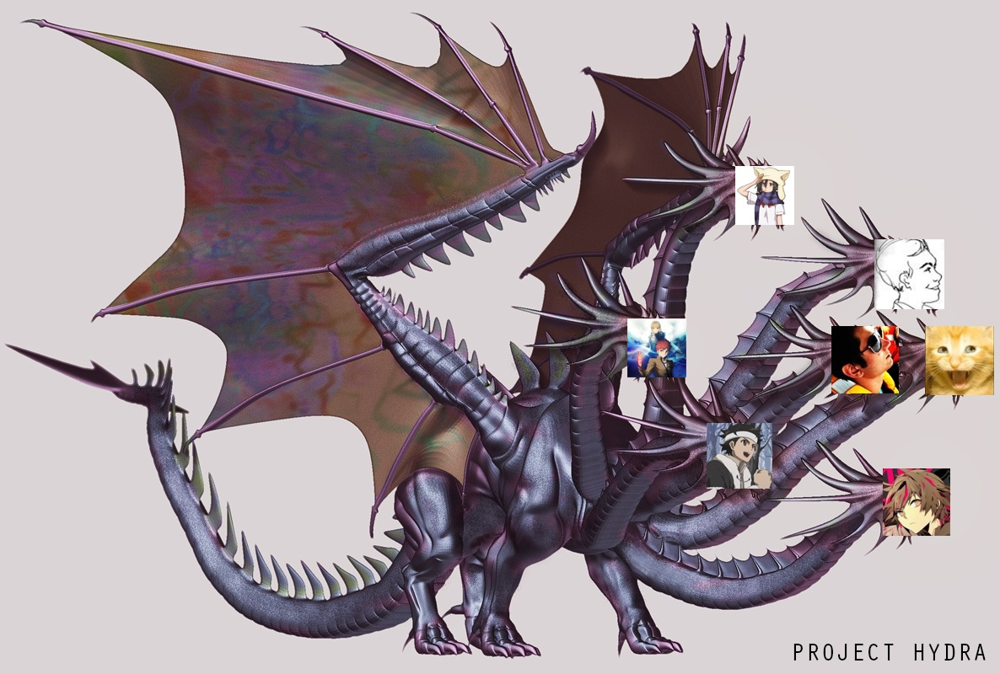
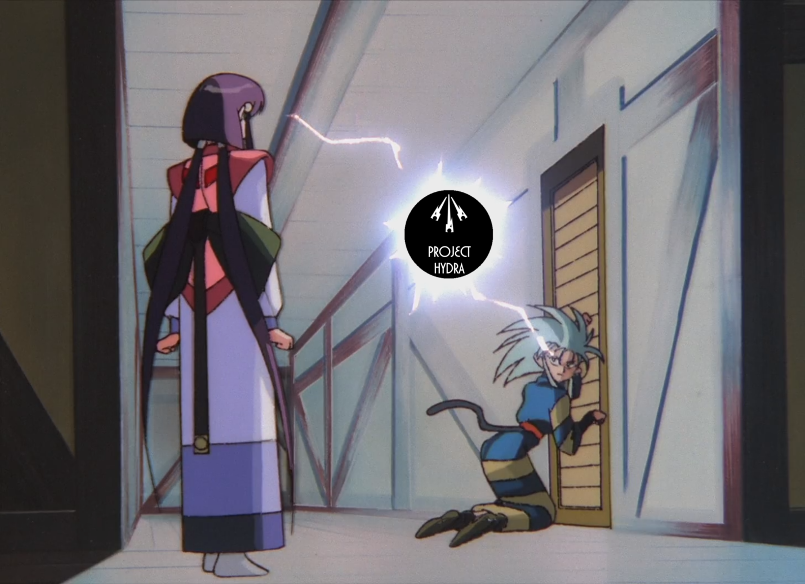

---
{
title: "Project Hydra Attends a Corpse Party for Tortured Souls",
tags: ["Project Hydra", "Corpse Party", "Tortured Souls", "AniTAY", "OVA", "Anime", "Horror", "Gore"],
authors: ['reikaze'],
published: '2014-12-15T14:55:00-05:00',
attached: [],
license: 'cc-by-4',
oldArticle: true
}
---

Welcome to the second article of <a class="sc-1out364-0 hMndXN sc-145m8ut-0 gIacKn js_link" data-ga='[["Embedded Url","External link","https://anitay.kinja.com/ani-tay-presents-project-hydra-1650055177",{"metric25":1}]]' href="https://anitay.kinja.com/ani-tay-presents-project-hydra-1650055177" rel="noopener noreferrer" target="_blank">Project Hydra</a>,
  the review series where random AniTAY members review random episodes of a show. Today, we have the 4 episode OVA anime
  adaptation of a PSP horror game, <em>Corpse Party: Tortured Souls</em>.

<aside class="sc-1rh3ayr-6 jfFNjl inset--story branded-item branded-item--kinja" data-commerce-source="inset">

<a class="sc-1out364-0 hMndXN js_link" data-ga='[["Permalink page click","Permalink page click - inset headline"]]' href="https://anitay.kinja.com/ani-tay-presents-project-hydra-1650055177" rel="noopener noreferrer" target="_blank"><h6 class="sc-1rh3ayr-3 jRIPES">Ani-TAY
    Presents: Project Hydra</h6></a>

      Ever wanted to just jump right into a random episode of a show and just start watching with no…
<a class="sc-1out364-0 hMndXN sc-1rh3ayr-0 kOvmIi js_readmore inset--story__readmore js_link" data-ga='[["Permalink page click","Permalink page click - inset read more link"]]' href="https://anitay.kinja.com/ani-tay-presents-project-hydra-1650055177" rel="noopener noreferrer" target="_blank">Read more</a>

</aside>
 To give you a <strike>brief</strike> summary, Corpse party follows a group of
  students that decide to perform a charm called "Sachiko Ever After" which enables them to be friends forever if they
  do it right. They don't (of course, we wouldn't have a story if they did it right), and they are sent to an alternate
  universe that contains the Heavenly Host Elementary School, an elementary school that was torn down but is haunted by
  the ghosts of the school's murdered children in this dimension. The students try to find their way home and figure out
  the truth to this mystery but things don't always go to plan. Due to it being a horror, several of them die and it
  doesn't really end on a pretty note. The game had many bad ends through the game (one of them leading to a spin-off
  called Book of Shadows), but <em>Tortured Souls</em> only follows the true end.

<em>Corpse Party: Tortured Souls</em> is a very interesting adaptation. While I'd
  personally recommend experiencing <em>Corpse Party</em> via the game because <em>Tortured Souls</em> has to rush the
  story and it has quite a different direction, it uses what little time it has well by portraying what people would
  expect from something called <em>Corpse Party</em>. What I mean by that is a lot of Corpses, gore, horror, gore,
  supernatural elements, gore, psychological damage, gore, horrible deaths, gore, and a killer soundtrack. Did I mention
  Gore? Yeah... there's a lot of that, making it absolutely perfect for Project Hydra, with the amazing reactions. It's
  a horror slasher film in anime format, and it laughs at the idea of subtlety. Everything's notched up to 11, and if
  you thought <em>Elfen Lied</em> and <em>Higurashi</em> was gory.... you are in for a treat. Now that you are in the
  right mindset for these reviews/reactions, let's get this started!

 In the respective <strike>chopping</strike> order, we have Krakken_Unleashed,
  Protonstorm, Messiah, and thatsmypizza <strike>dying</strike> watching this show and then writing up a quip for
  Project Hydra. As for the formatting for the Project Hydra for <em>Corpse Party: Tortured Souls</em>, I decided that
  I'd do it differently than the way Exile did the formatting for our first Project Hydra article, <a class="sc-1out364-0 hMndXN sc-145m8ut-0 gIacKn js_link" data-ga='[["Embedded Url","External link","https://anitay.kinja.com/anitay-presents-project-hydra-versus-tenchi-muyo-1667362501",{"metric25":1}]]' href="https://anitay.kinja.com/anitay-presents-project-hydra-versus-tenchi-muyo-1667362501" rel="noopener noreferrer" target="_blank"><em>Tenchi Muyô</em></a>. Instead of lumping them in one article, I thought it
  would be better if we released them one per day, as a separate article, and this article will serve to link to them.
  Please post feedback on thoughts for which you would prefer, as Project Hydra is very much a work in progress.

<aside class="sc-1rh3ayr-6 jfFNjl inset--story branded-item branded-item--kinja" data-commerce-source="inset">

<a class="sc-1out364-0 hMndXN js_link" data-ga='[["Permalink page click","Permalink page click - inset headline"]]' href="https://anitay.kinja.com/anitay-presents-project-hydra-versus-tenchi-muyo-1667362501" rel="noopener noreferrer" target="_blank"><h6 class="sc-1rh3ayr-3 jRIPES">AniTAY
    Presents: Project Hydra Versus Tenchi Mûyo!</h6></a>

Greetings all, and welcome to the inaugural article/trial run of Project Hydra. An
      idea sourced…
<a class="sc-1out364-0 hMndXN sc-1rh3ayr-0 kOvmIi js_readmore inset--story__readmore js_link" data-ga='[["Permalink page click","Permalink page click - inset read more link"]]' href="https://anitay.kinja.com/anitay-presents-project-hydra-versus-tenchi-muyo-1667362501" rel="noopener noreferrer" target="_blank">Read more</a>

</aside>

<a class="sc-1out364-0 hMndXN sc-145m8ut-0 gIacKn js_link" data-ga='[["Embedded Url","External link","http://anitay.kinja.com/project-hydra-corpse-party-tortured-souls-episode-1-1670894680",{"metric25":1}]]' href="http://anitay.kinja.com/project-hydra-corpse-party-tortured-souls-episode-1-1670894680" rel="noopener noreferrer" target="_blank">Epis</a><a class="sc-1out364-0 hMndXN sc-145m8ut-0 gIacKn js_link" data-ga='[["Embedded Url","External link","http://anitay.kinja.com/project-hydra-corpse-party-tortured-souls-episode-1-1670894680",{"metric25":1}]]' href="http://anitay.kinja.com/project-hydra-corpse-party-tortured-souls-episode-1-1670894680" rel="noopener noreferrer" target="_blank">ode 1</a> - Written by <a class="sc-1out364-0 hMndXN sc-145m8ut-0 gIacKn js_link" data-ga='[["Embedded Url","External link","http://krakkenunleashed.kinja.com/",{"metric25":1}]]' href="http://krakkenunleashed.kinja.com/" rel="noopener noreferrer" target="_blank">Krakken_Unleashed</a>

<a class="sc-1out364-0 hMndXN sc-145m8ut-0 gIacKn js_link" data-ga='[["Embedded Url","External link","http://anitay.kinja.com/project-hydra-corpse-party-tortured-souls-episode-2-1671010348",{"metric25":1}]]' href="http://anitay.kinja.com/project-hydra-corpse-party-tortured-souls-episode-2-1671010348" rel="noopener noreferrer" target="_blank">Episode 2</a> - Written by <a class="sc-1out364-0 hMndXN sc-145m8ut-0 gIacKn js_link" data-ga='[["Embedded Url","External link","http://protonstorm.kinja.com/",{"metric25":1}]]' href="http://protonstorm.kinja.com/" rel="noopener noreferrer" target="_blank">Protonstorm</a>

<a class="sc-1out364-0 hMndXN sc-145m8ut-0 gIacKn js_link" data-ga='[["Embedded Url","External link","https://anitay.kinja.com/project-hydra-corpse-party-tortured-souls-episode-3-1670905502",{"metric25":1}]]' href="https://anitay.kinja.com/project-hydra-corpse-party-tortured-souls-episode-3-1670905502" rel="noopener noreferrer" target="_blank">Episode 3</a> - Written by <a class="sc-1out364-0 hMndXN sc-145m8ut-0 gIacKn js_link" data-ga='[["Embedded Url","External link","http://themessiah.kinja.com/",{"metric25":1}]]' href="http://themessiah.kinja.com/" rel="noopener noreferrer" target="_blank">Messiah</a>

<a class="sc-1out364-0 hMndXN sc-145m8ut-0 gIacKn js_link" data-ga='[["Embedded Url","External link","http://anitay.kinja.com/its-a-small-small-world-and-its-full-of-guts-its-a-sm-1672862294",{"metric25":1}]]' href="http://anitay.kinja.com/its-a-small-small-world-and-its-full-of-guts-its-a-sm-1672862294" rel="noopener noreferrer" target="_blank">Episode 4</a> - Written by <a class="sc-1out364-0 hMndXN sc-145m8ut-0 gIacKn js_link" data-ga='[["Embedded Url","External link","http://thatsmapizza.kinja.com/",{"metric25":1}]]' href="http://thatsmapizza.kinja.com/" rel="noopener noreferrer" target="_blank">Thatsmapizza</a>

<em>This is the main article of Project Hydra for Corpse
  Party, Coordinated/Edited by Rockmandash12. If you want to see more Project Hydra, check the </em><a class="sc-1out364-0 hMndXN sc-145m8ut-0 gIacKn js_link" data-ga='[["Embedded Url","External link","http://anitay.kinja.com/tag/project-hydra",{"metric25":1}]]' href="http://anitay.kinja.com/tag/project-hydra" rel="noopener noreferrer" target="_blank"><em>Project Hydra Tag</em></a><em>
  on </em><a class="sc-1out364-0 hMndXN sc-145m8ut-0 gIacKn js_link" data-ga='[["Embedded Url","External link","http://anitay.kinja.com/",{"metric25":1}]]' href="http://anitay.kinja.com/" rel="noopener noreferrer" target="_blank"><em>AniTAY</em></a><em>. For an explanation of what Project Hydra
  is, </em><a class="sc-1out364-0 hMndXN sc-145m8ut-0 gIacKn js_link" data-ga='[["Embedded Url","External link","https://anitay.kinja.com/ani-tay-presents-project-hydra-1650055177",{"metric25":1}]]' href="https://anitay.kinja.com/ani-tay-presents-project-hydra-1650055177" rel="noopener noreferrer" target="_blank"><em>check this out</em></a><em>. You can join the fun on
  our </em><a class="sc-1out364-0 hMndXN sc-145m8ut-0 gIacKn js_link" data-ga='[["Embedded Url","External link","http://anitay.kinja.com/tag/ani-tay-sunday-cafe",{"metric25":1}]]' href="http://anitay.kinja.com/tag/ani-tay-sunday-cafe" rel="noopener noreferrer" target="_blank"><em>Sunday Cafes</em></a><em> or by posting your own articles on
  Kinja with the Ani-TAY tag.</em>

