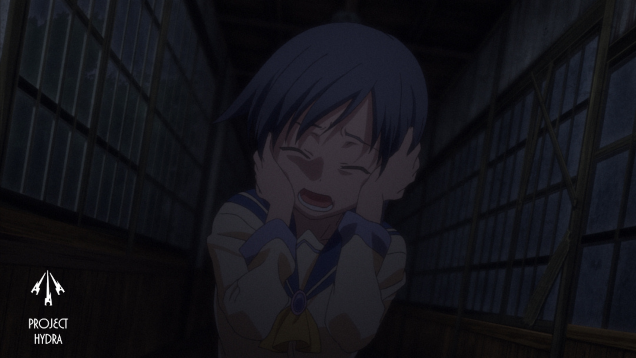
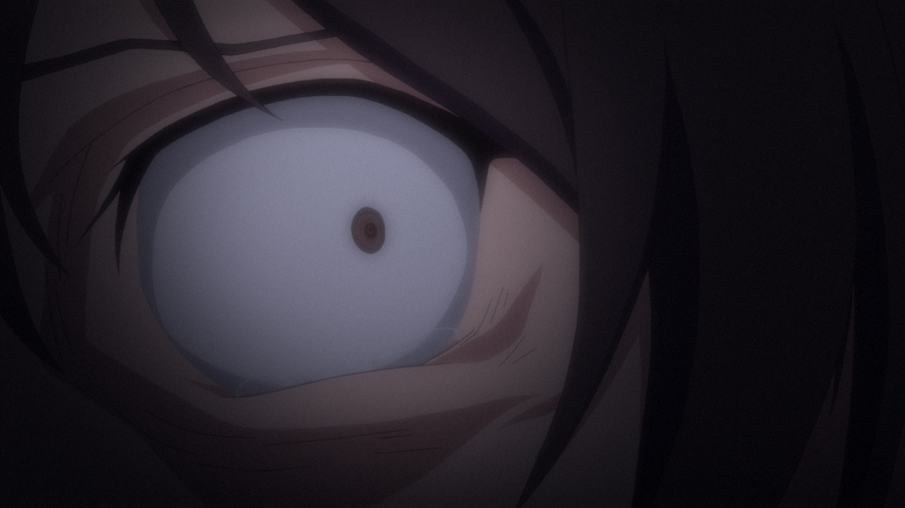
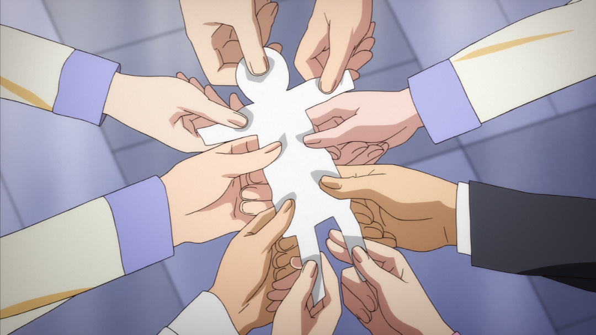

---
{
	title: "Project Hydra Attends a Corpse Party for Tortured Souls",
	published: "2014-12-15T14:55:00-05:00",
	tags: ["Project Hydra", "Corpse Party", "Tortured Souls", "AniTAY", "OVA", "Anime", "Horror", "Gore"],
	kinjaArticle: true
}
---

Welcome to the second article of [Project Hydra](https://anitay.kinja.com/ani-tay-presents-project-hydra-1650055177), the review series where random AniTAY members review random episodes of a show. Today, we have the 4 episode OVA anime adaptation of a PSP horror game, *Corpse Party: Tortured Souls*.

To give you a ~~brief~~ summary, Corpse party follows a group of students that decide to perform a charm called "Sachiko Ever After" which enables them to be friends forever if they do it right. They don't (of course, we wouldn't have a story if they did it right), and they are sent to an alternate universe that contains the Heavenly Host Elementary School, an elementary school that was torn down but is haunted by the ghosts of the school's murdered children in this dimension. The students try to find their way home and figure out the truth to this mystery but things don't always go to plan. Due to it being a horror, several of them die and it doesn't really end on a pretty note. The game had many bad ends through the game (one of them leading to a spin-off called Book of Shadows), but *Tortured Souls* only follows the true end.

*Corpse Party: Tortured Souls* is a very interesting adaptation. While I'd personally recommend experiencing *Corpse Party* via the game because *Tortured Souls* has to rush the story and it has quite a different direction, it uses what little time it has well by portraying what people would expect from something called *Corpse Party*. What I mean by that is a lot of Corpses, gore, horror, gore, supernatural elements, gore, psychological damage, gore, horrible deaths, gore, and a killer soundtrack. Did I mention Gore? Yeah... there's a lot of that, making it absolutely perfect for Project Hydra, with the amazing reactions. It's a horror slasher film in anime format, and it laughs at the idea of subtlety. Everything's notched up to 11, and if you thought *Elfen Lied* and *Higurashi* was gory.... you are in for a treat. Now that you are in the right mindset for these reviews/reactions, let's get this started!

In the respective ~~chopping~~ order, we have Krakken\_Unleashed, Protonstorm, Messiah, and thatsmypizza ~~dying~~ watching this show and then writing up a quip for Project Hydra. As for the formatting for the Project Hydra for *Corpse Party: Tortured Souls*, I decided that I'd do it differently than the way Exile did the formatting for our first Project Hydra article, [*Tenchi Muyô*](https://anitay.kinja.com/anitay-presents-project-hydra-versus-tenchi-muyo-1667362501). Instead of lumping them in one article, I thought it would be better if we released them one per day, as a separate article, and this article will serve to link to them. Please post feedback on thoughts for which you would prefer, as Project Hydra is very much a work in progress.

 

[Epis](http://anitay.kinja.com/project-hydra-corpse-party-tortured-souls-episode-1-1670894680)[ode 1](http://anitay.kinja.com/project-hydra-corpse-party-tortured-souls-episode-1-1670894680) - Written by [Krakken\_Unleashed](http://krakkenunleashed.kinja.com/)

[Episode 2](http://anitay.kinja.com/project-hydra-corpse-party-tortured-souls-episode-2-1671010348) - Written by [Protonstorm](http://protonstorm.kinja.com/)

[Episode 3](https://anitay.kinja.com/project-hydra-corpse-party-tortured-souls-episode-3-1670905502) - Written by [Messiah](http://themessiah.kinja.com/)

[Episode 4](http://anitay.kinja.com/its-a-small-small-world-and-its-full-of-guts-its-a-sm-1672862294) - Written by [Thatsmapizza](http://thatsmapizza.kinja.com/)

***

*This is the main article of Project Hydra for Corpse Party, Coordinated/Edited by Rockmandash12. If you want to see more Project Hydra, check the *[*Project Hydra Tag*](http://anitay.kinja.com/tag/project-hydra)* on *[*AniTAY*](http://anitay.kinja.com/)*. For an explanation of what Project Hydra is, *[*check this out*](https://anitay.kinja.com/ani-tay-presents-project-hydra-1650055177)*. You can join the fun on our *[*Sunday Cafes*](http://anitay.kinja.com/tag/ani-tay-sunday-cafe)* or by posting your own articles on Kinja with the Ani-TAY tag.*
