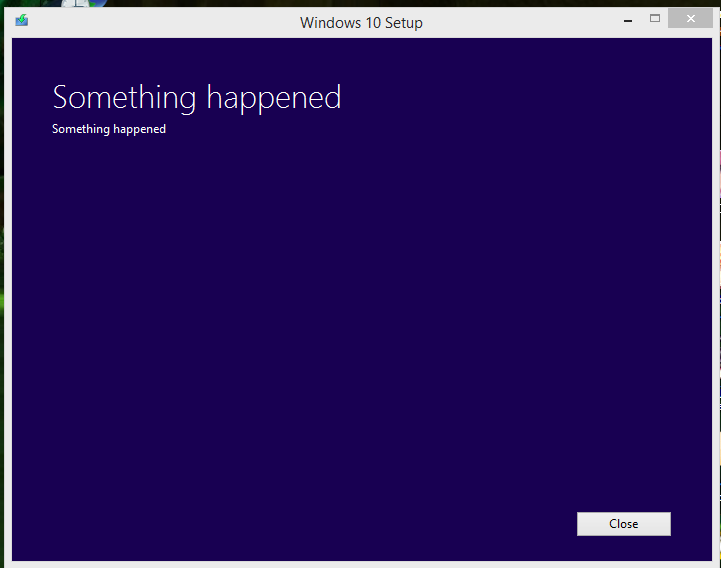

---
{
  title: "",
  tags: [],
  published: "2015-07-29T22:17:14-04:00",
  attached: [],
  license: "cc-by-4",
  oldArticle: true,
}
---

<strong>PSA to people upgrading to Win 10:</strong> If you use the Media Creation Tool to
  upgrade ATM, you may get the really helpful error that says “Something Happened”. The error is caused by your language
  and/or system locale being in not ENG (US). So, if you set it to japanese for VNs to get them to actually run, or if
  you’re not american, Switch it to ENG (US). GG MS, GG.

