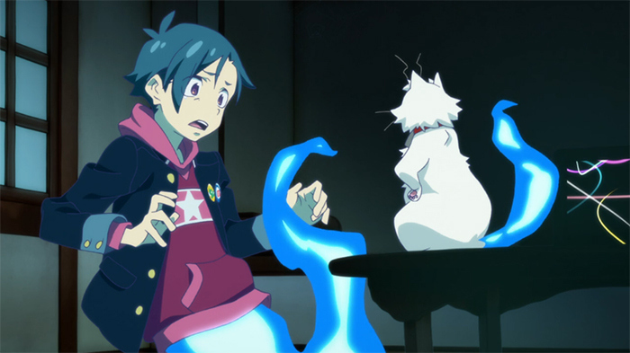
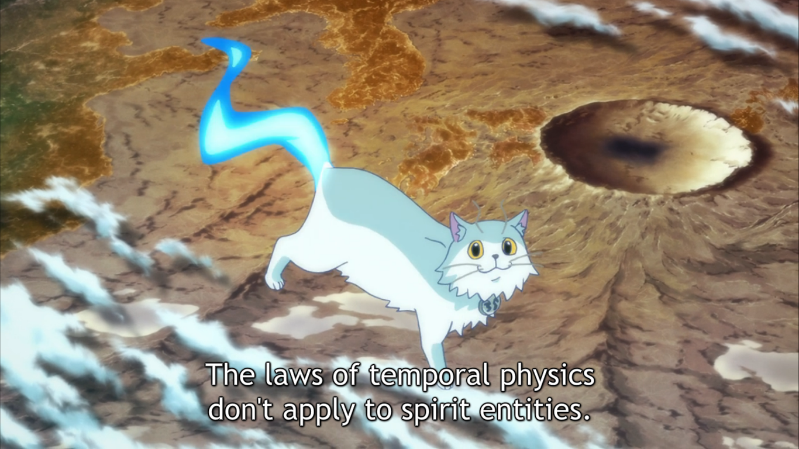
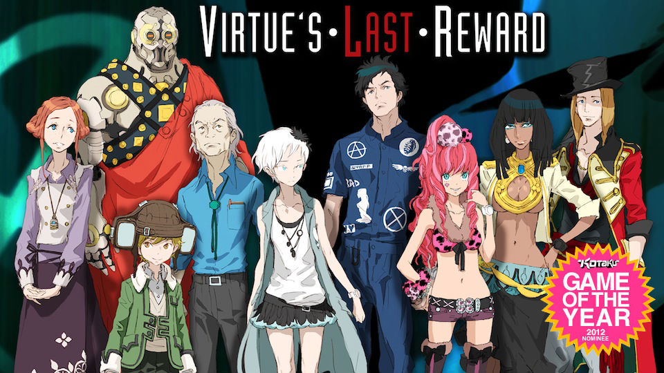
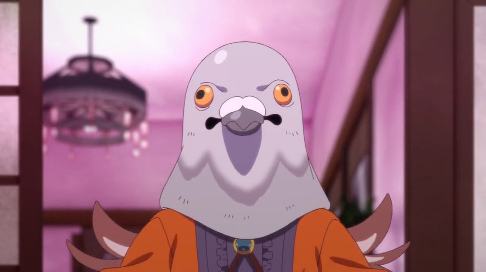
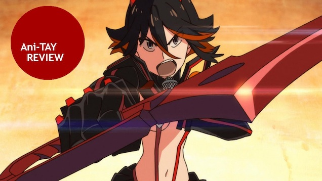
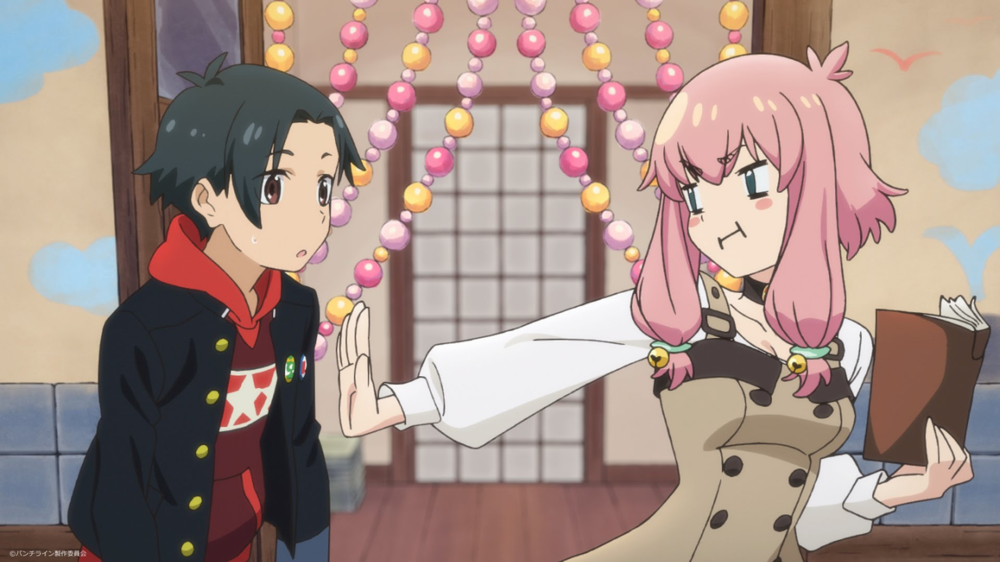
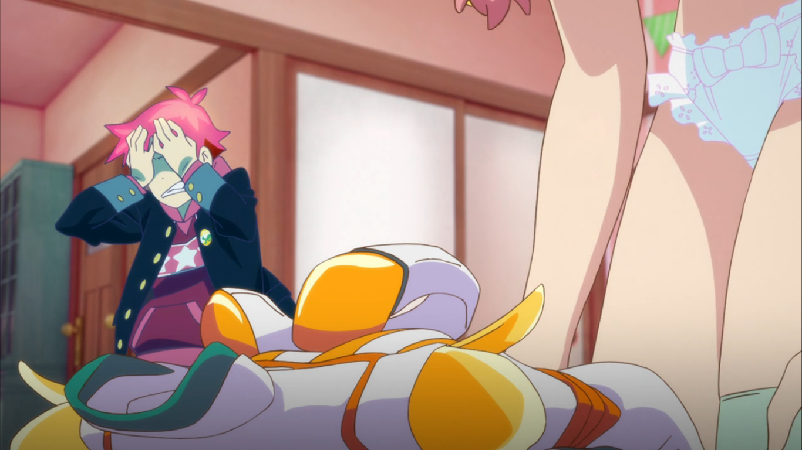
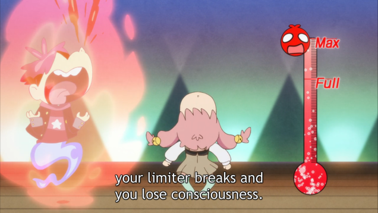
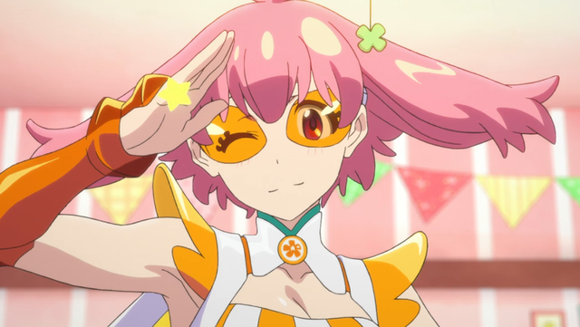
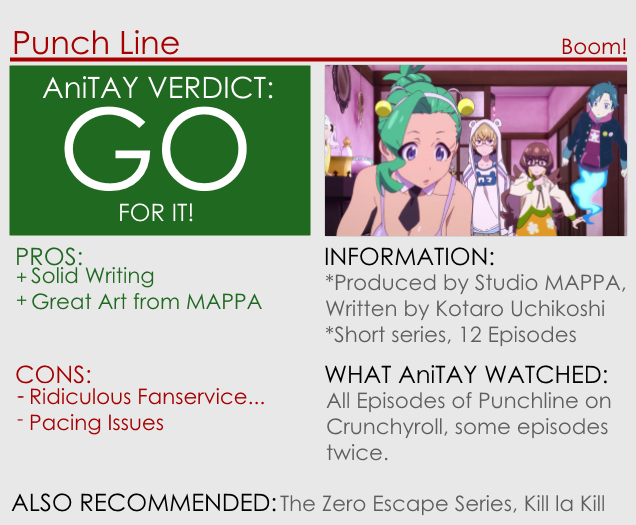

---
{
  title: "Punch Line : The Ani-TAY Review",
  tags:
    [
      "Rockmandash Reviews",
      "Punch Line",
      "Spring 2015",
      "AniTAY",
      "The Ani-TAY Review",
      "Review",
      "Tayclassic",
    ],
  published: "2015-06-25T18:30:00-04:00",
  attached: [],
  license: "cc-by-4",
  oldArticle: true,
}
---

<video autoplay="" loop="" muted=""><source src="./1313950703162309989.mp4" type="video/mp4"/></video>
With a tagline of<em> “If he sees underwear, humanity will be destroyed!?”</em>, what would
  you expect? Well, Whatever you are thinking, throw it out of the window: With <em>Punch Line</em>, <a class="sc-1out364-0 hMndXN sc-145m8ut-0 gIacKn js_link" data-ga='[["Embedded Url","External link","http://rockmandash12.kinja.com/rockmandash-reviews-infinity-zero-escape-marathon-w-1664979798#_ga=1.47325799.1523386611.1417386122",{"metric25":1}]]' href="http://rockmandash12.kinja.com/rockmandash-reviews-infinity-zero-escape-marathon-w-1664979798#_ga=1.47325799.1523386611.1417386122" rel="noopener noreferrer" target="_blank">Kotarou Uchikoshi</a> and MAPPA have made something that is totally
  different than what anyone would expect. 

<h4 class="sc-1bwb26k-1 fvCjqJ" id="h105555">Solid Story</h4>

Plot summaries and first impressions can be quite inaccurate at times, completely
  misrepresenting the work that it’s supposed to represent, and <em>Punch Line</em> is probably the most extreme example
  of this that I have seen. From the source itself:

<blockquote class="sc-8hxd3p-0 nvIqO" data-type="BlockQuote">
<em>If he sees underwear,
  humanity will be destroyed!? An original anime series from the noitaminA block, PUNCH LINE centers on Yuta Iridatsu, a
  high school student, with a peculiar habit. When he sees a girl’s panties, he gets so excited he faints! After a
  certain incident with a ghost cat, his soul gets separated from his body. Using his special powers, Yuta watches the
  daily lives of the inhabitants of an apartment and sometimes plays tricks on them. Eventually, Yuta decides to unlock
  the secrets to why Earth will be destroyed and tries to save it!</em>
</blockquote>

Given that, you would assume the show is about looking at panties, but it’s not.
Written by Kotarou Uchikoshi of <a class="sc-1out364-0 hMndXN sc-145m8ut-0 gIacKn js_link" data-ga='[["Embedded Url","Internal link","https://kotaku.com/why-zero-escape-virtues-last-reward-should-be-game-of-5972462",{"metric25":1}]]' href="https://kotaku.com/why-zero-escape-virtues-last-reward-should-be-game-of-5972462"><em>Zero Escape </em></a>Fame,<em>
Punch Line</em> starts out as this ecchi show but turns into a SciFi show about the world ending due to the Qmay
group hurling an astroid into the earth with the members of the Korai house trying to stop them. Full of twists,
character development and interesting elements like time travel and body switching, this show has a meaningful story
and one that is well written, well executed and a joy to watch.

<aside class="sc-1rh3ayr-6 jfFNjl inset--story branded-item branded-item--kotaku" data-commerce-source="inset"><a class="sc-1out364-0 hMndXN sc-1rh3ayr-2 lnnjIC inset--story__thumb js_link" data-ga='[["Permalink page click","Permalink page click - inset photo"]]' href="https://kotaku.com/why-zero-escape-virtues-last-reward-should-be-game-of-5972462" rel="noopener noreferrer" target="_blank">

<svg aria-label="Kotaku avatar" height="64" viewbox="0 0 64 64" width="64" xmlns="http://www.w3.org/2000/svg"><g fill="none" fill-rule="evenodd"><path d="M0 0h64v64H0z" fill="#FBC000"></path><path d="M16.8 49.62l3.67-.14c4.05-.15 7.76-3.2 8.35-6.78l4.13-24.65-10.3-.3-5.84 31.87zM43.19 29.1c3.57.02 4.95 1.29 5.93 3.27l6.84 16.84c-1.73 1.54-9.79 1-12.08-5.04l-2.5-6.72h-1.15c-3.8.06-9.2-2.78-8.03-8.4l11 .05zm-22.2-11.38l-5.59-.16c-7.78-.22-9.93 5.3-9.28 8.88l13.26.13 1.6-8.85zm31.55 7.69c2.62-1.66 3.74-7.65 1.9-9.4l-13.51 3.4c-2.3 1.28-4.94 5.01-2.33 9.15l13.94-3.15z" fill="#FFF"></path></g></svg></a>

<a class="sc-1out364-0 hMndXN js_link" data-ga='[["Permalink page click","Permalink page click - inset headline"]]' href="https://kotaku.com/why-zero-escape-virtues-last-reward-should-be-game-of-5972462" rel="noopener noreferrer" target="_blank"><h6 class="sc-1rh3ayr-3 jRIPES">Why <em>Zero
    Escape: Virtue's Last Reward</em> Should Be Game Of The Year</h6></a>

To describe why Zero Escape: Virtue's Last Reward was my favorite game of 2012 is to
      describe why I 
<a class="sc-1out364-0 hMndXN sc-1rh3ayr-0 kmFqkp js_readmore inset--story__readmore js_link" data-ga='[["Permalink page click","Permalink page click - inset read more link"]]' href="https://kotaku.com/why-zero-escape-virtues-last-reward-should-be-game-of-5972462" rel="noopener noreferrer" target="_blank">Read more</a>

</aside>
It’s executed like a lighter version of Uchikoshi’s works: it’s not super hard
  SciFi like in the Zero Escape and Infinity series (Probably due to time restraints, this is a 12 episode anime after
  all), with the SciFi being pretty much irrelevant and focusing on the characters and scenerio at hand (with the world
  ending and all) but like everything he’s done, it’s done really well, and his writing style really shines through. It
  creates a great sense of mystery and like his other works, it slowly unravels that mystery in a very satisfying way.
  Every scene, regardless of if it’s important or not is done pretty well, and it really ramps up the tension and action
  later on. It’s pretty great. 

<h4 class="sc-1bwb26k-1 fvCjqJ" id="h105556">Punchy
  Visuals</h4>

If you only had a phrase to describe the visuals, the title of <em>Punch Line</em>
  is s surprisingly accurate way of describing how this show looks. Animated by Studio MAPPA (of <a class="sc-1out364-0 hMndXN sc-145m8ut-0 gIacKn js_link" data-ga='[["Embedded Url","External link","https://anitay.kinja.com/terror-in-resonance-the-ani-tay-review-1640199423",{"metric25":1}]]' href="https://anitay.kinja.com/terror-in-resonance-the-ani-tay-review-1640199423" rel="noopener noreferrer" target="_blank"><em>Terror of Resonance</em></a>,<em> </em><a class="sc-1out364-0 hMndXN sc-145m8ut-0 gIacKn js_link" data-ga='[["Embedded Url","External link","https://anitay.kinja.com/garo-the-animation-the-ani-tay-review-1695909572",{"metric25":1}]]' href="https://anitay.kinja.com/garo-the-animation-the-ani-tay-review-1695909572" rel="noopener noreferrer" target="_blank"><em>GARO</em></a>, and <a class="sc-1out364-0 hMndXN sc-145m8ut-0 gIacKn js_link" data-ga='[["Embedded Url","External link","https://anitay.kinja.com/rage-of-bahamut-genesis-the-ani-tay-review-1676327262",{"metric25":1}]]' href="https://anitay.kinja.com/rage-of-bahamut-genesis-the-ani-tay-review-1676327262" rel="noopener noreferrer" target="_blank"><em>Rage of Bahamut </em></a>fame) with the character designs from Shouta Iwasaki
  (of <a class="sc-1out364-0 hMndXN sc-145m8ut-0 gIacKn js_link" data-ga='[["Embedded Url","External link","https://tay.kinja.com/kill-la-kill-the-ani-tay-review-1554090665",{"metric25":1}]]' href="https://tay.kinja.com/kill-la-kill-the-ani-tay-review-1554090665" rel="noopener noreferrer" target="_blank"><em>Kill La Kill</em></a> fame), this show looks pretty fantastic with a
  bright, punchy and engaging aesthetic design, combined with the fluid animation you would expect from MAPPA. The way
  that everything is rendered, the way that everything looks is pretty entertaining and the show is full of life, with
  great facial expressions and other aspects that add tons of character to the show. It’s a very fun to watch show, and
  the visuals are a big part of that.

<aside class="sc-1rh3ayr-6 jfFNjl inset--story branded-item branded-item--kinja" data-commerce-source="inset"><a class="sc-1out364-0 hMndXN sc-1rh3ayr-2 lcMGRt inset--story__thumb js_link" data-ga='[["Permalink page click","Permalink page click - inset photo"]]' href="https://anitay.kinja.com/terror-in-resonance-the-ani-tay-review-1640199423" rel="noopener noreferrer" target="_blank">
<video autoplay="" loop="" muted=""><source src="./njbj3pvrxfx8pxoamfns.mp4" type="video/mp4"/></video>
</a>

<a class="sc-1out364-0 hMndXN js_link" data-ga='[["Permalink page click","Permalink page click - inset headline"]]' href="https://anitay.kinja.com/terror-in-resonance-the-ani-tay-review-1640199423" rel="noopener noreferrer" target="_blank"><h6 class="sc-1rh3ayr-3 jRIPES"><i>Terror
    in Resonance</i>: The Ani-TAY Review</h6></a>

Tokyo has been lulled into a sense of security in an alternate version of the 21st
      century.…
<a class="sc-1out364-0 hMndXN sc-1rh3ayr-0 kOvmIi js_readmore inset--story__readmore js_link" data-ga='[["Permalink page click","Permalink page click - inset read more link"]]' href="https://anitay.kinja.com/terror-in-resonance-the-ani-tay-review-1640199423" rel="noopener noreferrer" target="_blank">Read more</a>

</aside>

<aside class="sc-1rh3ayr-6 jfFNjl inset--story branded-item branded-item--kinja" data-commerce-source="inset"><a class="sc-1out364-0 hMndXN sc-1rh3ayr-2 lcMGRt inset--story__thumb js_link" data-ga='[["Permalink page click","Permalink page click - inset photo"]]' href="https://anitay.kinja.com/garo-the-animation-the-ani-tay-review-1695909572" rel="noopener noreferrer" target="_blank">
<video autoplay="" loop="" muted=""><source src="./uohdbgi4rxsjt3uasad3.mp4" type="video/mp4"/></video>
</a>

<a class="sc-1out364-0 hMndXN js_link" data-ga='[["Permalink page click","Permalink page click - inset headline"]]' href="https://anitay.kinja.com/garo-the-animation-the-ani-tay-review-1695909572" rel="noopener noreferrer" target="_blank"><h6 class="sc-1rh3ayr-3 jRIPES"><i>GARO:
    The Animation</i>: The <i>Ani-TAY</i> Review</h6></a>

      The king of the Valiante Kingdom launches a witch hunt under the advice of his advisor Mendoza.…
<a class="sc-1out364-0 hMndXN sc-1rh3ayr-0 kOvmIi js_readmore inset--story__readmore js_link" data-ga='[["Permalink page click","Permalink page click - inset read more link"]]' href="https://anitay.kinja.com/garo-the-animation-the-ani-tay-review-1695909572" rel="noopener noreferrer" target="_blank">Read more</a>

</aside>
<aside class="sc-1rh3ayr-6 jfFNjl inset--story branded-item branded-item--kinja" data-commerce-source="inset"><a class="sc-1out364-0 hMndXN sc-1rh3ayr-2 lcMGRt inset--story__thumb js_link" data-ga='[["Permalink page click","Permalink page click - inset photo"]]' href="https://anitay.kinja.com/rage-of-bahamut-genesis-the-ani-tay-review-1676327262" rel="noopener noreferrer" target="_blank">
<video autoplay="" loop="" muted=""><source src="./flcr80vaunb6soyhigsy.mp4" type="video/mp4"/></video>
</a>

<a class="sc-1out364-0 hMndXN js_link" data-ga='[["Permalink page click","Permalink page click - inset headline"]]' href="https://anitay.kinja.com/rage-of-bahamut-genesis-the-ani-tay-review-1676327262" rel="noopener noreferrer" target="_blank"><h6 class="sc-1rh3ayr-3 jRIPES"><i>Rage
    of Bahamut: Genesis</i>: The <i>Ani-TAY</i> Review</h6></a>

Long ago in the land of Mistarcia, a magical realm where humans, gods, demons, and
      all sorts of…
<a class="sc-1out364-0 hMndXN sc-1rh3ayr-0 kOvmIi js_readmore inset--story__readmore js_link" data-ga='[["Permalink page click","Permalink page click - inset read more link"]]' href="https://anitay.kinja.com/rage-of-bahamut-genesis-the-ani-tay-review-1676327262" rel="noopener noreferrer" target="_blank">Read more</a>

</aside>

<aside class="sc-1rh3ayr-6 jfFNjl inset--story branded-item branded-item--kinja" data-commerce-source="inset">

<a class="sc-1out364-0 hMndXN js_link" data-ga='[["Permalink page click","Permalink page click - inset headline"]]' href="https://tay.kinja.com/kill-la-kill-the-ani-tay-review-1554090665" rel="noopener noreferrer" target="_blank"><h6 class="sc-1rh3ayr-3 jRIPES"><i>Kill
    la Kill</i>: The <i>Ani-TAY</i> Review</h6></a>

Over six years ago director Hiroyuki Imaishi and writer Kazuki Nakashima collaborated
      to create the 
<a class="sc-1out364-0 hMndXN sc-1rh3ayr-0 kOvmIi js_readmore inset--story__readmore js_link" data-ga='[["Permalink page click","Permalink page click - inset read more link"]]' href="https://tay.kinja.com/kill-la-kill-the-ani-tay-review-1554090665" rel="noopener noreferrer" target="_blank">Read more</a>

</aside>

<h4 class="sc-1bwb26k-1 fvCjqJ" id="h105557">Sound
</h4>

<iframe allow="accelerometer; autoplay; clipboard-write; encrypted-media; gyroscope; picture-in-picture" allowfullscreen="" frameborder="0" height="315" src="https://www.youtube.com/embed/7CAZWgZgcPg" width="560"></iframe>

While the opening of this show may be the single most flashy thing you’ll see this year,
  most of the music in <em>Punch Line</em> isn’t exactly that, with the music serving a supporting role. That being
  said, don’t let that make it sound like it’s a bad thing though, as this soundtrack does a great job at supporting the
  show, putting the viewer in the mood that the scenes dictate and they really help engage the viewer with the work.
  Whether it’s an upbeat scene or one that’s more somber, the music does a great job at fitting in, working well and
  just doing a good job at being a soundtrack. 

<h4 class="sc-1bwb26k-1 fvCjqJ" id="h105558"><strong>Puts
  a Smile on your Face</strong></h4>

<em>Punch Line</em> is a fun show: if you can get past a few things I’ll talk about
  later, it does pretty much everything it can to put a smile on your face, or keep you engaged with what it’s trying to
  do. From absolutely hilarious comedy (I particularly liked chiranosuke’s videos he was watching or the Strange Juice
  transformation scene in Ep1) to a really well rounded, developed and interesting cast, this show is a great experience
  to watch, one that will keep you entertained as you watch through it.  Also, the small touches are nice too, and
  really help the story along: All the character’s names have puns in them, the references to Uchikoshi works are
  entertaining to those who know them (no pepsiman tho), and watching it a second time around is a really nice
  experience.

<h4 class="sc-1bwb26k-1 fvCjqJ" id="h105559">Iffy Pacing</h4>

Writing for a visual novel doesn’t always translate well to an anime, and <em>Punch
  Line</em>, along with <em>Fate/stay night: Unlimited Blade Works</em> really shows how Visual Novel adaptations (or at
  least VN writers writing an anime) struggle with serialization: VNs are meant to be marathoned, and Anime has to be
  broken up into pieces. Due to this fundamental difference in pacing the work, the pacing of this show was averages at
  best and frustrating at worst, and as good as Uchikoshi’s writing is, it doesn’t really help here. He likes to use the
  middle of his works with random events that build up clues later on, like a good majority of the scenes in <em>Ever
    17</em>, but in anime form, this just led to filler episodes that were frankly, boring. This was a pretty annoying
  issue with the first half of the show, as they tried to change the show from the silly show that was episode one into
  the more character focused show it eventually became.

These pacing issues can take
  out most of the momentum that this has to viewers, and the fact that this is a serialized work makes it worse for
  those currently watching. <em>Punch Line </em>is a show where you actually need to know what was happening before hand
  due to how they progress with the plot, and a week off can throw you completely off on this. For the most part, the
  pacing of the story is livable, but it could have been better handled.

<h4 class="sc-1bwb26k-1 fvCjqJ" id="h105560"><em>Punch
  Line</em>’s Perversion</h4>

Even if the storyline isn’t just ecchi BS, <em>Punch Line </em>has a lot of
  fanservice, if you haven’t noticed yet. I really don’t know what to say here, to defend this or smash this, because
  it’s titillation for titillation’s sake, but they handle it in a way that makes it engaging and totally relevant to
  the story. While Punch Line gives out the vibe that this is the main premise of the show, and makes it comical to the
  point that it’s laughing at my feeble attempts to argue about it (like <em>Kill la Kill</em>), but it really only
  plays a role for 3 episodes, then surviving as an unnecessary plot point from there with relatively annoying panty
  shots all over the place.

The fact that the show even uses this gimmick is kinda
  annoying, considering that they don’t really do anything with it, treating it as a side thing that feels shoehorned in
  even though it’s supposed to be the main plot. Literally, if they changed one plot point, there would be no point in
  this at all... it’s frustrating. I totally get what they were going with here, trying to get you connected to the MC,
  as Yuta acted pretty prude whenever he saw them but I really felt like this show could have done without it and it may
  have been more enjoyable. 

<h4 class="sc-1bwb26k-1 fvCjqJ" id="h105561">Smashing
  Expectations</h4>

While it does smash your expectations, you have to ask yourself if this is something
  that you are actually happy about. If you saw my <a class="sc-1out364-0 hMndXN sc-145m8ut-0 gIacKn js_link" data-ga='[["Embedded Url","External link","http://anitay.kinja.com/im-being-blown-away-by-punchline-1696875871",{"metric25":1}]]' href="http://anitay.kinja.com/im-being-blown-away-by-punchline-1696875871" rel="noopener noreferrer" target="_blank">first impressions </a>article,
  you would know that I fell in love with this show: I loved everything it was doing from doing subtle references back
  to Uchikoshi’s other works to the overall high octane energy that this show had, smashing my expectations that this
  would be nothing but a stupid ecchi show. Unfortunately, Punchline did not keep the absolutely absurd shenanigans that
  I loved from first episode, and it dropped down to a slump of slow character development into the typical Uchikoshi
  fare, but not as awesome. What they built up was an action-y, almost <em>FLCL</em> like show that’s so absurd that you
  can’t help but love it, but they went absolutely nowhere with it. 

I was pretty
  exited to see another <em>FLCL</em>-like absurd show that does not give a single care about what people thought about
  it, but that’s not exactly what happened here. I was hoping that we’d get something totally different from Uchikoshi
  and he’d be able to walk the line between his typical works an the absurd show they showed in episode one, but that’s
  not what happened. The show we got was pretty good overall, being fun to watch for the most part, doing everything
  pretty well in general, but I wish the show tried to keep the absurd, action packed tone that the first episode has.

<em>Punch Line</em> is an odd show, acting like an ecchi show turned <em>Zero Escape:
Lite</em>, taking everything Uchkoshi typically does well and watering it down to fit the type of show it is, but not
at the same time. Of course, because it’s an Uchikoshi work the writing is as great as usual, it’s fun to go through
and the plot is engaging, but there’s some core issues that may keep you from enjoying this show. Personally? I liked
it for the most part, but was kinda disappointed in some aspects. Your mileage may vary.

<h4 class="sc-1bwb26k-1 fvCjqJ" id="h105562">Overall - 8.25/10, Polarization
  +1, -2.75</h4>

<strong><em>Copyright Disclaimer:</em></strong><em> Under
  Title 17, Section 107 of United States Copyright law, reviews are protected under fair use. This is a review, and as
  such, all media used in this review is used for the sole purpose of review and commentary under the terms of fair use.
  All footage, music and images belong to the respective companies.</em> 

<em>You can see all my reviews on </em><a class="sc-1out364-0 hMndXN sc-145m8ut-0 gIacKn js_link" data-ga='[["Embedded Url","Internal link","http://tay.kotaku.com/tag/rockmandash-reviews",{"metric25":1}]]' href="http://tay.kotaku.com/tag/rockmandash-reviews"><em>Rockmandash Reviews</em></a><em> and the rest of
  my </em><a class="sc-1out364-0 hMndXN sc-145m8ut-0 gIacKn js_link" data-ga='[["Embedded Url","External link","https://rockmandash12.kinja.com/rockmandash-reviews-infinity-zero-escape-marathon-w-1664979798",{"metric25":1}]]' href="https://rockmandash12.kinja.com/rockmandash-reviews-infinity-zero-escape-marathon-w-1664979798" rel="noopener noreferrer" target="_blank"><em>Infinity &amp; Zero Escape </em></a><a class="sc-1out364-0 hMndXN sc-145m8ut-0 gIacKn js_link" data-ga='[["Embedded Url","External link","https://rockmandash12.kinja.com/rockmandash-reviews-infinity-zero-escape-marathon-w-1664979798",{"metric25":1}]]' href="https://rockmandash12.kinja.com/rockmandash-reviews-infinity-zero-escape-marathon-w-1664979798" rel="noopener noreferrer" target="_blank"><em>Marathon here</em></a><em>. For An explanation of my review system, </em><a class="sc-1out364-0 hMndXN sc-145m8ut-0 gIacKn js_link" data-ga='[["Embedded Url","Internal link","http://tay.kotaku.com/rockmandash-rambles-an-explanation-on-my-review-system-1619265485",{"metric25":1}]]' href="http://tay.kotaku.com/rockmandash-rambles-an-explanation-on-my-review-system-1619265485"><em>check this out</em></a><em>.</em>

<aside class="sc-1rh3ayr-6 jfFNjl inset--story branded-item branded-item--kinja" data-commerce-source="inset">

<a class="sc-1out364-0 hMndXN js_link" data-ga='[["Permalink page click","Permalink page click - inset headline"]]' href="https://rockmandash12.kinja.com/rockmandash-reviews-infinity-zero-escape-marathon-w-1664979798" rel="noopener noreferrer" target="_blank"><h6 class="sc-1rh3ayr-3 jRIPES">
    Rockmandash Reviews: <i>Infinity &amp; Zero Escape Marathon [DONE!]</i></h6></a>

I’m pretty well known around here for being a Fate/fanboy, but if there’s one thing
      that I love…
<a class="sc-1out364-0 hMndXN sc-1rh3ayr-0 kOvmIi js_readmore inset--story__readmore js_link" data-ga='[["Permalink page click","Permalink page click - inset read more link"]]' href="https://rockmandash12.kinja.com/rockmandash-reviews-infinity-zero-escape-marathon-w-1664979798" rel="noopener noreferrer" target="_blank">Read more</a>

</aside>

