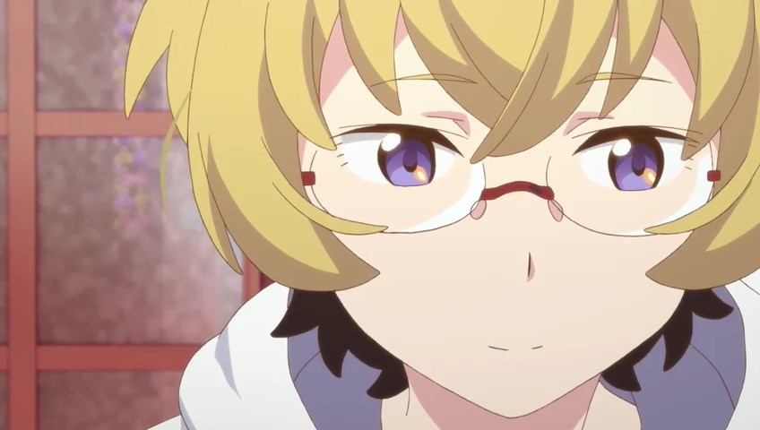

---
{
	title: "Punch Line : The Ani-TAY Review",
	published: "2015-06-25T18:30:00-04:00",
	tags: ["Rockmandash Reviews", "Punch Line", "Spring 2015", "AniTAY", "The Ani-TAY Review", "Review", "Tayclassic"],
	kinjaArticle: true
}
---

With a tagline of* “If he sees underwear, humanity will be destroyed!?”*, what would you expect? Well, Whatever you are thinking, throw it out of the window: With *Punch Line*, [Kotarou Uchikoshi](http://rockmandash12.kinja.com/rockmandash-reviews-infinity-zero-escape-marathon-w-1664979798#_ga=1.47325799.1523386611.1417386122) and MAPPA have made something that is totally different than what anyone would expect.

#### Solid Story

Plot summaries and first impressions can be quite inaccurate at times, completely misrepresenting the work that it’s supposed to represent, and *Punch Line* is probably the most extreme example of this that I have seen. From the source itself:

> *If he sees underwear, humanity will be destroyed!? An original anime series from the noitaminA block, PUNCH LINE centers on Yuta Iridatsu, a high school student, with a peculiar habit. When he sees a girl’s panties, he gets so excited he faints! After a certain incident with a ghost cat, his soul gets separated from his body. Using his special powers, Yuta watches the daily lives of the inhabitants of an apartment and sometimes plays tricks on them. Eventually, Yuta decides to unlock the secrets to why Earth will be destroyed and tries to save it!*

Given that, you would assume the show is about looking at panties, but it’s not. Written by Kotarou Uchikoshi of [*Zero Escape *](https://kotaku.com/why-zero-escape-virtues-last-reward-should-be-game-of-5972462)Fame,* Punch Line* starts out as this ecchi show but turns into a SciFi show about the world ending due to the Qmay group hurling an astroid into the earth with the members of the Korai house trying to stop them. Full of twists, character development and interesting elements like time travel and body switching, this show has a meaningful story and one that is well written, well executed and a joy to watch.

It’s executed like a lighter version of Uchikoshi’s works: it’s not super hard SciFi like in the Zero Escape and Infinity series (Probably due to time restraints, this is a 12 episode anime after all), with the SciFi being pretty much irrelevant and focusing on the characters and scenerio at hand (with the world ending and all) but like everything he’s done, it’s done really well, and his writing style really shines through. It creates a great sense of mystery and like his other works, it slowly unravels that mystery in a very satisfying way. Every scene, regardless of if it’s important or not is done pretty well, and it really ramps up the tension and action later on. It’s pretty great.

***

#### Punchy Visuals

If you only had a phrase to describe the visuals, the title of *Punch Line* is s surprisingly accurate way of describing how this show looks. Animated by Studio MAPPA (of [*Terror of Resonance*](https://anitay.kinja.com/terror-in-resonance-the-ani-tay-review-1640199423),* *[*GARO*](https://anitay.kinja.com/garo-the-animation-the-ani-tay-review-1695909572), and [*Rage of Bahamut *](https://anitay.kinja.com/rage-of-bahamut-genesis-the-ani-tay-review-1676327262)fame) with the character designs from Shouta Iwasaki (of [*Kill La Kill*](https://tay.kinja.com/kill-la-kill-the-ani-tay-review-1554090665) fame), this show looks pretty fantastic with a bright, punchy and engaging aesthetic design, combined with the fluid animation you would expect from MAPPA. The way that everything is rendered, the way that everything looks is pretty entertaining and the show is full of life, with great facial expressions and other aspects that add tons of character to the show. It’s a very fun to watch show, and the visuals are a big part of that.

***

#### Sound

While the opening of this show may be the single most flashy thing you’ll see this year, most of the music in *Punch Line* isn’t exactly that, with the music serving a supporting role. That being said, don’t let that make it sound like it’s a bad thing though, as this soundtrack does a great job at supporting the show, putting the viewer in the mood that the scenes dictate and they really help engage the viewer with the work. Whether it’s an upbeat scene or one that’s more somber, the music does a great job at fitting in, working well and just doing a good job at being a soundtrack.

***

#### **Puts a Smile on your Face**

*Punch Line* is a fun show: if you can get past a few things I’ll talk about later, it does pretty much everything it can to put a smile on your face, or keep you engaged with what it’s trying to do. From absolutely hilarious comedy (I particularly liked chiranosuke’s videos he was watching or the Strange Juice transformation scene in Ep1) to a really well rounded, developed and interesting cast, this show is a great experience to watch, one that will keep you entertained as you watch through it.\
\
Also, the small touches are nice too, and really help the story along: All the character’s names have puns in them, the references to Uchikoshi works are entertaining to those who know them (no pepsiman tho), and watching it a second time around is a really nice experience.

***

#### Iffy Pacing

Writing for a visual novel doesn’t always translate well to an anime, and *Punch Line*, along with *Fate/stay night: Unlimited Blade Works* really shows how Visual Novel adaptations (or at least VN writers writing an anime) struggle with serialization: VNs are meant to be marathoned, and Anime has to be broken up into pieces. Due to this fundamental difference in pacing the work, the pacing of this show was averages at best and frustrating at worst, and as good as Uchikoshi’s writing is, it doesn’t really help here. He likes to use the middle of his works with random events that build up clues later on, like a good majority of the scenes in *Ever 17*, but in anime form, this just led to filler episodes that were frankly, boring. This was a pretty annoying issue with the first half of the show, as they tried to change the show from the silly show that was episode one into the more character focused show it eventually became.

These pacing issues can take out most of the momentum that this has to viewers, and the fact that this is a serialized work makes it worse for those currently watching. *Punch Line *is a show where you actually need to know what was happening before hand due to how they progress with the plot, and a week off can throw you completely off on this. For the most part, the pacing of the story is livable, but it could have been better handled.

***

#### *Punch Line*’s Perversion

Even if the storyline isn’t just ecchi BS, *Punch Line *has a lot of fanservice, if you haven’t noticed yet. I really don’t know what to say here, to defend this or smash this, because it’s titillation for titillation’s sake, but they handle it in a way that makes it engaging and totally relevant to the story. While Punch Line gives out the vibe that this is the main premise of the show, and makes it comical to the point that it’s laughing at my feeble attempts to argue about it (like *Kill la Kill*), but it really only plays a role for 3 episodes, then surviving as an unnecessary plot point from there with relatively annoying panty shots all over the place.

The fact that the show even uses this gimmick is kinda annoying, considering that they don’t really do anything with it, treating it as a side thing that feels shoehorned in even though it’s supposed to be the main plot. Literally, if they changed one plot point, there would be no point in this at all... it’s frustrating. I totally get what they were going with here, trying to get you connected to the MC, as Yuta acted pretty prude whenever he saw them but I really felt like this show could have done without it and it may have been more enjoyable.

***

#### Smashing Expectations

While it does smash your expectations, you have to ask yourself if this is something that you are actually happy about. If you saw my [first impressions ](http://anitay.kinja.com/im-being-blown-away-by-punchline-1696875871)article, you would know that I fell in love with this show: I loved everything it was doing from doing subtle references back to Uchikoshi’s other works to the overall high octane energy that this show had, smashing my expectations that this would be nothing but a stupid ecchi show. Unfortunately, Punchline did not keep the absolutely absurd shenanigans that I loved from first episode, and it dropped down to a slump of slow character development into the typical Uchikoshi fare, but not as awesome. What they built up was an action-y, almost *FLCL* like show that’s so absurd that you can’t help but love it, but they went absolutely nowhere with it.

I was pretty exited to see another *FLCL*-like absurd show that does not give a single care about what people thought about it, but that’s not exactly what happened here. I was hoping that we’d get something totally different from Uchikoshi and he’d be able to walk the line between his typical works an the absurd show they showed in episode one, but that’s not what happened. The show we got was pretty good overall, being fun to watch for the most part, doing everything pretty well in general, but I wish the show tried to keep the absurd, action packed tone that the first episode has.

***

 

*Punch Line* is an odd show, acting like an ecchi show turned *Zero Escape: Lite*, taking everything Uchkoshi typically does well and watering it down to fit the type of show it is, but not at the same time. Of course, because it’s an Uchikoshi work the writing is as great as usual, it’s fun to go through and the plot is engaging, but there’s some core issues that may keep you from enjoying this show. Personally? I liked it for the most part, but was kinda disappointed in some aspects. Your mileage may vary.

#### Overall - 8.25/10, Polarization +1, -2.75

 

***

***Copyright Disclaimer:**** Under Title 17, Section 107 of United States Copyright law, reviews are protected under fair use. This is a review, and as such, all media used in this review is used for the sole purpose of review and commentary under the terms of fair use. All footage, music and images belong to the respective companies.*

*You can see all my reviews on *[*Rockmandash Reviews*](http://tay.kotaku.com/tag/rockmandash-reviews)* and the rest of my *[*Infinity & Zero Escape *](https://rockmandash12.kinja.com/rockmandash-reviews-infinity-zero-escape-marathon-w-1664979798)[*Marathon here*](https://rockmandash12.kinja.com/rockmandash-reviews-infinity-zero-escape-marathon-w-1664979798)*. For An explanation of my review system, *[*check this out*](http://tay.kotaku.com/rockmandash-rambles-an-explanation-on-my-review-system-1619265485)*.*

