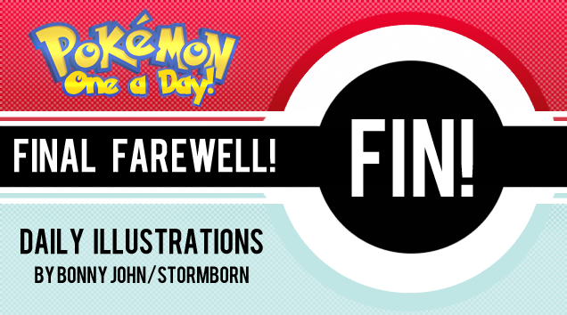

---
{
	title: "Question of the Day!",
	published: "2014-05-13T14:00:00-04:00",
	tags: ["QOTD", "Question of the day", "Rockmandash12"],
	kinjaArticle: true
}
---

[The Messiah is busy with school](https://messaika.kinja.com/cutting-lines-for-now-1574909721)(I kinda am too...), so I'll be covering the QoTD for today. Today... is a longer than usual.

###### [Cutting Lines (For Now)](https://messaika.kinja.com/cutting-lines-for-now-1574909721)

Hey guys, I'm not in the best of shapes when it comes to school and mood right now, so I won't…

[Read more](https://messaika.kinja.com/cutting-lines-for-now-1574909721)

You know, the TAY community is quite an impressive place.... We have amazing reviews, random facts, interesting opinions, etc, all coming in at a consistent rate (for the most part) from average joes that pump out quality equivalent to pro's for no monetary gain. Reading through [stormborn's post about the last Pokemon One a Day](https://tay.kinja.com/a-farewell-to-pokemon-one-a-day-thank-you-note-for-ta-1574915626) just made me absolutely shocked and amazed about the stories of the people behind the mask of the name and avatar, and got me curious on the reasons why prople create this content on TAY as the story of stormborn's post was just as interesting as the artwork itself. So, I ask of you... **Why do you do what you do on TAY?**

###### [A Farewell to Pokemon One a Day + Thank You Note for TAY](https://tay.kinja.com/a-farewell-to-pokemon-one-a-day-thank-you-note-for-ta-1574915626)

Before we get into the nitty gritty, I wanted to answer some questions as left by you guys from a…

[Read more](https://tay.kinja.com/a-farewell-to-pokemon-one-a-day-thank-you-note-for-ta-1574915626)

(Think of this as an extension to [Thursday's QoTD](https://tay.kinja.com/question-of-the-day-1573374553), which was essentially What are your reasons for being on TAY. Also, while I'm targeting content creators on TAY who makes articles and stuff, I don't want to alienate people who are just commenting and such, so a backup question is: How did you get on TAY?)

###### [Question of the Day!](https://tay.kinja.com/question-of-the-day-1573374553)

What is your "true" purpose here at TAY?

[Read more](https://tay.kinja.com/question-of-the-day-1573374553)

I'm on TAY for 2 reasons:

1\. I was looking for a gaming/anime community

2\. To post reviews on Tay.

Time for elaboration! 1. isn't really answering the question, but i'll tell why anyways: it's because my gaming community was (and is) on the decline, and I didn't know of any anime community I liked before I found TAY. Tay was a perfect little place for me :D

The reason why I write reviews on TAY was because I saw Dex's reviews and I was surprised by how many views it was getting, and I was fed up with YouTube's low view count and Content ID BS. To answer the question, I'll need to explain why I even write reviews in the first place, as I was writing them before I started TAY.

This story starts sometime about a year ago. I was one of those nerdy asian kids in school with good grades, but I was depressed. Family issues, social issues at school, etc. Games were a way of getting out of this conflict... But it led to a entirely new psychological battle: do I focus on school work but have a relatively unstable mental state of health but amazing grades, or do I focus on playing video games and watch as my grades drop? You see, I'm a person who always feels determined to do something, and I prioritize getting the feeling of achivement at all times. Video games was a way to relax, but it was also a way to get a false sence of achivement... meaning I'd be doing nothing but games. I had a hard time trying to balance the two, and it was becoming a huge problem for me. Then, I started to play visual novels thanks to a friend. I played through 999 and Ever 17.... But then saw that nobody was talking about Ever 17 and there was next to no reviews of it.I wanted to get my thoughts out... I wrote a review of it, and posted onto YouTube. It gave me the feeling of achievement, but more importantly, it helped bridge the gap between my two situations. Writing was critical thinking, and it helped me in essay writing, but the biggest thing was that it felt like school, so it was and is easy to go back and forth between focusing on school, and playing games.... And it helped spread the word. It's fun to write reviews, it helps give me the feeling of achievement, it helped me sort the psychological battle in my priorities, it taught me many skills that I was weak at, it helps spread the word, it helps convincing people to give it a shot, it helps me continue to be productive when I have downtime, and I feel like I'm a better person for it (plus my grades are still pretty good :D).

I thank you guys for reading my articles, being some of the nicest, most supportive people on the internet, helping people when in a rut, and being awesome.

Thank you.