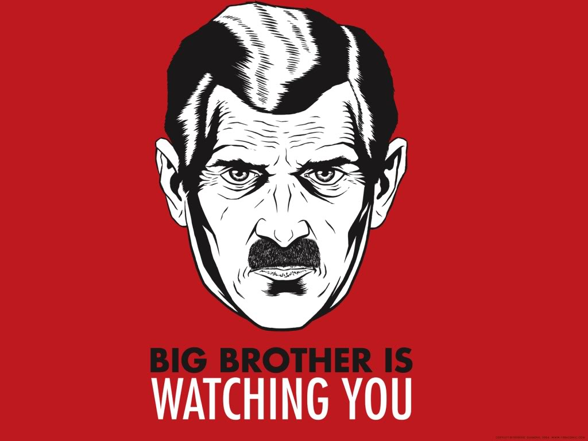
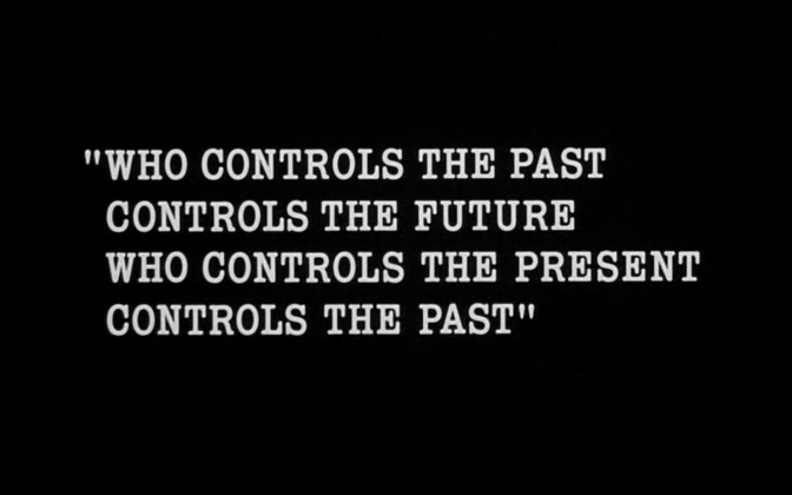
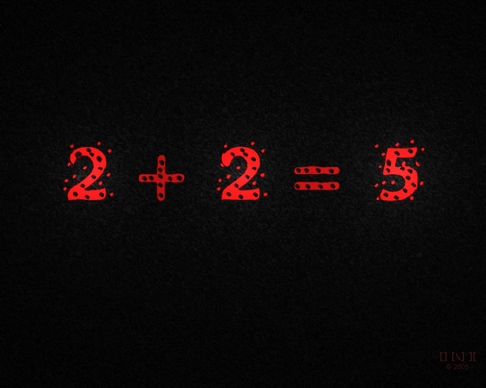
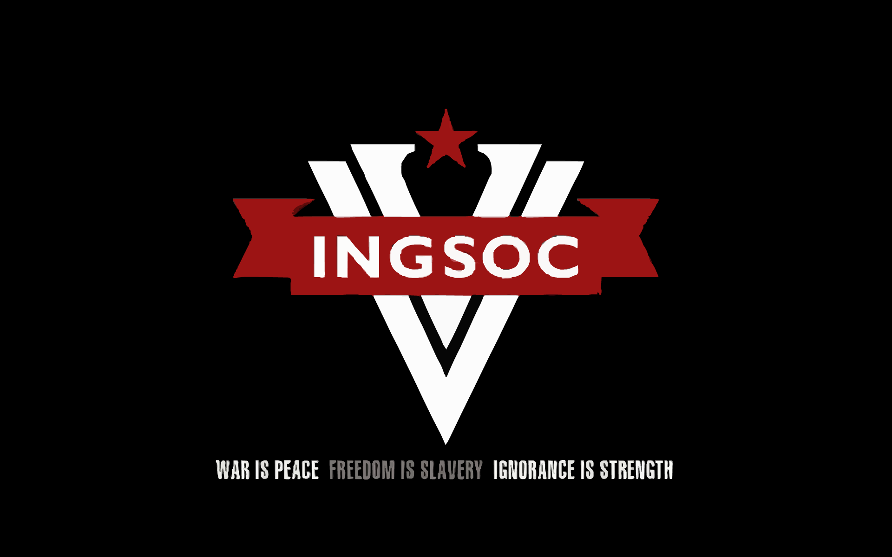
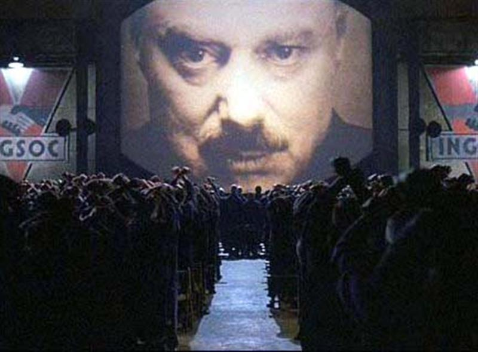

---
{
	title: "1984 Review",
	published: "2014-11-17T20:05:00-05:00",
	tags: ["Rockmandash Rambles", "TAY-Classic", "1984"],
	kinjaArticle: true
}
---

In my english class, I had the opportunity to re-read one of my favorite books, 1984. I got an assignment that stated that I had to do a speech in newspeak, the fake language in the story... so I sat there trying to figure out what I'd write, until I came up with the brilliant idea that I would do a review of 1984. How meta! I decided I'd post this anyways if anybody was interested, sorry if this is a bit different than usual.

### Oldspeak (English)

How should people be governed? This is a question that has been lingering in the minds of people for hundreds of years, and as we search for the perfect utopia, we need to acknowledge the potential pitfalls, and the mistakes we have made. 1984 by George Orwell is a dark, unforgiving story that serves as a message about the future, but also a tale of the past.

1984 is a story that tells the horrors of a totalitarian government, one that maintains stability via oppression. It follows Winston Smith, a party member who revises history, but dreams of overturning the party and rebels against big brother. Winston fails at this, and is tortured to believe in everything he opposed, eventually saying he loves big brother. The book was engineered to show the horrors of its dystopian world, with every bit of it helping to work towards that goal. The concepts that this story approaches like the socialism/communism, surveillance state, doublethink, adoration of a political leader, and control of government each serve a purpose and influence your thoughts in a way, but seeing all of these accumulate into one story is something that blows me away. Even the name 1984 adds to this message by serving to emphasize that the world of 1984 is a possibility that could happen, and would happen soon. Considering that the year is after 1984, and we don't live in an Orwellian nightmare, Orwell was wrong. That being said though, the fact that he was wrong enables us to see what this book does right.

One of my favorite aspects of 1984 is how it builds its world; it creates this hopeless and well developed world by creating lore to add the atmosphere of the story, adding things that you wouldn't even expect, and explaining everything you would ever want to know about the world, which all help to immerse you into the story that Orwell created. It even has newspeak: a fake language which isn't really that important to the story, but helps immersion. The world in 1984 is so well crafted that I cannot help but be fascinated by it and admire it.

1984 takes from your perceived notions of these ideals and amplifies them. Due to the fact that you already know about most of these ideals from history or being alive at the time, and have an opinion on the ideas of totalitarianism, surveillance states, and all the other themes that run in 1984, the book serves to manipulate and amplify those opinions you have on the subjects. The way that it makes you feel, the way that it makes you think is amazing: The world of despair and the feelings of oppression and lack of freedom is something that I admire, and it's rare to see a work that makes one fear for the future as much as 1984 does. 1984 is written so well and left so much impact that when describing anything that represents the world in 1984, people use the adjective Orwellian. The best part about this? 1984 doesn't do much fear mongering like modern TV news; it just tells the story of Winston Smith, along with his thoughts. What you fear is your reactions to the ideas thrown in the book, and it's a great example of what a satire should aim to do. It makes you think, and very few books I have read has made me think so much about the world around us, about the history of the past, and the way we even think about our viewpoints. It's a well written story in general, as the way the concepts are presented in the story keep you hooked, and most of the aspects of the story are executed in a way one would find engaging. One may not like the unforgiving execution of the story, but one should at least admire how well it's done.

Due to the interesting concepts, wonderful world, and an interesting premise, reading 1984 is a thrilling experience. The tension and tone utilized in this story create a sense of morbid mystery, and because the pacing was great, the story never felt boring or dull, and never once did I think it was poorly written or had a plot hole; it's so well written that I as completely absorbed into the story, and when it executed it's darker aspects, it rung me out of hope, which I loved due to the execution. Also, due to how thought provoking the story is, re-reading it is just as interesting as the first, as it'll always get you thinking in a different way. 1984 is done extremely well and is a great read: I had a blast reading it, and I hope you did too.

1984 is a book that I love, and it's one of my favorites. It's a story that is entertaining and is extremely thought provoking which all add up to a great experience, and it's one that I find to be one the best out there.

### Newspeak

How should persons governwise. Thisthink persons hundreds years. Search utopia, need accept future mistakes, mistaked. 1984 Orwell plusunlight story message taled.

1984 story doubleplusungood party stable via uncrimethink. Winston Smith minitrue but crimethink BB. Winston undo, miniluv, luv BB, Book made show doubleplusungood world every help. Concepts ingsoc, uncrimethinks, doublethink, control, BB, serve purpose effect. Gather one story doubleplusgood. Name 1984 emphasize: can happen, will happen. Consider after 1984, undo uncrimethink world, Orwell unright. He unright enable us see book right.

Favorite 1984 build world; doubleplusungood developed world by lore, add unexpect, explain all want, to doubleplusinvolve story. Even newspeak help. 1984 doubleplusgood, doublepluslike.

1984 take opinion doubleplusnincrease. Already know, opinion oldthink 1984 pluschange. Influence doubleplusgood: world doubleplusungood feel doubleplusuncrimespeak and lack crimespeak is doubleplusgood, unbrave future. 1984 so doubleplusgood, describe like 1984, Orwellian. Unfear monger telescreen; story Winston Smith thought. Unbrave reactions, plusgood example satire. Book doubleplusthink, few books plusthink. Plusgood, most engage, concepts help. One may unlike, but admire.

Due plusconcepts, doubleplusworld, pluspremise, read 1984 thrill. Tension tone plusungood mystery, pluspacing story excite. Never think ungood: absorbed story. Unlight take hope, I doublepluslike execute. Also reread interest, unsamethink way. 1984 doubleplusgood plusread: I like read, hope you likeread.

I 1984 doublepluslike. Plusentertain doubleplusthink, plusexperience.