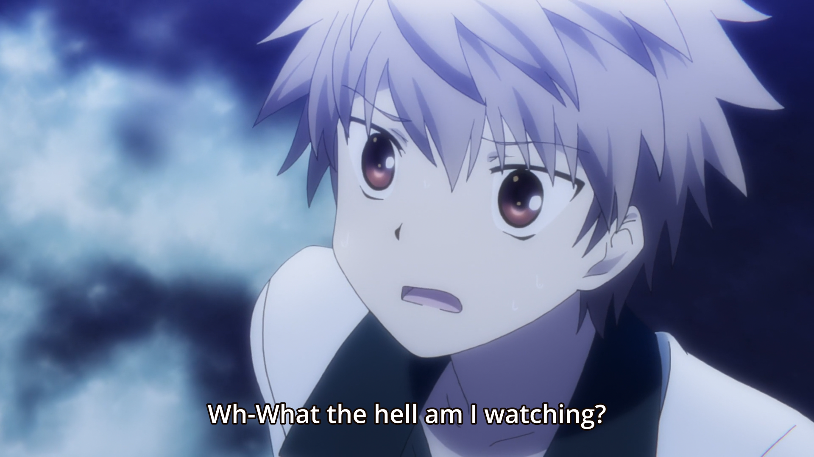
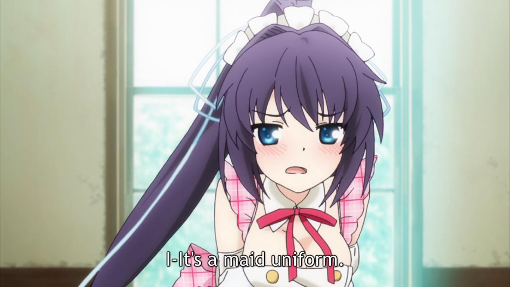
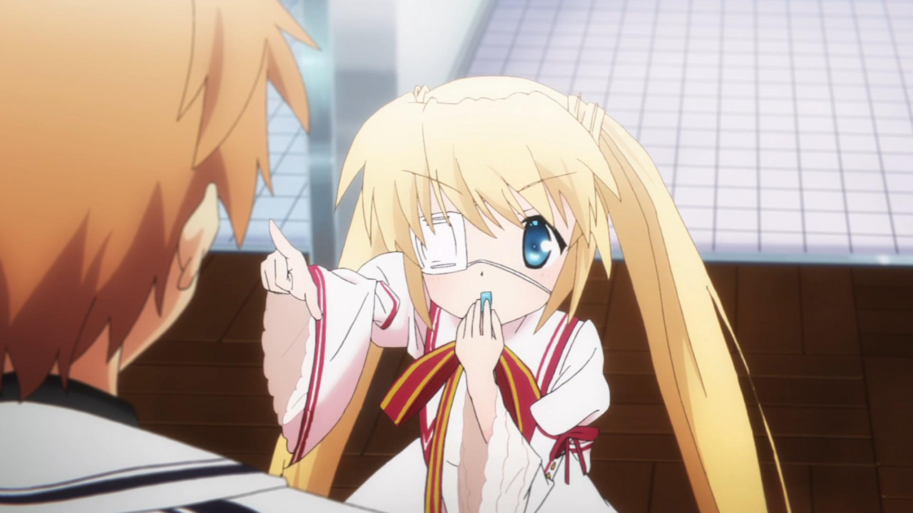
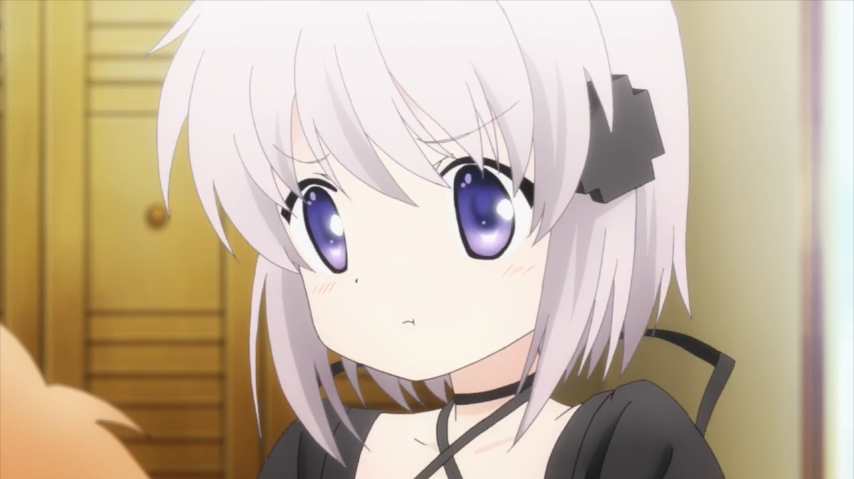
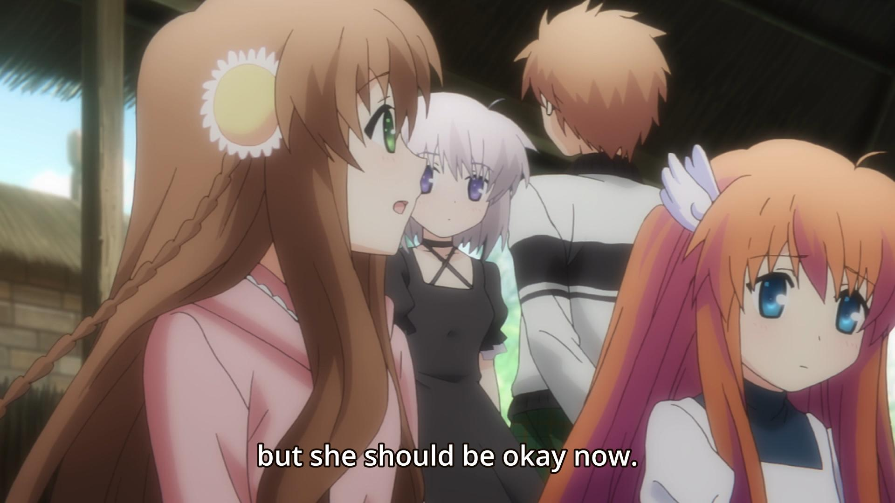
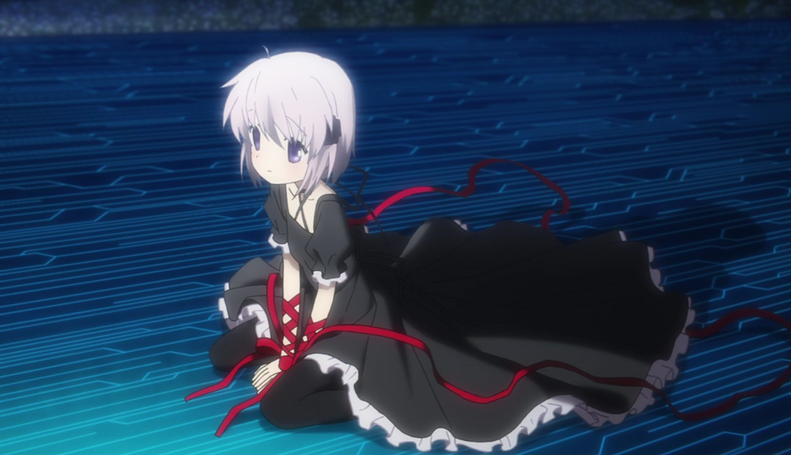
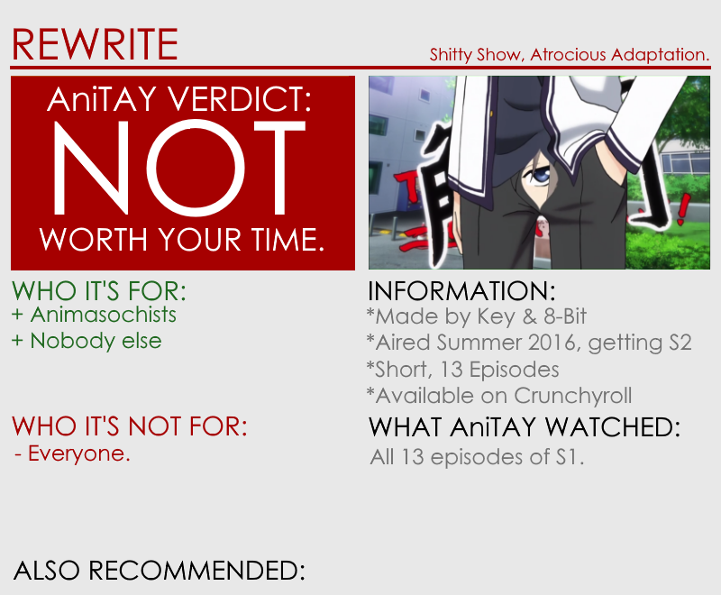

---
{
	title: "Rewrite : The AniTAY Review",
	published: "2016-10-06T15:45:00-04:00",
	tags: ["AniTay", "The Ani-TAY Review", "Key Marathon", "Key", "Rewrite", "Visual novels", "Visual Novel", "RockmanDash Reviews"],
	kinjaArticle: true
}
---

I love Key works as much as the next person, but unfortunately for me, that love can easily lead to fear. Hearing about the fan favorite Visual Novel *Rewrite *getting an adaptation is just one example of why: instead of cheering, [*I was praying*](https://puu.sh/rx9uV/17e17ef72f.png). Adapting any work into a new medium can be hard, but *Rewrite *is no ordinary work... it’s a Key Visual Novel. Thanks to a convoluted story structure and 8-Bit’s terrible adaptation skills, my fears were realized as the *Rewrite* anime became a checklist of everything that can go wrong, a work that fails to appeal to fans and newcomers alike.

***\*This is a review of the 2016 Anime adapted by 8-Bit. If you’re interested in a review of the Visual Novel, ***[****check out my review here****](http://rockmandash12.kinja.com/rockmandash-reviews-rewrite-visual-novel-1609445042)***\****

***

#### The Root of *Rewrite*

Regardless of the quality of the adaptation, there are aspects to a story that are nearly impossible to ruin (unless they completely change the work in a way that it becomes unrecognizable from the original). Those aspects would be the core of the work, the premise, and the assets that originate from the source (like character design). Luckily, in this adaptation these aspects are maintained for the most part, and because of these aspects, the show isn’t the worst thing ever to watch and individual episodes can be interesting to watch, but taken as a whole Rewrite is not great. FYI, the story of *Rewrite *follows our protagonist Kotarou, who lives an average life in the environmental conscious Kazamatsuri, a city that is a forerunner in ecological studies. He lives a normal life for the most part, until Kotarou decides to make the occult research society go into the forest looking for unidentified mysterious animals. Instead of UMAs however, Kotarou finds himself in the middle of a conspiratorial conflict and with a weird power. Unknown to most, there is an underground war between 2 factions fighting for a way to save the earth: the Superhumans known as Guardian, and the Summoners known as Gaia. These factions are rather interesting, with very different goals and ideals, which makes watching this conflict unravel intriguing. Unfortunately, the story was way too ambitious, something that carries over from the source material. If the source was too ambitious… just imagine how a bad adaptation would handle that….

***Rewritten into Randomness***

…. And you get an adaptation that is a failure, a pain to watch. Visual Novels are a fundamentally different medium than Anime, and even if you have aspects hat work well in a Visual Novel, they don’t necessarily work well in anime. Just to give you some idea about how they differ: In Visual novels, sometimes you have to repeat aspects of the work over and over again while anime is linear, visual novels aren’t serialized while anime is, the pace is much slower in VNs in comparison to anime, VNs are a lot more information dense, they’re less sensitive to time, etc... even the story structure can even screw things up. In even the best of times, Visual Novel adaptations can be rough, making hard decisions that drastically change the story experience like *Clannad*, but in the worst of times they can be incoherent, nonsensical, and impossible to enjoy.

*Rewrite *is that kind of adaptation, one that has to make drastic changes to make the adaptation work, but does it in a way that is near impossible to enjoy. Not just for a VN fan like me, but for anyone, newcomers alike ([Just take this reddit post comparing *Rewrite *to *Bananya *of all things](https://www.reddit.com/r/anime/comments/4s4wwj/discussionspoilers_bananya_has_better/)). It was limited by time (it went through the core of the story in 13 episodes, the Visual Novel is one of the longest in the market), one that selected parts and arranged them in a way that was impossible to make any sense out of, and it was just plain boring.

The primary reason? Poor handling of the Common Route, or the existence of the Common Route by itself. Visual Novels have this thing called a common route, an intersection that all routes branch off of, and it’s almost all slice of life, getting to know the cast before you go into their personal story. This anime was doing common route for more than half of the first season, but it still had to cut a lot of material due to the length of the original and you can feel it: developments are contrived, characters feel flat, you don’t understand any of the relationships between the characters, the scenes become boring due to the combination of all of these aspects, etc. You can’t really rush slice of life while keeping it interesting, by truncating the story you do not have the time to demonstrate average life, context of the characters, or the time to get to know them. They could have made this work by completely overhauling the common route until it barely represented what we saw in the VN, putting the enjoyment of the work itself over the accuracy of the adaptation, but that didn’t happen.

The situation with *Rewrite* is made worse given the structure of the Visual Novel: From my Visual Novel Review:

> *Rewrite is Key’s longest visual novel to date: It has a total of 7 routes, with each having a very different writing style due to them having different authors.*

This means that every aspect of the story is fragmented. In a visual Novel, this can work because in every time you play the game, you experience different routes where the events on one have no relationship to another... meaning different writing styles can work. I’d argue it felt fragmented even there, but in anime form…. yikes. An anime cannot be fragmented, it’s a linear story that must flow cohesively: everything has a cause and effect in an anime to make sense. While they had the main writer to try to make this work, this was a puzzle too complicated to solve. They pulled parts from common route, parts from other routes and mashed them together in a way that makes plot points feel arbitrary, makes developments boring, and makes it impossible to follow the story. It was basically a nightmare.

Changes are not necessarily bad, if they can make the work more enjoyable, than good for them! I actually really enjoyed some of the changes (like giving Kagari a personality… until they used it as a joke until it was stale and made me regret ever liking it). Honestly, giving the original writer a role in this rewrite may have been a big mistake, as they would want to maintain the story as much as possible. For a variety of reasons, there are many aspects of this work that don’t really work well in anime form, and they will never really work well. An adaptation first and formost needs to be its own work, needs stand by itself, regardless of how the source material differs from the intended medium. One cannot get a free pass because an adaptation is hard, and *Rewrite *certainly does not. The way they handled the story was a mess, and* this is without getting into the changes that pissed off the fans. *(What I have to say about that is that we’ll get those changes in the form of *Rewrite+*, and this is more an adaptation of that instead of the current *Rewrite* available on the internet.) It was not enjoyable to watch, and taken as a whole, it doesn’t fit into the medium. It’s another case of a poor adaptation, and those who have seen it had to suffer through some horrible stuff. Speaking of horrible…

#### **What Production Values?**

….8-Bit and their production Values! 8-bit is the animation studio that adapted *Rewrite*, and they’re primarily known for (to fans at least) making terrible adaptations, killing the dreams of a good version for anime fans. Just look at what resident AniTAY’er Fatalis [*had to say about their adaptation of *Grisaia**](http://anitay.kinja.com/grisaia-no-kajitsu-the-anime-you-should-not-be-watchin-1651115065)! Yeah… not great. *Rewrite* managed to be somehow worse than *Grisaia* though, because while the story of grisaia was butchered, at least there they didn’t have massive production issues. This show screams budget. While it’s passable for the most part, the visuals look cheap, the CGI used looks like trash, and later on in the show they had massive production issues that lead to off model characters, garbage animation, etc… it looked something out of *Shirobako’s Jiggly Jiggly Heaven. *It was not pretty, and is inexcusable given the era we live in, where this has to compete with media of all types. Hell, the original source looked great… Rewrite, in the grand scheme of things, is sa relatively new VN. Made in 2012, it was Key’s first VN into the widescreen HD world, and one of the first HD VNs in general. It had more than just technical aspects to its name however, as it was a great looking visual novel with a great and consistent art direction, excruciatingly detailed artwork with plenty of care put into it. If you ask me, even today’ it’s one of the best looking Visual Novels I’ve ever played. Yet, in 2016, thanks to the (lack of) efforts by 8 bit, we have none of this, leading to the worst looking anime I’ve seen all year, maybe some of the worst ever. Major QC issues here, and it’s incredibly irritating.

#### **The Same Soundtrack, for better or worse**

I’d like to say that even the soundtrack wasn’t spared in the massacre of *Rewrite*, but while that would sound great, it’s not the case, for better or for worse. In my Visual Novel review of *Rewrite*, I stated

> *It’s one of the best soundtracks Key has ever made and one of the best I’ve listened to.*

And I still stand by that! The anime didn’t change the soundtrack for the worse, but... *they didn’t change the soundtrack. *It sounds as great as it did back then, with the soothing and calm piano, the tranquility that perfectly captures the setting... but while I really enjoyed hearing all these tracks once again... anime is anime, not a VN, a fundamentally different medium. A score needs to be able to manipulate emotion, needs to create an atmosphere, etc. and a key part of this is how you use the score. In a VN, this can be done via BGM music, music that constantly plays in the background as you read, but an anime can’t just sloppily put a track on. They need to make a soundtrack work with the scenes that they have, and I can’t argue at all that they did this... really at all. Listening to the score by itself, it’s a wonderful and moving score, but the anime did nothing with it, squandering one of the best that it has to offer. I’m glad it wasn’t mutilated, but it wasn’t handled well either.

#### **The best for… not here.**

Remember that quote from my VN review earlier, stating that the VN has 7 routes? It’s not done adapting the routes! What this anime adapted was a unholy abomination of the first 5, leaving the last routes, Moon and Terra untouched. While you may argue this is good news, what it means for the anime at the moment is that it ended off on a cliffhanger that doesn’t make sense, and the part I would argue is the reason for playing *Rewrite*, is nowhere to be seen. This leaves the current anime a mediocre mess of a show that has little redeemable value for most. Hopefully that can get a solid adaptation considering those 2 are linear in nature, I don’t really expect much given this anime. If you’re interested, your time would probably be better spent playing the source (that’s coming to the west officially as *Rewrite+*) instead of hoping for something out of 8 Bit. (Though, the adaptations of the 2nd and 3rd parts of Grisaia weren’t too horrible, so you might be pleasantly surprised).

*Rewrite* is another case of a bad adaptation. The story sucks, the music is used horribly, the animation has major QC issues, and worst of all, it’s boring to watch. There is no reason to watch this anime, an adaptation is first and foremost a work by itself, and this fails at that. There’s nothing here for fans, and there’s nothing here for newcomers, all that’s left is a broken premise. The only people who should even consider this are people who are curious about the changes to the story, and even then they can get the story better in other ways. This is not worth your time, and do not watch this anime.

***

*You’re reading Ani-TAY, the anime-focused portion of Kotaku’s community-run blog, Talk Amongst Yourselves. Ani-TAY is a non-professional blog whose writers love everything anime related. Click *[*here*](http://anitay.kinja.com/)* to check us out. If you want to read more of my writing, check out *[*RockmanDash Reviews*](http://rockmandash12.kinja.com/)* and *[*KMTech*](http://kmtech.kinja.com/)*.*
