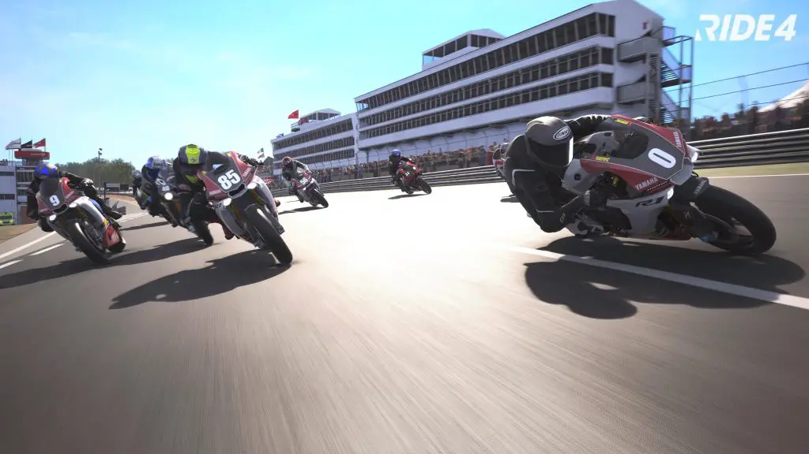
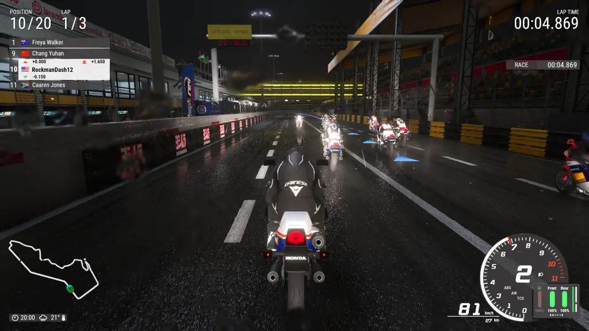
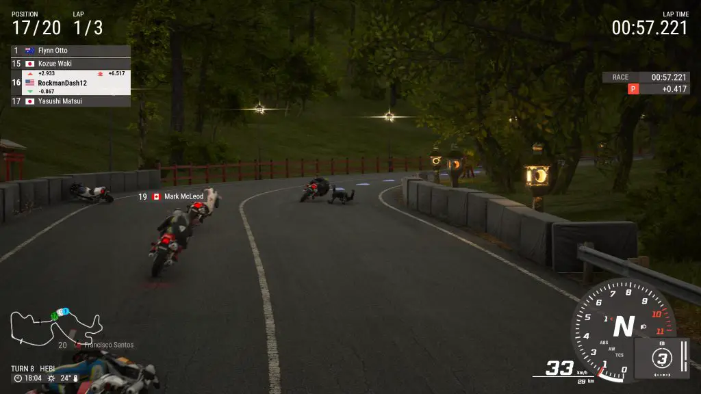
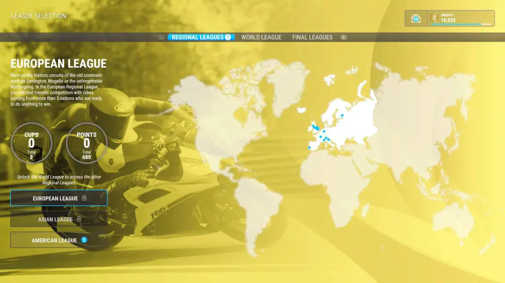
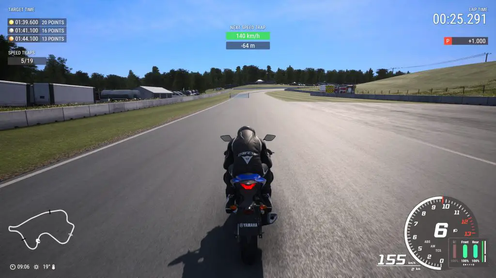
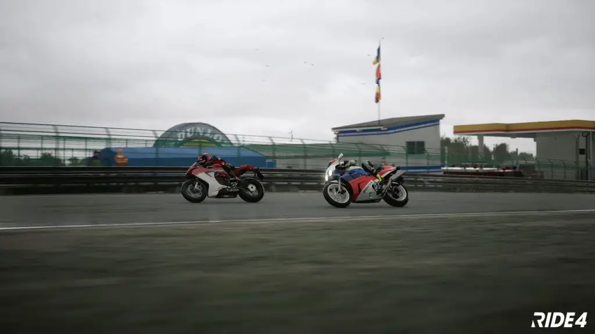

---
{
  title: "Ride 4 PS5/Xbox Series X Review – Wiped Out",
  published: "2021-01-21T00:02:11-08:00",
  originalLink: "https://noisypixel.net/ride-4-review-ps5-xbox-series-x/",
}
---

We have so many car racing games available but rarely do we get said racing games for other kinds of vehicles. What about motorcycle enthusiasts who want the Forza and Gran Turismo experience? Well, _Ride 4_ by Milestone attempts to a premiere racing sim in the genre, and while it might be a great simulator, it’s not a good racing experience. Further, Ride 4 is quite possibly the least beginner-friendly game I’ve ever played and easily one of my least favorite racing games, period.

Let’s get the positives out of the way – If you are a fan of the series and love racing simulators, there’s a lot here that you might enjoy. The motorcycles are highly detailed, and there is a large variety of them. There are tons of options, and the racing physics are superb. The actual handling of the bikes is fairly satisfying, as controls are tight and responsive. That being said, the game makes me think analog sticks aren’t nearly precise enough because it was hard to make fine adjustments – when I attempted to ride exactly on the racing line, I often just flung into a wall.

If you’re wondering what the PS5 version is like, the improvements are appreciated. Ride 4 is a great demonstration of the adaptive triggers: the resistance and vibrations add a lot to the immersion, making the throttle feel more like a throttle and adding a layer of refinement to the act of breaking. As for performance, _Ride 4_ runs a dynamic 4k resolution at 60 fps and stays sharp and fluid during gameplay. So, if you’re a fan of the series and are here to wonder if the PS5 version is a worthwhile improvement, it indeed is.

However, video game visuals are more than just resolution and model quality. Lighting, atmosphere, effects, UI: these elements all play into one’s enjoyment of the presentation, and Ride 4 puts minimal effort into these. There’s a bland aesthetic reminiscent of _Gran Turismo 5_ on PS3 regarding all of these and it makes the game feel woefully behind current generation games in that regard.

The visuals don’t improve the user experience, with the day and the night races not looking inspired at all. Weather is implemented lazily, with lazy rain effects showing up as water droplets on the screen in 3rd person mode, obscuring your vision. The night lights of the Macau stage for example appear static, just added to the soulless stage presentation. Legitimately, this game has so little character that I’d rather play something like the 92 arcade racing game* Virtua Racing* simply because it has more charm and character than the aesthetics of _Ride 4_.

When it comes to actual gameplay, I want to preface this section by saying that I can only judge a game based on my experiences as a reviewer. I am not a diehard racing sim enthusiast, and this is my first time playing an entry of this series. What I discovered is that Ride 4 doesn’t have a difficulty curve but instead a difficulty wall. From the very beginning, this game is sink-or-swim. You’re straight into a trial lap without any tutorials. When your motorcycle inevitably hits the grass, your lap becomes invalid, forcing you to restart the trial lap and unable to do anything until you’re able to complete a lap.

And that’s just the beginning. The bulk of the pain is how your driver seems to fly off the motorcycle at the smallest bump. Hit the curve, wipe out, brush against the wall or another racer, and you go flying. You seemingly get penalized for everything, and every setting is brutally difficult. Even with AI on easy and every driver assist option on, good luck placing anywhere but last. If you make the slightest mistake in a race, you’ll be hurled from first to last, and you’ll probably stay there.

If that wasn’t enough, let’s address the AI. Milestone advertises their AI as “A revolutionary AI system based on neural networks and machine learning,” I would like to tell Milestone that just because you use fancy new technology with cool buzzwords does not mean that it is good. The AI might be driving with ideal lines in a realistic time, but they always stay in a pack, and they act like you don’t exist: none of them will ever put any effort into trying to avoid you.

So, from the user’s perspective, you’ll frequently find that you’ll get wiped out at no fault of your own. Remember, you do anything, and the whole pack will pass you instantly, so this effectively means you have to restart the race. Even on the easy setting,  the AI drives basically perfectly – the difficulty only adjusts their level of aggression. Fun.

I’d love to tell you all sorts of things about the late stages of the career mode, but I could not get that far. You cannot pick and choose events- it is sequential, so if you get stuck at any event in career mode, you do not get to play anything else. Also, random assist features are locked out for certain events for no good reason: if you rely on the racing line or rewind feature to progress, sometimes you just don’t have it.

There is no thought to game balancing. It’s like the devs never thought that anyone other than diehard racing sim enthusiasts would buy their game. Ride 4 wants you to play it in a specific perfect way and gives you zero tolerance for error. These penalties end up preventing you from progressing and playing more of the game.

Let me give you an example of my experience: the 2nd event in career mode requires you to finish a lap given a certain time while hitting tiny speed traps. If you miss those speed traps, you’ll be penalized. While this sounds simple, this forces you to do 3 things: 1. Go at their speed at all times because you’ll be penalized for missing the speed traps 2. Ensure that you are driving their way because if you are not driving in the racing lines, they won’t show you, then you’ll miss the speed traps 3. Do all of this while hitting an extremely unrealistic overall time.

If you’re even seconds off, good luck moving on because the bike you start with is extremely slow, and you’re not going to get the time unless you finish the lap without any penalties. This, all ignoring the random penalties the game will give you if you accidentally veer off course or take a corner too aggressively. None of these requirements individually are that bad, but when put together, the experience becomes hell, and let me remind you that this is the 2nd event in career mode. I spent an hour or two trying to finish this, gave up, and stopped playing.

Ride 4 is not the must-own motorcycle racing game for your brand new PS5 due to its high barrier of entry and non-user friendly systems. The PS5 upgrades might be appreciated by returning fans of the last-gen version, but it doesn’t warrant the headache these races induce on the player. From my experience, I was locked out of any fun this game might have offered. As such, I really can’t recommend Ride 4 to anyone.
