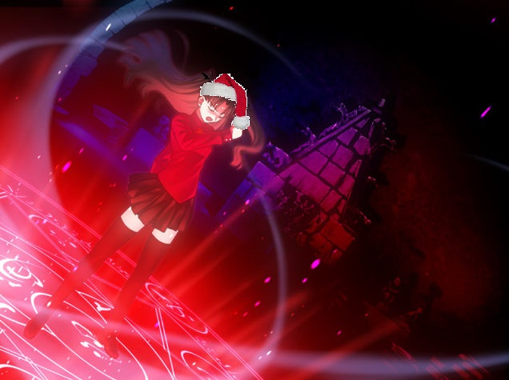

---
{
  title: "Rockmandash12's 2014 Gift Guide",
  tags: ["Secret Santa 2014"],
  published: "2014-11-14T20:28:00-05:00",
  attached: [],
  license: "cc-by-4",
  oldArticle: true,
}
---

 ^Thanks Morie for the photoshop :P    Hello TAYvians! This is my first time
  participating in TAY's secret santa, but I'm looking forward to it!

 Here's what I would
  really like (you can get pretty much anything gaming/anime related tho):

  Anime/Manga, and the respective merch if you can. I really don't have a lot of physical Anime stuff, mainly because I
  can't afford a lot of it. Pretty much anything I've talked about and liked is fair game. I'd really appreciate a copy
  of Clannad: After Story, Welcome to the NHK, and The World God Only Knows as that's what I've been saving up for.

Edit - A copy of serial experiments lain would be nice.    VN's: I talk a lot
  about VN's, but I only have 3 physicals: the Zero Escape series, and Steins;Gate. A physical VN would make me really
  really happy. Also, I still haven't gotten planetarian on steam yet, so I'd be pretty happy with that too.

 Vita games: I LOVE the Vita, but I just don't have any games for it. All my games for it
  are PS+ games, indies, P4G or Ys. RPGs and quirky japanese games would be appreciated.

Favorite game series: Zero Escape. I'm a pretty big fan of
  sonic, megaman, and a ton of VN series I've gushed about. 

Systems I Own: PSP, Vita, GBC, GBA, DS, 3DS, SNES, N64, Gamecube, Wii, Genesis,
  Dreamcast, &amp; PS1-PS3,

Games I typically play: I'm not really into AAA and tend
  to prefer japanese developed games. I prefer handhelds RPG (Action prefered. Nothing too grind heavy... :/) Racing
   Platformers (3D preferred) Anything Nintendo VN's (.... Yeah... I'm pretty sure you knew this by now) Puzzle Indie
  games

 Shirt Size: Large

Figurines: Cool, but not a
  priority atm

