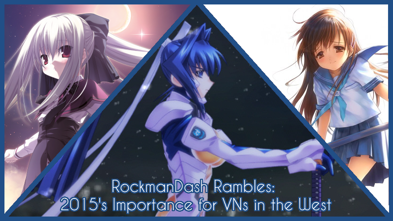
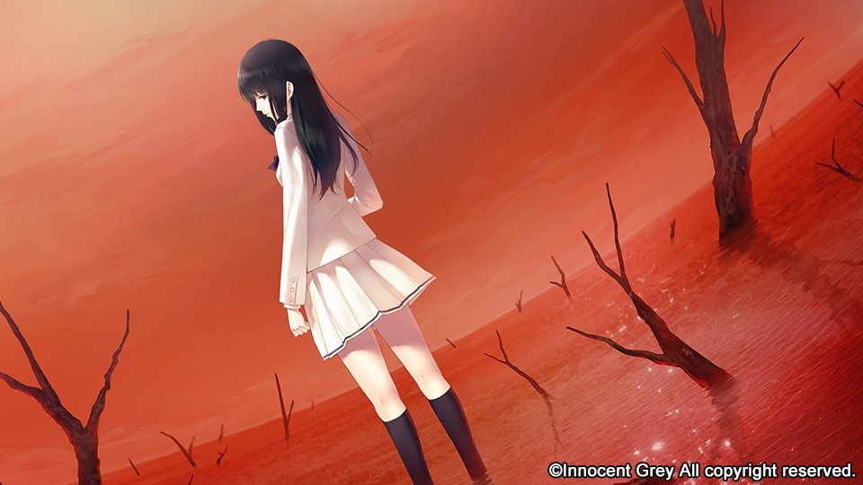
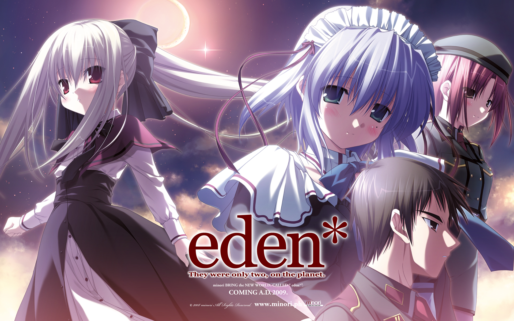
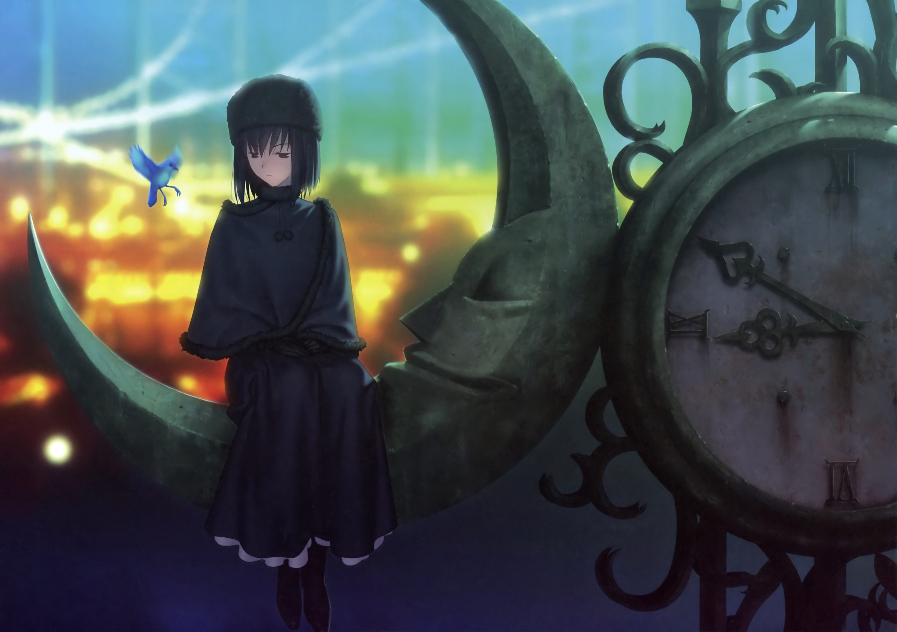
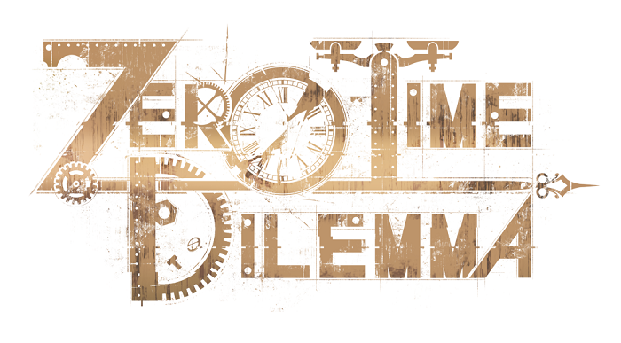

---
{
title: "RockmanDash Rambles - 2015's Importance for Visual Novels in the West",
tags: ["Rockmandash Rambles", "Rockmandash12", "Visual Novels", "Opinion", "2015", "West", "Localization"],
authors: ['reikaze'],
published: '2015-12-29T23:13:49-05:00',
attached: [],
license: 'cc-by-4',
oldArticle: true
}
---

It’s the end of 2015, and of course, like everyone, I’ve been reminiscing about
  what occurred over the year, thinking about making lists like everyone else and like I did with anime, but when I was
  thinking about visual novels, I about how much that happened this year. It’s an exciting time to be a fan of visual
  novels, so what better time is there to reminence about the recent past than now? Welcome to Rockmandash Rambles, and
  today, I’m going to talk about how this year has been huge for visual novels.

Also, For those who would
  rather watch a video, here is my video version: 

<iframe allow="accelerometer; autoplay; clipboard-write; encrypted-media; gyroscope; picture-in-picture" allowfullscreen="" frameborder="0" height="315" src="https://www.youtube.com/embed/O2pEFkctktY" width="560"></iframe>

This story really starts last year, where Sekai Project came out of nowhere and
  started grabbing partnerships and licensing of many well known Visual novels. They took the industry by storm - while
  Mangagamer was minding their own business and staying rather obscure while doing it, and JAST was.. doing nothing,
  Sekai Project did a really did a great job in getting the name of visual novels out in the west. While a lot of the
  VNs that came out recently in the west have been gags, these gag visual novels helped propel the genre into the
  awareness of the gaming community became a known genre in the west when before they really were not. This year, we saw
  the effects of this - Sekai Project proved to Japan that the western market is viable by actually you know, releasing
  stuff because of that, we got tons of great VNs, many of them being the biggest in the genre - stuff like <a class="sc-1out364-0 hMndXN sc-145m8ut-0 gIacKn js_link" data-ga='[["Embedded Url","External link","http://rockmandash12.kinja.com/rockmandash-reviews-grisaia-no-kaijitsu-visual-novel-1724385399",{"metric25":1}]]' href="http://rockmandash12.kinja.com/rockmandash-reviews-grisaia-no-kaijitsu-visual-novel-1724385399" rel="noopener noreferrer" target="_blank"><em>Grisaia</em></a><em>, </em><a class="sc-1out364-0 hMndXN sc-145m8ut-0 gIacKn js_link" data-ga='[["Embedded Url","External link","http://rockmandash12.kinja.com/g-senjou-no-maou-the-tay-review-1524540625?rev=1447751044655#_ga=1.78595869.888615642.1438970662",{"metric25":1}]]' href="http://rockmandash12.kinja.com/g-senjou-no-maou-the-tay-review-1524540625?rev=1447751044655#_ga=1.78595869.888615642.1438970662" rel="noopener noreferrer" target="_blank"><em>G-Senjou no Maou</em></a><em>, </em><a class="sc-1out364-0 hMndXN sc-145m8ut-0 gIacKn js_link" data-ga='[["Embedded Url","External link","http://rockmandash12.kinja.com/rockmandash-reviews-clannad-visual-novel-anime-1609437459",{"metric25":1}]]' href="http://rockmandash12.kinja.com/rockmandash-reviews-clannad-visual-novel-anime-1609437459" rel="noopener noreferrer" target="_blank"><em>Clannad</em></a>, they all came out this year and that shaped how VNs are seen
  in the west. That being said, they don’t have a perfect record, and many of their works haven’t been released yet..
  come on! Just release <a class="sc-1out364-0 hMndXN sc-145m8ut-0 gIacKn js_link" data-ga='[["Embedded Url","External link","http://anitay.kinja.com/world-end-economica-episode-one-is-an-extended-introduc-1600151068",{"metric25":1}]]' href="http://anitay.kinja.com/world-end-economica-episode-one-is-an-extended-introduc-1600151068" rel="noopener noreferrer" target="_blank"><em>World End Economica</em></a><em> </em>alreadyyyy.....

It’s not just Sekai Project too - Mangagamer released a lot - <em>Higurashi</em>,
  <a class="sc-1out364-0 hMndXN sc-145m8ut-0 gIacKn js_link" data-ga='[["Embedded Url","Internal link","http://kotaku.com/kara-no-shojo-the-second-episode-the-kotaku-review-1740205675#_ga=1.83788703.888615642.1438970662",{"metric25":1}]]' href="http://kotaku.com/kara-no-shojo-the-second-episode-the-kotaku-review-1740205675#_ga=1.83788703.888615642.1438970662"><em>Kara no Shoujo 2</em></a>
  (which is my favorite vn released this year), <a class="sc-1out364-0 hMndXN sc-145m8ut-0 gIacKn js_link" data-ga='[["Embedded Url","External link","http://anitay.kinja.com/ani-tay-reviews-eden-they-were-only-two-on-the-pla-1683418341",{"metric25":1}]]' href="http://anitay.kinja.com/ani-tay-reviews-eden-they-were-only-two-on-the-pla-1683418341" rel="noopener noreferrer" target="_blank"><em>eden*</em></a>, there’s a
  lot of quality titles and they really picked up precisely because they have competition and can’t just lollygag
  forever. Well, I mean, I guess they could have.. just look at JAST... yup, nothing’s going on. Also, in general, the
  quality of visual novels on steam have went up, with steam propelling the visual novels in the west. Even if you don’t
  like Sekai Project, their effect is clear - they have brought western localization to the table in japan, and got
  visual novels known in the west. Also, Who can forget about the kickstarters, which kinda seems like a pre ordering
  system now due to sekai project releasing Kickstarters faster then their games, but has made the genre viable in the
  west. We got tons of indies, and big titles like the earlier mentioned <em>Clannad</em> and <em>Grisaia</em>.. but of
  course, who can forget the landslide that was the <a class="sc-1out364-0 hMndXN sc-145m8ut-0 gIacKn js_link" data-ga='[["Embedded Url","External link","http://tay.kinja.com/rockmandash-reviews-muv-luv-extra-alternative-visua-1567978967",{"metric25":1}]]' href="http://tay.kinja.com/rockmandash-reviews-muv-luv-extra-alternative-visua-1567978967" rel="noopener noreferrer" target="_blank"><em>Muv-Luv</em></a>
  kickstarter? Raising 1.2 million dollars and bringing the community in ways we’ve never really seen before, The <em>Muv-Luv</em>
  kickstarter was huge, probably the biggest event in relation to visual novels in the west we’ve really seen thus far.

I just have to say here: if you’re one of those naysayers who complain that
  companies are being lazy and you shouldn’t support a localization of a work that has already been translation, I’d say
  to you, Shut up. Well, not really, but I couldn’t disagree with this argument even more than I do. First of all, while
  everyone pretty much ignores them, when you look at them from a legal aspect -fan translations are illegal, and while
  the fan translators themselves don’t promote piracy, the release of a fan translation generally does,they promote
  piracy as well. Maybe to those who argue this, bringing them to the west is a easy way to produce new revenue yes, but
  safe income fuels localization for new titles in the west. While kinda differently, Mangagamer releases the hentai
  stuff so they can get money to localize stuff they want to, like midori’s releases. It’s also a way for collectors in
  the west to get their own copies, so I can’t see why it’s bad for the consumer. If it means I can buy something I want
  to buy officially, where in the past they actively ignored us or tried to prevent games from going outside of Japan, I
  can only see this trend as a positive one. Also, there hasn’t just been rehashes, there’s been a lot of new stuff like
  <a class="sc-1out364-0 hMndXN sc-145m8ut-0 gIacKn js_link" data-ga='[["Embedded Url","External link","http://rockmandash12.kinja.com/rockmandash-reviews-ame-no-marginal-visual-novel-1721262799",{"metric25":1}]]' href="http://rockmandash12.kinja.com/rockmandash-reviews-ame-no-marginal-visual-novel-1721262799" rel="noopener noreferrer" target="_blank"><em>Ame no Marginal</em></a><em>,</em> <a class="sc-1out364-0 hMndXN sc-145m8ut-0 gIacKn js_link" data-ga='[["Embedded Url","External link","http://rockmandash12.kinja.com/rockmandash-reviews-cursed-sight-visual-novel-1739575838",{"metric25":1}]]' href="http://rockmandash12.kinja.com/rockmandash-reviews-cursed-sight-visual-novel-1739575838" rel="noopener noreferrer" target="_blank"><em>Cursed sight</em></a> and Visual novels that have never seen english releases
  like<em> </em><a class="sc-1out364-0 hMndXN sc-145m8ut-0 gIacKn js_link" data-ga='[["Embedded Url","External link","http://rockmandash12.kinja.com/rockmandash-reviews-sound-of-drop-fall-into-poison-1741263649",{"metric25":1}]]' href="http://rockmandash12.kinja.com/rockmandash-reviews-sound-of-drop-fall-into-poison-1741263649" rel="noopener noreferrer" target="_blank"><em>Sound of Drop </em></a>came out this year.

Even non official releases have been pretty solid this year: Degica showed to the VN
  community that they’re chill with the fan translations from Alternative Projects and we’ve seen more <a class="sc-1out364-0 hMndXN sc-145m8ut-0 gIacKn js_link" data-ga='[["Embedded Url","External link","http://tay.kinja.com/muv-luv-alternative-chronicles-01-the-tay-review-1578264356#_ga=1.83444511.888615642.1438970662",{"metric25":1}]]' href="http://tay.kinja.com/muv-luv-alternative-chronicles-01-the-tay-review-1578264356#_ga=1.83444511.888615642.1438970662" rel="noopener noreferrer" target="_blank">The Day After</a> and updates with KimiNozo, and hell, even working
  with them with interviews with podcasts and such, the type moon community beasts lair revived another dead translation
  with <em>Mahoutsukai no Yoru</em>, with half of it released so far, and man, it’s fucking amazing. <em>Majikoi</em>
  and <em>Majikoi S</em>, games that I’ve had recommended me to but never played it, has both excited everyone involved
  in the west and has scared everyone involved as well.... but hey! It’s risen out of the dead out of translation hell!
  and Everyone’s favorite(sarcasm) anime <em>OreImo</em>, got it’s translation finished up, and so much more.

Also, VN announcements have been almost insane this year, with so many great titles
  getting the A-OK. AX had tons of great announcements it was absurd: My faith in humanity was restored and I reached a
  state of bliss with the announcement of <em>Zero Time Dilemma</em>, the continuation of Uchikoshi’s amazing series
  Zero Escape, Sekai Project had a ball with tons of mindblowing releases like the amazing <em>G-senjou no Maou</em>,
  They announced a localization of <em>Root Double Before Crime After Days</em>, which has me very exited for 2016, they
  announced a <em>Narcissu</em> remake, etc and more. Mangagamer announced they got <em>Umineko</em> for localization
  with Ryukishi07 on stage, ( and a new game by him) and even JAST got on the announcement ball *GASP* with Innocent
  Grey’s <em>Flower</em>, strangely. I’ll be glad to play it when they release it in 20XX. Other than AX, we’ve had a
  pretty solid amount too -<em> Harmonia</em> by Key is coming next year with a simultaneous english release, we’re
  getting the Kamige of <em>Subarashiki hibi</em> coming officially, and so much more. 

So, that leads us to what this all means. While 2014 started this while thing, 2015
  was visual novels getting a stride in releases, the year that proved that visual novels in the west is something that
  can happen, and first time in which it felt like the west was actually cared about in the creation of visual novels, a
  real stride of progress for visual novels in the west. This is big. Like, probably one of the biggest things that can
  happen to VNs and it only will lead to more. 2015 was an awesome year for Visual Novels and let’s hope that this
  continues.

<em>You’re reading Rockmandash Reviews, a blog focused on
  everything revolving Visual Novels. If you want to read more of my writing, check out </em><a class="sc-1out364-0 hMndXN sc-145m8ut-0 gIacKn js_link" data-ga='[["Embedded Url","External link","http://anitay.kinja.com/",{"metric25":1}]]' href="http://anitay.kinja.com/" rel="noopener noreferrer" target="_blank"><em>AniTAY</em></a><em>
  and </em><a class="sc-1out364-0 hMndXN sc-145m8ut-0 gIacKn js_link" data-ga='[["Embedded Url","External link","http://kmtech.kinja.com/",{"metric25":1}]]' href="http://kmtech.kinja.com/" rel="noopener noreferrer" target="_blank"><em>KMTech</em></a><em>.</em>

