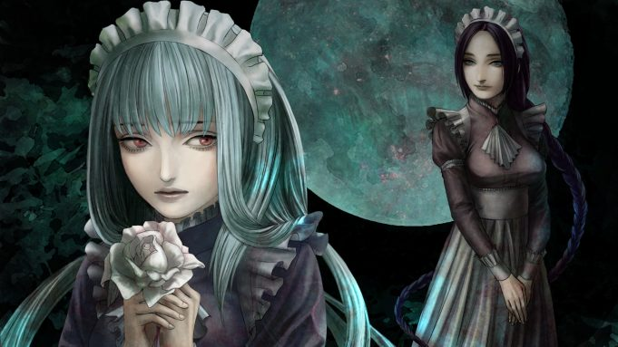
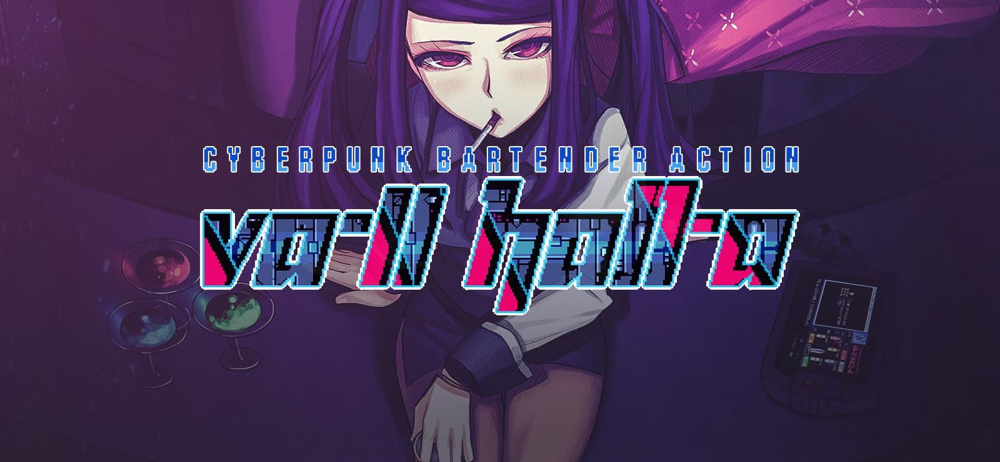
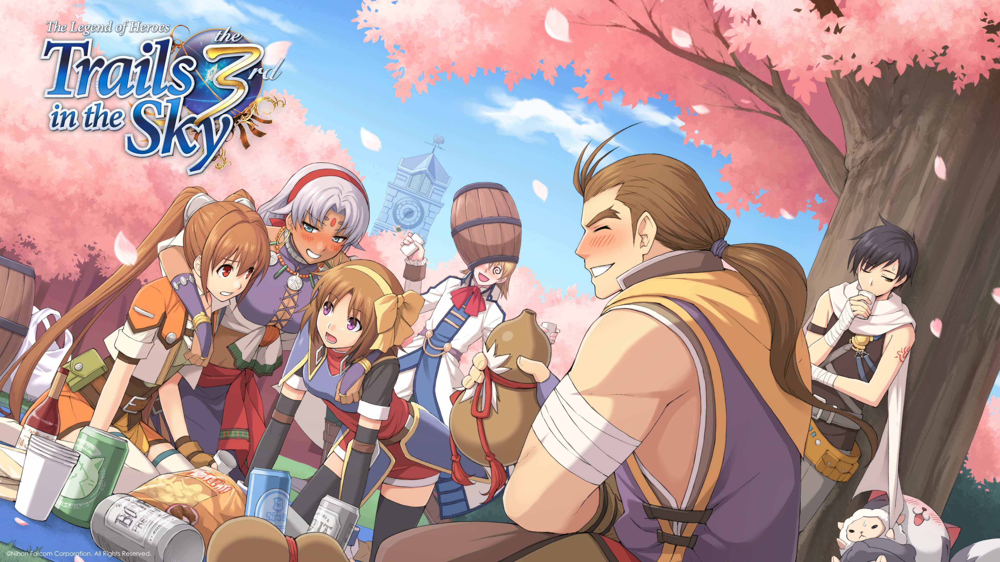
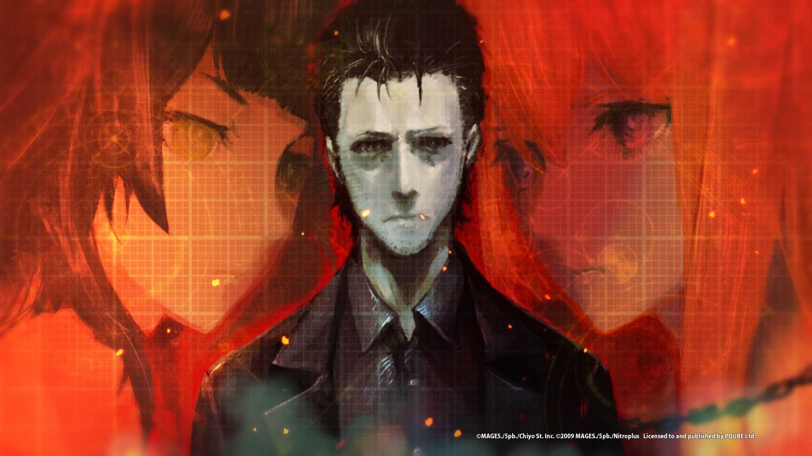
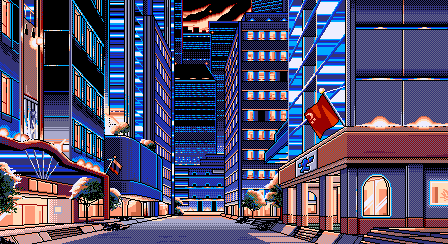
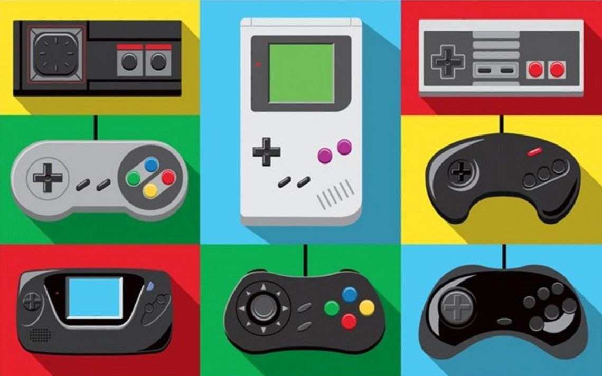

---
{
	title: "RockmanDash Rambles: A Bucket List of Things I'm Working On",
	published: "2018-06-27T19:22:00-04:00",
	tags: ["Rockmandash Rambles"],
	kinjaArticle: true
}
---

I haven’t written in a while. You know this, I know this. It’s summer time and I don’t have any extensive commitments, so I want to write more soon. I thought I’d put a bucket list up of things I would like to write but haven’t finished for various reasons, just to let people know what’s been occupying my thoughts in the past bit of time.\
\
These are gonna be mini versions of the reviews I’d like to write, might as well get something out instead of nothing if I never get around to finishing them.

***

### *The House in Fata Morgana Review*

**What: **A review of one of my favorite visual novels, The House of Fata Morgana

**Why:** It’s an underappreciated work that does what I wish all VNs did: turn away from tropes and long winded common routes to provide a visceral, narrative driven experience that’s gripping and engaging in every moment. It’s also one of the most “human” works i’ve ever played, and that’s something I honestly adore.\
\
**Excuses: **I played it in January of last year and I was going through a lot of stuff at the time, didn’t have time to finish it. It’s honestly been too long since I played it so my memory in regards to the game is pretty vague, I think i’d have to replay it before I can do a proper review of it. I really like the game so I would want to do a proper job of it, and I don’t want to half ass it. There’s also a bit I’m having trouble with - can’t really put into words why I enjoy it so much, and I’m having issues with describing the pacing in the later half of the game: I don’t know if it’s me trying to rush through the later half of the game or the game itself.\
\
Also, I’ve been thinking about shaking up my review style, it’s really dry and I’m trying to make it more conversational. I got into reviews to talk about things I love, but the traditional reviews were big back then and I was really into em. I’ve been kinda forcing myself to write that way, but I don’t enjoy that now and that’s honestly not me, so I’m gonna take my time with this and see what I can do.

***

### *The House in Fata Morgana: A Requiem for Innocence Review*

**What: **A review of the fandisk/sequel of one of my favorite Visual Novels

**Why:** It just came out and not many people are talking about it! would be a nice thing to review after not doing VNs for a while.\
\
**Excuses: **I haven’t reviewed the first game, and I haven’t played it yet! this one might be on the back burner for a while, which sucks because a big reason I wanted to review it was because it was relevant. RIP.

***

### *VA-11 HALL-A Review*

**What: **A review of the “Waifu Bartending Simulator”, *VA-11 HALL-A*.

**Why:** It’s a game oosing with style (PC-98 AESTHETIC FTW), and it has a remarkably human touch like *The House in Fata Morgana* focusing on the lives of average people even when it’s set in a cyberpunk dystopia. VA11-HALL A is one of the few VNs I’ve played that actually cares about the experience of the player, making every moment engaging and enjoyable thanks to the great music, fantastic gameplay, entertaining dialogue and chill atmosphere. I\
\
**Excuses: **I just finished it! I’m definitely a bit late on this, playing it about a year afterwords, but that’s because I didn’t think i’d like it when it came out. Something about Waifu Bartending didn’t really appeal to me, but when I looked into it, it was totally my thing - especially because right now i’m kinda in a retro gaming kick and fell in love with the whole PC-98 aesthetic. I do have issues with the game, and trying to properly explain them is kinda hard, but this one should come soon.

***

### ***YU-NO* Review**

**What: **An old PC-98 Visual Novel that was revolutionary for it’s epic storyline

**Why:** I really love YU-NO, moreso than I ever thought I would. There’s far too much of a focus on sex for my tastes but the premise, the gameplay and the setting is engaging and amazing, definitely deserves a mention. It also feels like it’s too important of a Visual Novel to ignore, TBH.

**Excuses: **Since it was so long since I’ve done a review and I was super busy at the time, I didn’t take notes so there’s not much to build a review on it. I might just talk about the way it plays with the gameplay instead of doing a full review, but idk. This one might never come out.\
\
Also, I guess I’m kinda waiting for either the anime or visual novel remake to come out so this is actually relevant when I do the review.

***

### ***Trails in the Sky Third *Review**

**What: **Arguably the best RPG Falcom has ever made, and a successor to what is currently my favorite game period, Trails in the Sky SC, which I wrote a review for [here](https://tay.kinja.com/the-legend-of-heroes-trails-in-the-sky-sc-the-tay-rev-1748211289).

**Why: **I’m a huge fan of Falcom and it’s the successor to my favorite game, I gotta write about this!\
**Excuses:** I haven’t played it yet... I don’t like playing RPGs on PC or console but hopefully I’ll sit down and get through this.

***

### *Megalo Box and the Magic of Music*

**What: **A article talking about Megalo Box’s Soundtrack\
**Why: **Megalo Box’s soundtrack is so good!!! Like, top 3 anime OST good. It shapes your experience in a work and shows how important a good score is to one’s enjoyment of a work so I’d love to talk about it.

**Excuses:** I’m not good at writing this type of article. I can’t really explain this stuff properly.

***

### *Steins;Gate 0* - How Adaptation is Not A Bad Thing

**What:** An article on how Steins;Gate 0's anime is actually improving on the Visual Novel

**Why: **Everyone talks about how the source is always better, but this ain’t the case. Steins;Gate 0's anime is really good, and it makes huge strides in certain aspects to make the overall experience more engaging than the Visual Novel. Also, a lot of people weren’t as big of a fan of the VN as I was, and those people are absolutely digging the anime in comparison so it feels like an article that needs to happen. I love talking about and writing about the nature of adaptation so this is right up my alley.\
\
**Excuses:** I’m too lazy to write thisssss, some other timeeeee

***

### **Praise about the Perfect Aesthetic of PC-98**

**What:** An article talking about the aesthetic of games that came out of the Japanese PC-98 computers. I kinda want to talk about PC-98 in general as well, so this might just become a PC-98 article\
**Why: **PC-98's aesthetic is probably my favorite aesthetic in general, and this is connected to YU-NO (A PC98 game) and VA-11 HALL-A (a PC-98 inspired game) so if I wrote either of those, this would accompany them. The PC-98 was a system of computers made by NEC that as exclusive to Japan, and many of the games that came out for it were hentai games so most people don’t really care about it, but this system of computer has a mix of perfect coincidences that make the games on it look absolutely stunning. Since PC-98 was JP only, the aesthetic is mostly anime; since it was an older system before 3D really took off, it’s all beautiful pixel work; and since the standard resolution was much higher than here in the west at the time, the art was very intricate and detailed, much moreso than other pixel work we’d see here. It’s an Anime Pixel Art PC Game Machine, and I’m absolutely in love with the look.\
**Excuses:** I want to do some of the articles first, and I’m not sure how to do this one. I’m thinking of just a small writeup like what I wrote in why, with just a bunch of PC-98 shots.

***

### Retro Gaming on a Budget

**What: **A series of articles about retro gaming and how to save money in the process. This would cover all sorts of stuff and would be a multiple part series of articles and videos, from hardware to the gaming setups to getting into RGB without buying something like a Framemeister.

**Why: **I know I write about VNs all the time but I would love to start writing about other things and Retro gaming is one of my passions, one I’ve been getting into even more lately than usual. There’s a lot of resources on how to get what’s the best, but not a lot on how to get good quality stuff while saving a few bucks and I’d love provide that kind of resource. Might as well use my time researching to provide a service to others!\
\
**Excuses:** This is a lot of work and I don’t know if it’s worth doing. I definitely want to try though. Not sure if people who follow me would like it either, since I primarily do VN content. I might make a separate blog/channel for this.

***

*Thank you for reading! This is Rockmandash Reviews, a blog focused on everything revolving Visual Novels, with stuff like tech and anime every now and then. If you want to check out more of my writing, check out *[*FuwaReviews*](https://fuwanovel.net/reviews-hub/)* and *[*AniTAY*](http://anitay.kinja.com/#_ga=2.29830716.283022684.1516595779-1252363867.1516472140)* where I am a contributor!*
