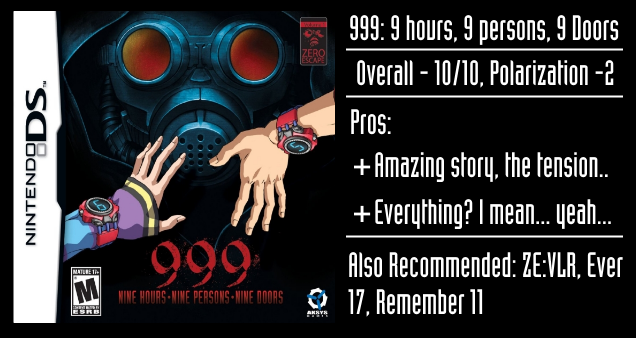

---
{
	title: "Rockmandash Rambles: An Explanation on my Review System (Updated 11/15/2015)",
	published: "2014-08-11T16:44:00-04:00",
	tags: ["rockmandash rambles", "review system", "explaination"],
	kinjaArticle: true
}
---

If you’ve read any of my reviews and wanted to know why I did them the way I do, here’s an explaination of them, for those who came here from said review, or someone around TAY that sees them every now and then. Since my review system deviates a bit from the [TAY](http://tay.kotaku.com/an-all-new-tay-review-system-that-you-can-use-if-you-w-1523594576#_ga=1.124862595.888615642.1438970662) and [Ani-TAY](http://anitay.kinja.com/the-updated-anitay-review-system-1676140651#_ga=1.124862595.888615642.1438970662) review systems that it’s surrounded by, and it has a few quirks , I figured it wouldn’t hurt to give this a bit of explaining on my review system.

***

### Categories

Every now and then, I’ll use the TAY/AniTAY review’s Fantastic, Not Great, and Terrible, but I usually have different categories sorted by the topic instead of the quality. In the respective order, the categories for review I personally use is Writing, Visuals, Sound, Gameplay, Source Material Comparison, Experience, and Conclusion, but usually the Order changes depending on importance.

Also, I now have a[ checklist](http://rockmandash12.kinja.com/rockmandashs-checklist-for-reviews-1-0-1654377006?rev=1415086408141) of everything I look for in a work in a checklist to help make sure I mention everything I want to say.

* **Writing** - This category focuses on the story, execution of plot, themes, tone, quality of writing in general, pacing, characters, etc. Pretty much anything that involves the writing of it. I typically have the sub-categories of Plot, Pacing, and Characters, and sometimes they get their own dedicated categories right after writing depending on how varied the quality of the sub-categories are, or the level of importance.
* **Gameplay **- For games, this is about the interactions you have. It’s usually about the quality of control, unique gameplay aspects, and experiences of actually playing through it. Sometimes, pacing can fall in here due to the fact that gameplay can effect the pacing of the story. This segment does not appear in games that do nothing special (or worth mentioning) or anime.
* **Visuals **- Rates how nice (or not so nice) something looks. Pretty self explanatory.
* **Sound **- Rates the quality of the Soundtrack, how well it used it and Voice Acting if said work had some. The Soundtrack itself is only half of the equation; the usage of the soundtrack to make the mood of the show is equally as important, and Voice Acting can really influence your thoughts on characters.
* **Source Material Comparison** - This category is almost never called this, it’s usually called the media of the source material. In this, I don’t rate it, i just compare the 2 and say which one I prefer. This only pops up when I have seen the source material, and if the topic of the review actually has a source material, so it’s not that common.
* **Experience** - This is, in my opinion, the most important section. This is my personal thoughts on it, what I experienced during this, my enjoyment of it, etc. What’s the point of a review if you can’t get your thoughts out, saying that something is good if you don’t care for it? Every review has an aspect of subjectivity, this is where a majority of the subjectivity in my reviews lie.

***

### Banners

This one is a pretty recent change, but I’m a fan of how it looks so i’ll keep on doing it. I’ve started to change the colors on the banners for the categories (or have entirely different banners) depending on the said work. It’s just an aesthetic change and doesn’t influence the review’s actual contents. Here’s an example from my [*Rewrite* review](http://rockmandash12.kinja.com/rockmandash-reviews-rewrite-visual-novel-1609445042#_ga=1.247352333.888615642.1438970662), [*FSN UBW *review](http://rockmandash12.kinja.com/fate-stay-night-unlimited-blade-works-tv-is-beautifu-1642722982) and [*Sound of Drop *review](http://rockmandash12.kinja.com/rockmandash-reviews-sound-of-drop-fall-into-poison-1741263649) to represent the different types of banners I use.

  

***

### Scores

I use a 1-10 scale to rank the quality of the work in my reviews, with 7 as average, just like the letter system for school. I’m familiar with it, and it’s easiest to place it for me. Everything is compared to stuff I’ve already reviewed to, so the higher number means better in my eyes. Keep in mind this is ranking quality, not how much I enjoyed it.

I’ll break the number system down a bit more to help clarify this.

* **1-4:** Does nothing right. You’ll never see something like this. The variation in number is how much I hate it.
* **4-6:** Screws up something so badly that it’s no longer enjoyable, but does have 1 or 2 categories that weren’t horrible. Think of something like [Mekakucity Actors](http://anitay.kinja.com/mekakucity-actors-rockmandashs-ani-tay-review-1594049265).
* **6-7:** Sub-Par shows. Something that should have been good, but due to major flaws, they weren’t. Usually they are pretty good in most fronts, but one or 2 parts just tank horribly. Some people might like them, but they weren’t good in my eyes. The biggest difference between a 6 and a 7 is personal enjoyment. Think of stuff like Aldenoah.Zero or [Valvrave](http://rockmandash12.kinja.com/rockmandash-reviews-valvrave-the-liberator-anime-th-1495344972).
* **7-8:** Average. Doesn’t stand out, but isn’t horrible either. They may have some flaws, but they are pretty good in general. I like to think of SAO Season 1 or [I/O](http://tay.kotaku.com/rockmandash-reviews-i-o-visual-novel-1563212529).
* **8-9:** Good. Stuff that I thought were good, but not necessarily amazing. These can also be stuff I thought was amazing but with a massive flaw. I like to think of [Rewrite](http://rockmandash12.kinja.com/rockmandash-reviews-rewrite-visual-novel-1609445042?rev=1407784763208), or [Remember 11](http://tay.kotaku.com/rockmandash-reviews-remember-11-the-age-of-infinity-1528062359).
* **9-10:** Amazing. Stuff you should experience, stuff that blew my mind. These are great works that you should check out. They have minor flaws, but I enjoyed them too much that they are a non-issue. Stuff like [Steins;Gate](http://rockmandash12.kinja.com/rockmandash-reviews-steins-gate-visual-novel-1557340615), and [G-Senjou no Maou](http://tay.kotaku.com/g-senjou-no-maou-the-tay-review-1524540625) come to mind.
* 10: Out of this world. The best of the best.

***

### Polarization

Polarization is usually my thoughts on what you might think of it, or others do. The larger the number, the more polarizing.

To give an example, I rather disliked [Mekakucity Actors](http://anitay.kinja.com/mekakucity-actors-rockmandashs-ani-tay-review-1594049265#_ga=1.246894349.888615642.1438970662). I gave it a 5. Some people find it average, so the positive polarization is +2.5. There’s also the chance that some people might like it even less than I did, (I almost gave it a 4) so the negative polarization is -1.

***

### Tiers

These tiers are my personal thoughts on said work, and if you asked me what I thought about them, they would fall into said category. These ranks how much I enjoyed them. Keep in mind that quality, personal thoughts, and recommendations are all different, so in my reviews, I split them up.

The tiers are:

* **Rockmandash Regrets** - If you see this tier, I don’t like it and I wouldn’t recommend it. Stay far away.
* **Rockmandash Regular** - I thought they were average. I enjoyed them, but I didn’t really care too much about them.
* **Rockmandash Recommends** - This tier is kinda self explanatory, these are shows and games i’d recommend, because I enjoyed them and they were pretty good overall. They have flaws, but they don’t prevent it from being enjoyable.
* **Rockmandash Remarkable **- which are Shows and Games that i’d recommend to everybody because they are really amazing works, and I really loved them. This is stuff that would be on a Top 10 list, in my eyes.

***

### Recommendations

For my thoughts on if you should check it out I just rely on the TAY’s Verdict system. These do not correlate with my personal thoughts on the show and can differ.

* **GO for it!** - Stuff I’d recommend
* **Proceed with caution.** - Stuff i’d recommend depending on who you are.
* **Not worth your time.** - Stuff you should stay away from.

***

### Ending Card

I used the same title card as everyone else originally, but when TAY originally changed the review card to t[his style of ending card](http://i.kinja-img.com/gawker-media/image/upload/s--6gko-_Z4--/1341232497695445861.jpg) that’s in place, I disliked some of the omissions in the new card info-wise so I decided to tweak it a bit and make it my own. These tweaks eventually lead to the AniTAY Review card, so I use a variation of that (pros/cons instead of Who’s it for and not for) or I use a custom card, depending on review. They are small changes, but I prefer it this way.

Here are some examples of both types:

 

***

### Policy on Edits

My reviews will constantly change. If I go back to it and find that something’s off about it, I’ll go in and tweak it. If there’s so much change that it’s so different that you can’t tell it’s the same review, I’ll redo it under my Review+ name, or what i’ve been doing lately, which is making an archive copy at the end of the post.

***

### Policy in regards to content in VNs

I will review any VN that I feel like is worth my time and has a good enough story to warrant a review, but I have to cross my lines somewhere. I kinda have to review some 18+ VNs, because there are so many but I will never review a VN in which Fanservice, or H-scene are the main selling point of the game, so you’ll never see me review a nukige. Also, gag VNs are out as well, just FYI to those devs who want me to review your VNs.

***

*That’s it for the explanation for how I categorize and rate my reviews, if you were confused about it. This explanation will be at the bottom of every review, for your convenience.*

***Note:**** This has been edited on 11/15/2015. To see what the old version looked up, click *[*this link here*](https://docs.google.com/document/d/1MmOudTwdHlFeIp344frdGIIcUjGPFhBJocT7NxcLFuo/edit?usp=sharing)*, it’ll send you to a google docs archive of the old article.*
