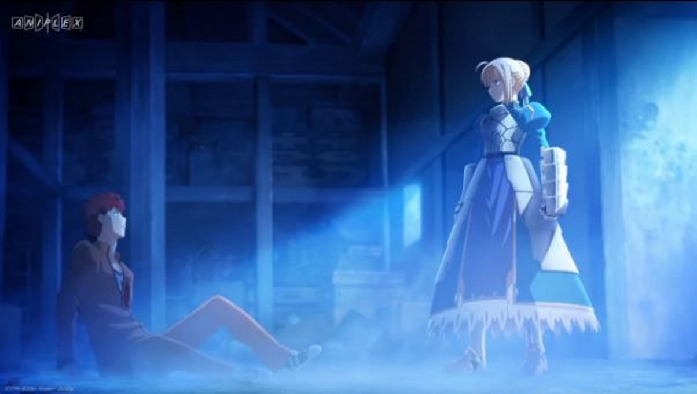
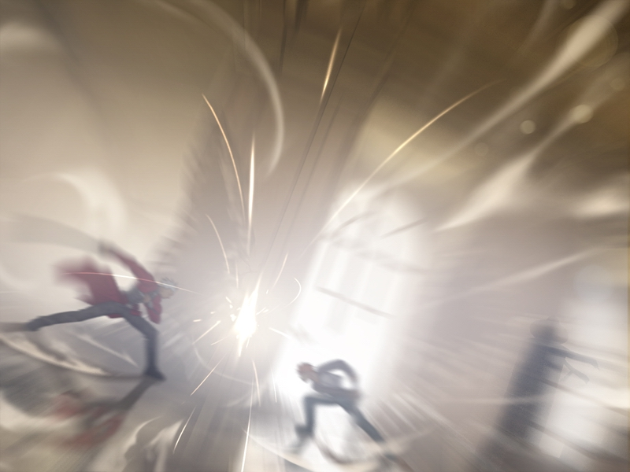
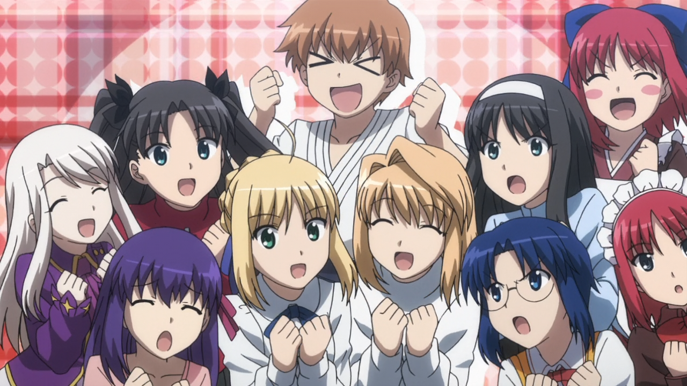

---
{
	title: "Rockmandash Rambles: Fate/stay night Hype!",
	published: "2014-09-28T21:00:00-04:00",
	tags: ["Rockmandash Rambles", "Fate/stay Night Hype", "Fate/stay night Unlimited Blade Works", "Ani-TAY", "Type-Moon Marathon", "Fate", "HYPE", "Unlimited Blade Works", "Unlimited Hype Works"],
	kinjaArticle: true
}
---

[Over the past few months, I've been writing about everything related to Fate/stay night, and everything in the Type Moon universe](https://rockmandash12.kinja.com/type-moon-marathon-wip-1534726534), in anticipation for *Fate/stay night: Unlimited Blade Works*. While I have a review on [*Fate/stay night*](http://rockmandash12.kinja.com/rockmandash-reviews-fate-stay-night-visual-novel-1613176306), it covers my thoughts on how good I think it is, it only has brief description on my thoughts on my experience. I want to expand on my personal thoughts on my experience with it, and why I'm looking forward to the new *Fate/stay night*.

**WARNING -** There may be a chance you experience hype backlash due to this post, and some minor spoilers. If you want to enjoy the show for what it is without knowing anything about it, don't read through this post.

The first time I heard about *Fate/stay night* was from one of those top 10 VN's list, and I heard that it was good. I expected nothing, and got something amazing. (That means I'm probably doing a great disfavor for you guys huh?) I did not expect the deeper and darker themes. I did not expect the excellent character development due to the extremely slow pacing. I did not expect to be blown away with ideals, I did not expect the epic fight scenes, I did not expect the character development to blow me away, and I did not expect the amazing atmosphere that the game has. The best part about *Fate/stay night* is that it holds its ideals under a magnifying glass, showing you what it is while going deeply into what they all mean. Even though the game takes forever, they always have a focus, they always keep you interested and entertained. The ideals of what it means to be a hero, what one has to do when confronted about his life and ideals, and last but not least, Shirou's ideals vs Reality are just some of things that got me hooked into the story.

What does it mean to be a hero? What is good, what is bad? Is sacrificing few for the many OK? Should you strive for your dreams even if they are impractical? What does it mean if your ideals are borrowed? In the age old question of world peace, what does it actually mean? By getting rid of conflicts, you get rid of competition, and thus progress.

To me, *Fate/stay night* is more than just a story. It was an experience. It told a story of philosophy and grand ideals, but as it was doing that, it was shaping my own viewpoint on the world around us. Type-Moon has been crafting ideal bending stories extremely well for a decade now, and I can't help but fall in love with them, and hype about them. It told a type of story I never experienced before: a story full of action, but full of development. A story that was thrilling, but painfully slow at the same time. It told a story that was filled with the ideals and motivations of characters, but also the story of some people in the day to day life. This perfect harmony between slice of life and action is something I love. While I wasn't immediately drawn into what *Fate/stay night* was trying to do, but as it sunk in, I enjoyed it more and more and it started to influence my viewpoint of the world. It was my gateway drug into the Nasuverse, and it lead me to many more experiences like [*Kara no Kyoukai*](https://rockmandash12.kinja.com/rockmandash-reviews-kara-no-kyoukai-the-garden-of-si-1524615358), [*Carnival Phantasm*](http://tay.kotaku.com/rockmandash-reviews-carnival-phantasm-ani-tay-1546038401), [*Fate/hollow ataraxia*](http://rockmandash12.kinja.com/rockmandash-reviews-fate-hollow-ataraxia-visual-novel-1612260148), *Fate/extra*, and so on. These games then added to the influence on my thoughts and made me appreciate and enjoy *Fate/stay night* even more (or were just silly and enjoyable :P).

Yes, I adore Fate/stay night, and the Nasuverse... but many people do not share this opinion, which may be due to the troubled series of releases so far. While fans who played Visual Novel enjoy it for what it is, many people don't have such a positive viewpoint on *Fate/stay night*. Just look at [Richard Eisenbeis's *Fate/Zero*](https://kotaku.com/fate-zero-sets-a-high-bar-for-all-other-fighting-anime-1638963368) comments section and you have a ton of people calling it shit. This is due to a few bad adaptations by Studio Deen, and the original English VN release. The 2006 anime by Deen tried to be an adaptation of the fate route, but started to throw stuff in that shouldn't be there, and the adaptation failed to capture the strong points of Fate/stay night while butchering others. It had some memorable moments, but those memorable moments were stuff like [People die when they are killed](http://knowyourmeme.com/memes/people-die-if-they-are-killed), and [CG Dragons](https://www.youtube.com/watch?v=Mdol1dMEtMY), thus helping to add the idea that this show was shit. The 2010 movie adaptation of the UBW route was way too sho rt (hell, the length of the first two episodes of the new anime is longer) thus butching the plot unless you've seen the source, and looked better than most of Deen's works but still looked poor in comparison to many out there, and once again alienating newcomers to the series. Last but not least, the fact that the only English version of the visual Novel was a fan translation of the original eroge version, thus people mocked/were alienated by the hentai scenes. The new *Fate/stay night* has the opportunity to debunk this viewpoint.

Which leads us to the New *Fate/stay night*. Of course there's the Ufotable adaptation of the Unlimited Blade Works, but before we cover that, I want to talk about relatively recent release of the VN that was overlooked by a good majority of people (including me, until I started writing this): Beast's Lair's English release for *Realta Nua*. If you are interested in playing the visual novel but were turned off by the eroge, you now have the option turn them on or off, if you played through the original release, they have new, *Realta Nua* exclusive scenes, if you want to see all of the OPs, they include 8 of them, if you were impressed by the visuals in *Fate/hollow ataraxia*, they now have those effects and slightly improved art. The guys over at Beast's lair have toiled to make this release amazing. It's leaps and bounds better then the original Mirror-Moon release, and maybe perhaps the definitive version of Fate/stay night. I've played a bit of it, and I really like it so far, especially the ability to switch to the new 2012 soundtrack. I'll update my review with a *Realta Nua* segment when I'm done with it.

So, now to the main topic. *Fate/stay night: Unlimited Blade Works*. I don't think I've ever been this exited for a single piece of medium. Never before have I been obsessively been speculating on what it will be like. Never before have I watched trailers in anticipation for a series. Never before have I ever got so exited over an announcement of a series that I decided to do a review marathon over everything a company has made before this. It's the first time that someone is adapting a show i'm a big fan of that's relatively obscure (at least here in the west), and I can finally show people what I really enjoy without them being alienated in some way. People finally have the chance to see the story of the original VN, shown in a way that is amazing. I finally can see the fight scenes in a way they should be in. I'm looking forward to the best visuals that anime has to offer, I'm looking forward to an amazing soundtrack by the guy who did Mahotsukai no Yoru's soundtrack, and [I'm looking forward to a fate show that I can recommend that I really love](https://rockmandash12.kinja.com/rockmandash-rambles-fate-zero-revisited-1637549445). From what I can tell, it looks amazing, and I'm looking forward to the execution of it.

> I am the Hype of my Fate/stay night
>
> Type-Moon is my Body and Ufotable is my Blood.
>
> I have written over a thousand words,
>
> Unknown to Hype,
>
> Nor known to Fate Stay Night.
>
> Have withstood days to watch UBW
>
> Yet those eyes will never forget Deen.
>
> So, as I Pray—
>
> Unlimited Hype Works
