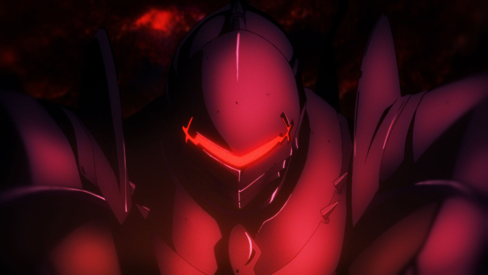
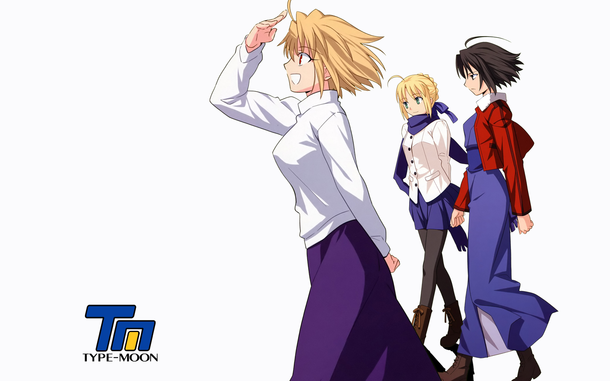
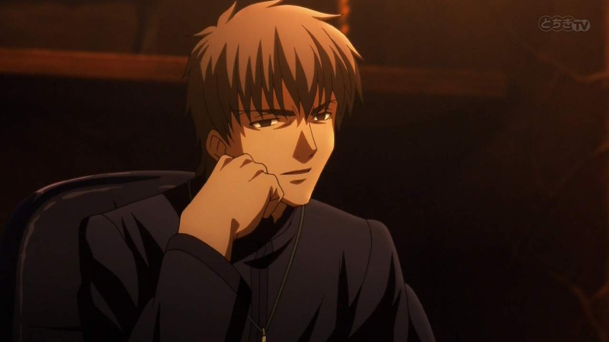
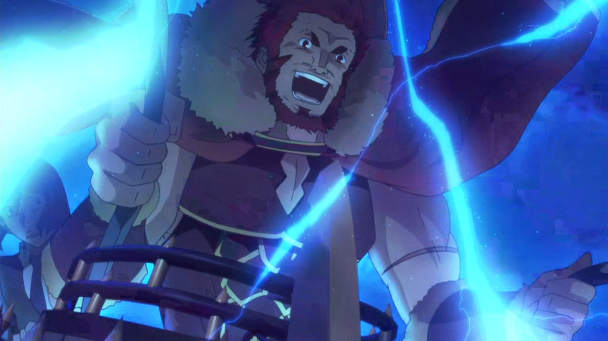
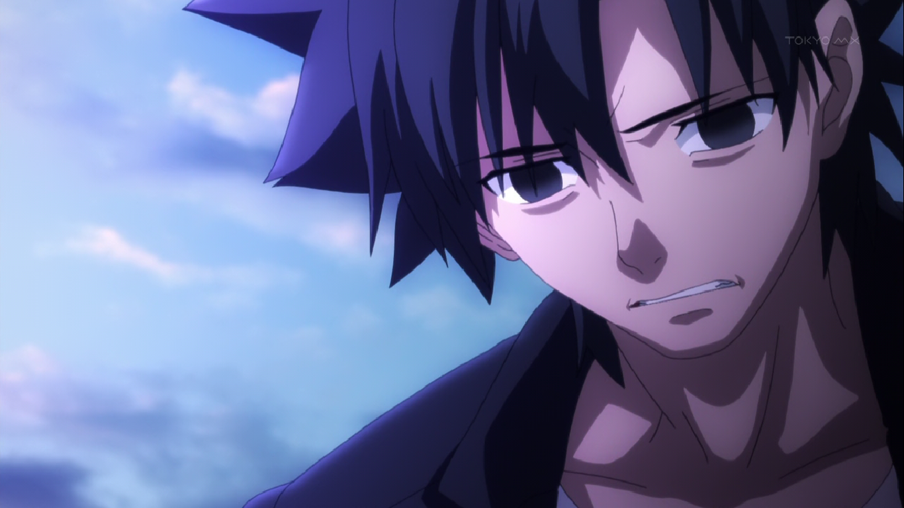

---
{
	title: "Rockmandash Rambles: Fate/Zero Revisited",
	published: "2014-09-23T19:45:00-04:00",
	tags: ["Rockmandash Rambles", "Fate/Zero", "Fate/stay night", "Revisited", "thoughts", "Oppinion", "Type-Moon Marathon"],
	kinjaArticle: true
}
---

[In preparation for Fate/stay night](https://rockmandash12.kinja.com/type-moon-marathon-wip-1534726534), and because I felt like marathoning something with decent storytelling and an interesting world, I decided I'd rewatch Fate/zero. I've never been the biggest fan of Urobucher stuff, and I hated Aoki's directing in Aldnoah.Zero, but looking back, was I wrong about [Fate/Zero](http://tay.kotaku.com/rockmandash-reviews-fate-zero-ani-tay-1538163593?rev=1411377604292)?

###### [Rockmandash Reviews: *Type-Moon Marathon*](https://rockmandash12.kinja.com/type-moon-marathon-wip-1534726534)

In preparation for the Fate/stay night: Unlimited Blade Works Adaptation by Ufotable, I decided to…

[Read more](https://rockmandash12.kinja.com/type-moon-marathon-wip-1534726534)

Before we delve into my thoughts on Fate/Zero, I'm going to put my thoughts on if you should watch it before or after Fate/stay night. It's hard to say which to watch first without seeing Ufotable F/SN, but I'd based on my experience with FSN's VN and F/Z, I'd say that both are pretty good starting points. The Ending to Fate/Zero flows seamlessly into Fate/stay night, but many would debate that F/Z spoils too much of Fate/stay night. I personally think you should do F/Z then FSN, but it's really more about patience than anything at this point.

This is the 3rd time watching Fate/Zero. The first time was right after originally reading FSN, then being extremely disappointed, the 2nd time was in the review marathon, and 3rd is now hoping I'll like it more & under the FSN "high" in anticipation for it. After watching it, I'd say I enjoyed it quite a bit more, but my overall thoughts didn't really change.

I don't love it like other Type-Moon stories; I admire it. I admire how Urobuchi kept the story close to the source of FSN, I admire how Fate/Zero objectively, is very good. The first episode of my personal favorite starts; 45 minutes of glorious exposition and development, which gets that all out of the way for an entertaining story. It has amazing action, it's executed well, it's serious and it has amazing production values with great music that's used well, and I see how everyone loves it, but I'm not one of them. There's something about Fate/Zero that lacks in personality; it spends it's time telling a story instead of getting you attached to the story like everything else in the universe. It's done well, but to me, it's a clear difference between quality and enjoyment, and while I enjoyed this show a bit, I didn't enjoy it nearly to the extent of something like F/SN or F/HA.

I never got attached to it, even after the 3rd watch, and that's really my biggest gripe with it. A show that doesn't engage the viewer cannot be called great in my opinion. I love stories I can get absorbed into, stories with main characters I can relate to, and experience events with. I love stories like [Muv-Luv](https://rockmandash12.kinja.com/rockmandash-reviews-muv-luv-extra-alternative-visua-1567978967), [Steins;Gate](http://rockmandash12.kinja.com/rockmandash-reviews-steins-gate-visual-novel-1557340615), and [G-Senjou no Maou](http://tay.kotaku.com/g-senjou-no-maou-the-tay-review-1524540625): stories that suck you in for a roller coaster of a ride, and That's why, even though Fate/stay night may have a generic protagonist and it panders with high school tropes, I love it much more than Fate/Zero.

###### [Rockmandash Reviews: *Muv-Luv & Alternative* \[Visual Novel\]](https://rockmandash12.kinja.com/rockmandash-reviews-muv-luv-extra-alternative-visua-1567978967)

Welcome to Rockmandash Reviews, and this is my review of the highly regarded Muv-Luv Visual Novels

[Read more](https://rockmandash12.kinja.com/rockmandash-reviews-muv-luv-extra-alternative-visua-1567978967)

To me, Fate/Zero is solid, with a few really enjoyable episodes (ep10 with rin, episodes 18-19), but I feel that, because it tries to focus on being a totally serious story, it leaves out the some of the strengths that FSN and FHA had. The characters in Fate/Zero seem hollow to me (with the exception of Waver and Rider) due the lack of character interactions and reactions. While they show personality, Fate/Zero rarely shows emotions. (A smile, or tears can go a long way) when they do it, its great, but most of the time, they don't. We see them fight, but we don't know much about them other than that, and that's due to the Ensemble cast effect that Fate/Zero runs with. Ensemble cast can be done well, but in this case, it holds back the story. In Fate/Zero, they bring up the ideals, but they never resolve the ideals they set, and they rarely focus on it. Entire routes of Fate/stay night are focused on one single ideal, and because of that focus, it's great. Fate/Zero scatters them around, hoping you'll get attached to them without developing them... and it fails in my eyes. They could have gone so much deeper. They could have done so much more than what they did. But they didn't. Kiritsugu is a prime example of this done wrong. Kiritsugu has one of the the greatest backstories I've ever seen, yet unlike Archer of Fate/stay night who has a personality and turns against those ideals, all Kiritsugu does is become hollow. This hollow is a tease, much like the rest of the show.

The show lacks a certain charm to it. It lacks expressions, it lacks character, and it never got me engaged into the story. To me, it's these small things that are the difference between a good show and a great show. Nasu wrote a story I fell in love with and got absorbed into. Urobochi wrote a story without these which they crippled my experience when I first watched it, and it still bothers me to this day. I know many don't mind this and will absolutely love it, but these are things that bother me. I admire what it does, and I can see why everyone loves it. I know it may sound very nitpicky and silly, but I can't see Fate/Zero as anything more than "solid" due to my personal beliefs on how a show should be, and I hope that's fine with you. I don't have any quantitative reasoning, but it just doesn't click with me.