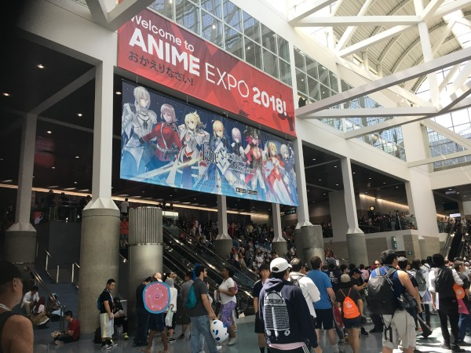
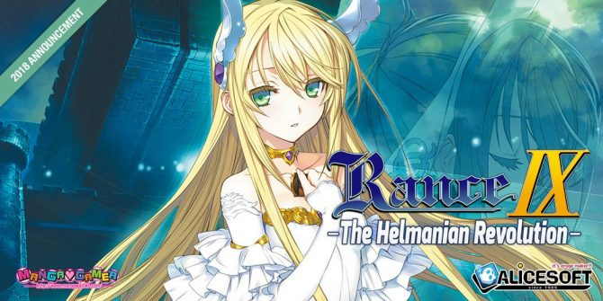
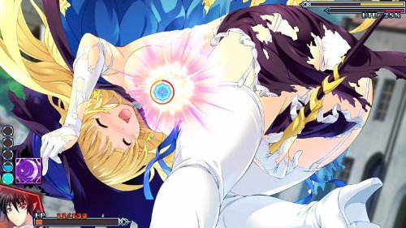
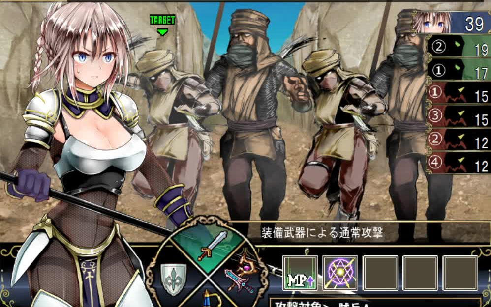
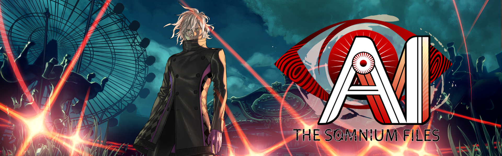
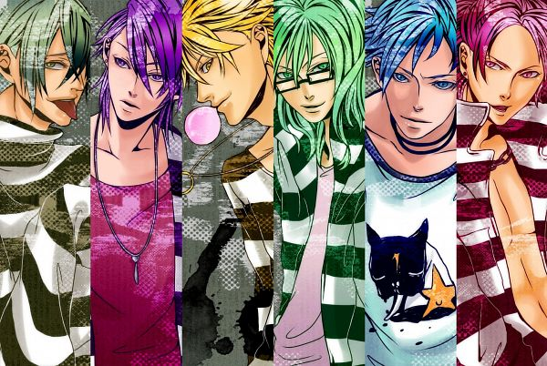
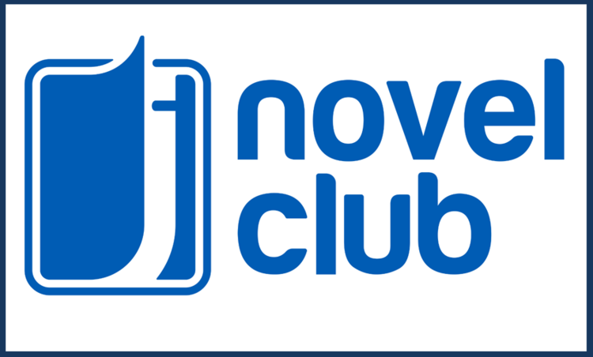
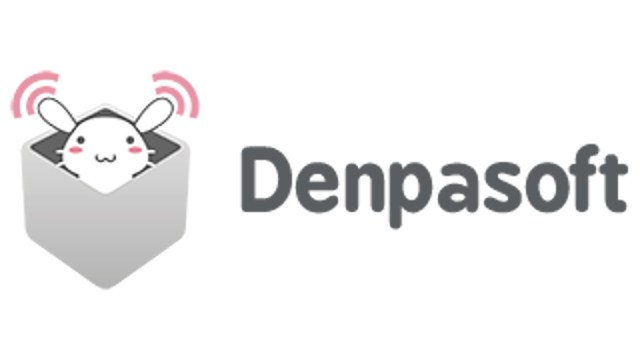

---
{
  title: "RockmanDash Rambles: My final AX and Thoughts on the VN Industry",
  tags:
    [
      "Rockmandash Rambles",
      "Visual Novels",
      "Anime Expo",
      "AX 2018",
      "Anime Expo 2018",
    ],
  published: "2018-08-04T13:30:00-04:00",
  attached: [],
  license: "cc-by-4",
  oldArticle: true,
}
---

It’s easy to fall in love with something; it’s much harder to give up on something you
  loved.

For the past few years,
  I’ve been making a 10 hour bus ride from Sacramento to Los Angeles to attend Anime Expo, the largest anime convention
  in North America. While the anime aspects of AX is great, AX is more than just an anime convention: As a result of
  Anime Expo being the biggest anime convention in North America, It’s become the defacto place for all sorts of
  localization companies to do their biggest and coolest announcements. Unlike the past few years though, I didn’t feel
  excited when all said was said done: instead, I felt left out. It took me a bit to realize this, but ultimately AX
  2018 was the straw that broke the camel’s back for me, the event that got me to realize that ultimately, the medium
  wasn’t for me. This AX made me realize that while the medium had works I absolutely adore, the overall medium itself
  is just not my cup of tea thanks to the VN localization industry catering to very specific audiences.

During AX, Mangagamer announced a BL game, A Yuri game and 2 <em>Rance </em>games.
  Frontwing showed their Frontwing made stuff but also showed 18+ content in their non 18+ panel and with works like
  <em>Lilitales</em> and <em>LocaLove</em>. JAST didn’t announce a lot but surprised the world with <em>Kimi to Kanojo
    to Kanojo no Koi</em> aka <em>Totono</em>, and they had a nice showing with their new BL focused wing, JAST Blue.
  With Sekai Project and Denpasoft, it was the inverse of the norm with a shit ton of H focused content like
  <em>Re;Lord</em>, <em>Haramade Kururu</em>, but very little traditional Sekai Project announcements that everyone
  complains about because of the lack of porn. These announcements might have more to differentiate themselves than they
  have in common, but for me there’s an obvious trend with the works announced - while there still are definitely story
  driven games like <em>Totono </em>and<em> Haramade Kururu</em>, these are a minority.<em> G</em>one are the days of
  translating works to get great stories available to larger audiences. We’ve picked through that crop - works are now
  being translated to target demographics, and the demographics they picked are all defined by gender or sex: whether
  it’s straight up Nukiges, or BL games or Yuri, almost everything that the VN Localization industry is picking up is
  primarily defined by gender or sex in the game. 

It should be obvious to everyone reading this that gender and sex drives the Visual
  Novel industry. All facets of what goes on in regards to Visual Novels in the west is dictated by sexual content.
  Games live or die by it, conversation is dictated by the amount of titties the game has or does not have. This
  community is fixated on this aspect, and we can see this to the reactions that people have to events: any
  anti-consumer act a company performs is completely out-shadowed by the fact that they decided to localize a BL game or
  what sex scenes a game may or may not have for legal reasons. This has always been the case, but when faced with so
  many great stories, I couldn’t help but focus on the story, as that’s what I live for, that’s what I love. 

For the longest time, I created an illusion that the VN community cared about
  primarily stories, that VN companies primarily cared about stories. There’s still great stories to be had, but it took
  me this AX to make the connection: this obsession with sex wasn’t just a side effect of how these games originated in
  japan, that it wasn’t just what these companies did to make money in order to bring great stories to the west. This is
  their business, and sexuality is the Visual Novel industry. This isn’t a bad thing inherently, and I’m happy to any
  one who’s enthusiastic by these recent announcements, that your demographic might be finally getting noticed or that
  you’re getting more of what you love, but this isn’t what I fell in love with the medium for. To go a bit further, I
  realized that isn’t just an odd quirk with the Visual Novel industry, and to say that this industry attracts <em>weird
    horny people who are obsessed with anime dicks and anime titties because muh porn </em>would be wrong. This is a
  direct result of human nature, and we can see this reflected in our society. Of course we are going to let our
  obsessions dictate our medium, and who am I to judge people for enjoying what they care about? 

Personally, I never quite understood society’s obsession with gender and sex - to
  me, what you are shouldn’t matter. To me, equality is that standard we should drive to, and because of that, obsessing
  about what people are instead of who they are always comes out as superficial to me. What matters in an actual
  relationship is the bond and connection itself, not what the people are. Sure, what someone is can definitely
  influence how the dynamic of the relationship is, but ultimately to me sex shouldn’t be the defining trait of
  relationships. Great relationships can exist regardless of age, race, sex, etc and what defines a great relationship
  is never one of those things. I’m an asian guy and my best friend is a white guy, but this our race and gender is just
  flavor text to the relationship itself: the core of the relationship is our common interest, the dynamics of how we
  interact with each other and the experiences we have had together. More and more, when I think about what I want out
  of a work I realize that stuff like premise or production values are not what I’m looking for. What I truly enjoy out
  of works is a relatable, truly human touch in works, and nothing this AX seems to have the same priorities as me.

I’m not a fan of sex scenes, Nukige, or the gender focused genres of Bishoujo, 
  <!-- -->BL, Otome, Yuri or what seems to be any of the main attractions for the genre, really. Having my first visual
  novel be <em>999</em> was a blessing, but also a curse in disguise: it made me fall in love with the potential of the
  medium but ultimately set me with a hope or expectations that other works would be like that when in reality the
  majority of the medium is entirely uninterested in telling a story. Sure, I’m excited about <em>Totono</em>,
  <em>428</em>, <em>YU-NO</em>, <em>AI(ye)</em>, <em>Tokyo Chronos</em>, etc but not many people really care about these
  story driven experiences. Panel after panel I’m honestly left disappointed, and this feeling of disappointment has
  been present for more than just this year. Almost nothing from SP or MG appealed to me, and this isn’t the first time
  I felt this way. I guess this just something I have to come to terms with, and realize that… yes, there’s nothing left
  for me in this medium, that I don’t actually like the medium itself but instead the promise that the medium has and
  the works I’ve enjoyed from it. 

I know that people are loving what these companies are bringing out. On twitter, or
  even in the panel rooms themselves, the atmosphere can be intoxicating in the excitement about the new releases. When
  the Rance announcements came out, the room went into uproar about how they couldn’t believe that the west would get an
  announcement for a game to be localized on the same year as the release of the game… but ultimately this isn’t what
  I’m excited about. 2015 and 2016 were very exciting to me because those were the years when Sekai Project was getting
  big and were going full throttle on announcements. It shocked me when I yolo-d into the J-Novel Club (well, if waiting
  30 minutes in direct 100F sun is considered yolo-ing) and found myself more excited about what they had to offer than
  vs Mangagamer and Sekai Project, but what I realized is that while they’re still announcing a shit ton of stuff for
  their audience (please stop with the isekai, LN companies), they’re announcing the story driven content I’m looking
  for. In the past, I always believed that these companies truly cared about these legends in the medium, truly cared
  about providing fans in the west the opportunity to get enthralled in amazing story driven experiences, but we saw no
  evidence of that the past few years. I believed that these companies cared about stories as much as I did, funding all
  of the sex driven projects as a way of getting revenue to be able to justify localizing narrative driven works, but
  that was just me being naive. People what want they want, so why should these companies have to care about obscure and
  long story driven works that nobody cares about? 

To be honest, I believe this is going to be my last AX in my foreseeable future. The
  more and more I think about it, the more and more I find myself without a place, without a reason to go (it doesn’t
  help that it’s ran horribly as well, yay for waiting in lines in direct sunlight on a 105F/40.5C day). I guess part of
  this is the changing tides in the Visual Novel industry, and my reluctance to give up on the medium as a whole. I’ve
  seen AX as a preview into the future of the VN industry but more and more I find myself uninterested in anything they
  have to offer. I’ll still be doing some VN content in the future, but I don’t imagine myself caring much about the
  announcements and the medium as a whole in the future. When your main attractions are a guy who rapes everything, cat
  girls and naughty relationships, it’s hard for me to get interested. I wish that Mangagamer, Sekai Project, JAST and
  others, would consider that there are people who are looking for narrative driven works that are interested in what
  they have to bring to the table, but if their announcements are a preview of the future, then this future is not for
  me.

<em>Thank you for reading! This is Rockmandash Reviews, a blog
  focused on Stories, in various different mediums. If you want to check out more of my writing, check out </em><a class="sc-1out364-0 hMndXN sc-145m8ut-0 gIacKn js_link" data-ga='[["Embedded Url","External link","https://fuwanovel.net/reviews-hub/",{"metric25":1}]]' href="https://fuwanovel.net/reviews-hub/" rel="noopener noreferrer" target="_blank"><em>FuwaReviews</em></a><em> and </em><a class="sc-1out364-0 hMndXN sc-145m8ut-0 gIacKn js_link" data-ga='[["Embedded Url","External link","http://anitay.kinja.com/#_ga=2.29830716.283022684.1516595779-1252363867.1516472140",{"metric25":1}]]' href="http://anitay.kinja.com/#_ga=2.29830716.283022684.1516595779-1252363867.1516472140" rel="noopener noreferrer" target="_blank"><em>AniTAY</em></a><em> where I am a contributor and </em><a class="sc-1out364-0 hMndXN sc-145m8ut-0 gIacKn js_link" data-ga='[["Embedded Url","External link","https://twitter.com/RockmanDash12",{"metric25":1}]]' href="https://twitter.com/RockmanDash12" rel="noopener noreferrer" target="_blank"><em>follow me on Twitter</em></a><em>.</em>   <strong>Note</strong> - made
  some revisions to the article throughout the course of the day of publishing.

