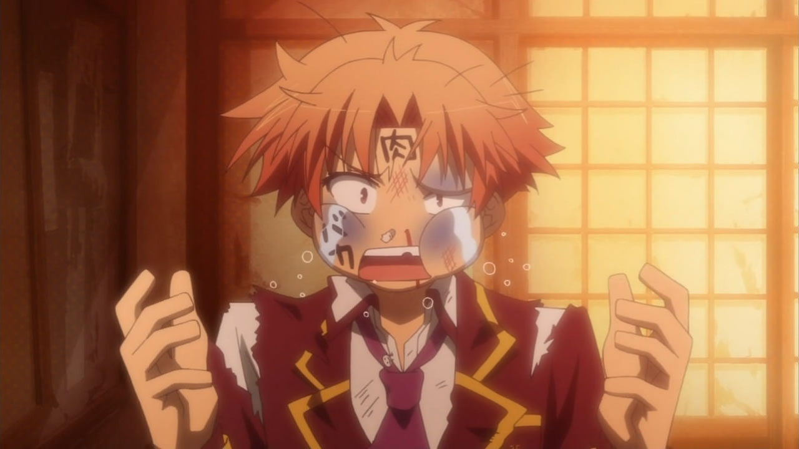
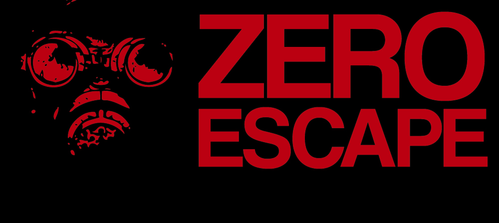
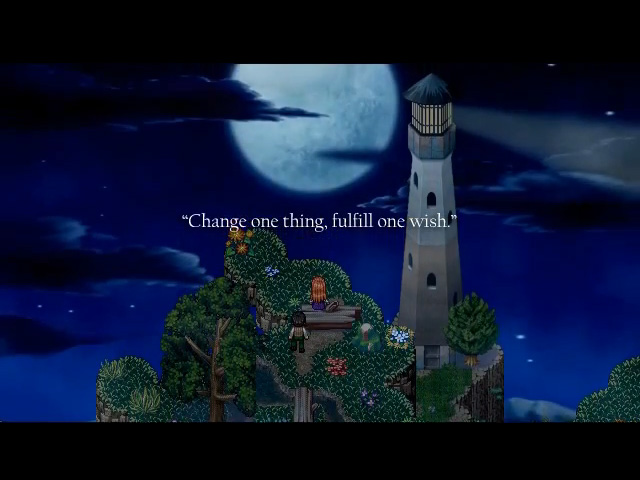
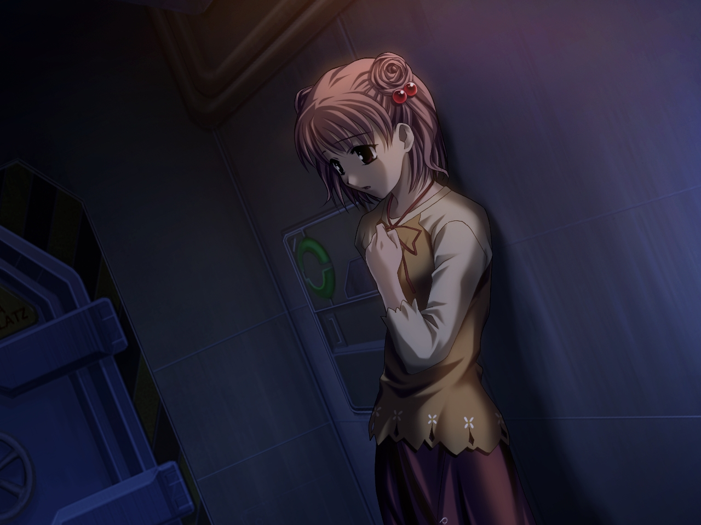
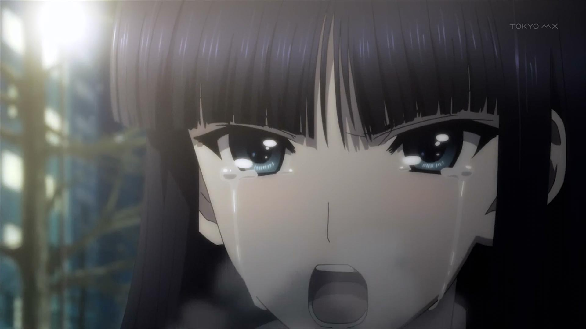
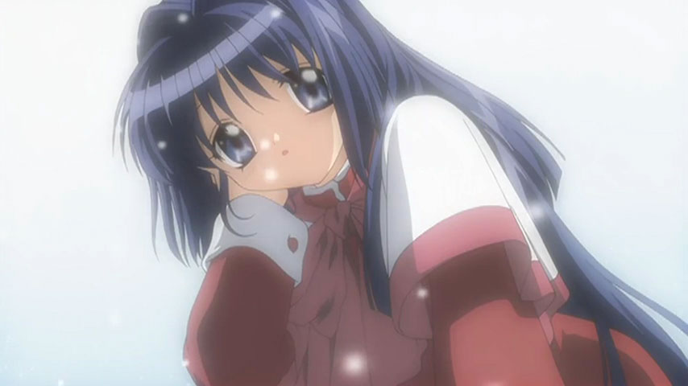

---
{
	title: "Rockmandash Rambles: My Personal Biases in Reviewing",
	published: "2015-03-08T22:30:00-04:00",
	tags: ["Rockmandash Rambles", "opinion", "bias", "Explaination"],
	kinjaArticle: true
}
---

Nobody is objective. As hard as you try, there will always be something that influences the way you view something, what makes you who you are. Knowing this set of biases is heavily important when reading one's review, and after seeing [Wrongeverytime's](http://wrongeverytime.com/2014/03/03/critical-evaluation-part-one-the-human-element/) [bias articles](http://wrongeverytime.com/2014/03/10/critical-evaluation-part-two-one-given-perspective/) that was shared over the AniTAY chatroom (which you should really read, it's pretty great), I decided it would be very much so worth my time to state my biases on media. This is what makes me who I am, how I judge media in general.

I'll start this off by stating I'm an absolute novice and amateur at reviewing literature and works of art in general. I have never got an A in an English course ever, and when I was young, I was in English as a Second Language courses, so if you read that wrongeverytime article, I'm a polar opposite. I'm not a language/english guy, and You will never find deep literary analysis from me, so please don't expect that. I do my reviews purely as a hobby: think of my reviews more as a rambling of thoughts from me to you, or a way to imprint my thoughts of a show on word, and less about the critical analysis. I do try to look at things more objectively when doing a review, but most things I make, I am as an opinion article of some sort, because that's who I am.

I judge works primarily based on the experience it provides, the thrill, the feelings, the emotion are things I love. I am a person who loves to be moved by a story, a person who cares about the influences that works have on me and what the work does to me. What does this experience focus really mean? It means I'll prioritize aspects like the narrative, the atmosphere/world and emotion more so than other aspects, and I'll explain these one at a time. Also, Let me get out of the way that while these are my general opinions and biases, this does not hold true all the time and there are shows in my favorites that go against some of these. These aren't my definitive thoughts, these are preferences on a work, and it differs from work to work.

***

# Storytelling

A meaningful story is one of the best ways you can influence a person, and a strong, cohesive narrative is a must. Due to the fact that I primarily am focused around the experience of a work, when it comes to the story, I really care about how the story is told. A cohesive, trilling, well paced, entertaining narrative that is told well is something that I look for, and these aspects are much more important to me than the characters or the writing itself. Because of this, I love works with a tight narrative, especially thrillers, which do a great job at executing the story aspects.

Funny thing about this, While people in the gaming community look down on things like *To the Moon* and *Stanley Parable* because they "aren't games" in the traditional sense, they actially fit really well with my narrative, experience oriented focus and really are exactly what I'm looking for. They provide an amazing experience, an engaging and thrilling experience that I'm enjoying throughout. You can see this in my [*How I got into Visual Novels article*](https://rockmandash12.kinja.com/why-i-love-visual-novels-so-much-and-how-i-got-into-th-1571227739), where I moved away from JRPGs because the grind was just insane.

This bias has some side effects though: because I'm really sensitive to issues with storytelling, I do really poorly with time jumps in a story that occur without any prior notice. I'm fine when they have a major event like [*Nagi no Asukara*](https://rockmandash12.kinja.com/rockmandash-reviews-nagi-no-asukara-anime-1567969970) to mark it, but when you randomly jump to a different time period without notifying the viewer, the narrative is no longer consistent, I just can't stand it ([*Shin Sekai Yori*](http://anitay.kinja.com/shin-sekai-yori-is-a-great-believable-coming-of-age-d-1670092196) being a prime example here of where it really bothered me). I also have a hard time enjoying works where I have to "turn my brain off", works that people enjoy because of the spectacle of it but have stories that don't really matter like *Gurren Lagann,* [*Kill la Kill*](http://tay.kotaku.com/kill-la-kill-the-ani-tay-review-1554090665), and [*Valvrave the Liberator*](/posts/rockmandash-reviews-valvrave-the-liberator-anime-th-1495344972). Works that fuck it's storytelling up however, with a bad scene or a bad ending are shows that I do not deal well with and I get significantly more annoyed than the shows above. I cannot tolerate events that break my suspension of disbelief, and I cannot tolerate anything that takes me out of the story, because that is an absolute failure on storytelling, regardless of if fan theories "fix" the ending, because that's not inherently a part of the story telling experience, so I get annoyed. A broken, incomplete work will annoy me much more than a bad work, and you can really see this in my sentiments on the endings of [*Remember 11*](/posts/rockmandash-reviews-remember-11-the-age-of-infinity-1687285802) *and* [*Angel Beats*](/posts/rockmandash-reviews-angel-beats-anime-1618928342). >\_>

***

# Atmosphere/World

I'm not really sure that I have much to say here, honestly, as this is probably my most documented bias... as I tend to mention it everywhere, most apparent in my [reviews of Uchikoshi works](https://rockmandash12.kinja.com/rockmandash-reviews-infinity-zero-escape-marathon-w-1664979798). I love how works create an atmosphere that makes you feel like you are a part of the work, how they manage to pull you in. This is the difference between my good and my great, and it's something I find really important. The major effect of this is that i'll pay much more attention to a [soundtrack](http://tay.kotaku.com/music-in-media-part-1-influencing-your-experiences-1654820461) than most, as the soundtrack is probably the most important element of making a good atmosphere. Also, on this vein, I love world building, and worlds that approach aspects like this in general. My love for things like dystopians and alternate histories really come into play here, as if they approach a familiar setting that they've tweaked, i'm interested in all the changes, which may not be ideal for all shows. I just like an interesting world in general, and if you pitch an idea out, you better go all the way in my opinion. \*cough\* [Aldnoah.Zero](http://anitay.kinja.com/aldnoah-zero-the-ani-tay-review-1637330529) \*cough\*

***

# Emotion

I love it when a work manages to influence me emotionally, when it clicks with me and elicits emotions, from feelz to a crushing depression. If a show makes me smile and happy, I like it, if a show makes me feel like a useless person, I tend to really appreciate how they did it, and love the experience of watching said show. The harder a punch a work can do, the better it is in my books. Because of this, you can see a general bias of mine to romantic comedies, comedies in general, dramas, thrillers, etc, shows that tend to elicit emotions rather than genres like action which focus on other aspects. Almost all of my favorites in any of these lists manages to do this, as this is an aspect that I really find important, almost a mandatory to become one of my favorites. (Granted, I'm a pretty sensitive person so this isn't hard to do at all, but it's worth mentioning.) That being said, this can lead to weird things, like how I have quite a fondness twords the objectively bad School Days anime, but that ending just packed such a punch that I adore it.. I had so much fun with that ending... XD. Another aspect is that if I don't "click" with a show that's well received, that really influences my viewpoint of a work, (like [*Fate/Zero*](https://rockmandash12.kinja.com/rockmandash-rambles-fate-zero-revisited-1637549445)) thus I'm not really the best person to do reviews on highly acclaimed, popular series. This can lead to really disastrous results, but that hasn't really happened so far because unlike most reviewers I've seen, I'm odd in the fact that I tend to take into account other people's opinions, as can seen in the polarization number, and how I write some of my reviews.

***

# Etcetera

I like shows with big ideas, and strong themes, with the respective execution: I really appreciate it when works scream out their ideals, when they emphasize their themes out so everyone notices them. I like it when they are hammered down, and I like it when they get in so much that you really feel it. This has really shown its influence with the fate series, which I really love because of the ideals they have shown in the work.

I like meta humor, and tropes quite a bit. I'm not as much of a TV troper as Dex is, but I still go through it quite a bit and I really like them.

I do have a hipster tendency to prefer obscure things over more popular things... yeah, it's pretty lame, but I find that it's nice to have your own little thing that you can self identify with so yeah. I have an article explaining this viewpoint a bit more in the works, but yeah.. that's a thing. :/

***

# Conclusion

By being able to see one's biases, it enables you to better understand the perspective of the reviewer, and why they would say stuff in that way. I personally believe that everyone who does reviewing should make an article like this that shows all their biases, so people can better gauge your thoughts on said articles. Overall, mine can really be summed up with a focus on the influence of said experience, and I hope you learned something about me as you read through this. :)

***

*Rockmandash is a frequent writer of Visual Novels and anime on *[*this blog*](/authors/reikaze)* and the *[*AniTAY Blog*](http://anitay.kinja.com/#_ga=1.196883561.473183827.1418699279)* as well. Come and check them out if you are interested in reviews and opinion pieces on these topics!*

