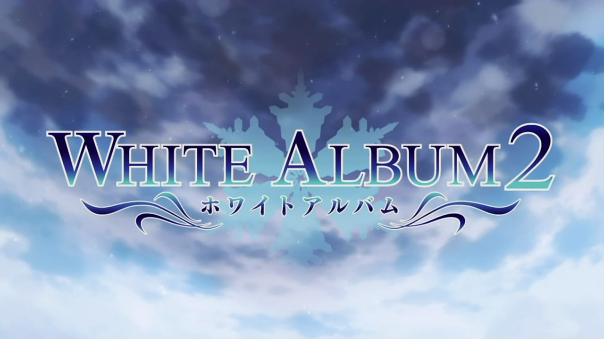

---
{
	title: "Rockmandash Rambles: Random Romances",
	published: "2014-06-08T20:33:00-04:00",
	tags: ["Rockmandash Rambles", "TAY-Classic", "My Teen Romantic Comedy SNAFU", "SNAFU. White Album 2", "Romance", "Ef"],
	kinjaArticle: true
}
---

With my schedule clearing up and I finally got started with my [Key Marathon](https://tay.kinja.com/rockmandashs-state-of-the-review-address-key-maratho-1555068823) (don't expect a review from that for another 2 weeks though), I've been in the mood for a romance so I've been watching a ton of different and random romance series because re-treading water when it's relatively fresh in your head isn't the most fun thing to do. I thought I'd talk about them a bit because I want to, but most of these have full reviews already. (i'll link to those too.) I also need to mention I've never seen a romance series I particularly disliked and it's one of my favorite genres, so one might call me biased.

### My Teen Romantic Comedy SNAFU

My Teen Romantic Comedy SNAFU is one of the most "safe" Rom Coms i've seen, but I still managed to love it to bits. I'm currently reading the LN translated from [Baka-Tsuki](http://www.baka-tsuki.org/project/index.php?title=My_Youth_Romantic_Comedy_Is_Wrong_As_I_Expected), and it's been a lot of fun. It's great to see a show that shows introverts well, pretty much anybody who wasn't always in the center of attention will be able to relate to this a bit, as it's done extremely well, especially with Hachiman, the main charecter. Hachiman is also very [genre savvy](http://tvtropes.org/pmwiki/pmwiki.php/Main/GenreSavvy) as well, which just helps with the series. I like the simplicity and the fun of this series, and anybody into light hearted rom coms should check this out. Like Dex said in [his review](http://tay.kotaku.com/dexs-review-my-teen-romantic-comedy-snafu-1466040052), it's hard to talk about this show, but it's really solid and like every rom com, I had a great time with it. Here's [Richard's review](http://kotaku.com/this-series-is-the-daria-of-anime-1115758409) if you want another opinion on the same show.

### White Album 2

This is an absolutely beautiful romance from last year that I overlooked. GO WATCH IT NOW. It has a absolutely killer soundtrack, absolutely outstanding writing, the drama feels realistic, it's a hidden gem, and it has an absolutely fantastic ending that will leave you wanting more. Like I am right now. And there is more in the form of a visual novel. but it's not translated. FUUuuuuuuu.... Season 2? Please?

White Album 2 is something you will fall in love with. White Album 2 is a great analysis of human relationships, it's simple, serious, and amazing. This show does things I love, and putting it bluntly, I fell in love with this show. It creates a perfect atmosphere, it has flawed characters that are interesting (unlike stuff like magic high with Mr.Perfect), It's real, and it's great. It's one of the best 13 episode anime I have seen with absolutely perfect pacing, and I'd say its better than Anohana. It's a perfect blend of beautiful audio, beautiful visuals, but a not so beautiful writing. Once the VN is translated, I'll give a more detailed review. But until then, take my word for it. I love it. Here are [other](https://tay.kinja.com/dexs-review-white-album-2-1488422133) [opinions](http://kotaku.com/white-album-2-is-one-of-last-season-s-hidden-gems-1541072591) for this.

### Ef - A Fairy Tale of the Two + Animes

Ok, I'm cheating here as I haven't seen this yet, but this is what i'm going to tackle next, with a full on VN review, and then an anime review after that. I'm really looking forward to this as the OP is done by Makoto Shinkai, the art looks beautiful, the music is done by Tenmon, the VN has glowing reviews all over the web, the anime is early shaft before headtilt fun. Its hard to go and play a VN after seeing an anime of it, while it's quite easy to go the other way around so I want to play through the VN first then watch the anime, but that's just me rambling. I'm looking forward to another great romance, and it looks like i'll get it from this.

I'm in a full on Romance Kick, and I'm really wanting more. What are some you guys would recommend, and what are your thoughts on these?
