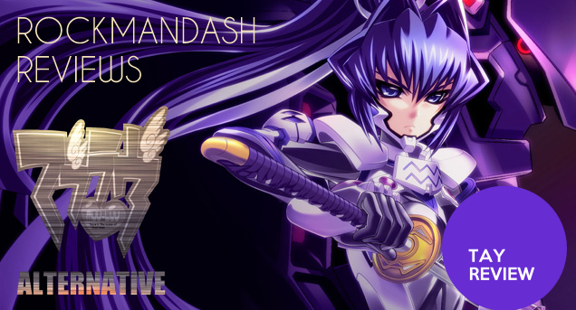

---
{
title: "Rockmandash Rambles: SacAnime Summer 2014!",
tags: ["Rockmandash Rambles", "Tay Classic", "Ani-TAY", "Convention", "SacAnime", "2014", "Rockmandash", "Anime", "Popular"],
authors: ['reikaze'],
published: '2014-08-31T22:11:00-04:00',
attached: [],
license: 'cc-by-4',
oldArticle: true
}
---

 It's that time of year again! <a class="sc-1out364-0 hMndXN sc-145m8ut-0 gIacKn js_link" data-ga='[["Embedded Url","External link","https://tay.kinja.com/tay-goes-to-pax-the-second-day-a-conflict-of-interest-1628985137",{"metric25":1}]]' href="https://tay.kinja.com/tay-goes-to-pax-the-second-day-a-conflict-of-interest-1628985137" rel="noopener noreferrer" target="_blank">CON</a> <a class="sc-1out364-0 hMndXN sc-145m8ut-0 gIacKn js_link" data-ga='[["Embedded Url","Internal link","http://tay.kotaku.com/dragon-wins-dragon-con-1628703776/all",{"metric25":1}]]' href="http://tay.kotaku.com/dragon-wins-dragon-con-1628703776/all">TIME</a>!
  I don't have the funds to go to PAX, but there's a local anime convention that is twice a year that I go to, known as
  SacAnime (in Sacramento, CA) I went to some really cool panels, saw some cool stuff, hung out with great friends, and
  had a lot of fun. I decided I'd do a write up on my thoughts.

<aside class="sc-1rh3ayr-6 jfFNjl inset--story branded-item branded-item--kinja" data-commerce-source="inset">

<a class="sc-1out364-0 hMndXN js_link" data-ga='[["Permalink page click","Permalink page click - inset headline"]]' href="https://tay.kinja.com/tay-goes-to-pax-the-second-day-a-conflict-of-interest-1628985137" rel="noopener noreferrer" target="_blank"><h6 class="sc-1rh3ayr-3 jRIPES">TAY Goes
    to PAX: The Second Day (A Conflict of Interests)</h6></a>

The morning is pitch black again... it's a weird feeling waking up when it's still
      dark. I'm just…
<a class="sc-1out364-0 hMndXN sc-1rh3ayr-0 kOvmIi js_readmore inset--story__readmore js_link" data-ga='[["Permalink page click","Permalink page click - inset read more link"]]' href="https://tay.kinja.com/tay-goes-to-pax-the-second-day-a-conflict-of-interest-1628985137" rel="noopener noreferrer" target="_blank">Read more</a>

</aside>

<h3 class="sc-1bwb26k-1 fvCjqJ" id="h114593"> PREPARE! PREPARE! PREPARE!
</h3>
This is my 3rd time going to SacAime, I prepared this time, and I felt like I had a
  better time because of it. I planned what I wanted to to to maximize time, I had a dedicated camera to take pictures
  instead of just a cellphone (which saved me a lot of time and hassle), I bought a packed lunch early so I could avoid
  the lunch rush, I had a battery pack for my phone so I could charge it while at panels and such. This preparation
  really made my experience a lot better. 

<h3 class="sc-1bwb26k-1 fvCjqJ" id="h114594">Have friends to hang out with
</h3>

"It's not about where you go, but who you go with." That couldn't be any more true
  in cons like this. hanging out with friends is half of the fun, it's just in a cool place. Here are some of my
  friends, and it was fun hanging out with them. :)
<h3 class="sc-1bwb26k-1 fvCjqJ" id="h114595"> Cosplays are Cool</h3>

As par for the course for an anime convention... there were so many great cosplays,
  and they were AWESOME! My favorites were the lancer from F/Z and the teacher from Kill la Kill. People put some
  serious time into these cosplays, and they show. While I'm not a personal fan of the whole idea, I admire what they
  do, and they come out great. I took a bunch of pics of cosplays, check this <a class="sc-1out364-0 hMndXN sc-145m8ut-0 gIacKn js_link" data-ga='[["Embedded Url","External link","http://imgur.com/a/XIj0h#1",{"metric25":1}]]' href="http://imgur.com/a/XIj0h#1" rel="noopener noreferrer" target="_blank">imgur</a> for it... but i'm an
  amateur at photography so some of the pics aren't that great.

<aside class="sc-1rh3ayr-6 jfFNjl inset--story branded-item branded-item--kinja" data-commerce-source="inset">

<a class="sc-1out364-0 hMndXN js_link" data-ga='[["Permalink page click","Permalink page click - inset headline"]]' href="http://imgur.com/a/XIj0h#1" rel="noopener noreferrer" target="_blank"><h6 class="sc-1rh3ayr-3 jRIPES">SacAnime Summer 2014 RMD12</h6></a>

<a class="sc-1out364-0 hMndXN sc-1rh3ayr-0 kOvmIi js_readmore inset--story__readmore js_link" data-ga='[["Permalink page click","Permalink page click - inset read more link"]]' href="http://imgur.com/a/XIj0h#1" rel="noopener noreferrer" target="_blank">Read more</a>

</aside>
<h3 class="sc-1bwb26k-1 fvCjqJ" id="h114596">Pretty much everyone in the
  industry who goes to panels are awesome</h3>

I went to two main panels at SacAnime this time around: J Micheal Tatum's panel, and
  Johnny Young Bosh's panel. Along with Vic Mignogna and Charles Martinet's panel (best panel you can ever go to,
  imagine his instagram posts for an hour but with actual conversation :D), that's 4 panels i've been to, and they've
  been all awesome! I really enjoyed Tatum's panel, as even though it was full of black butler fangirls, there was a lot
  of discussion about the industry and Steins;Gate. JYB's panel was weird though... he answered everything in
  song....
<h3 class="sc-1bwb26k-1 fvCjqJ" id="h114597">You are always learning
</h3>

At the J Micheal Tatum Panel, I ran into some pretty interesting news. Apparently,
  he was writing the script for the english dub for Steins;Gate while doing the Voiceover for Okabe Rintarou. That's
  some fascinating info, and stuff like that is why I enjoy going to panels. There will always be something you don't
  know.
<h3 class="sc-1bwb26k-1 fvCjqJ" id="h114598">Don't be afraid to go to
  fan panels</h3>
Probably the most fun I had all week was during the fan Anime Debate
  panel. (<a class="sc-1out364-0 hMndXN sc-145m8ut-0 gIacKn js_link" data-ga='[["Embedded Url","External link","https://anitay.kinja.com/lets-ani-debate-ani-debate-annoucement-topic-1621418976",{"metric25":1}]]' href="https://anitay.kinja.com/lets-ani-debate-ani-debate-annoucement-topic-1621418976" rel="noopener noreferrer" target="_blank">who would have thunk it?</a>) It was a lot of fun
  because there was actually back and forth discussion and such, unlike every other place where there was very little
  talking. The cool thing is that you'll probably run into people from that panel in other places, and it helps create
  friends. GO TO FAN PANELS! Btw, the guy who ran the panel was Paladincecil on youtube, and he should be uploading them
  soon. btw if you do check it out, I'm the annoying guy in the pokemon shirt :P.

<aside class="sc-1rh3ayr-6 jfFNjl inset--story branded-item branded-item--kinja" data-commerce-source="inset">

<a class="sc-1out364-0 hMndXN js_link" data-ga='[["Permalink page click","Permalink page click - inset headline"]]' href="https://anitay.kinja.com/lets-ani-debate-ani-debate-annoucement-topic-1621418976" rel="noopener noreferrer" target="_blank"><h6 class="sc-1rh3ayr-3 jRIPES">Let's
    Ani-Debate! Ani-Debate Annoucement Topic</h6></a>

Here on Ani-TAY, we have very opinionated and passionate people. These people like to
      write and…
<a class="sc-1out364-0 hMndXN sc-1rh3ayr-0 kOvmIi js_readmore inset--story__readmore js_link" data-ga='[["Permalink page click","Permalink page click - inset read more link"]]' href="https://anitay.kinja.com/lets-ani-debate-ani-debate-annoucement-topic-1621418976" rel="noopener noreferrer" target="_blank">Read more</a>

</aside><h3 class="sc-1bwb26k-1 fvCjqJ" id="h114599">Merch: Hit and Miss</h3>

Cons always have a vender's hall... the place where your wallet goes empty. Most of
  it was stuff I didn't particularly have an interest in, but there's some exceptions. (like this sumika from <a class="sc-1out364-0 hMndXN sc-145m8ut-0 gIacKn js_link" data-ga='[["Embedded Url","External link","https://rockmandash12.kinja.com/rockmandash-reviews-muv-luv-extra-alternative-visua-1567978967",{"metric25":1}]]' href="https://rockmandash12.kinja.com/rockmandash-reviews-muv-luv-extra-alternative-visua-1567978967" rel="noopener noreferrer" target="_blank">Muv-Luv Alternative</a>. ) Most of it was Titan, Eva, Gundam, Kill
  La Kill, Black Butler and cash cows like that, but I ran into quite a bit of Type Moon stuff (mostly F/Z due to it
  getting pretty popular, but there was a decent amount of FSN and even some <a class="sc-1out364-0 hMndXN sc-145m8ut-0 gIacKn js_link" data-ga='[["Embedded Url","External link","https://www.facebook.com/photo.php?fbid=689828427765267&amp;set=pb.100002143491884.-2207520000.1409535120.&amp;type=3&amp;theater",{"metric25":1}]]' href="https://www.facebook.com/photo.php?fbid=689828427765267&amp;set=pb.100002143491884.-2207520000.1409535120.&amp;type=3&amp;theater" rel="noopener noreferrer" target="_blank">F/ha</a> and KnK stuff) and I got this neat <a class="sc-1out364-0 hMndXN sc-145m8ut-0 gIacKn js_link" data-ga='[["Embedded Url","External link","https://z-n.ak.fbcdn.net/sphotos-c.ak/hphotos-ak-xpa1/v/t1.0-9/10603618_689450337803076_195453099456350374_n.jpg?oh=c94bc2a451dacda4f5b88acf169f70e4&amp;oe=5479475C&amp;__gda__=1417189217_035f4af634544991bea4197537e18964",{"metric25":1}]]' href="https://z-n.ak.fbcdn.net/sphotos-c.ak/hphotos-ak-xpa1/v/t1.0-9/10603618_689450337803076_195453099456350374_n.jpg?oh=c94bc2a451dacda4f5b88acf169f70e4&amp;oe=5479475C&amp;__gda__=1417189217_035f4af634544991bea4197537e18964" rel="noopener noreferrer" target="_blank">wall scroll, model, and decal which I put on a folder</a>. The
  Vender's hall for SacAnime have been better than this year, but it wasn't horrible. It's always fun to go around in a
  place where there's a ton of anime stuff around, and I had a good time there :)  Also... OTAKU STUFF IS
  EXPENSIVE &gt;_&gt;

<aside class="sc-1rh3ayr-6 jfFNjl inset--story branded-item branded-item--kinja" data-commerce-source="inset">

<a class="sc-1out364-0 hMndXN js_link" data-ga='[["Permalink page click","Permalink page click - inset headline"]]' href="https://rockmandash12.kinja.com/rockmandash-reviews-muv-luv-extra-alternative-visua-1567978967" rel="noopener noreferrer" target="_blank"><h6 class="sc-1rh3ayr-3 jRIPES">
    Rockmandash Reviews: <i>Muv-Luv &amp; Alternative</i> [Visual Novel]</h6></a>

 Welcome to Rockmandash Reviews, and this is my review of the highly regarded Muv-Luv
      Visual Novels 
<a class="sc-1out364-0 hMndXN sc-1rh3ayr-0 kOvmIi js_readmore inset--story__readmore js_link" data-ga='[["Permalink page click","Permalink page click - inset read more link"]]' href="https://rockmandash12.kinja.com/rockmandash-reviews-muv-luv-extra-alternative-visua-1567978967" rel="noopener noreferrer" target="_blank">Read more</a>

</aside>
<h3 class="sc-1bwb26k-1 fvCjqJ" id="h114600"> Artist alleys don't always
  rock</h3>
 So far, every one I've been to has had an awesome artist alley, which is where
  fans can sell their own stuff. Not so much this year. There was only 2-3 stands I cared about this year, with the only
  thing I bought being some cool stickers. 

<h3 class="sc-1bwb26k-1 fvCjqJ" id="h114601">Don't be afraid to talk to
  strangers</h3>

Everyone at a con has a common interest, so strike up some conversations! Talking to
  people is some of the most fun you will have at a con! That's a big part about what made the Debate panel so much fun.
  A great example of this was when I was waiting for a ride when some guy came up to me and started to ask about my
  camera, the NEX-3N. I then had a pretty fun discussion about cameras and such. Another cool one was when a guy came up
  at the end of the panel to discuss the best anime ever and brang up Umineko. I interjected saying that the anime sucks
  while the VN's pretty good, then after the panel ended, we had a great discussion on Vn's and umineko (which I'm
  currently playing through and may be my next new review)
<h3 class="sc-1bwb26k-1 fvCjqJ" id="h114602">Con-Goers know very few shows</h3>

So, I thought that cowboy bebop, FLCL, and Oreimo were pretty popular shows. During
  the anime debate panel, the guy running it brang up questions like weirdest anime character (Which I said haruko from
  FLCL because that shit's crazy), and Which Anime Character would be the best to bring to a con like this (which I said
  Kirino from OreImo because otaku are the best type of people to come to stuff like this and just remembering her
  reactions to Comiket and Akihabara were great) and each time I brang up characters I thought were from shows that had
  a repetitively large fanbase, nobody recognized. When somebody brang up Lain from Serial Experaments lain, only 2
  other people (including me) recognized her, and when someone brang up ein from Bebop... same thing. Con-goers only
  know the really popular stuff like attack on titan. :(
<h3 class="sc-1bwb26k-1 fvCjqJ" id="h114603">We are a minority</h3>

Us seasonal anime watchers and people who care about character development and
  quality of said show... yeah nobody gives a shit. I felt like I was the only one there that watched shows that weren't
  black butler or Attack on titan... and it kinda sucked... :( Every time I pointed flaws in well known shows like
  attack on titan, people would give me a fanboi reaction back, or when I talked about how great something is, nobody
  cared. I couldn't strike up conversations on how Kara no Kyoukai Paradox Spiral was the greatest thing ever because
  nobody's heard of it, or even about stuff from a few seasons ago like golden time. To those who don't know what shows
  we are talking about here on Ani-TAY, don't feel bad. Most people don't, even at cons.
<h3 class="sc-1bwb26k-1 fvCjqJ" id="h114604">The western anime market is doomed</h3>

Running on the theme of there's only a few shows people care about... yeah there's
  no wonder why the Japanese market hikes the prices up... because there's such a niche market. There was a lot of
  people there sure, but none of them gave a shit about 90% of what's out there. If it's not big like AoT, nobody cares
  and it won't sell well, especially in the west. There's a reason why <a class="sc-1out364-0 hMndXN sc-145m8ut-0 gIacKn js_link" data-ga='[["Embedded Url","External link","https://anitay.kinja.com/rockmandash-rambles-why-you-should-fund-under-the-dog-1626833454",{"metric25":1}]]' href="https://anitay.kinja.com/rockmandash-rambles-why-you-should-fund-under-the-dog-1626833454" rel="noopener noreferrer" target="_blank">Under The Dog</a> hasn't hit the kickstarter goal: because the anime fanbase here
  in the west don't care about the future, or the quality of the show. They only bandwagon on what their anime friend
  told them was good.... and the horrible part about that is they don't even go to legal sites to watch them... just
  piracy. This can't be sustainable for a market, and it truly shows that we are pennies to the Japanese market who buys
  stuff like this on a day to day basis, and watches all the types of shows. If you haven't read this yet, check out
  this <a class="sc-1out364-0 hMndXN sc-145m8ut-0 gIacKn js_link" data-ga='[["Embedded Url","External link","http://www.animenewsnetwork.com/feature/2012-03-05",{"metric25":1}]]' href="http://www.animenewsnetwork.com/feature/2012-03-05" rel="noopener noreferrer" target="_blank">ANN post about Anime Economy</a>
  that'll help you with understanding the industry a bit more.

<aside class="sc-1rh3ayr-6 jfFNjl inset--story branded-item branded-item--kinja" data-commerce-source="inset">

<a class="sc-1out364-0 hMndXN js_link" data-ga='[["Permalink page click","Permalink page click - inset headline"]]' href="https://anitay.kinja.com/rockmandash-rambles-why-you-should-fund-under-the-dog-1626833454" rel="noopener noreferrer" target="_blank"><h6 class="sc-1rh3ayr-3 jRIPES">Why You
    Should Fund <i>Under The Dog</i>, and What this Kickstarter Represents</h6></a>

When I first saw Under the Dog, I wasn't exactly sure what to think about it. I
      thought that it…
<a class="sc-1out364-0 hMndXN sc-1rh3ayr-0 kOvmIi js_readmore inset--story__readmore js_link" data-ga='[["Permalink page click","Permalink page click - inset read more link"]]' href="https://anitay.kinja.com/rockmandash-rambles-why-you-should-fund-under-the-dog-1626833454" rel="noopener noreferrer" target="_blank">Read more</a>

</aside>

Cons are a fun time, if you can get over the fans. I had a blast, and if you go to a
  con like this, I hope you do too.

