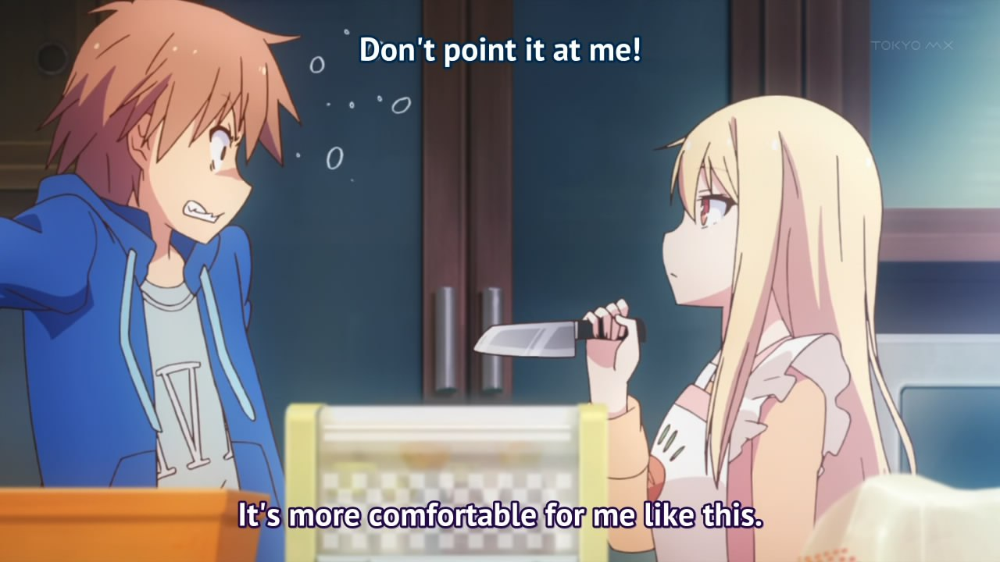
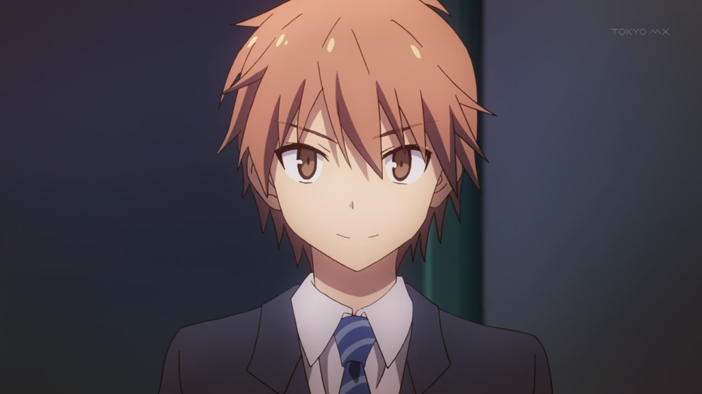
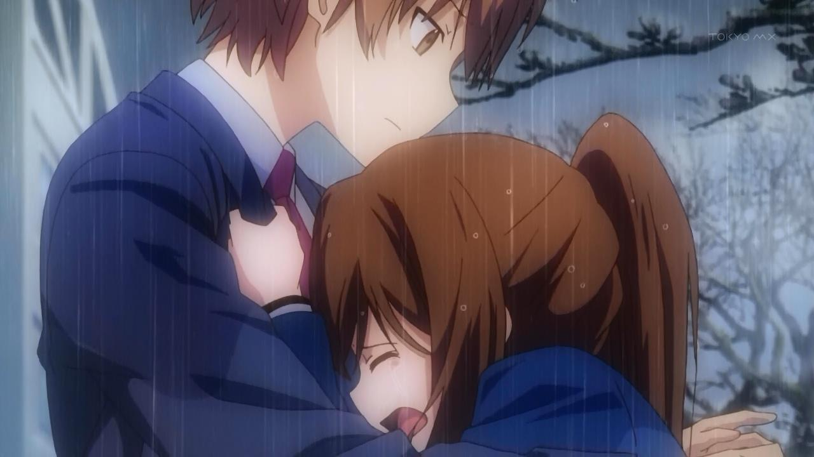
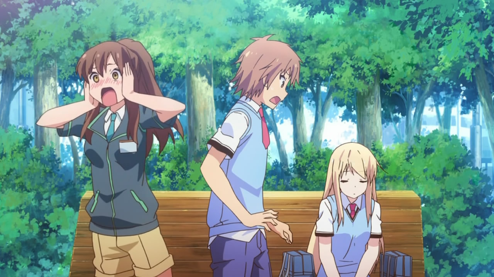
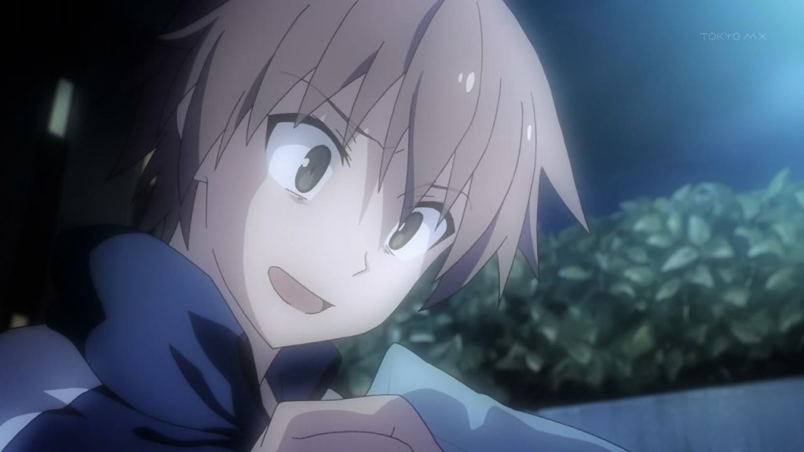

---
{
	title: "Sakurasou is the first Romantic Comedy that caused me to despair.",
	published: "2014-07-10T19:48:00-04:00",
	tags: ["rockmandash rambles", "sakurasou", "the pet girl at sakura hall", "hate", "personally"],
	kinjaArticle: true
}
---

I made a [post](http://anitay.kinja.com/rockmandash-rambles-random-romances-1587882529) about a month ago about random romances I was watching, and I asked a few recommendations. I have been watching more Rom Coms like Ano Natsu de Matteru, Kokoro Connect, Date a Live, etc (which were all fantastic, but that’s for another time). Due to the recommendations, I checked out The Pet Girl of Sakurasou. I came in liking it, but came out hating it.

**WARNING- This isn’t a review. It’s my raw thoughts. It’s way too personal, ranty, and angry to be a review, and i’m not summing over anything so if you haven’t seen the show, go and do so. If you want a review, go and check out **[**Sylverfyst’s review**](http://tay.kotaku.com/ani-tay-review-sakurasou-no-pet-na-kanojo-1042340894)** or other random reviews on the internet for a more objective article. This isn’t a great article anyways, I just need to get this off of my chest. ALL OF THIS IS MY OPINION, AND YOURS MIGHT BE DIFFERENT.THIS DOES NOT MEAN SAKURASOU IS A HORRIBLE SHOW.**

***

Sakurasou is a deceiving show. It is advertised as a moe fanservice show, but in reality it’s about your dreams and determinations. The fanservice that intros the show fades away to be replaced by a hammy drama ( this show was VERY HAMMY AT TIMES). This is a show that puts hard work, effort and dreams in a ring with Brilliant raw talent. Guess who wins? Brilliant people are something to admire, but how does the radiance they have effect you? Take that concept, add romantic comedies and eccentric personalities, and you got Sakurasou. Not what you were expecting, eh? Well it certainly was not what I was expecting. Sakurasou as a show, isn’t bad, but the messages it sent with the decisions it made, pissed me off. The execution of marginalizing everything that wasn’t blessed, pissed me off (ex: everybody but the main cast, The guy Aoyama rejected, etc.)

I think that the story of friendship and that you can get through anything as long as you have a person with you that can support you was beautiful, but the message that the journey is more important than the results is something I’ll never admit to. People’s success and failures guide who we are. The main message this show has is something I’ve personally believed in a long time: Effort isn’t everything. The message of accepting failure and accepting your place in life is something I’m still trying to deal with, and I’m sure many of you are too. Put on face value, these are great lessons in life, but the way Sakurasou goes out of it’s way to bring the worth of effort up and then throw it out into the streets, beat it up, kick it, burn it until it’s crisp, and make effort and dreams of a not brilliant person the most pointless and futile thing in existence under the hands of pure and raw talent, pissed me off. It hurt, especially after they show how important it is to the characters.

Yes, at equal skill levels, the one who puts the most effort into the work will do better, but in real life there are conditions that will sway how successful you are. Connections, raw talent, the surroundings around you, personality, memory, competition, etc, there are so many elements that limits the level of success you can have. I’m one of those nerdy honors kids, but in my honors classes, I’ve never been the best. I’ve always have been one to try my hardest to do the best I can when I truly care about it, when it comes to school or these reviews. I personally believe that I worked hard to get where I was, and to see a show use inspiration and effort to lead the viewer just to have that shining effort and progression smashed, was heartbreaking. I loved the ride to that, it was my beliefs wrapped up in a funny package. But then they crushed it. The representations of my hopes, my dreams, and my actions crushed within a day. Yeah yeah, you could see it a mile away. Yeah yeah, the characters all rebounded, gave it their all, and were better for it. But what message does that send to the people who try and consistently fail, or to those who don’t have those friends that can push them back up? Brush it off and continue compete with people way above your league until you break? Have the popular and brilliant save the day when your futile efforts slowly fade away? That was the message the show sent to me, not the chasing your dreams until you find your place message that it was supposed to send. At the end, the shipping of Mashirou over Nanami was just pushing that idea, that brilliant radiance wins all.

In many ways, I think I’m a lot like Nanami: I’m a try hard, I’m relatively smart but I don’t shine like others, I have family that is opposed to what I love and what I want to do, I’m a crybaby, and I’m a relatively boring person who tries to take most things seriously. Almost every flaw that Nanami has, you could probably find in me. (Yes, this means I can be horrible at times. This post is probably just that; Me being a horrible person.) I fell in love with Nanami as a character, and seeing her dreams and chances crushed, was like crushing my own dreams. You can tell me I need to get over it, the journey is more important... But seeing dreams crushed like that is depressing. I was rooting for Nanami the whole time, and seeing the show ship it the way it did... I’m pissed. Everything I was hoping to happen in this show, didn’t. A good example of this is the fact that I love good endings. This ending, made me feel burned. The ending while technically fantastic wrapping everything up well, leaving you wanting more and having a slight epilogue, just didn’t do it for me. The ending ended it off with Sorata and Nanami’s situation still being kinda being bad, and Mashirou essentially getting everything she wanted.

This show loves it’s radiance and putting the normal people in despair. They do it all the time. Mashiro is this message as a character and I can pull so many examples. Episode 4. Mashiro got 100% on everything with one glance. I’m one who has a horrible memory, I need to jam things in for days before I remember it, and sometimes that’s not enough. I spend hours studying, to luckily get an A- or lower, depending on the test. To see a **\_frankly IMO\_ IDIOT AIRHEAD WITH NO COMMON SENSE GET 100s ON EVERY TEST,** that pissed me off. I absolutely hated her by the end of the show. She has no comprehension of how the world works... But she’s a genius. Why can a person with no concept of the world shape her life into the way she wants it, fulfilling all her dreams? She wants everything and gets everything. When Sorata said to apologize to people who put effort, I was actually hoping a sincere apology, but of course knowing Mashiro and the show, that was way too much to ask for. This is a common theme with the show, it made me question if the effort is worth it. Seeing this consistent failure One of the icings on the top of the cake was the letter from the game company asking Mashirou to do art, while right after rejecting Sorata. That was the show saying FUCK YOUUUU to Sorata, and sanity. Even if you have no interest in what we do, even if you don’t have passion, because of your raw talent, we want you. That may be life, but that just BURNSSS. I haven’t been this upset or pissed at a show in a long time. This took a representation of life, and shattered it. Unlike the main characters though, Many people probably won’t have a Sakurasou when they eventually crash and burn. This show made me cry. This show made me cry in ways I’ve never cried due to a show before. This crushed dreams, and told me that normal people aren’t good enough. This show made me cry due to my personal sadness, and I’ve never seen a form of media do that before.

It’s the journey that matters not the results, right? Is this something that you people call amazing? This message makes a good show? This is one of the harshest and negative shows I’ve seen, in terms of the message it presents. Maybe I have rose tinted glasses at me hoping for everything to go well. Maybe I love the cliches a bit too much. Yes, this stuff is ignored by every other romance show. **BUT THAT’S BECAUSE THIS IS NOT WHAT MAKES AN ENJOYABLE SHOW**. If this was a review, and I had to give a personal enjoyment rating, I’d give it less than 4 because the despair made me hate it. It was not up my alley. Is a spiral to success too much to ask for?

Mari Okada, you did it again. Making shows that make me have strong feelings twords (and this time against) a show. This is a show that made me smile, laugh, but most importantly, despair. If there’s anything that’s a deconstruction of the moe romance genre, we have it right here. This is a show that prides itself on ideals, the less normal and more brilliant you are, the better. If you are a normal person wishing to succeed, you are going to crash and burn. How can I like a show that is refusing hopes and dreams? No matter how excellent they execute it, any show that believes in that is just not for me, and I’ll hate it.