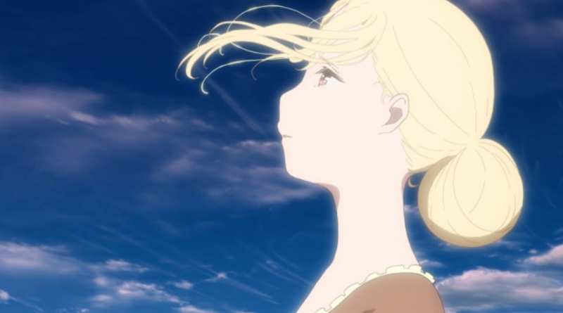

---
{
	title: "RockmanDash Rambles: Some Thoughts on the Character Leilia from Maquia: When the Promised Flower Blooms (Spoilers)",
	published: "2018-07-24T18:06:00-04:00",
	tags: ["Rockmandash Rambles", "Maquia", "Anime", "Anime Movie", "AniTAY"],
	kinjaArticle: true
}
---

When I walked out of* Maquia*, I had a ton of thoughts, but a lot of what was brewing in my head was in regards to one of the side characters, Leilia. These are some thoughts about Leilia that i’d like to comment on here, because it would be rather inappropriate to have in a review due to spoilers**. This is a spoiler filled side article to my main review Maquia, so if you haven’t seen the film or**[** haven’t read that first**](https://rockmandash12.kinja.com/rockmandash-reviews-maquia-when-the-promised-flower-b-1827838489)**, go do that!** With that out of the way, let’s get these thoughts out of the way!\
\
**THIS IS A SPOILER FILLED ARTICLE - DO NOT READ IF YOU HAVEN’T SEEN THE MOVIE!!!**

***

Leilia is a fascinating character - in regards to the overarching plot of the movie, she might be the most important character in the story, but in practice she isn’t all that important because *Maquia* isn’t necessarily focused on the premise but the characters and themes it’s trying to express. This means that Leilia gets very little real screen time, which is really a detriment to the film as a whole, because Leilia as a character is arguably a more interesting character than Maquia. While Leilia is haunted by her situation, as a character she’s entertaining to watch, while being spunky, and passionate, which was a lot more enjoyable than Maquia is a cardboard of a character who’s only real defining trait is her motherhood (Though, Maquia does get a lot of development in this front, making her a fascinating and interesting character, but this doesn’t change the fact that the base personality of Maquia isn’t all that interesting). Also, what she goes through can be considered to be more fascinating than what we witness through Maquia.

While Maquia is swept away by a rogue dragon, finds Ariel, and is dumped into society, Leilia is kidnapped by the invading army of Mezarte and is forced to have a child with the prince of said nation in the hopes that they can weaponize the eternally long life that the Iolph clan has. While Leilia starts out in love with Krim and serves as a positive foil to Maquia, being a strong and capable character of doing anything, we actually see none of that throughout the film - Leilia serves as a foil to Maquia in mostly tragic ways. While Maquia is someone who experiences the outside world, Leilia is trapped inside the castle, and while Maquia takes every attempt to free herself from the ideas and situations she’s in, Leilia is afraid and does not. Maquia is not a mother who wants to be a mother, Leilia is a mother that can’t truly be a “mother” - the Mezarte staffers keep Leilia separated from her kid. Maquia, while living a rough life, is ultimately happy and fulfilled with what she’s done - Leilia on the other hand is tormented by the decisions she’s made; only kept sane by the idea of her child… while Maquia actually lives and experiences what it’s like to be a mother.

The dynamic between Leilia and Medmel, people who long to see each other but cannot, ultimately not knowing who each other are in the end is fascinating and I wish they explored it more. The interaction between each other, with Medmel not even knowing who leilia was absolutely tragic. Imagine obsessing over someone for years, only for them to not even recognize who you are.. What would it truly be like to be forcibly separated from your child, even though they live so close by? What would it be to be royalty but never have actually seen your mother?

It’s absolutely fascinating how much her actions and the events that happen to her contrast what Maquia goes through, Leilia’s arc is one of my favorite parts of the film- while Maquia’s arc is the best case scenario in the end, with Maquia ultimately learning that goodbyes don’t have to be tragic and embracing everything that is a part of her life, Leilia’s arc is nothing like this. In Leilia’s arc, she tells Medmel to forget about her, she wants to wipe out her own existence from Medmel’s’ life because ultimately it’s nothing but pain. What she says is a complete counter to the main story in the film and is a fascinating tragedy that I wish they explored more.

There’s a pretty big issue with her arc though - her meek actions throughout clash with her personality and she’s not really a very consistent character, which hurts immersion. (This, is actually a fun link from Maquia, whose decision to take Ariel in makes very little sense, but who’s meek personality is clashing with strong actions throughout.) She starts out as the tomboy character who who’s strong and capable of doing anything, but she doesn’t do anything! We actually see none of that strong will until the very end! I spent the whole film wondering when she would show the strong will, and wondering, why she was so meek even though the movie introduced her as a strong character. Because of this, there’s a *what if *factor with her character that is really appealing, and is a big reason why even when the movie ended, I was still thinking about her. What if she escaped, what if she snuck out and met Medmel and became a true mother. What if she took down the Mezarte nation instead of the coalition in the form of a coup d’etat? What if?

Ironically, in the end it takes Maquia screaming “fly!” to unleash the courageous nature that Leilia has. She becomes the person she used to be, and aims to wipe away the tragic experience that was her life in Mezarte. In the end, while their lives and approaches were different, both were moving forward with their lives and because of that, managed to find some form of happiness in their lives, counter to other characters like Krim. It was an interesting end of the film to an interesting character, and I for one really wish we got more of her throughout the film.

***

*Thank you for reading! This is Rockmandash Reviews, a blog focused on everything revolving Visual Novels, with stuff like tech and anime every now and then. If you want to check out more of my writing, check out *[*FuwaReviews*](https://fuwanovel.net/reviews-hub/)* and *[*AniTAY*](http://anitay.kinja.com/#_ga=2.29830716.283022684.1516595779-1252363867.1516472140)* where I am a contributor and *[*follow me on Twitter*](https://twitter.com/RockmanDash12)*.*
