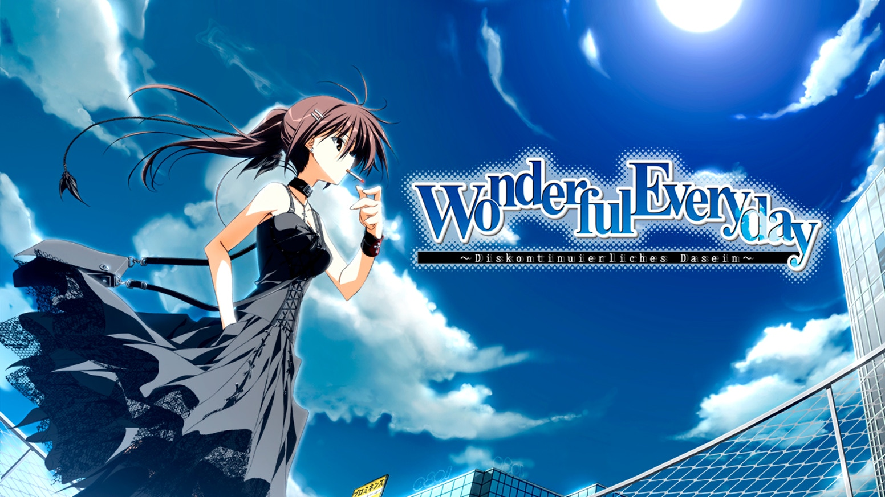
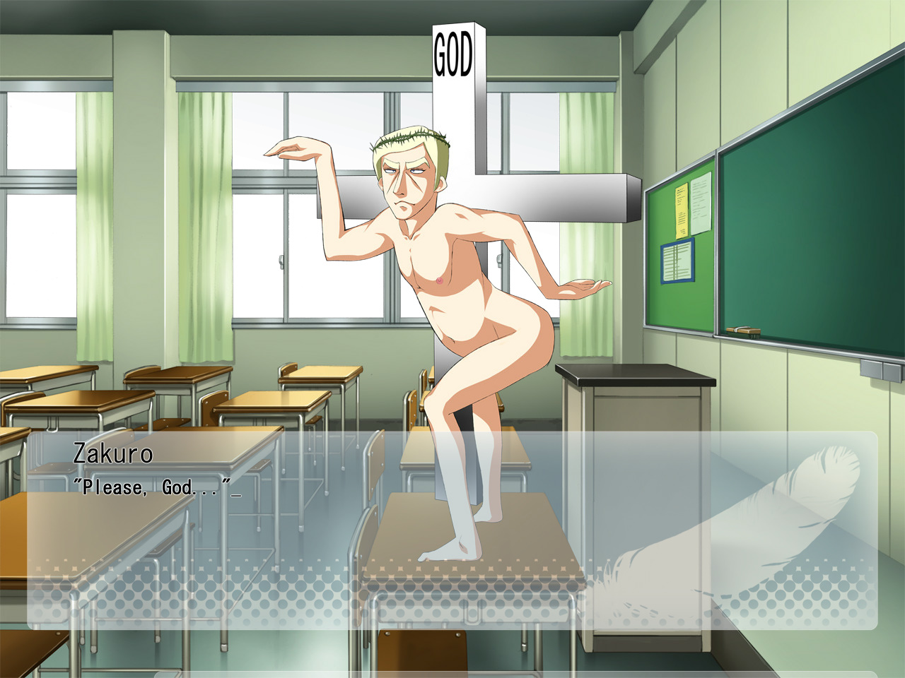
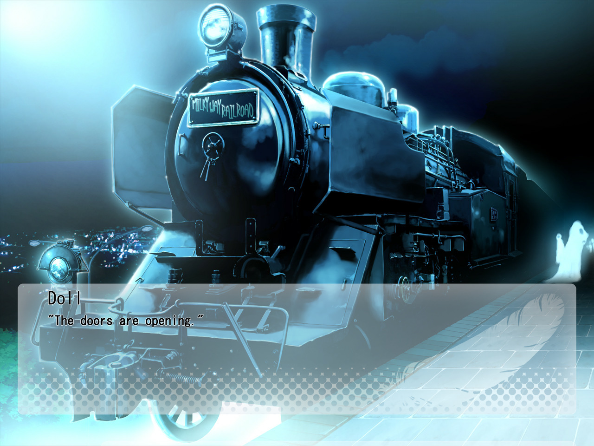
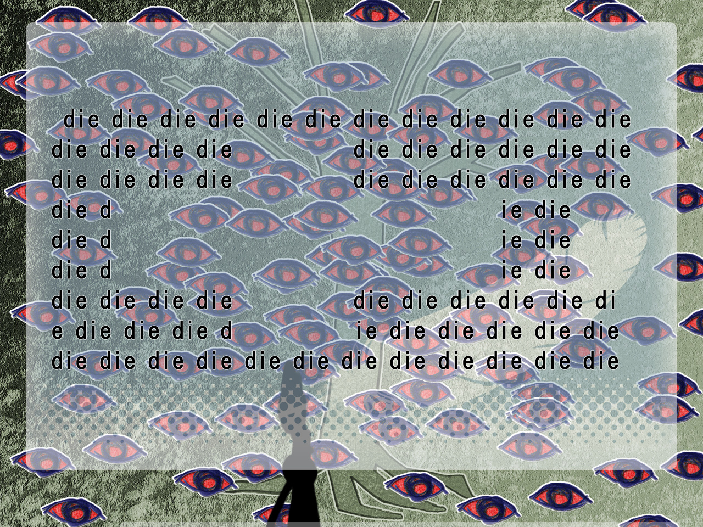
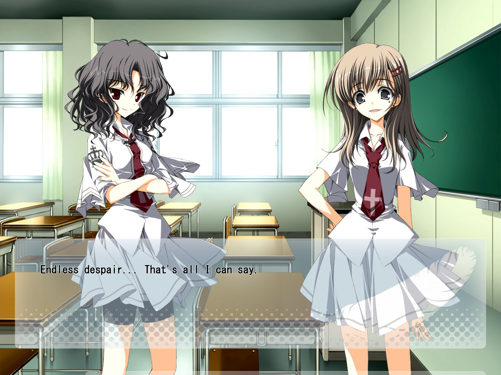
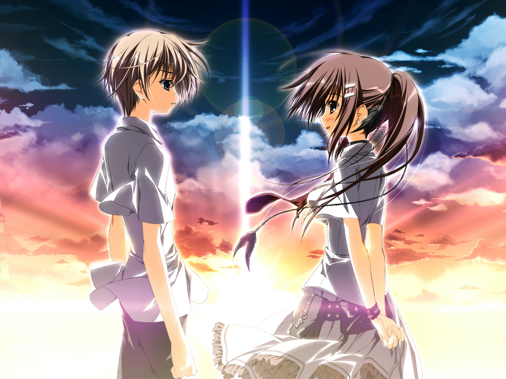

---
{
	title: "Rockmandash Rambles: Subarashiki Hibi",
	published: "2017-10-18T19:15:00-04:00",
	tags: ["Rockmandash Rambles", "RockmanDash Reviews", "Fuwareviews", "subahibi", "Subarashiki Hibi", "Wonderful Everyday", "Visual novels"],
	kinjaArticle: true
}
---

神ゲ(Kamige) is a controversial Japanese internet slang word that literally translates to “God game”. It’s a word used in the Visual Novel community referring to the best VNs that will never see the light of the day anywhere else outside of the holy Japan... but as the tides change in the Visual Novel industry, so do our perceptions on the games themselves.

*Wonderful Everyday* or *Subarashiki Hibi *(will be referred to as *Subahibi* from now on) for the longest time was known as one of these Kamige that we never thought we’d actually get. From its questionable content and rather complex script to its troubled translation,* Subahibi* was a nerve wracking wait, but it’s now available for your enjoyment. It’s a victory for localization, but is it worth playing? Welcome to RockmanDash Rambles, and here are my thoughts on the latest Kamige to come to westward.

***

Let’s get the easy stuff out of the way: The presentation of* Subahibi* is great, and serves to enhance the core of the story as it really should. *Subahibi*’s visuals are absolutely on point as *Subahibi* has a well done and unique art style that is always pleasing to the eyes, and is absolutely fantastic in moments with CGs that can take your breath away. To complement these visuals, the music is just amazing, being one of my favorite Visual Novel soundtracks. It’s beautiful and memorable, a score that serves as a standard for what a soundtrack should be like. The score sets an amazing atmosphere as well, both drawing attention to itself while never really getting in the way with the experience. It’s also used exceedingly well, adding the needed emotion that allows *Subahibi* to be as moving as it is. I adored the presentation in the game and can easily say that these are great positive contributions to your experience.

But outside of the presentation, where the meat of* Subahibi* lies? Even though *Subahibi* does what it sets out to do exceedingly well, I personally didn’t like it at all, and because of this I don’t think I can really make a traditional review for *Subahibi*. With *Subahibi*, I feel like that there are too many of my personal biases that prevent me from judging this work for what it is. Your experience will be different from mine, and your biases and tastes will have a significant impact on your enjoyment of this game. Therefore, I’m not calling this a regular “review”, but I hope you enjoy the read regardless.

When I started to play through *Subahibi*, I came into it thinking that this wouldn’t be my kind of game. With the praise around the community with *Subahibi *being one of the most profound work the genre has to offer, I was expecting for my viewpoint to change, but ultimately it didn’t, simply because of the goals that this work sets out to achieve. To me, a work being profound with fascinating ideas is nice, but ultimately, this is not what I sign up for when I play a Visual Novel. What I hope for, what I look for out of this medium is primarily a narrative driven experience first and foremost, a work that that can create a cohesive and enjoyable narrative that one can get immersed into. This can be seen in my list of favorite Visual Novels, with almost all of them focused on that. *Subahibi* then, is a complete 180 of my tastes, being the antithesis of the Visual Novels I like, with a complete disregard to structure and experience that I enjoy so much. That being said though, this isn’t inherently bad: in *Subahibi*’s complete disregard for providing a scripted and enjoyable experience, it provides a wild ride unlike anything else, and depending on who you are, this might be exactly what you are looking for.

If you read any review of *Subahibi*, you’re probably going hear this, but it’s really quite hard to summarize and describe what *Subahibi *is like. A large portion of this is because of the complex nature of the work, and the fact that *Subahibi* is a spoiler landmine because there exists many structural aspects and story elements that must not be revealed for the player to have the full experience… but If you asked me, the biggest issue with summarizing the plot that many people have is that, frankly the story doesn’t matter. It’s simply a backdrop for the ideas and experiences that this game has. As a matter of fact, the plot never really goes anywhere, and that’s entirely the point.

Unlike most works that progress in a linear time period, from beginning to end, *Subahibi* is comprised of 7 cyclical chapters, each with a different protagonist. The chapters are *Down the Rabbit Hole I, Down the Rabbit Hole II, It’s My Own Invention, Looking Glass Insects, Jabberwocky I, Which Dreamed it *and *Jabberwocky II*. Each chapter feeds you more information about the game and situation, but this is not done by progressing the story, but through telling the same story in a different perspective. It starts as a mystery with nothing really explained, but as you progress through the story, more and more about the situation starts to unravel.

Personally,* Subahibi*’s structure is one of my biggest gripes with the work, and it means we don’t see the story progress further, highlighting its inner viewpoint, but I also felt the work I felt like it was aimless early on, and boring because of the repetition. That being said, While this structure may make the work seem like these chapters would be overly similar to each other, every chapter is basically an entirely different work from the others, with materials and ideas that is completely out of left field from the previous chapters. The different perspectives have different experiences help you construct a more complete picture of the work itself, and ultimately, to tell you the philosophical message it has.

*Subahibi* convey its ideas through a gauntlet of extremely visceral and extreme experiences, with very high peaks, and very low valleys. There are moments where it feels like nothing in the world could be better than what* Subahibi *has to offer (*Jabberwocky I* comes to mind), there are other moments when the work is is jaw dropping in excitement and beauty , but when talking about the collective of *Subahibi*, I can’t really say that it lives up to the hype, or even to the point that I can say I truly enjoyed the work as a whole. This is because of the controversial content in this game as this Visual Novel has some of the most fucked up shit I’ve seen in the medium. I don’t think I’m really exaggerating with either as *Subahibi*’s controversial content really took a toll on me and made it hard for me to enjoy the game. I felt it overwhelmed the rest of the experience, with certain scenes and what felt to me as perpetual pain serving as an unjust punishment for the reader. I know a lot of people were deeply impacted by the message this work has to offer and can overlook the painful experiences as they can be seen as adding to the message, but I couldn’t. The message was extremely overshadowed by the experience that I had with it and in the end, I actually found the message itself to be extremely underwhelming, given the amount hardships the player has to go through.

A lot of this has to do with the cast of characters. There are a significant amount of fantastic characters and I wish I could describe why without a ton of spoilers and rambling on about unrelated stuff for days (I absolutely loved the character Yuki for an example, and Kimika is a bright spot in a pit of despair), but there are a lot of characters that are written to be hated, and they can ruin your experiences. Shitty teachers, one dimensional bullies that take things absolutely too far, and more, your choices for characters to hate are abound here.

And then there’s Mamiya Takuji. He’s not meant the most likable character, but he hindered my enjoyment to the point that I didn’t want to read the work because of his perspective, or because of his sheer presence. He is everything I hate out of a main character and I’m sure that was on purpose as that enhances some parts of the story later on, but that doesn’t make the experience of having to read from his perspective any less painful.

In the end though, *Subahibi* isn’t about the story,* Subahibi* isn’t about the characters. It’s about the raw ethereal experience that is the result of being shown events and ideas, and to get something out of *Subahibi*, you really need to resonate with the work itself. There are parts that I did enjoy and I do have to say that it is quite well written, but I felt like I didn’t really get anything out of *Subahibi*, and I felt like none of the the themes and messages it was trying to tell quite resonated with me in any way. All I can come out of this game with a bunch of experiences but I don’t really think I can say that I came out with a unifying, singular message that influenced so many others.

That being said, Subahibi works for a lot of people, with its beautifully written, deeply introspective and personal experience serving to resonate with many. But if you’re looking for a work with a story driven experience, I highly suggest you look somewhere else. This is a work that is looking in, and you need to look in with it. Ultimately, Subahibi didn’t click for me but there are definitely many people who enjoy this work, however and if it sounds like this is up your alley, give it a shot.

***

*Thank you for reading! This is Rockmandash Reviews, a blog focused on everything revolving Visual Novels, with stuff like tech and anime every now and then. If you want to read more of my writing, check out *[*FuwaReviews*](https://fuwanovel.net/reviews-hub/)* and *[*AniTAY*](https://anitay.kinja.com)* where I am a contributor or follow my twitter, *[**@RockmanDash12**](https://twitter.com/RockmanDash12)*.*
