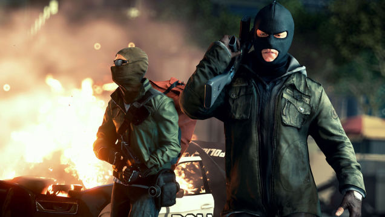
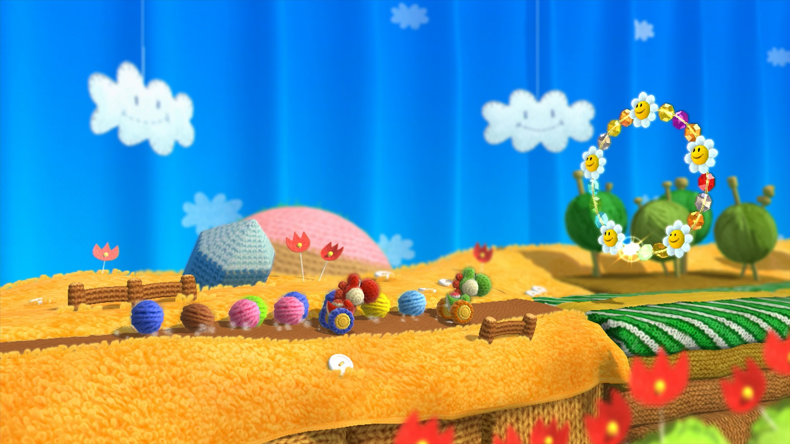

---
{
title: "Where did variety in games go?",
tags: ["Rockmandash Rambles", "Variety", "in", "gaming", "AAA", "Indie", "Nintendo", "FPS"],
authors: ['reikaze'],
published: '2014-06-10T23:44:00-04:00',
attached: [],
license: 'cc-by-4',
oldArticle: true
}
---

It's E3, the time of the year to get hyped about the awesome new games. It's the time of
  year where you watch press conferences of companies that you don't care for because everybody talks about them, and
  the time of year where the world gets to see the trends of the industry. Unfortunately the industry is going in a
  direction I don't care for, even more so than it has before.

 Maybe I'm wrong about
  that last claim, but as I was watching through MS's and Sony's press conference, all I could think of was.... "I don't
  care about your guns, and I want to see something that is not a shooter, high fantasy, casual, or racer." Don't get me
  wrong, E3 this year was pretty solid and a lot better than the years past, but Variety is the spice of life; I really
  want a flat out fun game (because it seems like devs suck at meshing a plot with fun gameplay), but all i'm getting is
  the same games over and over again, and they are in genres I've never been the biggest fan of. Don't get me wrong, I
  don't mind shooters, or cinematic experiences (trust me.. I love a good story), but I need some fun in my game.
  Colors, fast action, puzzles, something that's not about killing some other person while still being good... is that
  too much to ask? At this point, it really feels like it is and that's why I spend so much time playing older games. It
  seems like, especially now, games are having a hard time melding a good plot with a fun time, so I'd rather see games
  try to make me smile, but I'm not getting that. 

It seems like console makers and larger devs are relying on indie devs to provide
  the other genres.. it seems like all AAA makes are the same few genre of games, and it's a lot less than it used to
  be. What happened to the platformer? The Puzzler? The 2D fighter? The SHMUP? The RPG? The Point and Click adventure?
  What happened to games with a sense of speed that wasn't in a a car? What happened to experimentation? What happened
  to games that were beyond the bounderies of earth? What's with all these games trying to be so realistic? Maybe these
  have been gone and their absence hasn't been noticeable to me until now, but I'm really disheartened.... It was really
  noticeable this year. The consistent stream of nothing but FPS's means I'm just not interested in new games, and it's
  killing the fun in gaming.

The one exception to this.. is Nintendo. They showed games with color. They showed
  party games, or games about exploration. They showed things with the objective of not killing people, for the purpose
  of fun. They showed games I'm truly exited for, and games that play differently than the rest of the industry. They
  showed fun with friends, they showed the platformers I've been hoping for (well Sony showed LBP and I'm happy about
  that, and there was no 3d platformer), and variety. If this means I'm a nintendo fanboy, go ahead! call me a fanboy.
  I'll be a nintendo fanboy until the rest of the industry starts providing the experiences i'm used to. I'll take my
  colorful worlds, charming visuals, fun/entertaining presentations and varied experiences, thank you very much.

