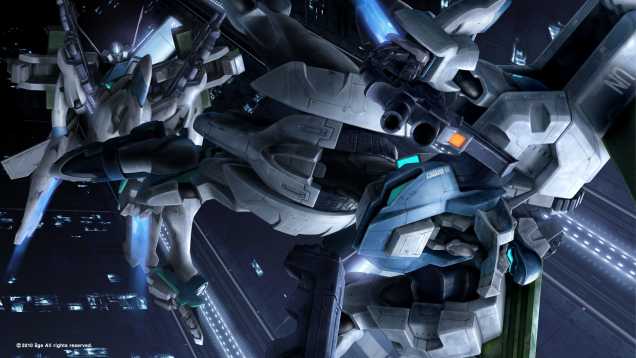
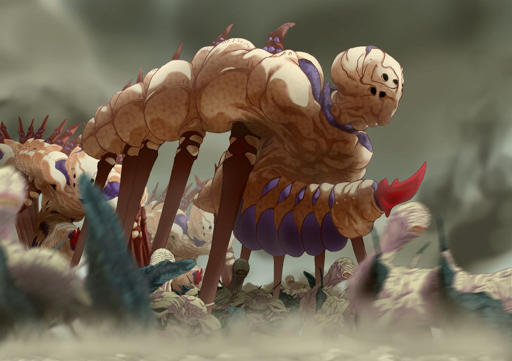
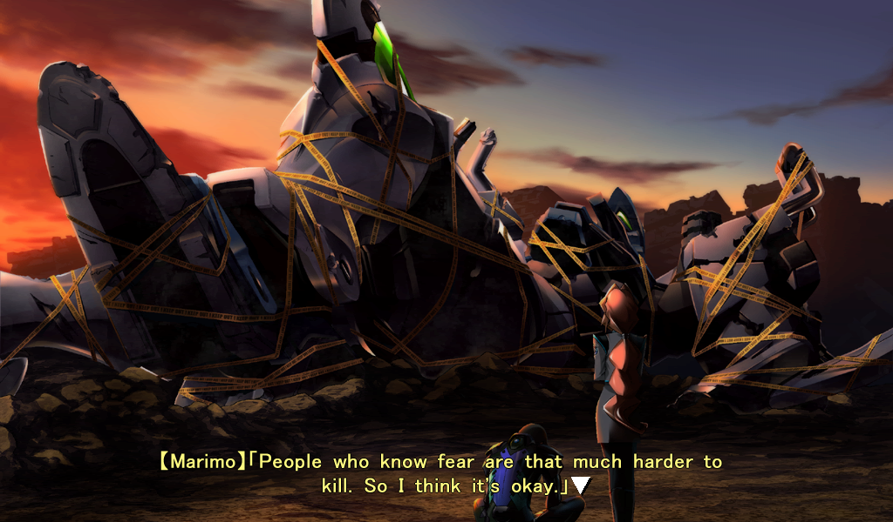
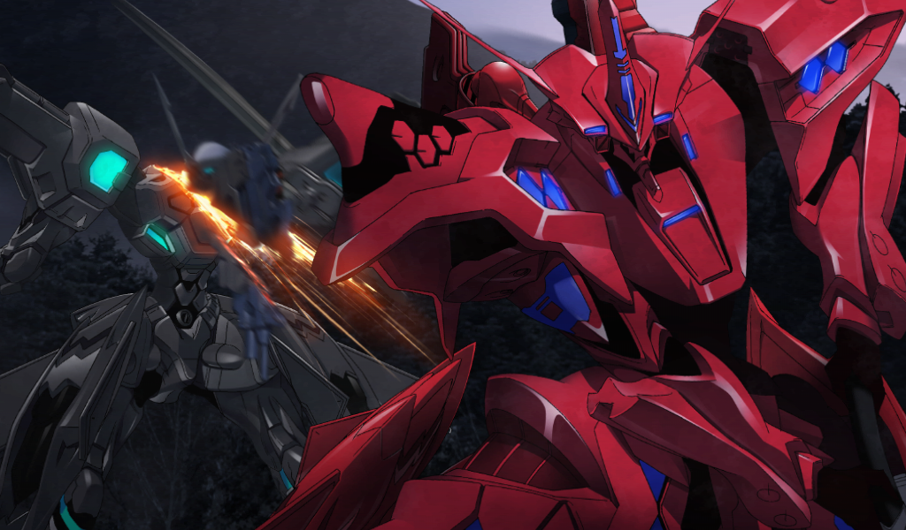
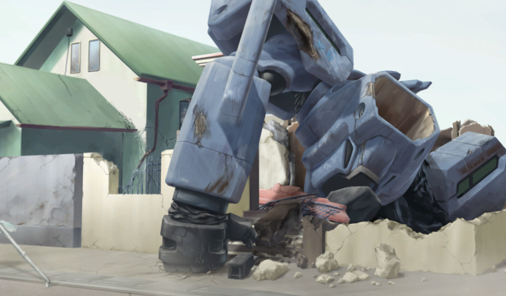
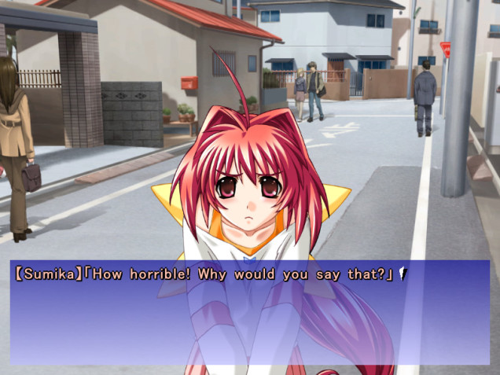
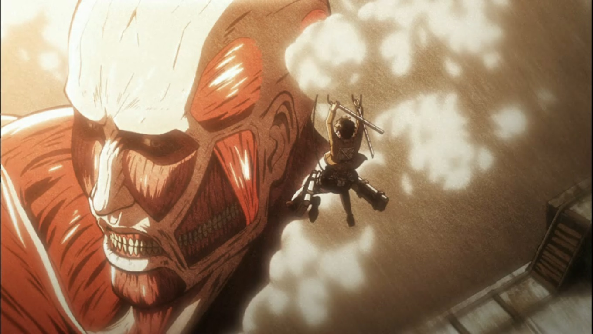

---
{
  title: "Rockmandash Rambles: Why I loved Muv-Luv (but you might not)",
  tags:
    [
      "Muv-Luv",
      "Muv-Luv Alternative",
      "Ani-Tay",
      "Visual Novel",
      "Rockmandash Rambles",
      "Rockmandash12",
      "Observation Deck",
    ],
  published: "2014-04-23T22:43:00-04:00",
  attached: [],
  kinjaArticle: true,
}
---

It’s been a while since I’ve played a game that has broken expectations as much as Muv-Luv
  Alternative has. It’s been a while since I felt the need to do an entire post on just my random thoughts on a game,
  It’s just that amazing. This is my thoughts and experiences on Muv-Luv so expect spoilers. It’s not exactly concise
  and might be a bit tangential, but that’s what a ramble is. If you want a spoiler free and more concise opinion or
  want to know what i’m talking about, check out <a class="sc-1out364-0 hMndXN sc-145m8ut-0 gIacKn js_link" data-ga='[["Embedded Url","External link","https://rockmandash12.kinja.com/rockmandash-reviews-muv-luv-extra-alternative-visua-1567978967",{"metric25":1}]]' href="https://rockmandash12.kinja.com/rockmandash-reviews-muv-luv-extra-alternative-visua-1567978967" rel="noopener noreferrer" target="_blank">my review</a>,
  or <a class="sc-1out364-0 hMndXN sc-145m8ut-0 gIacKn js_link" data-ga='[["Embedded Url","Internal link","http://tay.kotaku.com/muv-luv-the-tay-review-1541968420",{"metric25":1}]]' href="http://tay.kotaku.com/muv-luv-the-tay-review-1541968420">Dex’s</a> <a class="sc-1out364-0 hMndXN sc-145m8ut-0 gIacKn js_link" data-ga='[["Embedded Url","Internal link","http://tay.kotaku.com/muv-luv-alternative-the-tay-review-1546183909",{"metric25":1}]]' href="http://tay.kotaku.com/muv-luv-alternative-the-tay-review-1546183909">reviews</a>.

<aside class="sc-1rh3ayr-6 jfFNjl inset--story branded-item branded-item--kinja" data-commerce-source="inset">

<a class="sc-1out364-0 hMndXN js_link" data-ga='[["Permalink page click","Permalink page click - inset headline"]]' href="https://rockmandash12.kinja.com/rockmandash-reviews-muv-luv-extra-alternative-visua-1567978967" rel="noopener noreferrer" target="_blank"><h6 class="sc-1rh3ayr-3 jRIPES">
    Rockmandash Reviews: <i>Muv-Luv &amp; Alternative</i> [Visual Novel]</h6></a>

 Welcome to Rockmandash Reviews, and this is my review of the highly regarded Muv-Luv
      Visual Novels 
<a class="sc-1out364-0 hMndXN sc-1rh3ayr-0 kOvmIi js_readmore inset--story__readmore js_link" data-ga='[["Permalink page click","Permalink page click - inset read more link"]]' href="https://rockmandash12.kinja.com/rockmandash-reviews-muv-luv-extra-alternative-visua-1567978967" rel="noopener noreferrer" target="_blank">Read more</a>

</aside>

As I was writing my <a class="sc-1out364-0 hMndXN sc-145m8ut-0 gIacKn js_link" data-ga='[["Embedded Url","Internal link","http://tay.kotaku.com/rockmandash-reviews-i-o-visual-novel-1563212529",{"metric25":1}]]' href="http://tay.kotaku.com/rockmandash-reviews-i-o-visual-novel-1563212529">I/O review</a>, <a class="sc-1out364-0 hMndXN sc-145m8ut-0 gIacKn js_link" data-ga='[["Embedded Url","External link","http://dexomega.kinja.com/",{"metric25":1}]]' href="http://dexomega.kinja.com/" rel="noopener noreferrer" target="_blank">Dexomega</a> (a fellow TAYer) was
  making all of his <a class="sc-1out364-0 hMndXN sc-145m8ut-0 gIacKn js_link" data-ga='[["Embedded Url","Internal link","http://tay.kotaku.com/tag/muv-luv",{"metric25":1}]]' href="http://tay.kotaku.com/tag/muv-luv">Muv-Luv posts</a> here on TAY. I read the
  articles and because I’ve been such a <a class="sc-1out364-0 hMndXN sc-145m8ut-0 gIacKn js_link" data-ga='[["Embedded Url","Internal link","http://tay.kotaku.com/the-beginners-guide-to-visual-novels-1541975662",{"metric25":1}]]' href="http://tay.kotaku.com/the-beginners-guide-to-visual-novels-1541975662">VN fan</a>,
  I was deathly curious about this series. On TAY and Skype, Dex was telling me about how great it was, and that just
  rose my anticipation for wrapping up my I/O review. I could only nod my head and say that’s cool, and say I would get
  to it right after this game. I was afraid of <a class="sc-1out364-0 hMndXN sc-145m8ut-0 gIacKn js_link" data-ga='[["Embedded Url","External link","http://tvtropes.org/pmwiki/pmwiki.php/Main/HypeBacklash",{"metric25":1}]]' href="http://tvtropes.org/pmwiki/pmwiki.php/Main/HypeBacklash" rel="noopener noreferrer" target="_blank">Hype Backlash</a>. I really
  was. Muv-Luv alternative decimated all expectations I had.

I can praise it all I want, but if you don’t know what it is, that praise is
  useless. Muv-Luv is a series of VN’s with 3 arcs - Extra, Unlimited, and Alternative. Extra is a boring slice of life
  dating sim, and Unlimited rips the Main character Takeru out of his familiar life, and throws him into a universe of
  despair - an alternate world where aliens known as BETA invade the world, and have killed billions of people, thus
  pushing humanity to the brink of extinction unless they do something about them. Unfortunately, even with such a great
  plot, Unlimited is too light hearted, and has pacing issues. Why am I even mentioning Muv-Luv then? The last game,
  Muv-Luv Alternative, takes Unlimited’s plot, blows me out of the water and impressed me in a way only games like
  Steins;Gate and Ever 17 have.

What makes Muv-Luv so great is how it manipulates you as a player. Once Unlimited
  starts, you and the main character Takeru are thrown into an unknown world that you could not imagine: Aliens called
  BETA invading Earth and massacring everyone. I didn’t notice, but I make a connection with Takeru - as an outsider
  along with Takeru, there was an invisible bond &amp; I felt what Takeru felt. I grew with Takeru, and whenever he
  would cry or break down, I would too. Whenever something happened, I would react in a very similar fashion. I felt
  like a complete outsider (being american increases this feeling even more), like I didn’t belong; exactly like what
  Takeru was dealing with in the game. As Takeru goes on through his adventure into darker themes, alternate universes,
  and connecting with the characters, I felt like I was a part of this world, and my thoughts were being represented by
  Takeru… more so than any other game I’ve ever had the chance to experience.. Of course, I’m not Takeru, and still
  facepalmed at times, but I’ve never played a game that I’ve gotten so absorbed into the plot without noticing it. It
  shows Takeru’s psyche at the best of times and at the worst of times, and it doesn’t mind messing with Takeru’s psyche
  or, messing with you. I really don’t want to spoil this, so I’ll try to describe the one example this perfectly fits
  with extremely vague terms. The scene in the middle of alternative, after that attack… once you hear that depressing
  <a class="sc-1out364-0 hMndXN sc-145m8ut-0 gIacKn js_link" data-ga='[["Embedded Url","External link","https://www.youtube.com/watch?v=WlXb8P21kws",{"metric25":1}]]' href="https://www.youtube.com/watch?v=WlXb8P21kws" rel="noopener noreferrer" target="_blank">music</a>,
  then it suddenly stops… then *CHOMP*.... INSTANT PTSD. YOU CAN FEEL THE FEELZ…. If you weren’t balling up at that
  point in the game, you either were ignoring the whole game, or you have no soul.

I felt that Muv-Luv Alternative was an amazing experience. I loved everything about
  it: from the excellent written characters, to the fantastic world they built, and the amazing feelz trip I went
  through. I loved it to bits, especially after the 12/5 incident, where it really picks up. It’s kinda cliche to say
  this, but it really does get better the further you go along, and it only picks up halfway. Once you can make it
  through, your body better be ready. I spent 2 all nighters and a good majority of my break playing this, and I did not
  regret a single bit. This game will make you think: its stumped me in many ways. It’s stumped me in how I would write
  the review, it’s stumped me on concepts like nationalism, morality, humanity, <a class="sc-1out364-0 hMndXN sc-145m8ut-0 gIacKn js_link" data-ga='[["Embedded Url","Internal link","http://tay.kotaku.com/the-many-worlds-interpretation-of-rpgs-1561564092",{"metric25":1}]]' href="http://tay.kotaku.com/the-many-worlds-interpretation-of-rpgs-1561564092">Multiple worlds</a>, etc. I
  love how the game kept on asking questions and made me think. That’s something that Muv-Luv does extremely well, way
  better than anything like it.

The Pacing of Muv-Luv is something to be admired; It’s never a roller coaster of
  pace, it always keeps a detailed and collected pace. The game is cold and calculated, and spends its time developing
  the characters to the perfect degree, to develop to the perfect point, just to hit you hard, either via feelings or
  astonishment. It teaches you everything you would ever want to know about the world in detail, even things you might
  not want to know. I’ve always been one to prefer a roller coaster thrill ride of a game, but Muv-Luv is the exception:
  this game does slow pacing right. When pacing is the most important element of writing to me, saying this shocks me. I
  loved how the game made me on the edge of my seat for 40% of the game. Only in Steins;Gate have I felt the feeling of
  climax and tension for a long period of time... And this is longer than that.

It’s not all fine and dandy though, as there is one thing that personally made me
  mad. That would be the ending; I believe the ending would have been better if Takeru remembered the whole situation..
  the ending is essentially Extra 2.0 and it feels like everything that happened.... was just pointless. Even with the
  ending being pretty sub-par, I haven’t felt the void this strong since I watched Clannad (but that was kinda filled up
  by Kanon… Muv-Luv has no such replacement.)

With All the praise I’m giving to
  Alternative, you might feel like skipping Extra would be a good idea. It’s not. All parts of Muv-Luv is important in
  the Saga, as Alternative does something I’ve rarely seen in any medium ever - it wraps up everything, it never leaves
  any red hearings and it makes everything important. The game deliberately sabotages itself. In my opinion, Extra is
  the first of the players challenge, and the challenge continues on. Being so boring and generic will deter people. The
  fact that its an eroge will deter people. But if you are open minded enough, and you can persevere like Takeru does
  later in the game, you get to experience the game for all its worth. Getting through the shock of the new world,
  learning all the military, science and politics that comes with an alternate world is another steep challenge that
  players will have to face, and last but not least, the hentai. This is actually one time where I’m not going to
  complain about it, as it’s used very meaningfully and helps develop the characters whether they know it or not…. but
  the fact is, hentai games are looked down upon and they limit the audience, and it doesn’t help that none of the all
  ages versions are translated, or ever get translated. I feel like Age is essentially saying this: your challenge is
  just as important as Takeru’s, and as a reward for going through this challenge, you are getting one of the best
  experiences you will ever see. It’s limiting the audience, but by doing this, its essentially making everyone who
  plays this through, love it. I do not know why Age would do this, but they do.

The most important discussion that involves Muv-Luv is not about Muv-Luv itself, but
  its about a certain show that’s found a massive, rabid fanbase..... <a class="sc-1out364-0 hMndXN sc-145m8ut-0 gIacKn js_link" data-ga='[["Embedded Url","Internal link","http://kotaku.com/attack-on-titan-is-good-damn-good-but-not-perfect-1432110574",{"metric25":1}]]' href="http://kotaku.com/attack-on-titan-is-good-damn-good-but-not-perfect-1432110574">Shingeki no Kyoujin</a>,
  <a class="sc-1out364-0 hMndXN sc-145m8ut-0 gIacKn js_link" data-ga='[["Embedded Url","Internal link","http://tay.kotaku.com/dexs-review-attack-on-titan-1464030190",{"metric25":1}]]' href="http://tay.kotaku.com/dexs-review-attack-on-titan-1464030190">aka Attack on Titan</a>. If you
  have experienced both, it’s impossible to think about one without the other. Just look at that plot description and
  tell me you cannot think about Titan. Unstoppable enemies in massive numbers killing many people? Check. Disturbing
  Visuals of people dying? Check. A great world with tons of potential? Check. Human Factions that go screwing humanity
  instead of helping the cause? Check. I can go on and on, but the point is, Attack on Titan was inspired by Muv-Luv,
  and Muv-Luv did it better than AoT a whole 6 years before Titan even started. If you felt hopeless watching titan, you
  will feel another level of hopeless while playing through Muv-Luv. Muv-Luv does the story, pacing, characters and
  information stream way better than Attack on Titan. I believe that if Muv-Luv had the same Animation, Sound and ease
  of use that Titan did, it would be very popular. But that’s not the case. Titan is popular because it doesn’t limit
  the audience, and it’s a beautiful show.... but if you liked titan, go play Muv-Luv. You will love it.

Muv-Luv is not a game, its not a VN, it’s an experience. Looking at it objectively, this
  series overall cannot compare with so many things I love. But it does. It might alienate a good majority of people,
  but the people who have the willpower to try it and overcome it’s roadblocks will really love it. Everyone reading
  these words should really give it a shot. It’s a fantastic experience, and it’s one you will never forget. 

