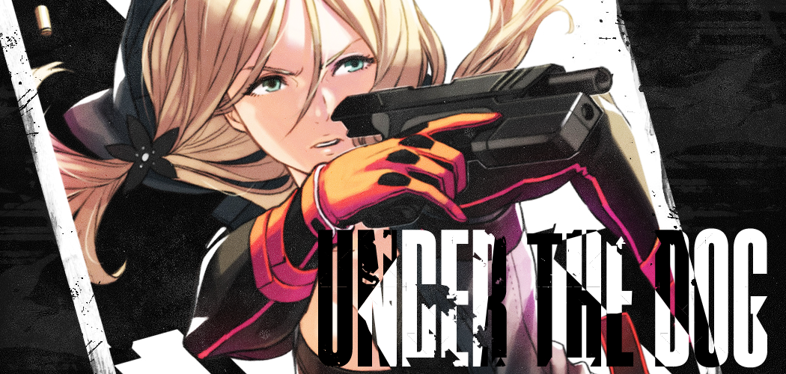
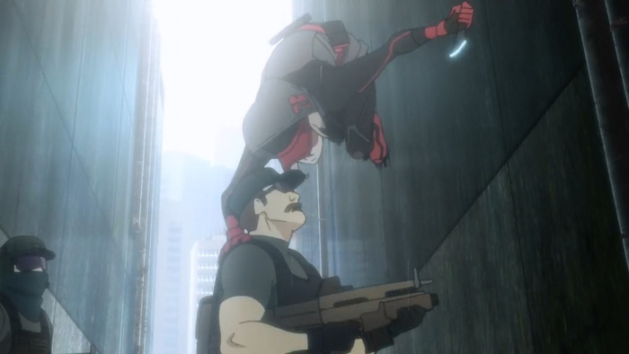
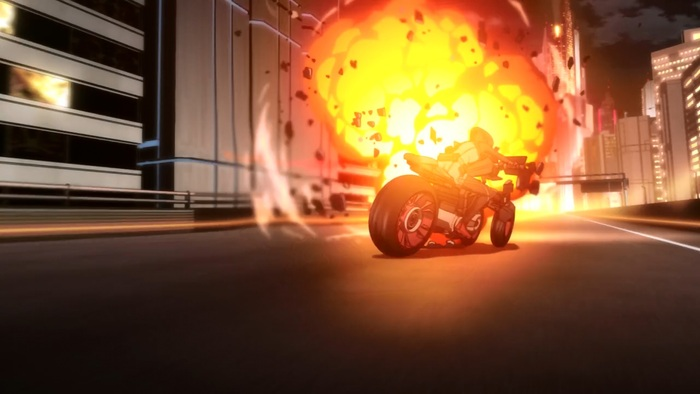
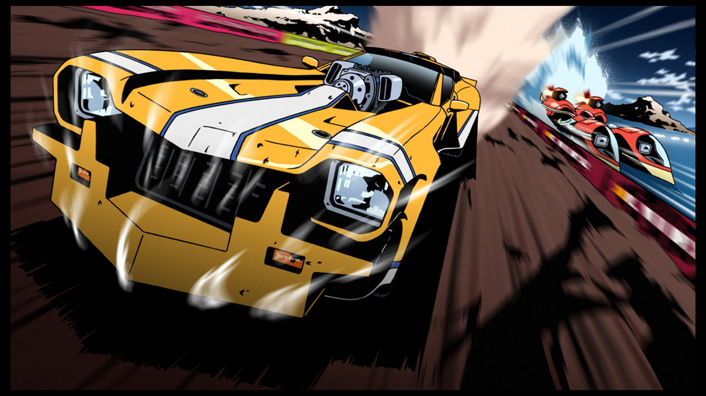
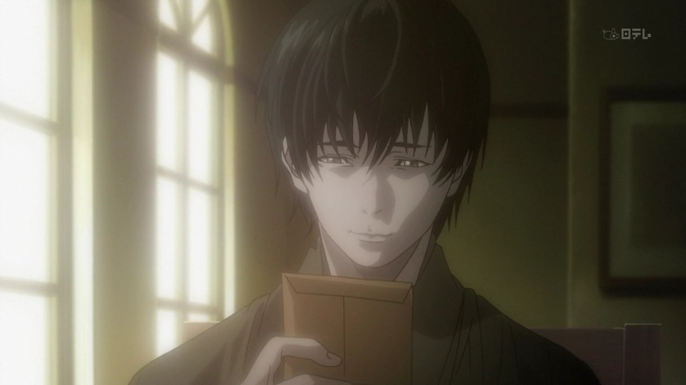
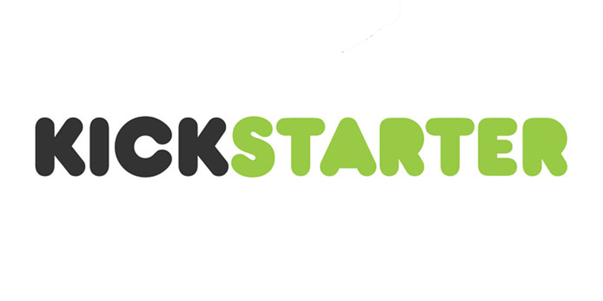

---
{
	title: "Why You Should Fund Under The Dog , and What this Kickstarter Represents",
	published: "2014-08-26T16:00:00-04:00",
	tags: ["Rockmandash Rambles", "Under The Dog", "Kickstarter", "Fund it! NOW! Seinen", "Action", "Oppinion", "Future", "Industry"],
	kinjaArticle: true
}
---

[When I first saw Under the Dog](http://anitay.kinja.com/elite-group-seeking-funding-for-new-anime-1618902750/all), I wasn't exactly sure what to think about it. I thought that it looked cool, but they were just asking too much money. Now that I've recently watched Canaan (review coming up soon, probably next week) and thought about what Under The Dog represents, I'm going to try my best to convince as much people to fund Under The Dog so we can hit that goal. Welcome to Rockmandash Rambles, and this is my write-up on why you should fund Under The Dog, and influence this show might have.

**DISCLAIMER:** I am not paid to write this, and I have no relation to the people making it. I'm just a fan that really hopes that they hit the goal, and I want to see how something like this will influence anime in the future. I realized as I was typing this that it might just echo the kickstarter, but I hope I can get the point out in a clearer way. Last but not least, I'm not an expert at how the industry works and such. I might have some errors. I'm just a high school student writing about what they love. Also, there's a lot of anime talk that you may or may not be familiar with... so sorry. Anyways, Thanks for reading!

## About Under The Dog itself

Well, I can't really convince you to fund something without giving you reasons on why it's **AWESOME**. First off, just check that [Kickstarter](https://www.kickstarter.com/projects/1300298569/under-the-dog) page. Look at it. Play the Video.

The production values really just speak for itself. They don't just want another run of the mill show, but they are planning to make something that will push the boundaries of animation. Straight from the Kickstarter, they said.

> 1\) we are aiming for 100% backer funded AAA production quality.

Looking at the PV, that's exactly what we are getting. The Group under Creative Intelligence Arts is out there to make something awesome. I'm seeing some great CG, high quality video, and amazing stuff all around. It's everything a modern and great anime should have: excellent directing, great character design, clean and amazing industrial design, stunning scenery, amazing action... it's beautiful. It's like if you took the awesome wallpapers of Makoto Shinkai's movies and amplified them with action. This has the potential to be one of the best looking anime out there, matching with what ufotable has been doing to push the boundaries with anime. Just visuals alone, I'm interested, and you should be too. This is going to be a beautiful anime, if it gets funded.

There's more than this than just visuals: We have an interesting story written by Jiro Ishii, about being pushed into a corner... an underdog situation. It's an interesting theme and it creates a story with an interesting premise... and knowing Jiro Ishii, who's made the visual novel that I want to play the most but don't have any access too, 428: In a Blockaded Shibuya (and helped produced 999, my favorite game). I'm expecting great writing, interesting sci-fi elements based on real science, and interesting themes and plot points that are developed well.

We haven't had a well done Seinen action show in a while. Shows like Trigun, GiTS, Code Geass, Bokurano, Darker than Black, etc... and I realized that I really... really miss these types of shows. I mean, the shoenens will always exist and be meh, the fanservice-y shows will still be there because they are cheap and sell, the romances will be there because they are great and are cheaper while being equally as awesome. When I was watching Canaan, I loved it! (partially because I'm a type-moon fanboy....) Not because it was the greatest thing ever, but because I haven't seen this type of show in a long time. It was done pretty well, with solid action and an interesting story,but it had some production kinks and story issues that were just off. It's like we are getting with Under The Dog is what Type-Moon tried to do with Canaan, but with much better production values, similar themes, and better execution. We're getting that Sci-Fi Action that everyone wants.

On that note, we have the absolutely amazing team that's working on this. Orange Co. who did the CG for the new Code Geass OVA's, and Eva movies, Kinema Circus who is made by Ex Production IG staff who made the absolutely beautiful GiTS:SAC series, Yusuke Kozaki, who's working on the character design and did the character designs for Fire Emblem:Awakening, and the director from Masashiro Ando, the director of the 428 inspired work Canaan, who has a ton of industry experience. We have an absolutely amazing team here, and with all this talent, it's almost a given that we will get something amazing. This is a dream team of industry experts, who know what they are doing.

It looks great, sounds great, and will probably have a great story. Under The Dog however, is it's own underdog, and it's fighting to exist.

## The State of the Anime Industry in General

What Creative Intelligence Arts is trying to get funded is not an anime series, but an episode that represents a pitch. You might be asking then... why are they asking all this money, and why are they even asking for money in the first place when they are industry experts? Most people don't really realize this, but anime is really really expensive. Not just to buy, but to make. For something to look good, someone has to be payed to make it.... and the process of getting an anime funded and to make.... is insane. This is explained at the bottom of the kickstarter page, but most people didn't really read that much of it. Here's a video by Digibro that explains this very well.

> In Japan, it is very difficult to obtain independent funding since the anime industry heavily relies on what is known as "seisaku iinkai" or "production committees." This committee requires buy-in from multiple major corporations that combine their efforts to help carry the load of the production costs and thereby minimize the financial risk for each individual company. One company could take on animation, another music, another advertising, another distribution, and so on. It can also drive down the costs of production due to companies willing to take an initial loss with the hopes of turning a profit over the course of several years as the anime and any licensing deals run their course (music, toys, manga, etc.).
>
> These committees are usually composed of people with an investor's mindset who look to profit first and then to creative awesomeness, if at all. This can often lead to projects stalled or mired in bureaucracy, indecision, and conflicts of interest. Production committees also generally require intellectual property buyouts in which the creatives involved essentially sacrifice all rights to their work just so they can see their dreams come to fruition in any form at all. Kickstarter will allow our artists to retain their rights and control as well as maintain their passion and investment for the lifetime of the series and any spin-offs. We also have less "cooks in the kitchen," so to speak, so that creative direction will be decisive. No marketing or advertising based creative decisions or delays here! - From UTD Kickstarter

This kickstarter is not just about the show, but to shake up the anime industry, or to at least provide some people the directive freedom to make what they want. The Anime industry is focused on making money like everyone else... but they sacrifice originality, high production values, and creativity to get there. The perception of anime, the fanbase, and the market makes the industry wary about trying new things.... so we get adaptations of shows that only appeal to the hardcore otaku, or shows that try too hard to grab an audience. I do not that I mind some of these shows, but diversity is really the key. Why can't we have our kickass action shows with amazing stories and well done themes, but still have our amazing romantic comedies? I understand that shows are made to gear a profit, but in the process they lose so much. Why should we have to deal with these butchered adaptations, instead of seeing what they could be? If the industry wasn't so geared to selling merchandise, we'd have more of people's favorites like Haruhi, or something like a [Muv-Luv adaptation done right](http://dexomega.kinja.com/dex-where-do-i-start-with-muv-luv-1561900783). What if the companies want to try something new? Why restrict the creativity of talent, deluding the quality of work just to sell more toys? As a fan, don't you want to support what represent the common interest of the consumer and the creator? Yes, there are stuff that are great that bomb like Nichijou, Redline, and Aoi Bungaku (which if you haven't seen, go do it now.), but We got Neon Genesis Evangelion out of letting Hideaki Anno do his own thing, and we are getting Zankyou no Terror out of what Watanabe wants to do..... why can't we let Jiro Ishii get his shot? (and we should continue to allow Kotaro Uchikoshi to do what he does best.... #Operationbluebird, #ZeroEscape3)

We are funding an episode to show to the industry that... yes, there is an interest. Yes, this is a show that will sell, and it will be amazing. We are showing them that this is a type of show that we like, and we like people to do what they want to do. While this is just funding a single episode, and to the consumer, it doesn't make sense because it's literally a dollar an minute... that's not the point. It's not about what you are getting, quantity wise. It's about making someone willing to foot the bill to see this dream come true, so we can have Under The Dog become one of the greatest anime in the longest time.

## What Under The Dog Represents for the Future of Action Anime

I think that the Under The Dog Kickstarter might possibly be, the biggest chance us western anime fans have at getting our voices out to the Japanese producers and shareholders we've had in a while. It represents an age of anime that is long gone.. yet something totally unprecedented.

At this point in time, Kickstarters for anime are more symbolic than anything. Kickstarter's are mostly a western thing with no Japanese support yet, so it's us fans here in the west that are funding it all.... which ignores the bread and butter fans that they have there. It's symbolic of a company trying to do something new, to break away from the chains of normal production. This exact same thing happened with [Little Witch Academia 2 for Studio ](https://www.kickstarter.com/projects/1311401276/little-witch-academia-2)[TRIGGER](https://www.kickstarter.com/projects/1311401276/little-witch-academia-2), then they got the funding to make something all of you are familar with: [Kill La Kill](http://www.crunchyroll.com/kill-la-kill). (Also, Kickstarters showing western interest recently had an impact with the Visual Novel genre. World End Economica brought Sekai Project's name to the forfront, and now they are trying to bring over works such as Clannad and Grisaia no Kaijitsu. I'll write a whole opinion piece about that too.) I'm not sure how much the kickstarter influenced Kill la Kill, but it certainly got the attention for publishers in japan to let TRIGGER do whatever they want. It was also a way for the industry to realize that we are serious about this hobby over here... we funded a show, all by ourselves! It showed that we care about the small innovative studios, and they should too.

[Read more](http://www.crunchyroll.com/kill-la-kill)

We need to keep up that drum beat... but also show how much we love these type of shows! I know there's a lot of you guys out there that are like ... 90's anime is the best! While I'm not one to follow that doctrine, I still love a lot of that shows from that era, and I'm sure there's a lot of people out there who do to... The west is where those were originally really popular! (Cowboy Bebop and Trigun tanked in japan, if you didn't know.) Yes, there are exceptions like Fate/stay night, and Zankyou no Terror, but for the most part, its gone. If you want shows like those that have high quality writing with Action and AAA Animation, we'll have to prove we care about this. We'll need to fund this to show to the Anime Industry in Japan that people in the west still love those kind of shows... and hopefully this will be a start of a trend twords having those shows available. Diversity in anime is a good thing... and why not have more? We need to continue this, and show them we care.

## The Bad News

Most fans just can't get over the whole value proposition. Hell, I was one of those a few days ago! As of writing, we have 12 days to go and $250,009 USD out of the $580,000 USD we need. That's a lot we need to fund. Please do me a favor and spread this as much as you can, I really want to see this thing happen. As a poor high school student, I really don't have a lot of money to chunk in... so I'm trying to make the difference by getting the word out. Let's get this all over the web... I certainly will be spreading it to every anime site I know, and you should too. Also, don't just spread the word, try to legit fund this. If I can put in 25, most of you should be able to put in at least enough to match me. Every bit helps... let's get this goal through! This has been Rockmandash, see ya later.
