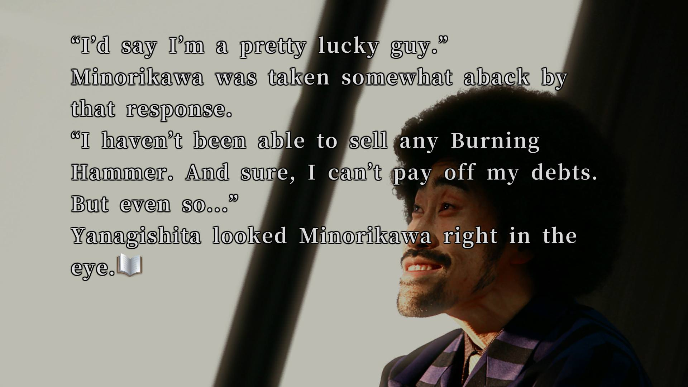

---
{
title: "RockmanDash Reviews: 428: Shibuya Scramble",
tags: ["428", "Visual Novel", "Rockmandash Reviews", "428 Shibuya Scramble"],
authors: ['reikaze'],
published: '2018-10-28T02:00:00-04:00',
attached: [],
license: 'cc-by-4',
oldArticle: true
}
---

<video autoplay="" loop="" muted=""><source src="./sw4kl2vyawrcfklj973c.mp4" type="video/mp4"/></video>
There’s nothing quite like <em>428 Shibuya Scramble</em>. It’s been a long time
  since I first learned about this game, 4 years in fact, but I’ve always been eager to get my hands on it, my
  excitement never dwindling. From it’s 40/40 score on Famitsu to the insane budget and quirky visuals this game has to
  offer, there’s something that’s excited me and intrigued me about 428 for years, and now it’s finally out in the west
  thanks to some miracle by Spike Chunsoft. After waiting for so long, I’m sure you’re wondering if it was worth the
  wait for me, and if it’s worth picking up: my answer, is YES - 428 is one of my favorite visual novels I’ve played in
  years, and my favorite game of 2018 so far. 

If you’d rather watch the
  review, here’s the video:

<iframe allow="accelerometer; autoplay; clipboard-write; encrypted-media; gyroscope; picture-in-picture" allowfullscreen="" frameborder="0" height="315" src="https://www.youtube.com/embed/9geELNoeNfQ" width="560"></iframe>

Let’s get the thing you’re probably all thinking about out of the way, 428 looks
  like no other visual novel you’ve probably seen thanks to its photographic presentation of live actors and frankly,
  that’s a good thing. The amount of budget that went into this is frankly amazing, and while it’s presentation might
  seem like an acquired taste the amount of charm and effort they put into it makes me think that very few people would
  actually dislike it. 428 is a game that tries to balance weird and serious, and the presentation goes a long way to
  making this happen. If you asked me, the presentation is really fantastic and adds a lot of character. It’s a visual
  style that echoes its era in a way that ages extremely well, much better than others in the time, and it makes me
  think that this could easily be looked back on as a timeless classic. 

<iframe allow="accelerometer; autoplay; clipboard-write; encrypted-media; gyroscope; picture-in-picture" allowfullscreen="" frameborder="0" height="315" src="https://www.youtube.com/embed/2WAgYvOrQwc" width="560"></iframe>

As for the sound of 428<!-- --> ,it<!-- --> echoes many of the same elements from the
  visuals like charm and personality, and it definitely serves as the emotional driving point of the diverse story but
  this one’s definitely more of an acquired taste. It has a lot of character, and it has some songs that really help
  make the moment feel absolutely fantastic, but some of the tracks are honestly just plain weird and many just fall
  flat. It’s serviceable, but not really something you’re probably gonna <!-- -->listen<!-- --> to outside of the
  game... <!-- -->trust<!-- --> me I’ve tried. Now, with the presentation out of the way, onto the story!

428 is a slice of life/police procedural story- from 10 AM to 6 PM on the titular
  April 28th, in the titular Shibuya, 428 revolves around the kidnapping of Maria Osawa, a girl with fascinating
  relationships. At first glance, the story goes through these events straight, for the most part, but as the player
  progresses through the story, the scope of 428 evolves into something grander: elements like gangs, viruses and
  international syndicates start playing a role to make for a fascinating tale. If you like both an entertaining slice
  of life or a compelling drama you’re going to get it here and that’s fantastic! but assuming that is all 428 is, is
  doing the work a severe disservice. 

If you were to ask me how I’d describe 428, I’d say more than anything that it’s a
  story about society and life in general, making the name 428: Shibuya Scramble rather fitting. With so many police
  procedurals, dramas or action films, we see stories that fixate on the lead and plot, but there’s so much more to
  events than that - there’s unrelated personal stories, motivations, personalities, tragedies that play a part of how
  events unfold. 428 addresses all of this, adding an unmistakably human touch to the story, allowing us to see the
  lives of people instead of the big event. It’s filled to the brim with so many interesting and unique viewpoints and
  aspects about life, and if you want a story you can engage with, you can resonate with, you’re going to find it here
  with 428. 

This starts at the fact that the entire cast, in general, is pretty
  likable and entertaining thanks to 428’s personal and quirky writing. All have endearing faults, all have relatively
  straightforward problems and beliefs, all are human and enjoyable. I got to love all of them: Kano, the idealistic yet
  rookie detective, Achi, the former gang member clean freak, Minorikawa, the over the top freelance journalist, Tama,
  the poor girl stuck in a catsuit peddling bunk junk, and Kenji Osawa, the virologist dealing with family issues and
  the kidnapping of his daughter.. All of them were great, and I got attached to all of them.

A key part of how this is even possible is thanks to the interesting and unique
  way that 428 handles characters and story progression: instead of one lead character, 428 follows all the of
  aforementioned characters with their individual stories, going together in parallel but merging all the time. The
  easiest way to explain the story structure is rope: they’re all technically separated stories, but they weave in
  together back and forth to make a giant cohesive story that flows all together. These stories affect each other, and
  we see that through the story, and through the gameplay, adding a feeling of livelihood that isn’t possible without
  this structure. This leads to frustrating moments of in regards to gameplay(which we’ll get to later), but because of
  this structure we get really diverse, compelling stories that mesh surprisingly well. We get hilarious comedy, we get
  a deeply introspective story, we get down to earth moments, there’s so much to 428, it perfectly captures the modern
  human experience, and I absolutely love it.

A great example of 428’s strengths meshing together is a scene with Tama’s boss
  Yanagishita. Yanagishita is one of my favorite characters in the game - he’s basically a wacky snake oil salesperson,
  and is usually played for laughs, but at 13:40, he’s the center of one of the most touching moments in the game to me
  - he’s down on his luck, with his event completely flopping and no real way to pay for his dept... but even given this
  he’s still optimistic through the end - comedy moving to serious extremely seamlessly, in a way that adds so much
  relatability and human touch to the story, something most works simply don’t have. 

Adding to my adoration of 428 is that game has this magical ability rarely found
  in visual novels to keep every moment engaging. While some fans may bemoan the idea of Slice of Life, I believe that
  is not because of the concept but because Visual novels execute Slice of Life poorly: Slice of Life normally in visual
  novels are either repetitive or flat out boring scenes. This is absolutely not the case with 428: it’s a game that
  kept me wanting to read more and more because I enjoyed the moment to moment experience so damn much. The writing in
  this game is phenomenal, and the fantastic translation by Kevin Frane and the others on the localization team means
  the charm and character are conveyed in spectacular fashion. The game is written with so much character, with moments
  of excitement and intrigue to the point that it’s very hard to put down. Engaging story, relatable cast, enjoyable
  experience, touching moments - what more could you want from a game? 

Well, you’d want a completely engaging, seamless experience overall. If I could rate
  428 solely by the quality of writing and presentation, I would give it a perfect score, but there are other elements
  to the experience that ultimately let it down: which is, frankly the story progression, the gameplay mechanics can
  easily take you out of the story and can be downright frustrating. Thanks to 428 being a Spike Chunsoft game, things
  are <!-- -->distinctly<!-- --> old school here. 

<ul class="sc-1lmbno3-0 dpuHif" data-style="Bullet" data-type="List">
<li>choices can be absurdly obtuse to find(trust me, I got really stuck in some of the choices, especially late
    game)
  </li>
<li>there’s no manual save so maneuvering the story can be annoying</li>
<li>there’s an auto-read but no manual skip which is surprisingly not a big deal because of but can be infuriating if
    you’re looking for a specific thing
  </li>
<li>And last but not least... there are so many bad endings... The bad endings thing is a bit of a blessing and a
    curse- it allows the storytelling I mentioned before, but it causes your story progression screeching to a halt at
    no fault of your own, rather frustratingly at times. There are 87 different endings in 428, many of them being
    abrupt bad ends, and you’ll run into them solely because you’ve gone too far in one character’s route. Most of these
    bad ends are trivial so you’ll just have to go back to the previous story or whatever, and some are extremely good,
    but ultimately it does stilt the flow of your experience and that’s really frustrating at times. It’s a bit of a
    tradeoff they made as there are clear benefits to their choices, but it’s really the only thing keeping it from
    perfect for me. </li>
</ul>

That being said: Finding a game with this much charm and character is so hard, and
  if any of this intrigues you, give it a shot. 428 is a fantastic experience with a consistently engaging story with a
  human touch, a different but timeless presentation and a different take on the visual novel structure that is easy to
  fall in love with. The gameplay/story progression might take you out of the game and be more than frustrating at
  times, but it’s worth it - there’s nothing quite like this, and 428 is easily my favorite game of the year<!-- -->
  .

<em>Thank you for reading! If you want to check out more of my
  writing, check out my blog </em><a class="sc-1out364-0 hMndXN sc-145m8ut-0 gIacKn js_link" data-ga='[["Embedded Url","External link","https://rockmandash12.kinja.com/",{"metric25":1}]]' href="https://rockmandash12.kinja.com/" rel="noopener noreferrer" target="_blank"><em>RockmanDash Reviews</em></a><em>, as
  well as </em><a class="sc-1out364-0 hMndXN sc-145m8ut-0 gIacKn js_link" data-ga='[["Embedded Url","External link","https://fuwanovel.net/reviews-hub/",{"metric25":1}]]' href="https://fuwanovel.net/reviews-hub/" rel="noopener noreferrer" target="_blank"><em>FuwaReviews</em></a><em>
  and </em><a class="sc-1out364-0 hMndXN sc-145m8ut-0 gIacKn js_link" data-ga='[["Embedded Url","External link","http://anitay.kinja.com/#_ga=2.29830716.283022684.1516595779-1252363867.1516472140",{"metric25":1}]]' href="http://anitay.kinja.com/#_ga=2.29830716.283022684.1516595779-1252363867.1516472140" rel="noopener noreferrer" target="_blank"><em>AniTAY</em></a><em> where I am a contributor.
  Also </em><a class="sc-1out364-0 hMndXN sc-145m8ut-0 gIacKn js_link" data-ga='[["Embedded Url","External link","https://twitter.com/RockmanDash12",{"metric25":1}]]' href="https://twitter.com/RockmanDash12" rel="noopener noreferrer" target="_blank"><em>follow me on Twitter</em></a><em>
  if interested!</em>

PS: <!-- -->Here’s<!-- --> some things worth mentioning, but don’t really have a
  place in the review:

<ul class="sc-1lmbno3-0 dpuHif" data-style="Bullet" data-type="List">
<li>The game’s surprisingly demanding - running on my desktop AMD Ryzen 1600 &amp; Radeon R9 Fury wasn’t a problem,
    but my laptop with an Intel i5 8250u was not having it, play it on a gaming pc or a ps4.
  </li>
<li>I mentioned it earlier, but there are some spots mentioned that really got me stuck. In case you also get stuck,
    here’s some help &amp; feel free to ask for help if you get stuck. :  1905 A, Achi 1900 C, Tateno 1910 B, Jack
    1930 C &amp;
  </li>
</ul>

Here’s<!-- --> two guides that helped me: <a class="sc-1out364-0 hMndXN sc-145m8ut-0 gIacKn js_link" data-ga='[["Embedded Url","External link","https://translate.google.com/translate?hl=en&amp;sl=ja&amp;tl=en&amp;u=http%3A%2F%2F428.gkwiki2.com%2F&amp;sandbox=1",{"metric25":1}]]' href="https://translate.google.com/translate?hl=en&amp;sl=ja&amp;tl=en&amp;u=http%3A%2F%2F428.gkwiki2.com%2F&amp;sandbox=1" rel="noopener noreferrer" target="_blank">https://translate.google.com/translate?hl=en&amp;sl=ja&amp;tl=en&amp;u=http%3A%2F%2F428.gkwiki2.com%2F&amp;sandbox=1</a>
  &amp;

<aside class="sc-1rh3ayr-6 jfFNjl inset--story branded-item branded-item--kinja" data-commerce-source="inset">

<a class="sc-1out364-0 hMndXN js_link" data-ga='[["Permalink page click","Permalink page click - inset headline"]]' href="https://steamcommunity.com/sharedfiles/filedetails/?id=1503746753" rel="noopener noreferrer" target="_blank"><h6 class="sc-1rh3ayr-3 jRIPES">Steam
    Community :: Error</h6></a>

<a class="sc-1out364-0 hMndXN sc-1rh3ayr-0 kOvmIi js_readmore inset--story__readmore js_link" data-ga='[["Permalink page click","Permalink page click - inset read more link"]]' href="https://steamcommunity.com/sharedfiles/filedetails/?id=1503746753" rel="noopener noreferrer" target="_blank">Read more</a>

</aside>

<ul class="sc-1lmbno3-0 dpuHif" data-style="Bullet" data-type="List">
<li>Kinda spoiler here, but the normal end fucking sucks. There’s a true end, and you should try your damndest to get
    it on your first try. Ending it on the normal end could easily sour your experience. On a tangent, I hate the idea
    of a “true end” that you have to earn. When it’s so essential to the story, it only serves to punish players and
    ruin experiences. This is antiqueated gameplay and it really should be abolished.
  </li>
<li>Spike Chunsoft has a fascinating history that lead to 428. Was gonna include it in the review but it really
    shouldn’t be in the review. Click here for a read:
  </li>
</ul>
<aside class="sc-1rh3ayr-6 jfFNjl inset--story branded-item branded-item--kinja" data-commerce-source="inset">

<a class="sc-1out364-0 hMndXN js_link" data-ga='[["Permalink page click","Permalink page click - inset headline"]]' href="https://rockmandash12.kinja.com/428-shibuya-scrambles-fascinating-history-1830043191" rel="noopener noreferrer" target="_blank"><h6 class="sc-1rh3ayr-3 jRIPES"><i>428:
    Shibuya Scramble</i>'s Fascinating History</h6></a>

Heralded as one of the few games to receive the perfect 40/40 from Japanese magazine
      Famitsu, 428…
<a class="sc-1out364-0 hMndXN sc-1rh3ayr-0 kOvmIi js_readmore inset--story__readmore js_link" data-ga='[["Permalink page click","Permalink page click - inset read more link"]]' href="https://rockmandash12.kinja.com/428-shibuya-scrambles-fascinating-history-1830043191" rel="noopener noreferrer" target="_blank">Read more</a>

</aside>

