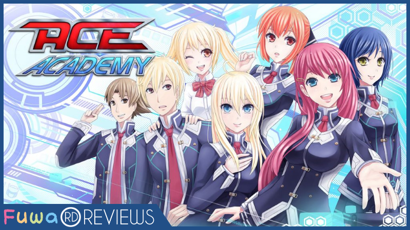
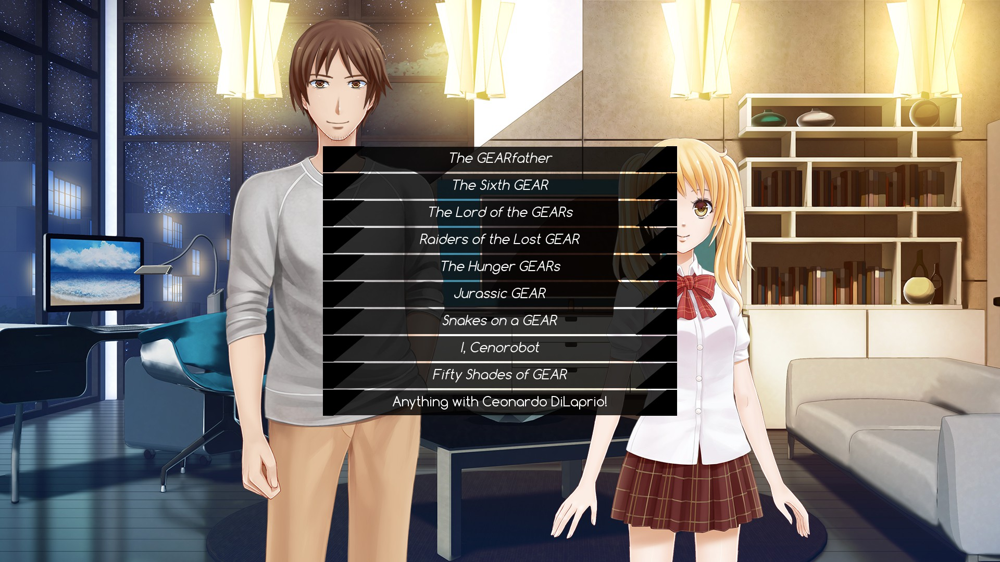
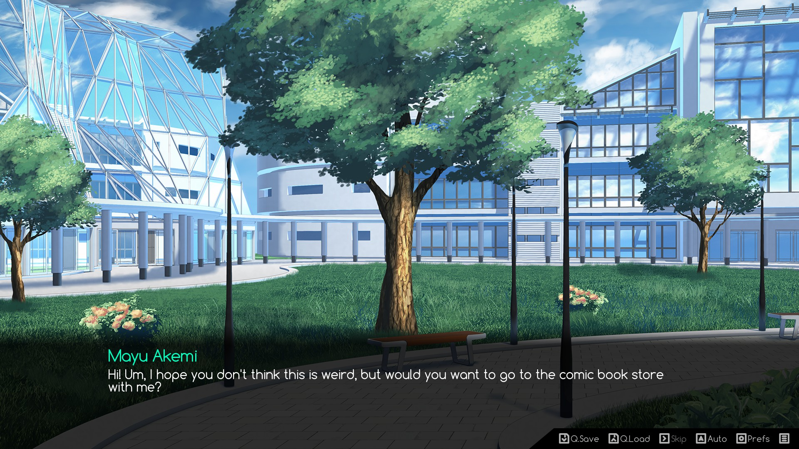
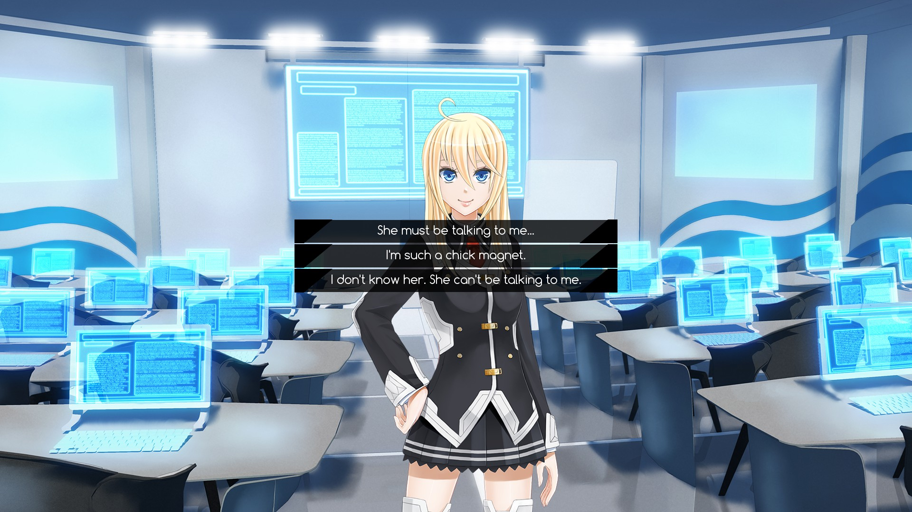
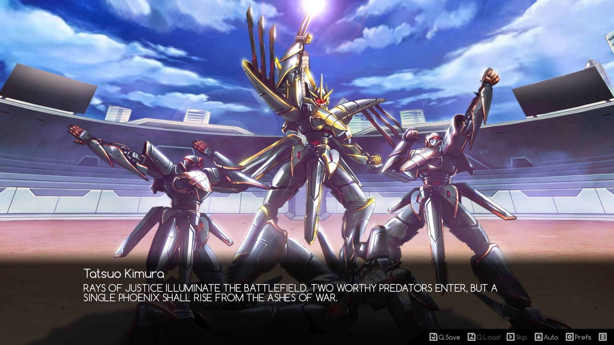
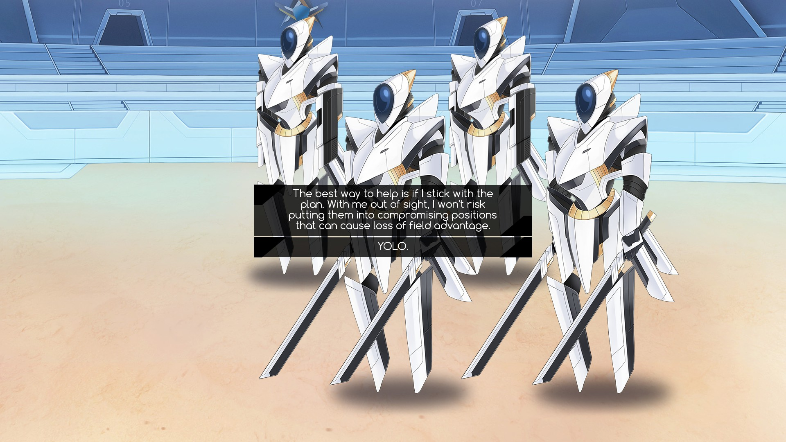
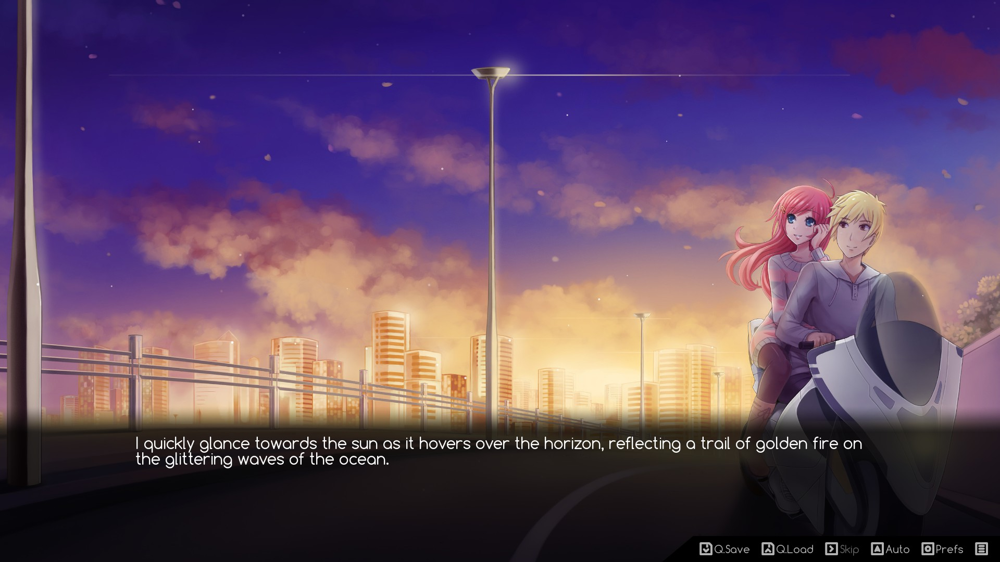
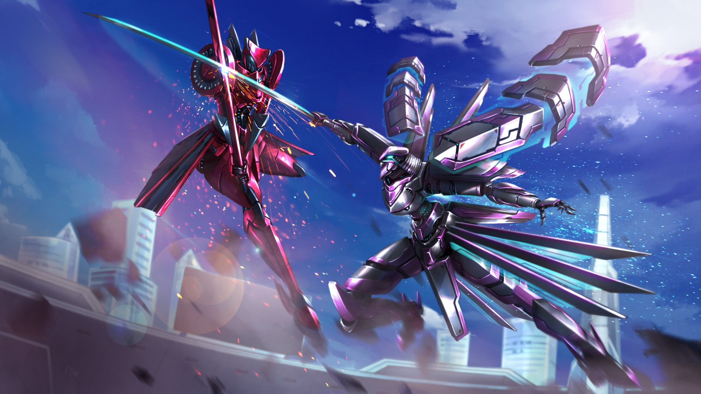

---
{
	title: "RockmanDash Reviews: Ace Academy [Visual Novel]",
	published: "2016-11-02T12:00:00-04:00",
	tags: ["RockmanDash Reviews", "Ace Academy", "Visual Novels"],
	kinjaArticle: true
}
---

One of the best parts about playing a Visual Novel is that they are very powerful: powerful enough to shake up perspectives and powerful enough to give you an impression of something would have never even crossed your mind. In the Visual Novel community, our opinions on the Western Visual Novel/EVN category of Visual Novels ebb and flow with every passing game, but a common criticism that has seemingly stuck around is that they are inferior imitations of Japanese Visual Novels because Visual Novels made in the west frequently try to emulate their Japanese counterparts. Of course, there are negatives to this approach, potentially leading to blander games that try too hard to be what they are not, but after playing a game like *Ace Academy*, I can confidently say that this viewpoint only scratches the surface of what Western Visual Novels are capable of. By embracing the culture of the Western Visual Novel community and Visual Novels in general, *Ace Academy* executes its premise in a way that it can only do with this approach, a hybrid execution of sorts.

*Ace Academy* is a Visual Novel made by western developer PixelFade Studio, that while maintaining the premise and culture of Visual Novels, bucks the trend of Visual Novels that focus on crafting a wonderful story to the detriment of the experience at a given moment.

\**Note - This game was originally written for *[*FuwaReviews*](http://fuwanovel.net/reviews-hub/)*, a project from the *[*Fuwanovel*](http://fuwanovel.net/)* VN community to make a hub for Visual Novel Reviews. Please check them out if interested, or if you want to see the*[* original version of this article*](http://fuwanovel.net/reviews/2016/10/27/ace-academy/)*.\**

***

 

*Ace Academy* is set in the future year of 2049, a world where giant robots called GEAR have revolutionized the way people live to the point where they’re commonplace, even in many non-military applications. The protagonist (that the user can name) is an American student pilot who uses an old GEAR made by him and his dad, but due to circumstances (that aren’t revealed until late in the game), he and his sister transfer to *the glorious Nippon* Japan. Instead of going into a typical high school and living a typically boring life, however, our main character transfers into the prestigious *Ace Academy *that trains students to pilot GEARs, and throughout the game, we see him, disappointingly, live a typical high school life with a slight mecha twist.

While one can tell from a plot summary that the story and premise contain mecha and sci-fi elements, what one may not get from them is that the majority of this game is a slice of life —nothing more, nothing less— and that can be a bit disappointing depending on who you are. While the story has a few interesting twists, such as mecha fights or a conspiracy surrounding our main character’s family, the story isn’t anything remarkable, and doesn’t do anything that goes beyond what one expects from an ordinary high school slice of life (with the occasional mecha). Although there are some aspects of the story like the backstories of certain characters that one can point to as being notable and engaging, the issue with the story really is that none of the developments make any meaningful difference in the terms of adding to one’s experience with the story: The characters don’t change in any meaningful way and the plot doesn’t develop far enough to provide any real gratification. Hell, even the main storyline about the main character and his GEAR doesn’t really go anywhere, because the story ends before that arch could develop into something cool and interesting. The only thing that truly stood out was the romance in the game, because of how natural it felt in comparison to all of the awkward romances we see constantly in VNs. In the end though, the story is nothing but average, becoming nothing more than the vehicle for character interactions.

While that view on the story may have sounded overly critical, ultimately, the actual plot of the game and the premise it’s based on don’t matter when playing *Ace Academy,* because it’s a game that focuses on the moment-to-moment experience first and foremost and the execution of the actual experience is so enjoyable that it overshadows the flaws of the story structure. There are only a few aspects of this game that truly bothered me (the time jumps and the ending being my main sticking points), but I still had a blast with the game regardless.

While many may dislike the slice of life genre because it can feel like a drag, *Ace Academy* is a game that understands how to execute slice of life properly: it leads with entertaining and engaging interactions that constantly put a smile on your face. Giving the writing a lot of lot of personality and charm goes a long way towards one’s enjoyment of a work. When reading *Ace Academy,* it becomes clear that the writers wanted you to have fun with their work: every line elicits enjoyment that one doesn’t usually expect out of a Visual Novel. While several cast members on first impression seem to be cut off of the cloth of Visual Novel archetypes, every character has an entertaining and engaging personality, and others are just so different from the standard that their mere presence is refreshing, making the game enjoyable to read. The script is full of brilliant one-liners and gags that easily leave you grinning, all great aspects of the game.

Then of course there are the the troll options… The dev team must have had fun with making this game, because every choice in the game has the typical answer you would expect, as well as a \_troll answer\_. These are joking responses that elicit glorious reactions out of everyone, giving the main character an amazing sense of humor while making him seem like a complete weirdo. They make for the best moments in *Ace Academy *and are the game’s defining attribute. The best part about these is they give off a sense that the developers are fans just like us: they not only understand the jokes that we would enjoy, but also the culture of the western gaming/Visual Novel/anime community much better than anyone in the East, and this makes it all the more enjoyable. There’s nothing like it in the market: I have yet to play a Visual Novel that truly understands and subverts the culture of the western market like *Ace Academy*. In its execution, it embraces the fact that it is a Visual Novel much more than anything I have read, and because of this, *Ace Academy* becomes truly great, a fantastic experience that I truly loved to play.

***

 

Another surprising aspect of the game: *Ace Academy* looks quite fantastic. With a lot of detail, great character designs, extremely well-drawn CG, and a visually-pleasing aesthetic, the game truly looks great, with the visual aspects all working together to enhance your experience with the game. If you dig around, you can easily figure out that this is a Ren’Py game, but it does such a good job at giving its UI a sense of personality that’s not immediately noticeable, something I can’t say for other western VNs I’ve played. It’s just one of the best looking western Visual Novels I have seen, with a polished design that easily competes with works like *Katawa Shoujo* and its Japanese counterparts in quality. I particularly appreciated the CGI that prettied up the GEAR and some of the romance scenes, as the quality of art in those moments really stepped up, and they don’t go unnoticed. Great work here.

Unfortunately, the sound isn’t nearly as impressive as the visuals. While nothing was noticeably bad, nothing quite stood out either. It’s just there and doesn’t help or hinder the experience, so I don’t have much to say. However, the voice acting is another story. There’s a lot of it, but it varies in quality. Nearly every line is voiced, which is nice to see because Western Visual Novels are usually lower budget (to be fair, this did have a Kickstarter), but the voice acting itself can be hit-or-miss. Nobody had a bad performance, and many of the voice actors did a tremendous job, but some voices were grating, while others didn’t seem to fit the characters they were given. It is all the more noticeable thanks to the quality of the rest of the game.

***

 

Overall, *Ace Academy* is a unique and engaging Slice of Life Visual Novel that focuses on execution instead of story, one that understands its audience and makes the best out of it. I can definitely say that I had a blast with this game, and I highly recommend that you give it a shot. Just keep in mind that it’s rather different than most Visual Novels out there.

Also, just as a side note, if you’re having issues with full screen on devices that have a high DPI, then make sure to go into the files and disable DPI scaling. I had that issue when playing the game, and disabling that option fixed it.

***

*Thank you for reading! This is Rockmandash Reviews, a blog focused on everything revolving Visual Novels, with stuff like tech and anime every now and then. If you want to read more of my writing, check out FuwaReviews and AniTAY where I am a contributor.*
