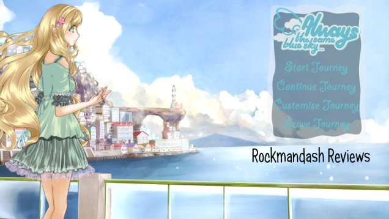
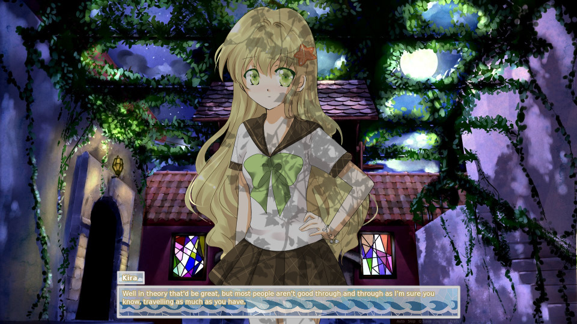
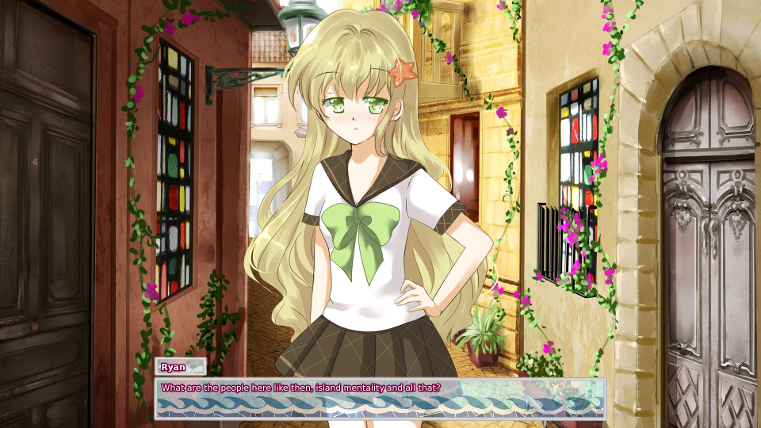
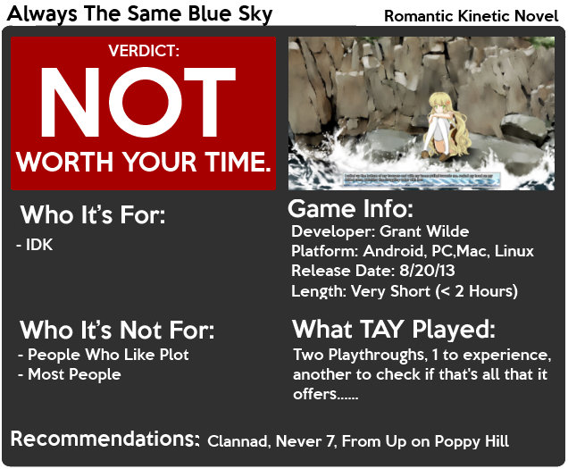

---
{
title: "Rockmandash Reviews: Always The Same Blue Sky [Visual Novel]",
tags: ["rockmandash reviews", "indie", "visual novel", "tay-classic", "lackluster", "always the same blue sky"],
authors: ['reikaze'],
published: '2014-04-30T20:00:00-04:00',
attached: [],
license: 'cc-by-4',
oldArticle: true
}
---

 I've always believed the ideal place for a romance series is near by the coast in a small
  town. There's just something very charming about that setting whether it's Ghibli doing it, or some random company.
  Today we have a game that lives on the idea of a romance at the coast; an indie Visual Novel called Always The Same
  Blue Sky. 

 Video Review here:

<iframe allow="accelerometer; autoplay; clipboard-write; encrypted-media; gyroscope; picture-in-picture" allowfullscreen="" frameborder="0" height="315" src="https://www.youtube.com/embed/o9vNjnknN_I" width="560"></iframe>

 Always The Same Blue Sky is a romantic visual novel set nearby the ocean in an
  un-named small town. I find that the easiest way to describe this plot is that it's a poor man's Planetarian with an
  interesting setting. It's a short kinetic novel, with the writing best described as bad. It's rushed yet bloated at
  the same time, and it feels really generic. What I mean by this is that there's lots of random rabble that doesn't
  help the experience, but the pacing of the game is too fast to develop any meaningful plot.

 My biggest issue with the writing is that things happen because they happen; there's no
  rhyme or reason for anything. There's no real plot, it's just a bunch of conversations of nonsense or messages
  stitched together. The characters aren't really worth mentioning; they have no depth, the relationship between the
  protagonist and the heroine Kira is awkward because they don't really have any buildup and it feels like the only
  reason they like each other is because the writer wanted it to be that way.

 The writing would have been much better if this game did a better job connecting
  the plot; actually showing the world, characters, plot etc. instead of throwing random scenarios. Another con is the
  length: this game is short. Very short. You can finish this in about 10-20 minutes. Don't get me wrong; I don't mind
  short VNs. I loved the heck out of Planetarian, but that had the charm, great world building, interesting characters,
  etc. In ATSBS, the writing is pretty meh, and there is so much they could have done to improve it. 

<h4 class="sc-1bwb26k-1 fvCjqJ" id="h117229">Writing - 5/10</h4>

 Always the Same Blue Sky is a Short kinetic novel. This means there is no gameplay
  and nothing to talk about. It's literally just reading. It works but I'd rather see decisions. One thing to note is
  that it's available on android, and that's a pretty nice experience, but other than that, nothing to mention here.

<h4 class="sc-1bwb26k-1 fvCjqJ" id="h117230">Gameplay - 6/10</h4>

I don't really know what to think about the visuals on this game. It's water colored nicety
  in a pretty high resolution, but the whole game looks pretty generic. There's something that really bothers me about
  this game's visuals, I guess it's just not my taste. The Art style is nice, but it's just not my cup of tea. I didn't
  like the character art... but my biggest gripe was about the visuals was that I felt like it needed more art, and in
  general it could have been improved. The game runs on the Ren'py visual novel engine, and I'm not too keen on how the
  engine looks in general, but in this game the UI is not scaled well, as the text, the text-box and any of the UI
  elements felt too small, no matter what device I was playing. ATSBS does some things right, but others horribly wrong
  when it comes to visuals. 

<h4 class="sc-1bwb26k-1 fvCjqJ" id="h117231">Visuals - 7/10</h4>

 The music is pretty charming, and calming. It's charming, but it suffers through
  the same problems that plagues this whole game: There's not enough of it, and it doesn't try to stand out, thus it
  doesn't really stand out. 

<iframe allow="accelerometer; autoplay; clipboard-write; encrypted-media; gyroscope; picture-in-picture" allowfullscreen="" frameborder="0" height="315" src="https://www.youtube.com/embed/rN1L9Z6DIus" width="560"></iframe>
<h4 class="sc-1bwb26k-1 fvCjqJ" id="h117232">Sound - 6.5/10</h4>

 Grant Wilde, if you are reading/<a class="sc-1out364-0 hMndXN sc-145m8ut-0 gIacKn js_link" data-ga='[["Embedded Url","External link","https://www.youtube.com/watch?v=o9vNjnknN_I&amp;list=UU4ho5vWtymodIky88AQIaUw",{"metric25":1}]]' href="https://www.youtube.com/watch?v=o9vNjnknN_I&amp;list=UU4ho5vWtymodIky88AQIaUw" rel="noopener noreferrer" target="_blank">watching</a> this, I'm very happy that you gave me a review copy, and you check out
  my stuff. It's been an interesting experience to have a review copy, and I thank you for it. That won't sway my
  opinion of this game though, as it's not very good. It's not the worst I've played, but it comes pretty close to it. I
  cannot recommend this game to anybody at the price it currently sits at, and I wouldn't recommend this game even if it
  was free. This game is bad, and I'm hoping it'll be better the next time.
<h2 class="sc-1bwb26k-1 fvCjqJ" id="h117233">Overall - 5/10, Polarization +3 -1</h2>

<strong>Copyright Disclaimer:</strong> Under Title 17, Section
  107 of United States Copyright law, reviews are protected under fair use. This is a review, and as such, all media
  used in this review is used for the sole purpose of review and commentary under the terms of fair use. All footage,
  music and images belong to the respective companies. 

<em>You can see all my reviews on </em><a class="sc-1out364-0 hMndXN sc-145m8ut-0 gIacKn js_link" data-ga='[["Embedded Url","Internal link","http://tay.kotaku.com/tag/rockmandash-reviews",{"metric25":1}]]' href="http://tay.kotaku.com/tag/rockmandash-reviews"><em>Rockmandash Reviews</em></a><em>. For An explanation
  of my review system, </em><a class="sc-1out364-0 hMndXN sc-145m8ut-0 gIacKn js_link" data-ga='[["Embedded Url","External link","https://rockmandash12.kinja.com/rockmandash-rambles-an-explanation-on-my-review-system-1619265485",{"metric25":1}]]' href="https://rockmandash12.kinja.com/rockmandash-rambles-an-explanation-on-my-review-system-1619265485" rel="noopener noreferrer" target="_blank"><em>check this out</em></a><em>. </em>

<aside class="sc-1rh3ayr-6 jfFNjl inset--story branded-item branded-item--kinja" data-commerce-source="inset">

<a class="sc-1out364-0 hMndXN js_link" data-ga='[["Permalink page click","Permalink page click - inset headline"]]' href="https://rockmandash12.kinja.com/rockmandash-rambles-an-explanation-on-my-review-system-1619265485" rel="noopener noreferrer" target="_blank"><h6 class="sc-1rh3ayr-3 jRIPES">
    Rockmandash Rambles: <i>An Explanation on my Review System</i> (Updated 11/15/2015)</h6></a>

If you’ve read any of my reviews and wanted to know why I did them the way I do,
      here’s an…
<a class="sc-1out364-0 hMndXN sc-1rh3ayr-0 kOvmIi js_readmore inset--story__readmore js_link" data-ga='[["Permalink page click","Permalink page click - inset read more link"]]' href="https://rockmandash12.kinja.com/rockmandash-rambles-an-explanation-on-my-review-system-1619265485" rel="noopener noreferrer" target="_blank">Read more</a>

</aside>

