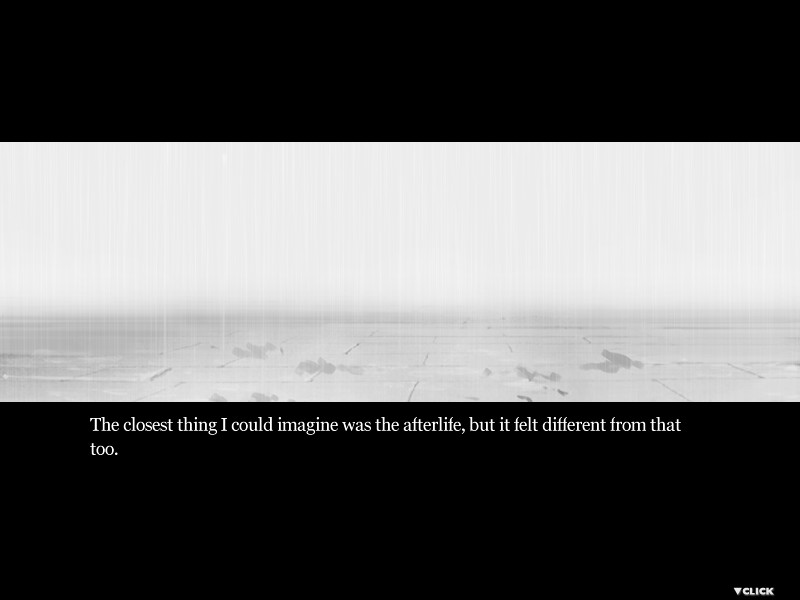
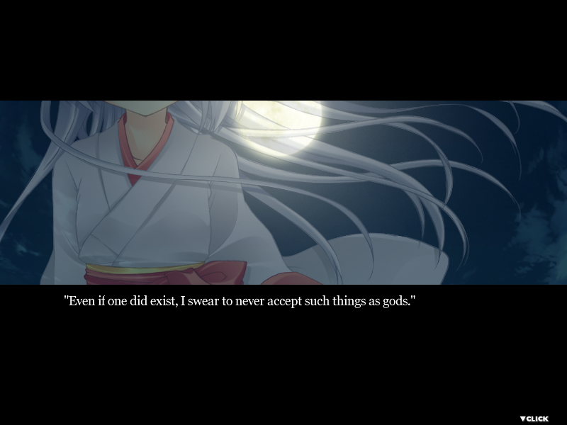
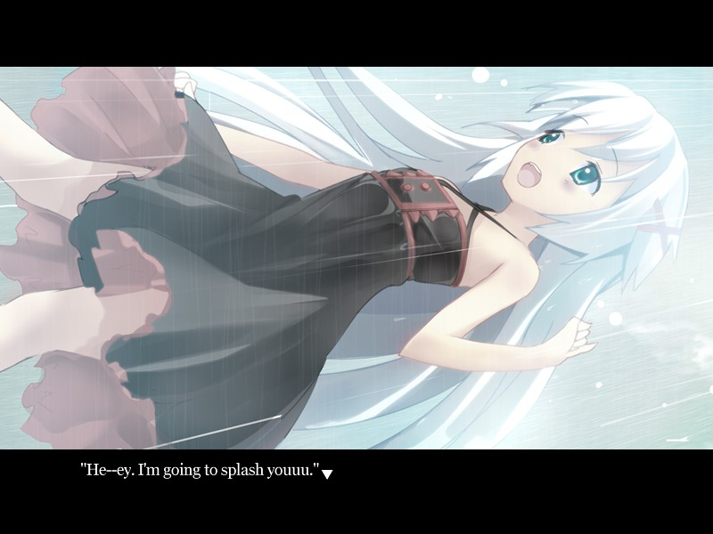
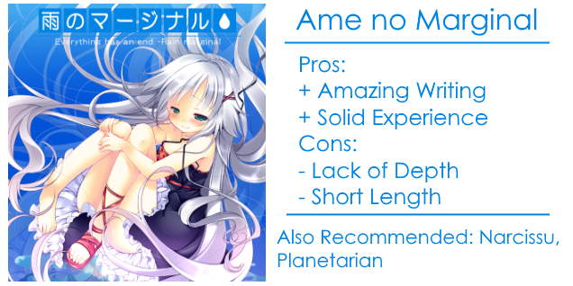

---
{
  title: "Rockmandash Reviews: Ame no Marginal [Visual Novel]",
  tags:
    [
      "Rockmandash Reviews",
      "Ame no Marginal",
      "Narcissu",
      "AniTAY",
      "Tayclassic",
      "FuwaReviews",
      "Visual Novel",
      "Sekai Project",
    ],
  published: "2015-08-04T20:50:00-04:00",
  attached: [],
  kinjaArticle: true,
}
---

Have you ever felt that your pain would never go away, continuing with no end in sight?
  This is the focus of <em>Ame no Marginal</em>, a Short VN by Stage-Nana, the creator of the absolutely fantastic
  <a class="sc-1out364-0 hMndXN sc-145m8ut-0 gIacKn js_link" data-ga='[["Embedded Url","External link","http://rockmandash12.kinja.com/rockmandash-reviews-narcissu-1st-2nd-visual-novel-1676683203",{"metric25":1}]]' href="http://rockmandash12.kinja.com/rockmandash-reviews-narcissu-1st-2nd-visual-novel-1676683203" rel="noopener noreferrer" target="_blank"><em>Narcissu</em></a>. Transported into a strange and
  mysterious world, where there is nothing but rain and sorrow, we see a moving tale about staticity, the consistant
  pain that occurs when everything is fruitless.

In <em>Ame no Marginal</em>, We follow a suicidal man as he steps into an elevator
  which transports him into a strange world in which there is no passage of time, no hunger, no death, nothing but a
  consistent rain and a girl named Rin. Through this tale, we get to see Stage-Nana doing what they do best, as <em>Ame
    no Marginal</em> tells a tale about misery and depression, dealing with the interaction between others, a mysterious
  world and forces that are outside of your control. With it’s segmented chapters, split between our MC and Rin’s
  horrific past, it creates a similar dynamic to <em>Narcissu</em> and <em>Narcissu 2</em> in which we learn about the
  world and the past as we progress through the story, and it’s one of the more interesting styles of storytelling out
  there. It’s engaging, well paced, and strong with story that isn’t afraid to hold back at you, to show you what a
  harsh life is like, and because of that it’s a great ride.

In particular, the way
  that this work handled the premise and particular characters were extremely strong, with rin’s backstory in particular
  being the best part of the story and being some of the best, most engaging backstory I’ve seen executed in a while.
  The things that she has to go through are things no sane person should ever have to experience, and the way they
  handled it, was just engaging and moving, thought provoking and just interesting in general, a element of the story
  that keeps you moving on, keeps you engaged with the story and the world. 

The story, while it does have it’s lighthearted aspects, is just as melancholy as you would
expect and along with the somber atmosphere this story has, allows the work to push out it’s themes in a rather
powerful way. The themes themselves, like dealing with forces out of your control, are really interesting and
engrossing, handled extremely well. The way it it ponders with the ideas of forced bondage by religious cult,
suffering, lasting pain that will never change in a world of an infinite now, forgiveness and a life of loneliness
create a large impact on the readers, get them to think about the world, how we deal with others, and a relationship
between a person and untouchable forces were done extremely well and were very strong.

That being said, there’s one thing that I believe is a huge issue in the writing,
  keeping this game from being something truly special, something memorable and something amazing. While the story is
  written well with strong themes, it’s a bit of missed potential: it’s extremely short (being about a 2-8 hour read),
  it’s not deep, it’s not that developed and there’s simply not enough of it as everything we experience passes by a
  little too quick, which is rather ironic given the premise of the story is a world where there is everlasting stasis.
  The story gets you to think about the themes but does not have enough time to engross you in it, it moves you, but not
  to the extent that you would hope for. For an example, the MC is not developed at all and is probably the weakest
  link. He’s here, but we don’t get to learn anything about him, what he’s like and what got him into the situation...
  which is just odd when we compare him to the other characters that were pretty well developed. The game is lacking,
  and more development would have went a long way.

Beautiful. While not nearly as minimalistic as <em>Narcissu</em>, it still has those
  minimal touches due to the black borders and the presentation of this work was very solid with the visuals and the
  sound totally in synergy, providing an atmosphere that was beautiful yet somber, getting you engaged in the work while
  standing out as strong assets themselves. The visuals did a great job at making the world feel ethereal and
  mysterious, yet perfect at what it was doing while the music had mellow yet moving tracks that did a great job at
  getting you into the mood. 

<iframe allow="accelerometer; autoplay; clipboard-write; encrypted-media; gyroscope; picture-in-picture" allowfullscreen="" frameborder="0" height="315" src="https://www.youtube.com/embed/cVRkzGCDJmY" width="560"></iframe>

Ame no Marginal is a good game. It’s a solid experience with an interesting story, moving
  you in a way that only a stage-mana story can with it’s somber yet calm atmosphere, but it’s a bit too short and
  underdeveloped to call it amazing. I had a great time with this and would recommend it to everyone, but you should
  keep in mind that it’s not omgamazingness that <em>Narcissu</em> was. 

Also, I need to mention pricing: <em>Ame no Marginal</em> is sitting at $12.99,
  which is a bit expensive, considering the length of the game. It’s a good time, but it’s probably not worth that much
  to most people and even if you’re a <em>Narcissu</em> fan, it’s a lot. That being said, wait for a sale or something,
  it’s definitely worth trying out at some point.
<h4 class="sc-1bwb26k-1 fvCjqJ" id="h107894">Overall - 8/10, Polarization +.5,-2</h4>

<strong><em>Disclaimer: </em></strong><em>This copy of the
  game was provided by Sekai Project for the purpose of review. Also, Under Title 17, Section 107 of United States
  Copyright law, reviews are protected under fair use. This is a review, and as such, all media used in this review is
  used for the sole purpose of review and commentary under the terms of fair use. All footage, music and images belong
  to the respective companies.</em> 

<em>You can see all my reviews on </em><a class="sc-1out364-0 hMndXN sc-145m8ut-0 gIacKn js_link" data-ga='[["Embedded Url","Internal link","http://tay.kotaku.com/tag/rockmandash-reviews",{"metric25":1}]]' href="http://tay.kotaku.com/tag/rockmandash-reviews"><em>Rockmandash Reviews</em></a><em>. For An explanation
  of my review system, </em><a class="sc-1out364-0 hMndXN sc-145m8ut-0 gIacKn js_link" data-ga='[["Embedded Url","Internal link","http://tay.kotaku.com/rockmandash-rambles-an-explanation-on-my-review-system-1619265485#_ga=1.205141205.473183827.1418699279",{"metric25":1}]]' href="http://tay.kotaku.com/rockmandash-rambles-an-explanation-on-my-review-system-1619265485#_ga=1.205141205.473183827.1418699279"><em>check this out</em></a><em>.</em>

