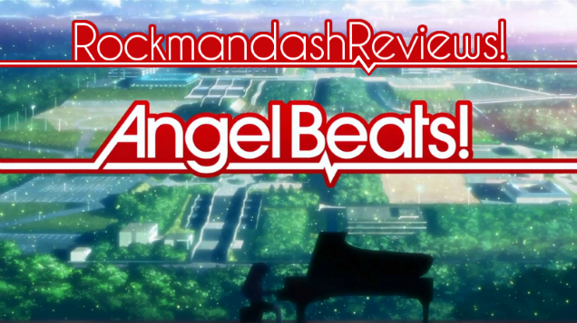
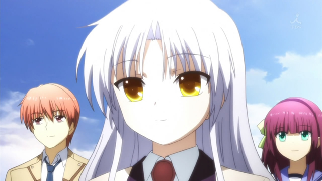
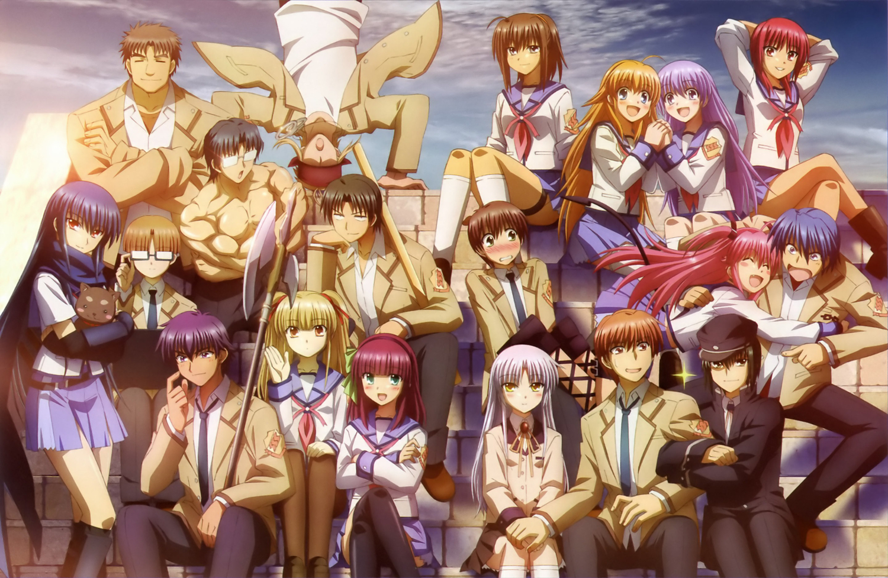
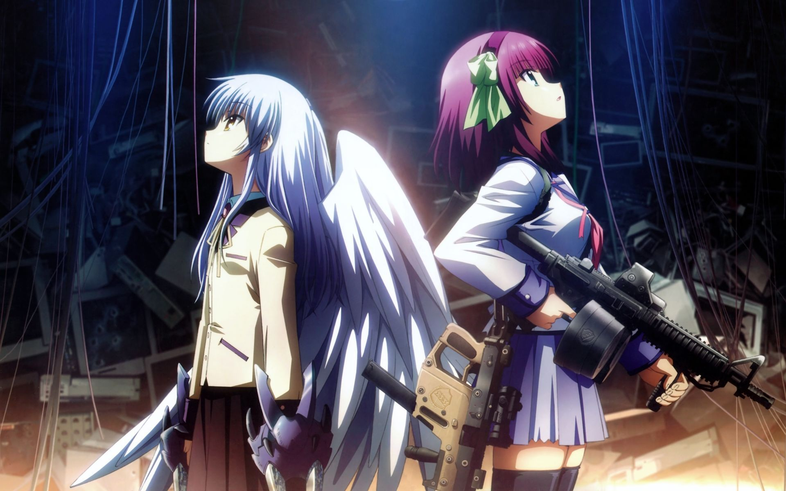
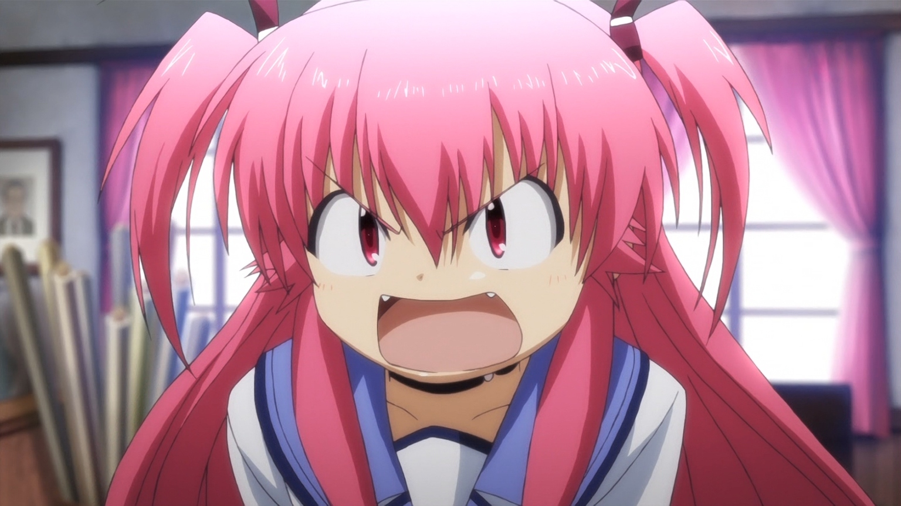
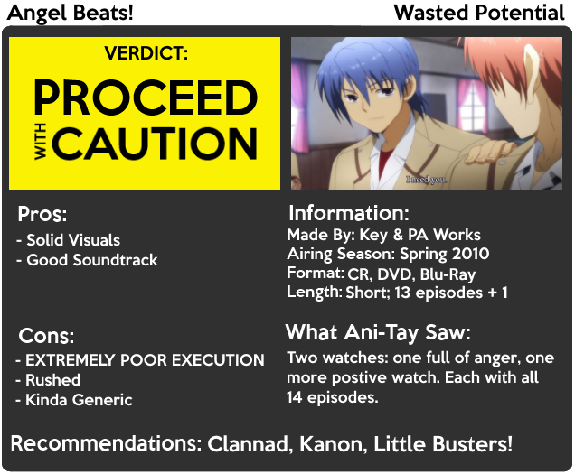

---
{
	title: "Rockmandash Reviews: Angel Beats! [Anime]",
	published: "2014-08-18T20:00:00-04:00",
	tags: ["rockmandash reviews", "key marathon", "angel beats", "tay-classic"],
	kinjaArticle: true
}
---

Let’s think of a recipe for a good anime. One that might come to mind is [Key](https://tay.kinja.com/rockmandash-reviews-key-marathon-wip-1606707641) + PA Works = Greatness. Thinking about the type of stuff they made, this would be a match made in heaven, right? And considering how well said show has been been received by fans, shouldn’t it be an amazing show? Welcome to Rockmandash Reviews, and today we’ve have one of most disappointing shows in my opinion, *Angel Beats!*.

*Angel Beats!* has a poorly executed plot, due to rushed pacing, bland characters, and a lack of what makes Key works great. It’s a Key work without slice of life, character development, an interesting cast; Without those, all you are left with is a hollow show tries to be as good as the others, but it inevitably fails at doing anything well.

Almost all of this stems from the fact that Key and PA Works didn’t have enough money to make a 24-26 episode show, so they took that script made for 24-26 episodes, and turned it into a 13 episode show. If you compress a 24 episode script into a 13 episode show, It’s inevitable that things will be sacrificed... but what’s sacrificed in* Angel Beats* is what separates Key works from the others; it sacrifices what they are good at, to make a sub-par show overall. It has bad pacing, a cast that screams wasted potential, and a rushed plot.

You might be thinking (or not... probably not) that because of the budget issues in the show, I’m going to be lenient on it. I’m not. You can do a lot with 12-13 episodes; *Anohana *had 12 episodes and it was executed very well due to a tight narrative focused on a few broken characters. In *Angel Beats*, they could have done that, instead they focused on a plot that had no depth instead of focusing on the characters, and they had so many characters you couldn’t keep track of. Simply put, *Angel Beats* was trying to do too much in too little time, and even with the budget constraints, they still could have done better. It was done poorly; It was trying to create an amazing and interesting world full of interesting characters, interesting back-stories, and a good concept, but by packing so much into so little time, it causes the show to be sub-par with a boring tone. It’s like trying to watch the [UBW movie](http://rockmandash12.kinja.com/rockmandash-reviews-fate-stay-night-unlimited-blade-wo-1504755437) without seeing the source material... It’s impossible to pick up the plot and it leaves a bitter taste in your mouth. Unfortunately, this is the source material, and there’s no really good version of it that we can rely on, until the VN comes out. (I really hope it’s good.)

The story in *Angel Beats *follows our Amnesiac (Which is an epic fail right there) lead Otonashi, who finds himself enrolled into a high school in purgatory. He meets a girl named Yuri who invites him to join the Afterlife Battlefront, an organization she leads which fights against the student council president Angel a girl with supernatural powers to rebel against god. The rest of the story is Otonashi going with the flow of the other, more interesting characters, and trying to find his back story. It’s an interesting premise (if a bit generic in structure if you take it face value), but it’s just done horribly wrong. Did I mention that everybody in purgatory lived an unfair life and usually died a pretty miserable death? This leads to tragic incidents that occur just because of the nature of the setting... which I’ll get to later.

From the description I gave, The main cast may seem interesting, but they are pretty boring in the long run. Our main Otonashi, barely has a personality. He’s supposed to be a viewer proxy, and the straight-man for the show, but instead what we get is a boring main that lacks any appeal. He lacks the snark and interesting personalities that other Key mains have, which just makes this more boring than it should be. Our main heroine, Angel, also known as Kanade, is a Kuudere played straight. Very archetypal, very cold, and very boring. I have personal issues with the archetype itself, but especially in a situation like this, it simply does not work. Key works rely on a romance, and when we have a romance that has a heroine that shows no emotion, it’s not enjoyable. Speaking of Romances, there’s pretty much none here. The show tries to do a love triangle with Yuri, who’s a Haruhi clone without god powers, but they don’t really go anywhere with that and just ignore that love triangle to try to neatly wrap the show with a little bow (which fails, but I’ll get to that later).

The side characters were quite interesting, but the issue was they never got enough development and **THERE WERE WAY TOO MANY**. Many of them didn’t get any character development at all, and they were so shallow that you can describe them with personalities. You’ll probably do that, because some characters get very few screen time and it’s hard to juggle a cast so large. In general they were interesting (TK!), but I never really cared about what happened to them due to the lack of character development.(also because you can’t die in the purgatory world). They try to use the back-stories of characters as a replacement for actual interaction and development because they don’t have time to do so, which kinda work due to the fact that the flashbacks had a tighter narrative and were done better, but not completely because you don’t have development before hand. This is one of my gripes in a lot of shows; if the show just throw horrible situations at characters without getting to know them, it just leads to wasted potential, a general lack of interest in the viewer and a bitter taste in the viewers mouth.

<video src="./1248126401809686598.mp4"></video>

Also, this show tries to be a comedy and that aspect was done pretty well, with mostly entertaining jokes. I enjoyed many of the gags they pulled like the amazing [rocket chairs](https://www.youtube.com/watch?v=fORH60LtOt4), but sometimes they try to rely on jokes based on the personality of the characters, which can be hit or miss because of said characters, but it should keep you entertained.

I thought I ranted about the writing enough, but we haven’t even got to the worst part.... the ending. **WARNING SPOILER ALERT HERE SKIP IF YOU DON’T WANT THE ENDING RUINED.** The Ending leaves so many plot holes that it’s like a slice of Swiss cheese... It’s rubbish. Why did Otonashi get to purgatory if he died without regrets? if he donated his heart to Kanade, why did Kanade come first to Purgatory? Kanade would have had to live the rest of here life, die, then spend a year-ish in the Purgatory high to get to where she was in the story... so what was Otonashi doing in that time? How did Otonashi not notice he didn’t have a heart? Why didn’t Kanade just say thanks when she noticed it? The ending leaves so many questions, and it’s just a rubbish ending that breaks the suspension of disbelief. It tugs at your heart, yes... but it’s a flawed way of doing it.

The writing in *Angel Beats *is flawed, but mostly due to the execution. When you execute a plot so horribly, it’s a bad show, and it really drags the rest of the show down.

#### Writing - 5/10

 

I don’t think that the visuals in *Angel Beats* are something that will blow you away like other [PA Works shows](http://tay.kotaku.com/rockmandash-reviews-nagi-no-asukara-anime-1567969970), but it’s pretty good. PA Works did a great job building an world with the visuals: interesting camera shots, great lighting, and art that makes the world feel like it has depth. Other than that, Angel Beats has solid action scenes neat effects and attention to detail that I appreciated; It has amazing gradients, accurate art and a solid aesthetic design overall. There’s one thing that bothered me about the art, and that was the characters. I think that some of the characters in general look generic, and sometimes the animation and art of the characters can be rough around the edges at times. Overall though, it’s pretty good.

#### Visuals - 8/10

The day Key makes something with a bad soundtrack is the day pigs sprout wings and sail through the air, and to my knowledge, no pig has done so. If you like piano, you will be very happy... this soundtrack is full of amazing piano pieces and it’s music to my ears. It has an amazing opening (one of my personal favorites), and the tracks themselves are always good. The Angel Beats soundtrack lives up to the name in quality, but when it comes to sound in anime, quality of tracks is not the most important part.... and frankly, this soundtrack is better standalone.

Just as important as the quality of the soundtrack is the usage of it; In an anime, tracks need to make an atmosphere and the way the show implements the music into the show is quite poor. They reuse the same tracks for the times with tension which can have a negative impact on your enjoyment of the show and sometimes there are times where they should have some music but either there’s no music, or it’s really quiet so you don’t notice it. This soundtrack fades too much into the background, which leads many of the tracks to not be memorable, even though they are pretty good. Also, Quantity; *Angel Beats *needs more music, playing at more times. With only 25 songs, and some sounding eerily similar to others, they blur and I’d think this show would do better with more tracks. More of a good thing isn’t bad.... Hopefully we’ll get more in the VN?

#### Sound - 7.5/10

Overrated, underwhelming, wasted potential: the recipe for Hype backlash. No offence to any *Angel Beats *fans out there reading this, and sorry for a bit of pretentiousness in this segment here, but Angel Beats fans ruined the show for me, at least on my first watch. I came in with expectations; They said it was amazing, one of the best anime ever, and it will flood you with feels. To a guy who just finished *Clannad,* these are the words I wanted to hear.

Unfortunately, I did not notice the popularity of the show, and the demographics of the fans; *Angel Beats* is popular enough that the majority of the fans are what i’d classify as a Lowest Common Denominator anime fan: The type who only watches the really well known shows, (mostly shounen). These people praise said shows like all hell in a fanboy-like fashion, they don’t take an objective look on the series, and are generally a pain to deal with: they always compare the show they are talking about to the same few shows they have see, and they also go on fanboy attacks whenever you say anything about said show.

The first time I watched it, this show filled me with rage. I came in expecting something great, and what happened was that I was bored out of my mind with a boring world, meh writing, and a sub-par cast. every episode I was expecting something great, but got mediocrity instead. I was expecting tears, but what I got was anger instead. I hated the show with a burning passion; How could something like this get popular? Why this instead of something like *Kanon* or *Rewrite*? **WHAT ARE THESE PEOPLE THINKING?** I did not enjoy my first watch at all, and I came into this review ready to bash.

Thankfully, I re-watch shows for reviews, and as you can see, the bashing did not happen to the extent that I was expecting it to. Coming in with lower expectations totally changed the way I viewed the show; I actually enjoyed this show a it, even with it’s massive flaws in writing. I couldn’t get the thought out of my head on how much of Angel Beats is a waste of potential. It could have been a lot better; maybe not *Clannad* levels of greatness, but at least *Rewrite* levels. Structurally, its sound; good production values, good basic plot (if a bit boring), lots of potential when it comes to character development, and a potential for feels. That being said, I still don’t get how people love it to death, and that still bugs me. It’s a very flawed show, and I really hope the VN fixes all the issues I have.

#### Enjoyment - 6.5/10

Coming in without expectations enables me to be a bit more rational about it, and I’ve came up with this conclusion: This is a show that had potential, but it was wasted due to budget constraints. If you come into this show with high expectations, like that it’s the [2nd saddest anime you will see](http://www.thetoptens.com/saddest-anime-series/), throw out those thoughts unless you like hype backlash. It’s an average to less than average show, and it deserves to be treated as such. Here’s hoping that key can fix this broken story up, and make something worth all the praise it gets.

If you want another, more positive perspective on this show, check out my fellow AniTAYer [Dex’s review](http://tay.kotaku.com/dexs-review-angel-beats-1490745497) on it.

## OVERALL 6.5/10, Polarization +3, -.5

 

***

**Copyright Disclaimer:** Under Title 17, Section 107 of United States Copyright law, reviews are protected under fair use. This is a review, and as such, all media used in this review is used for the sole purpose of review and commentary under the terms of fair use. All footage, music and images belong to the respective companies.

*You can see all my reviews on *[*Rockmandash Reviews*](http://tay.kotaku.com/tag/rockmandash-reviews)*, and the rest of my *[*Key Marathon*](https://tay.kinja.com/rockmandash-reviews-key-marathon-wip-1606707641)[* Here*](https://tay.kinja.com/rockmandash-reviews-key-marathon-wip-1606707641)*. For An explanation of my review system, *[*check this out*](http://tay.kotaku.com/rockmandash-rambles-an-explanation-on-my-review-system-1619265485)*.*

*This anime is available on *[*Crunchyroll*](http://www.crunchyroll.com/angel-beats)* for free and legal streaming.*

*Also, this review has been edited to fix several issues brung up in the comments.*
