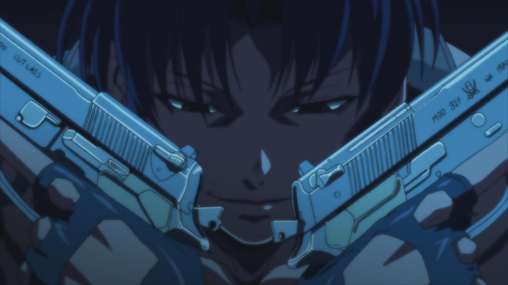

---
{
	title: "Rockmandash Reviews: Anime Backlog Review Gauntlet #1",
	published: "2015-01-19T12:00:00-05:00",
	tags: ["Rockmandash Reviews", "AniTAY", "Anime Backlog Review Gauntlet", "Backlog", "Perfect Blue", "Death Billards", "Black Lagoon", "Tokyo Magnitude 8.0", "Time of Eve"],
	kinjaArticle: true
}
---

When I write a review, I typically do so because I want to talk about it, and get my thoughts out about it. This works out well when I go into a work knowing that I want to review it, but there are times when trying to review and analyze something can lessen the experience, like killing a backlog. Today on Rockmandash Reviews, I'm trying a new article structure to see if I can bridge this gap, with the*** SUPER DELUXE ANIME BACKLOG REVIEW GAUNTLET EXTRAVAGANZA!***

The Anime Backlog Gauntlet serves multiple purposes. First off, I've heard a lot of complaints that we really don't cover older shows here on AniTAY. This is a completely valid complaint because... we don't. It just so happens that most of my backlog are older shows (not this time in particular, but in the future there will be more older shows) and are the ones that have been recommended with near universal praise, so it kinda works out. Second, I don't really have the time to do full reviews for everything I see, but even when I don't, I still want to talk about them. This is my way of compromising on that: it's shorter reviews in the style of my lists but in more detail or Dex's[ Purgatory reviews ](https://anitay.kinja.com/dex-reviews-space-yuri-school-and-more-1676056274)(which I may have a Gauntlet dedicated to). Third, In my opinion, this season is relatively dry, so I'm working on trying to slay the beast that is a backlog, and this is the best way I thought of to cover these shows in my backlog. Now that I've said all of that, it's time to get into the gauntlet! (Note: The order of this is the order I watched it, there's no rhyme or reason to it.)

###### [Dex Reviews Space Yuri, School, and More](https://anitay.kinja.com/dex-reviews-space-yuri-school-and-more-1676056274)

For the last year I've had a problem. I've watched several shows that I never really wanted to…

[Read more](https://anitay.kinja.com/dex-reviews-space-yuri-school-and-more-1676056274)

***

### *Tokyo Magnitude 8.0*

**Information: **11 Episodes, Made by Bones and Kinima Citrus in 2009

**Plot Description: **The premise of the project is the 70% possibility that a magnitude 7.0 earthquake will occur in Tokyo in the next 30 years. The anime depicts what would happen if an 8.0 earthquake took place.

The story centers on Mirai, a middle school freshman girl who goes to Tokyo's artificial Odaiba Island for a robot exhibition with her brother Yuuki at the start of summer vacation. A powerful tremor emanates from an ocean trench, the famed Tokyo Tower and Rainbow Bridge crumble and fall, and the landscape of Tokyo changes in an instant. With the help of a motorcycle delivery woman named Mari who they meet on Odaiba, Mirai and Yuuki strive to head back to their Setagaya home in western Tokyo. -* Plot Description from MAL*

**Why I watched it: **There are a few reasons why I pick up a show, and this is one of the most typical reasons: I see a review that peaks my interest, and I go watch it because of said review. In this case, Dex's hype and [review ](https://anitay.kinja.com/tokyo-magnitude-8-0-the-ani-tay-review-1677232000)convinced me that I needed to watch it immediately, thus I did. The premise also peaked my interest immensely, so I watched it the day after I read Dex's review.

[](https://anitay.kinja.com/tokyo-magnitude-8-0-the-ani-tay-review-1677232000)

###### [*Tokyo Magnitude 8.0*: The Ani-TAY Review](https://anitay.kinja.com/tokyo-magnitude-8-0-the-ani-tay-review-1677232000)

Tokyo Magnitude 8.0 poses a question: What would happen if Tokyo were hit by a long-expected 8.0…

[Read more](https://anitay.kinja.com/tokyo-magnitude-8-0-the-ani-tay-review-1677232000)

**Thoughts: **It's an interesting, realistic disaster show that is something that everyone should watch. I pretty much agree with Dex on most aspects, as it's an amazing coming of age story with an awesome, powerful narrative, and a great feeling of tension, especially in the second half. What really got me into it was how realistic it felt, how it gets you to know these characters like you knew them in real life, and how it felt like you were actually in the situation. The mystery felt real, the situation in general felt real, and it's just fantastic. The impact that the show has on you is just amazing: It's a coming of age done in a fantastic, realistic way, and it will evoke feelings from you. I really mean that: I don't think I've cried this much while watching a show since White Album 2, and it just blew my mind. I had a great time watching through this show, even though it was a bit depressing.

**Score: **9/10, Polarization +.5, -2. ***Rockmandash Recommends/Go For It!***

***

### *Time of Eve*

**Information: **6 Episode ONA (18 min each) or 1hr 46 min Movie by Yasuhiro Yoshiura in 2008-2009. The ONA is on Crunchyroll.

**Plot Description: **In the not-too-distant future, probably Japan, androids have come into common usage. Rikuo Sakisaka, who has taken robots for granted for his entire life, one day discovers that Sammy, his home android, has been acting independently and coming and going on her own. He finds a strange phrase recorded in her activity log, "Are you enjoying the Time of Eve?". He, along with his friend Masakazu Masaki, traces Sammy's movements and finds an unusual cafe, "The Time of Eve". Nagi, the barista, informs them that the cafe's main rule is to not discriminate between humans and androids. Within the cafe, androids do not display their status rings, and, when patrons depart, the door is automatically locked for two minutes to prevent someone from following them to discover their true nature. - *Plot Description from Wikipedia*

**Why I watched it: **After seeing [*Patema Inverted*](https://anitay.kinja.com/patema-inverted-ani-tay-review-and-discussion-1678652596) (which was made by the same director, Yasuhiro Yoshiura) and hearing about it from people in the AniTAY chatroom, I was curious about it.

###### [*Patema Inverted *Ani-TAY Review and Discussion](https://anitay.kinja.com/patema-inverted-ani-tay-review-and-discussion-1678652596)

Dexomega: Hey everyone. Today Rockmandash and I are going to talk about Patema Inverted. It's a…

[Read more](https://anitay.kinja.com/patema-inverted-ani-tay-review-and-discussion-1678652596)

**Thoughts:** The *Time of Eve *is a great and realistic near sci-fi that felt believable, something I really appreciate. I really enjoyed it, but I wish they had more time to flesh the characters out, as the way that it's done here leaves room for improvement. The best part of the show has to be the society and the world: the way that the show expanded on how society viewed human/robot interactions, the look on the social structure, and just seeing the characters act in the way that they did was pretty interesting and engaging, especially at the Time of Eve cafe. The premise is based around the human/robot relationships, and they executed everything about that extremely well with interesting scenarios throughout the show/movie. Also, due to the way that the characters interact and the way it presents the story, the show gets you to think, even if you've seen these themes and have been asked these questions tons of times already. What is a human? What is a Robot? Which is which, and does it even matter? How would you treat a robot if they were nearly humanoid, and how does that reflect your treatment twords humans? It's a pretty deep show/movie, especially considering the time it has to work with.

The show is focused on the character interactions and the dynamics of people and robots who don't know which is which, and delving into these relationships was deeply interesting, but the most important relationship wasn't fleshed out at all, to my dismay. It lacks in the very same thing that I praised Patema inverted for: Catharsis. I really wanted to see Rikuo and Sammy get to know each other better, and how their relationship changed after all the events happened, but they didn't go into it at all. They developed pretty much everyone else in a great way, but that one relationship wasn't touched at at all, which left me disappointed with the overall story.

As for the presentation, it was pretty good. The tone of the show is what really dictates it all: It's a pretty mellow show at most times due to its premise of being about a cafe and its always calming and relaxed, but it manages to handle it's serious ideas well. It creates an atmosphere that is interesting, calming and relaxed yet very real. The visuals were beautiful, with great lighting that made it all happen while looking just great in general. I have a minor complaint with it though, as the characters looked kinda plain, but that sorta helped the story with its trying to be real, so it's not really a big deal. The soundtrack was good, did the job and helped scenes when it needed to, and sounded nice but didn't really stick out.

Overall, I liked *Time of Eve.* I ended up a bit disappointed with it due to some things... but it's pretty good in general, with a great world and awesome atmosphere. For more thoughts, check out [Bakashift's review](https://www.youtube.com/watch?v=D_l_p6TUc5s).

**Score: **8/10, Polarization: +1.5, -.5. ***Rockmandash Recommends/Go For It!***

***

### *Black Lagoon*

**Information: **24 Episodes (in the form of 2 seasons)made by Madhouse in 2006

**Plot Description: **Okajima Rokuro is a Japanese businessman in a town full of Japanese businessmen. His normal day consists of social drinking with clients and being kicked around by his bosses. He finally gets a break though, as he's sent by his company to the tropical seas of Eastern China to deliver a disc. But his boat gets hijacked by a band of mercenaries hired to retrieve the disc. Rock (as he is newly dubbed by his captors) catches the interest of the only female merc Revy as she thinks he's worth a ransom, taking him hostage. However, the disc that was stolen has a terrible secret that's unknown to Rock, which causes massive confusion and chaos for both him and his kidnappers. *- Plot Description from MAL*

**Why I watched it: **I watched this mainly because I was interested in how they portrayed Southeast Asia (I'm Vietnamese and have been there several times). Also, I've heard about this show quite a bit, and have had some recommendations so I gave it a spin.

**Thoughts: **Guns, Girls, and Gangs. These are 3 words that can pretty much describe the show and everything about it. It's an over the top action show that takes place in an interesting part of the world and oozes enjoyment (Torpedo + Plane = Boom). Personally? Not my type of show, but I can totally see why people would love it. It's very well done, well rounded, and well developed. The characters and setting are great, and the scenarios they get in are extremely engaging. Also, Baddass action fights. What's not to love? It's an episodic action adventure that's always interesting.

Surprisingly, I really enjoyed the writing of this show, as it was pretty well executed. All the characters are great: well developed, interesting and entertaining. I was surprised how much I liked Rock as he was a great main who got a surprising amount of development (I found his nickname funny because people call me "Rock" online cus of my username) and even the bad guys got a decent amount of development. The world is just as awesome, taking place in Southeast Asia and representing it's city of Roanniper pretty well. It's good writing and good action makes for the best type of action show, where the writing supports the action but never gets in the way.

As for the presentation, it really hasn't aged at all. The visuals look great, especially when you consider that it's 10 years old, and it sounds pretty solid as well. About the soumd, pretty good but the ED SUCKSSSSSSSSSSSSSssssssssssss. Also, listen to the dub. You are doing yourself a disfavor if you listen to the sub.

To those interested in my viewpoint and how it relates to "dark" shows, because that's where I was originally asked about this, I'd say this is a show that has elements of it and uses it pretty well, but it isn't the primary focus on it. It's used to build the world and characters, and the show definitely goes through those darker aspects of life, but it's all about the action. Due to me watching it for the plot and world first, action second, it got me thinking about life, how they live in a totally different world. People who spend time watching this show will never be able to do things like them, and they just live in a totally different world, one I'd never be able to endure. I really admired Rock as he managed to bridge the two worlds together, even though he was kinda avoiding both of them...

Overall, Black Lagoon is pretty great. It's the best type of action show that you can find, with great writing and great action. It's a great ride, and if you are looking for some fun action, here it is.

**Score: **8/10, Polarization +1.5, -1. ***Rockmandash Recommends, Go For It!***

***

### *Death Billiards*

**Information: **Madhouse OVA from Anime Mirai 2012, 1 Episode

**Plot Description: **An old and a young man find themselves in a mysterious bar where they have to play a game of billiard. The bet? Their lives. - *Plot Description from MAL*

**Why I watched it: **To be blunt, I wanted more[*Death *](https://anitay.kinja.com/death-parade-has-the-potential-to-become-great-1680091988)[*Parade*](http://anitay.kinja.com/by-fruity-drinks-and-nomadic-dec-in-the-midst-of-an-unc-1679848416)* *(A currently airing anime that is based off of this OVA), and I was too impatient to wait a week. I was also curious about what it was like considering what I saw from *Death Parade*.

[](https://anitay.kinja.com/death-parade-has-the-potential-to-become-great-1680091988)

###### [*Death Parade* Has the Potential to Become Great](https://anitay.kinja.com/death-parade-has-the-potential-to-become-great-1680091988)

2013 is the only year that Madhouse ever was one of the studios to give a final project in Anime…

[Read more](https://anitay.kinja.com/death-parade-has-the-potential-to-become-great-1680091988)

**Thoughts: **If you are watching Death Parade, it's pretty much the same thing, and pretty similar to the first episode in particular. (Makes sense though, it's essentially a pitch version) There was pretty much no real explanation, it was just 2 guys told to play a game of billiards for their lives, and it was great. I really liked the characters in it: the old man was fantastic, entertaining and quick-minded while the other guy was School Days'd :P, and both of them were very entertaining, with an awesome rant at the end. The OVA in general was just pretty good: it had interesting back stories, an interesting premise, a great atmosphere, is absolutely beautiful when it comes to visuals, and it was very entertaining. It's well done, as expected from Madhouse, and it's pretty good.

**Score: **8/10, Polarization: +1.5, -1. ***Rockmandash Recommends/Go For It!***

***

### *Perfect Blue*

**Information: **Satoshi Kon movie produced by Madhouse in 1998

**Plot Description: **Mima Kirigoe, a member of a pop-idol group called "CHAM!", decides to quit singing to pursue a career as an actress. Some of her fans are displeased with this decision though, particularly a stalker named Me-Mania. As Mima progresses into her new career, those close to her are violently murdered one by one, and Mima begins to lose the ability to distinguish reality from fantasy. -* Plot Description from MAL*

**Why I watched it: **I was in the mood for Madhouse stuff, and I felt like I might as well watch some Satoshi Kon's stuff. That was a good decision.

**Thoughts: THAT WAS AWESOMEEEEE!!!!! MIND = BLOWN. **I always avoided Satoshi Kon's stuff because I was afraid of mindfuck, but if everything is like that, I'm going to marathon through all of his movies this week! Seriously, [think Lain](https://anitay.kinja.com/some-rambling-about-serial-experiments-lain-1663388188) but better, as this has all the same core themes of an identity crisis and delusions, but this time wrapped up in a thriller package. I love psychological thrillers, and that was just great. Throw in Dissociate Identity Disorder, Killing, creepy stalkers, and some of the best disillusion I've ever seen where reality and imagination literally blur, and it's just awesome. It was an amazing movie with a great narrative, an amazing feel of suspense, and a surprisingly well done horror. The plot twist too... such a great movie. Mima as a character was pretty interesting as well ignoring all the other aspects, as she confronts her ideals of idol vs acting, and I was engaged.

###### [Some Rambling about *Serial Experiments Lain*](https://anitay.kinja.com/some-rambling-about-serial-experiments-lain-1663388188)

There are 2 things that I can tell you about Lain that I have a concrete opinion on: I like it, and

[Read more](https://anitay.kinja.com/some-rambling-about-serial-experiments-lain-1663388188)

I kinda have to wonder though: what would this movie be like in a live action? It was originally supposed to be a live action, and if they did it, they probably would had the same effect, maybe it could have been better because it would have felt more real (but I really don't mind because I watch a lot of anime), but that's just food for thought. About the actual visuals, it hasn't aged perfectly because you know, it's nearly 20 years old, but it's Madhouse so it's held up pretty well and it really shouldn't hold you back. I have nothing really to say about the soundtrack, didn't really notice it at all.

Overall, I really loved Perfect Blue, and I'm really looking forward to enjoying through his other works. It's aged, but it's just as great as it was in the 90's. For more thoughts, check out [Chris Stuckmann's ](https://www.youtube.com/watch?v=c0FtxOLUs6Y)Review of this movie (a movie reviewer who has a more casual view of anime).

**Score:** 9.25/10, Polarization +.75, -1.25. ***Rockmandash Remarkable, GO FOR IT! DO IT NOW!***

***

**Copyright Disclaimer:** Under Title 17, Section 107 of United States Copyright law, reviews are protected under fair use. This is a review, and as such, all media used in this review is used for the sole purpose of review and commentary under the terms of fair use. All footage, music and images belong to the respective companies.

*You can see all my reviews on *[*Rockmandash Reviews*](http://tay.kotaku.com/tag/rockmandash-reviews#_ga=1.121004232.1184866688.1416094773)*. For An explanation of my review system, *[*check this out*](https://rockmandash12.kinja.com/rockmandash-rambles-an-explanation-on-my-review-system-1619265485)*.*

###### [Rockmandash Rambles: *An Explanation on my Review System* (Updated 11/15/2015)](https://rockmandash12.kinja.com/rockmandash-rambles-an-explanation-on-my-review-system-1619265485)

If you’ve read any of my reviews and wanted to know why I did them the way I do, here’s an…

[Read more](https://rockmandash12.kinja.com/rockmandash-rambles-an-explanation-on-my-review-system-1619265485)

*Like always, thanks to Protonstorm for helping me out with this article. Without his help, this article would be like the events after protons collide. Really appreciate everything you do to help!*

P.S: Feedback on this would be really nice here as this is a new article type, and I'd like to hear your thoughts on it. Thanks in Advance!